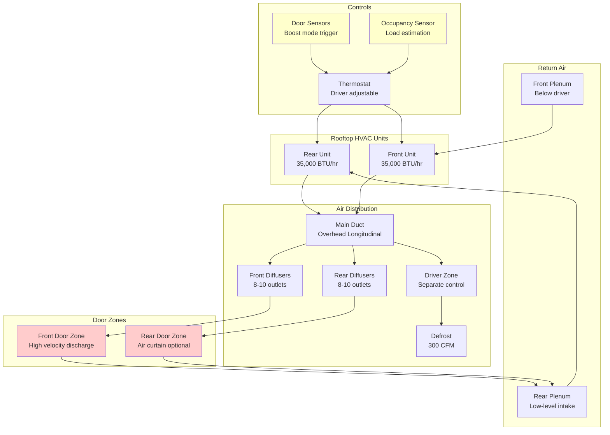

Transit bus HVAC systems operate under the most demanding conditions in the transportation sector: frequent door cycling (20-40 stops per route), variable passenger density including standees, vehicle kneeling for accessibility, and the requirement for rapid thermal recovery between stops. These factors create cooling and heating loads that exceed conventional calculations by 30-50%.

## Transit-Specific Load Components

Transit bus thermal loads differ fundamentally from motor coach or school bus applications due to operational characteristics unique to urban service.

### Door Cycling Infiltration Load

Frequent door openings represent the dominant variable load component in transit service. Each door cycle introduces outdoor air at ambient conditions, creating both sensible and latent loads.

**Door Infiltration Calculation:**

The instantaneous infiltration load per door cycle:

$$Q_{door} = \dot{m} \cdot c_p \cdot \Delta T = \rho \cdot V_{door} \cdot c_p \cdot \Delta T$$

Where:
- $\dot{m}$ = mass flow rate of infiltrating air (lb/min)
- $\rho$ = air density, 0.075 lb/ft³ at sea level
- $V_{door}$ = air volume per door cycle, 150-300 ft³ depending on door size and open duration
- $c_p$ = specific heat of air, 0.24 BTU/(lb·°F)
- $\Delta T$ = temperature differential between outdoor and indoor air (°F)

**Average Hourly Door Load:**

$$Q_{door,avg} = \frac{n_{cycles} \cdot V_{door} \cdot 1.08 \cdot \Delta T}{60} + Q_{latent}$$

Where:
- $n_{cycles}$ = door cycles per hour (30-50 typical for urban routes)
- 1.08 = combined factor (0.075 lb/ft³ × 0.24 BTU/(lb·°F) × 60 min/hr)
- $Q_{latent} = 0.68 \cdot n_{cycles} \cdot V_{door} \cdot \Delta \omega$ (latent load, BTU/hr)
- $\Delta \omega$ = humidity ratio difference (lb water/lb dry air)

For a 40-foot transit bus with 40 door cycles per hour at 95°F ambient (ΔT = 20°F):

$$Q_{door,avg} = \frac{40 \times 200 \times 1.08 \times 20}{60} = 2,880 \text{ BTU/hr (sensible)}$$

Latent load adds approximately 1,500-2,500 BTU/hr depending on outdoor humidity conditions.

### Standee Load Calculation

Transit buses carry standing passengers during peak service, dramatically increasing occupant density and heat generation.

**Occupancy Levels:**

| Bus Length | Seated Capacity | Standee Capacity | Total Peak Load | Diversity Factor |
|------------|----------------|------------------|----------------|------------------|
| 30 ft | 25-30 | 10-15 | 35-45 | 0.70 |
| 35 ft | 30-35 | 15-20 | 45-55 | 0.75 |
| 40 ft | 35-40 | 20-30 | 55-70 | 0.75 |
| 60 ft articulated | 55-65 | 40-60 | 95-125 | 0.80 |

**Occupant Heat Generation:**

Standees generate higher metabolic heat than seated passengers due to continuous muscle engagement for balance during vehicle motion:

- Seated passenger: 450 BTU/hr total (250 sensible + 200 latent)
- Standing passenger: 550 BTU/hr total (300 sensible + 250 latent)

**Total Occupant Load:**

$$Q_{occupant} = (N_{seated} \cdot 450 + N_{standee} \cdot 550) \cdot DF$$

Where $DF$ = diversity factor accounting for average loading conditions (0.70-0.80).

For a 40-foot bus at peak capacity (40 seated + 25 standees):

$$Q_{occupant} = (40 \times 450 + 25 \times 550) \times 0.75 = 23,812 \text{ BTU/hr}$$

### Kneeling System Impact

Low-floor and kneeling buses introduce thermal bridging and air leakage at the lowered entry threshold.

**Kneeling Thermal Effects:**
- Increased door seal leakage: 20-40 CFM per kneeling event
- Floor insulation compression reduces R-value by 15-25%
- Duration per stop: 15-30 seconds
- Additional infiltration load: 800-1,500 BTU/hr averaged over route

The kneeling mechanism creates a temporary gap in the floor-to-door seal, allowing infiltration even when doors are closed during the kneeling period.

## Total Transit Bus Cooling Capacity

The total cooling capacity requirement combines all load components with appropriate safety factors for rapid recovery capability.

$$Q_{total} = Q_{solar} + Q_{transmission} + Q_{occupant} + Q_{door} + Q_{equipment} + Q_{ventilation}$$

**Design Cooling Capacity by Bus Configuration:**

| Bus Type | Length | Base Capacity | Door Cycling Adder | Peak Capacity | Units Required |
|----------|--------|---------------|-------------------|---------------|----------------|
| Standard floor | 30 ft | 38,000 BTU/hr | +6,000 BTU/hr | 44,000 BTU/hr | 1 × 45K |
| Low-floor | 35 ft | 45,000 BTU/hr | +8,000 BTU/hr | 53,000 BTU/hr | 1 × 60K |
| Standard floor | 40 ft | 52,000 BTU/hr | +10,000 BTU/hr | 62,000 BTU/hr | 1 × 65K or 2 × 35K |
| Low-floor | 40 ft | 56,000 BTU/hr | +12,000 BTU/hr | 68,000 BTU/hr | 2 × 35K |
| Articulated | 60 ft | 85,000 BTU/hr | +18,000 BTU/hr | 103,000 BTU/hr | 3 × 35K |

The door cycling adder accounts for the 30-50% increase in infiltration load compared to intercity coach service.

## System Architecture for Transit Service

## Rapid Recovery Requirements

Transit schedules demand fast temperature recovery after door openings and passenger boarding surges.

**APTA Performance Standards:**
- Pull-down from 95°F to 78°F interior: 20 minutes maximum
- Recovery from door opening (5°F rise): 3-5 minutes
- Temperature uniformity: ±3°F throughout passenger compartment
- Driver zone independent control: ±5°F from passenger zone setting

**Recovery Time Calculation:**

The time to recover from a thermal disturbance:

$$t_{recovery} = \frac{m \cdot c_p \cdot \Delta T}{Q_{excess} \times 60}$$

Where:
- $m$ = mass of interior air, approximately bus volume × 0.075 lb/ft³
- $c_p$ = 0.24 BTU/(lb·°F)
- $\Delta T$ = temperature rise to overcome (°F)
- $Q_{excess}$ = cooling capacity beyond steady-state load (BTU/hr)

For a 40-foot bus (interior volume 2,400 ft³) recovering from a 5°F door-induced temperature rise with 15,000 BTU/hr excess capacity:

$$t_{recovery} = \frac{2400 \times 0.075 \times 0.24 \times 5}{15,000 \times 60} = 0.144 \text{ hours} = 8.6 \text{ minutes}$$

This calculation demonstrates why oversizing by 25-30% is standard practice for transit applications.

## Air Distribution for Door Zone Management

Strategic air distribution minimizes the impact of door cycling and maintains thermal comfort near entry areas.

**Door Zone Discharge Strategy:**
- High-velocity discharge (200-300 FPM) directed across door openings
- Supply air outlets positioned 12-18 inches inboard of door frame
- Downward angle 15-30° to create partial air curtain effect
- Increased airflow volume to door zones: 30-40% above average

**Vertical Temperature Gradient Control:**

Standing passengers place their heads in the upper thermal zone where hot air naturally stratifies. Maintaining uniform vertical temperature distribution requires:

- Supply air temperature 12-15°F below setpoint during peak cooling
- Discharge velocity sufficient to reach floor level before mixing (180-220 FPM)
- Return air intakes at low level (18-24 inches above floor) to remove stratified warm air
- Overhead fans prohibited due to safety concerns and regulatory restrictions

## Heating System Considerations

Transit bus heating faces unique challenges from frequent door openings and low-floor designs that reduce equipment installation space.

**Heating Capacity Requirements:**

| Bus Length | Design Outdoor Temp | Heating Capacity | Heat Source | Warm-up Time |
|------------|---------------------|------------------|-------------|--------------|
| 30 ft | 0°F | 45,000 BTU/hr | Engine coolant + 20K aux | 15 min |
| 35 ft | 0°F | 55,000 BTU/hr | Engine coolant + 25K aux | 18 min |
| 40 ft | 0°F | 65,000 BTU/hr | Engine coolant + 30K aux | 20 min |
| 60 ft articulated | 0°F | 95,000 BTU/hr | Engine coolant + dual 25K aux | 25 min |

**Engine Coolant Heat Recovery:**

Transit buses utilize engine coolant as the primary heat source, providing 35,000-60,000 BTU/hr depending on engine size:

$$Q_{coolant} = \dot{m}_{coolant} \cdot c_p \cdot (T_{in} - T_{out}) \cdot \varepsilon$$

Where:
- $\dot{m}_{coolant}$ = 15-25 GPM (125-210 lb/min)
- $c_p$ = 0.95 BTU/(lb·°F) for 50/50 glycol mixture
- $(T_{in} - T_{out})$ = 15-25°F temperature drop across heat exchanger
- $\varepsilon$ = heat exchanger effectiveness, 0.65-0.75

**Auxiliary Heating:**
- Diesel-fired heaters: 20,000-35,000 BTU/hr for pre-heat and idle operation
- Electric heaters (plug-in): 15-25 kW for overnight pre-conditioning
- Heat pumps (electric buses): COP 2.0-3.0 above 40°F, resistance backup below

## Electric and Hybrid Transit Bus HVAC

Battery-electric buses present unique HVAC challenges due to energy consumption impact on range.

**Electric Bus HVAC Power Requirements:**

- Cooling: 8-15 kW electrical input (27,000-51,000 BTU/hr equivalent)
- Heating: 15-25 kW electrical input (resistance or heat pump)
- Range impact: 20-35% reduction in cold weather with heating operation
- Battery thermal management integration with cabin HVAC system

**Heat Pump Systems:**

Heat pumps reduce energy consumption by 40-60% compared to resistance heating above 40°F ambient:

$$COP = \frac{Q_{heating}}{W_{input}}$$

Typical COP values:
- 50°F ambient: COP = 3.0-3.5
- 32°F ambient: COP = 2.0-2.5
- 20°F ambient: COP = 1.2-1.5
- Below 15°F: Resistance backup engages

## Standards and Testing Protocols

**APTA Bus Procurement Standards:**
- APTA BTS-BS-RP-002: HVAC system requirements
- Temperature maintenance: 68-72°F heating mode, 74-78°F cooling mode
- Minimum ventilation: 14 CFM per passenger (SAE J1343)
- Defrost performance: Clear 6-inch viewing band in 15 minutes at 0°F

**SAE J1343 Testing:**
- Cool-down test: 95°F to 78°F in 30 minutes maximum
- Heat-up test: 20°F to 68°F in 30 minutes maximum
- Temperature uniformity: Measurements at 9 locations throughout bus
- Door cycling test: Maintain ±4°F of setpoint with simulated door openings

**Performance Validation:**

Transit agencies typically require 30-60 day in-service testing before fleet-wide acceptance:
- Thermal imaging surveys to identify distribution deficiencies
- Data logging of interior temperatures during revenue service
- Driver comfort surveys and complaint tracking
- Refrigerant charge verification and leak testing

Proper transit bus HVAC design accounts for the compounding effects of door cycling, standee loads, and accessibility features. Oversizing by 25-30% beyond base calculations ensures adequate capacity for rapid recovery and passenger comfort during peak service conditions.
