HVAC systems represent a substantial portion of total vehicle energy consumption in mass transit applications, particularly for electric and hybrid vehicles where climate control directly impacts operating range and fuel economy. Energy-efficient HVAC design reduces operating costs, extends battery range, and improves environmental performance while maintaining passenger comfort.

## HVAC Energy Consumption by Vehicle Type

Transit HVAC energy requirements vary significantly based on vehicle size, propulsion system, and operating conditions.

### Typical HVAC Power Consumption

| Vehicle Type | Cooling Power (kW) | Heating Power (kW) | % of Total Vehicle Energy | Range Impact (%) |
|--------------|-------------------|-------------------|---------------------------|------------------|
| Electric Bus (40 ft) | 10-18 | 15-25 | 25-40% | 20-35% |
| Hybrid Bus | 8-15 | 12-20 | 15-25% | 10-15% |
| Diesel Bus | 6-12 (engine-driven) | 8-15 (waste heat) | 5-10% | 3-5% |
| Light Rail Car | 12-20 | 18-30 | 20-30% | 15-20% |
| Subway Car | 15-25 | 20-35 | 25-35% | 18-25% |
| Commuter Rail | 18-28 | 25-40 | 15-25% | 12-18% |

Electric vehicles experience the most significant impact because HVAC draws directly from propulsion batteries. A 40-foot electric bus with 250 kWh battery capacity operating HVAC at 15 kW continuous reduces available range by approximately 30% during peak summer conditions.

### Energy Consumption Equations

**HVAC Power Draw - Cooling Mode:**

$$P_{cooling} = \frac{Q_{total}}{EER \times 3.412} + P_{fan}$$

Where:
- $P_{cooling}$ = total electrical power (kW)
- $Q_{total}$ = cooling load (BTU/hr)
- $EER$ = energy efficiency ratio (BTU/W-hr), typically 8-12 for transit systems
- $P_{fan}$ = blower motor power (kW), typically 1.5-3.5 kW

**HVAC Power Draw - Heating Mode:**

$$P_{heating} = \frac{Q_{heating}}{COP} + P_{fan}$$

For heat pump systems:
- $COP$ = coefficient of performance, ranges 1.5-3.5 depending on ambient temperature

For electric resistance heating:
- $COP = 1.0$ (100% conversion efficiency)

**Daily Energy Consumption:**

$$E_{daily} = \int_0^{t_{op}} P_{HVAC}(t) \, dt$$

For typical transit routes operating 14-18 hours daily:
- Summer cooling energy: 120-280 kWh/day per vehicle
- Winter heating energy: 150-350 kWh/day per vehicle

## Impact on Electric Vehicle Range

Electric transit vehicles face range limitations directly affected by HVAC operation.

**Battery State of Charge Depletion:**

$$SOC_{remaining} = SOC_{initial} - \frac{\int (P_{traction} + P_{HVAC}) \, dt}{E_{battery}}$$

Where:
- $SOC$ = state of charge (0-1.0)
- $E_{battery}$ = total battery capacity (kWh)
- $P_{traction}$ = propulsion power (kW)
- $P_{HVAC}$ = climate control power (kW)

### Range Reduction Analysis

| Ambient Condition | HVAC Load | Range Reduction | Mitigation Strategy |
|-------------------|-----------|-----------------|---------------------|
| Summer (95°F) | 12-18 kW cooling | 25-35% | Heat pump, thermal preconditioning |
| Moderate (70°F) | 3-6 kW ventilation | 5-10% | Optimized airflow, demand control |
| Winter (20°F) | 18-28 kW heating | 30-45% | Heat pump, waste heat recovery |
| Extreme cold (-10°F) | 25-35 kW heating | 40-55% | Diesel heater supplement |

Cold weather heating presents the most severe range penalty. Electric resistance heating at 25 kW for a 4-hour route consumes 100 kWh—equivalent to 40-50 miles of propulsion energy.

## High-Efficiency HVAC Technologies

Modern transit systems employ advanced technologies to reduce energy consumption while maintaining comfort.

### Heat Pump Systems

Heat pumps provide superior efficiency compared to electric resistance heating by moving heat rather than generating it.

**Heat Pump Performance:**

$$COP = \frac{Q_{heating}}{P_{electrical}}$$

Typical performance curves:

| Ambient Temperature | Cooling COP | Heating COP | Energy Savings vs Resistance |
|---------------------|-------------|-------------|------------------------------|
| 70°F | 3.2-3.8 | 3.5-4.2 | 70-76% |
| 50°F | 3.0-3.5 | 3.0-3.8 | 67-74% |
| 32°F | 2.5-3.0 | 2.2-2.8 | 55-64% |
| 10°F | 2.0-2.5 | 1.5-2.0 | 33-50% |
| -10°F | 1.5-2.0 | 1.0-1.5 | 0-33% |

Below 10°F, heat pump efficiency degrades substantially, requiring supplemental heating. Vapor-injection and tandem compressor designs extend efficient operation to 0°F.

**Heat Pump Cycle Enhancement:**

- **Vapor injection**: Increases capacity by 15-25% at low ambient temperatures
- **Variable-speed compressors**: Match capacity to load, improving part-load efficiency 20-30%
- **Subcooling optimization**: Increases system efficiency 5-8% through enhanced refrigerant management

### Variable Capacity Compressors

Fixed-speed compressors cycle on/off, creating energy waste during partial loads. Variable-speed technology modulates capacity continuously.

**Energy Savings Calculation:**

$$\text{Energy Ratio} = \frac{PLF}{PLR}$$

Where:
- $PLF$ = part load factor (actual efficiency at reduced load)
- $PLR$ = part load ratio (required capacity / full capacity)

Variable-speed compressors maintain PLF near 1.0 across 30-100% capacity range, while fixed-speed systems experience PLF degradation to 0.6-0.8 at part load.

Annual energy savings: 15-30% compared to fixed-speed systems in typical transit duty cycles.

### Thermal Energy Storage

Thermal preconditioning reduces peak HVAC demand by cooling or heating vehicles while connected to shore power.

**Preconditioning Energy Balance:**

$$Q_{stored} = m \times c_p \times \Delta T$$

For vehicle thermal mass:
- Vehicle structure: $m = 8,000\text{-}15,000$ lbs, $c_p = 0.12$ BTU/lb-°F
- Preconditioning from 95°F to 75°F stores: 192,000-360,000 BTU
- Reduces initial cool-down HVAC load by 50-70%

Phase-change materials (PCM) integrated into ceiling panels or seat structures provide passive cooling/heating capacity of 20,000-40,000 BTU for 2-4 hours post-disconnect from charging.

### Demand-Controlled Ventilation

CO₂-based ventilation control reduces unnecessary outdoor air introduction.

**Ventilation Control Logic:**

$$CFM_{OA} = \begin{cases}
CFM_{min} & \text{if } CO_2 < 800 \text{ ppm} \\
CFM_{min} + K(CO_2 - 800) & \text{if } 800 < CO_2 < 1200 \text{ ppm} \\
CFM_{max} & \text{if } CO_2 > 1200 \text{ ppm}
\end{cases}$$

Where $K$ is calibration factor based on occupancy and sensor placement.

Energy savings: 10-20% reduction in cooling/heating load during low-occupancy periods by minimizing outdoor air conditioning.

## Waste Heat Recovery Systems

Recovering waste heat from propulsion systems and auxiliary equipment improves overall vehicle energy efficiency.

### Heat Recovery Sources

| Heat Source | Available Power (kW) | Temperature (°F) | Recovery Efficiency |
|-------------|---------------------|------------------|---------------------|
| Traction inverters | 8-20 | 140-180 | 60-75% |
| Propulsion motors | 5-15 | 150-200 | 50-65% |
| Battery thermal management | 3-10 | 100-140 | 70-85% |
| Brake resistors (dynamic braking) | 15-40 (transient) | 200-300 | 40-60% |
| Compressor oil coolers | 2-5 | 180-220 | 65-80% |

**Heat Recovery Heat Exchanger Design:**

$$Q_{recovered} = \epsilon \times C_{min} \times (T_{hot,in} - T_{cold,in})$$

Where:
- $\epsilon$ = heat exchanger effectiveness (0.6-0.8 for liquid-to-liquid)
- $C_{min}$ = minimum heat capacity rate (BTU/hr-°F)

A well-designed system recovers 15,000-30,000 BTU/hr during winter operation, supplying 40-60% of heating requirements at moderate ambient temperatures.

### Integrated Thermal Management

Advanced electric vehicles employ unified cooling loops connecting:
- Battery pack thermal conditioning
- Power electronics cooling
- Motor cooling
- HVAC condenser/evaporator

Integrated control optimizes total system efficiency rather than individual component performance, achieving 12-18% energy reduction compared to separate systems.

## Energy Efficiency Optimization Strategies

### Smart HVAC Control Algorithms

Predictive control algorithms optimize HVAC operation based on route, schedule, and weather data.

**Model Predictive Control (MPC):**

Minimizes energy consumption subject to comfort constraints:

$$\min_{u(t)} \int_0^{t_f} [P_{HVAC}(u) + \lambda \cdot J_{comfort}] \, dt$$

Subject to:
- $T_{min} \leq T_{cabin} \leq T_{max}$
- $RH \leq 60\%$
- $CO_2 < 1000$ ppm

Implementation results show 8-15% energy reduction with maintained comfort metrics.

### Zone-Based Temperature Control

Multi-zone control prevents overcooling/overheating of low-occupancy areas.

**Zone Control Strategy:**

- Driver zone: Maintained at setpoint ±1°F (critical for safety and comfort)
- Front passenger zone: Setpoint ±2°F
- Mid-vehicle zone: Setpoint ±3°F based on door activity
- Rear zone: Setpoint ±2°F

Energy savings: 5-12% by reducing overcooling of low-occupancy rear sections during off-peak periods.

### Economizer and Free Cooling

When ambient conditions permit, outside air provides free cooling without mechanical refrigeration.

**Economizer Control Logic:**

Enable when: $h_{outside} < h_{return} - \Delta h_{threshold}$

Where $h$ = enthalpy (BTU/lb dry air)

Limited applicability in transit due to:
- Frequent door openings already provide air exchange
- Urban air quality concerns (particulates, NOₓ)
- Humid climates reduce economizer hours to <200/year

Where applicable, economizer operation reduces cooling energy 3-8% annually.

```mermaid
graph TB
    A[Transit HVAC Energy Efficiency Strategies] --> B[Equipment Efficiency]
    A --> C[System Optimization]
    A --> D[Waste Heat Recovery]
    A --> E[Smart Controls]

    B --> B1[Heat Pump Systems<br/>COP 2.0-3.5]
    B --> B2[Variable Speed Compressors<br/>15-30% savings]
    B --> B3[High-Efficiency Fans<br/>EC motors]
    B --> B4[Advanced Refrigerants<br/>R-513A, R-1234yf]

    C --> C1[Demand-Controlled Ventilation<br/>10-20% load reduction]
    C --> C2[Multi-Zone Control<br/>5-12% savings]
    C --> C3[Thermal Preconditioning<br/>Shore power]
    C --> C4[Optimized Setpoints<br/>±2°F comfort range]

    D --> D1[Inverter Waste Heat<br/>8-20 kW available]
    D --> D2[Motor Heat Recovery<br/>5-15 kW available]
    D --> D3[Integrated Thermal Management<br/>12-18% improvement]
    D --> D4[Battery Conditioning<br/>3-10 kW available]

    E --> E1[Predictive Control<br/>MPC algorithms]
    E --> E2[Route-Based Optimization<br/>Pre-cooling/heating]
    E --> E3[Occupancy Sensing<br/>Load-based modulation]
    E --> E4[Weather Integration<br/>Forecast-driven control]

    B1 --> F[Total Energy Reduction:<br/>25-45%]
    B2 --> F
    B3 --> F
    B4 --> F
    C1 --> F
    C2 --> F
    C3 --> F
    C4 --> F
    D1 --> F
    D2 --> F
    D3 --> F
    D4 --> F
    E1 --> F
    E2 --> F
    E3 --> F
    E4 --> F

    style A fill:#1a5490,color:#fff
    style F fill:#2d7a3e,color:#fff
```

## Regulatory Standards and Efficiency Metrics

### APTA Efficiency Guidelines

The American Public Transportation Association establishes performance benchmarks:

**Energy Consumption Targets:**

| Vehicle Class | Maximum HVAC Energy (kWh/mile) | Measurement Condition |
|---------------|--------------------------------|----------------------|
| 40-ft Electric Bus | 0.8-1.2 | 95°F ambient, full load |
| 60-ft Articulated Bus | 1.1-1.6 | 95°F ambient, full load |
| Light Rail Car | 1.0-1.5 | 90°F ambient, typical load |
| Subway Car | 1.2-1.8 | 85°F ambient (tunnel heat) |

### Federal Transit Administration (FTA) Requirements

FTA Low/No Emission Vehicle programs mandate efficiency documentation:

- HVAC energy consumption mapping across ambient temperature range
- Range impact quantification for electric vehicles
- Thermal comfort maintenance criteria
- Energy recovery system implementation (where applicable)

### SAE Standards for Transit HVAC

**SAE J1343** specifies performance testing under controlled conditions, now supplemented by energy efficiency metrics:

- EER minimum: 9.0 BTU/W-hr for cooling at 95°F ambient
- Heating COP minimum: 2.0 at 32°F ambient for heat pump systems
- Standby power: <500W when HVAC in off mode but controls energized

### European EN Standards

**EN 14750-1** (Railway Applications - Air Conditioning):
- Energy efficiency class ratings (A-G scale)
- Maximum auxiliary power consumption limits
- Seasonal energy efficiency ratio (SEER) requirements: minimum 12.0

## Case Study: Electric Bus HVAC Optimization

A 40-foot battery-electric bus with 250 kWh battery operating urban routes.

**Baseline System:**
- Fixed-speed compressor cooling: 60,000 BTU/hr (17.6 kW)
- Electric resistance heating: 25 kW
- Continuous ventilation fan: 2.5 kW
- Daily energy consumption: 185 kWh (cooling) / 245 kWh (heating)
- Range reduction: 32% summer / 42% winter

**Optimized System:**
- Variable-speed heat pump: 50,000 BTU/hr cooling (COP 3.2), 60,000 BTU/hr heating (COP 2.8 @ 32°F)
- Inverter waste heat recovery: 12 kW supplemental heating
- Demand-controlled ventilation with CO₂ sensors
- Thermal preconditioning at depot
- Daily energy consumption: 125 kWh (cooling) / 165 kWh (heating)
- Range reduction: 20% summer / 26% winter

**Results:**
- Energy savings: 32% cooling mode, 33% heating mode
- Range improvement: 12% summer, 16% winter
- Payback period: 2.8 years based on $0.12/kWh electricity cost
- Annual CO₂ reduction: 18 metric tons per vehicle

The combination of heat pump technology, waste heat recovery, and intelligent control reduced HVAC energy consumption by one-third while maintaining passenger comfort standards and extending operational range during extreme weather conditions.

Implementing energy-efficient HVAC technologies in mass transit applications reduces operating costs, extends vehicle range, and supports electrification initiatives critical to sustainable urban transportation infrastructure.
