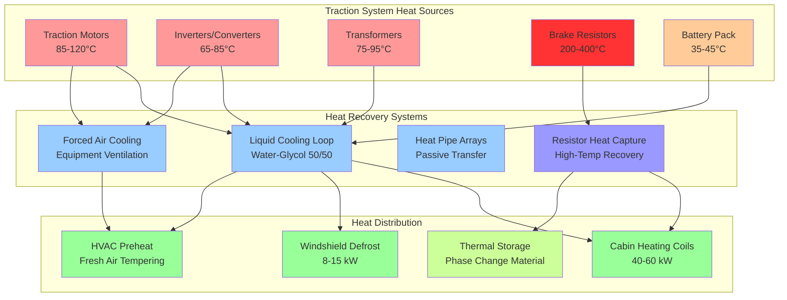

Heat recovery in mass transit vehicles captures waste thermal energy from propulsion systems, dynamic braking, and auxiliary equipment to reduce HVAC energy consumption. Electric and hybrid transit vehicles generate substantial recoverable heat from traction motors, power electronics, and regenerative braking systems that can offset heating loads during cold weather operation.

## Heat Sources in Transit Vehicles

Transit vehicles generate waste heat from multiple sources with varying temperature levels and availability profiles.

**Traction Motor Heat Generation:**

Electric traction motors operating at 85-95% efficiency reject 5-15% of input power as heat. For a typical light rail vehicle with 400 kW traction power during acceleration:

$$Q_{\text{motor}} = P_{\text{input}} \times (1 - \eta_{\text{motor}})$$

Where:
- $P_{\text{input}}$ = electrical input power to motor (kW)
- $\eta_{\text{motor}}$ = motor efficiency (0.85-0.95)
- $Q_{\text{motor}}$ = heat rejection rate (kW)

For a 400 kW motor at 90% efficiency:

$$Q_{\text{motor}} = 400 \times (1 - 0.90) = 40 \text{ kW} = 136,500 \text{ Btu/hr}$$

**Power Electronics Heat:**

Inverters and converters typically operate at 95-98% efficiency, with losses concentrated in IGBT switching devices and gate drivers. A 600 kW inverter at 97% efficiency produces:

$$Q_{\text{inverter}} = \frac{P_{\text{output}}}{\eta_{\text{inverter}}} - P_{\text{output}} = P_{\text{output}} \times \left(\frac{1}{\eta_{\text{inverter}}} - 1\right)$$

$$Q_{\text{inverter}} = 600 \times \left(\frac{1}{0.97} - 1\right) = 18.6 \text{ kW} = 63,500 \text{ Btu/hr}$$

**Regenerative Braking Energy:**

During dynamic braking, kinetic energy converts to electrical energy, with a portion dissipated as heat in resistor grids or absorbed by onboard energy storage. The recoverable thermal energy during braking depends on the braking power profile:

$$Q_{\text{brake}} = \frac{1}{2}m v^2 \times f_{\text{dissipated}} \times \frac{1}{t_{\text{brake}}}$$

Where:
- $m$ = vehicle mass (kg)
- $v$ = initial velocity (m/s)
- $f_{\text{dissipated}}$ = fraction not recovered electrically (0.20-0.40)
- $t_{\text{brake}}$ = braking duration (s)

## Heat Recovery Effectiveness

The thermal effectiveness of heat recovery systems quantifies the ratio of recovered heat to available waste heat.

**Heat Exchanger Effectiveness:**

For air-to-air or air-to-liquid heat exchangers recovering motor or inverter heat:

$$\varepsilon = \frac{Q_{\text{recovered}}}{Q_{\text{max}}} = \frac{C_{\text{min}}(T_{\text{h,in}} - T_{\text{h,out}})}{C_{\text{min}}(T_{\text{h,in}} - T_{\text{c,in}})}$$

Simplified to:

$$\varepsilon = \frac{T_{\text{h,in}} - T_{\text{h,out}}}{T_{\text{h,in}} - T_{\text{c,in}}}$$

Where:
- $T_{\text{h,in}}$ = hot side inlet temperature (°F)
- $T_{\text{h,out}}$ = hot side outlet temperature (°F)
- $T_{\text{c,in}}$ = cold side inlet temperature (°F)
- $\varepsilon$ = heat exchanger effectiveness (dimensionless)

**Overall System Effectiveness:**

The system-level effectiveness accounts for heat exchanger performance, distribution losses, and control efficiency:

$$\varepsilon_{\text{system}} = \varepsilon_{\text{HX}} \times \eta_{\text{distribution}} \times \eta_{\text{control}}$$

Where:
- $\varepsilon_{\text{HX}}$ = heat exchanger effectiveness (0.50-0.75)
- $\eta_{\text{distribution}}$ = duct/piping efficiency (0.85-0.95)
- $\eta_{\text{control}}$ = control system efficiency (0.90-0.98)

Typical system effectiveness ranges from 0.40 to 0.65 depending on configuration.

## Heat Recovery Methods by Source

## Recovery Efficiency by Method

| Recovery Method | Heat Source | Temperature Range | Effectiveness | Typical Capacity | Application |
|----------------|-------------|-------------------|---------------|------------------|-------------|
| **Liquid Loop - Motor Jacket** | Traction motors | 85-120°C (185-248°F) | 0.65-0.75 | 30-80 kW | Cabin heating, defrost |
| **Liquid Loop - Inverter Cold Plate** | Power electronics | 65-85°C (149-185°F) | 0.70-0.80 | 15-40 kW | Cabin heating, preheat |
| **Forced Air - Equipment Compartment** | Motors, inverters | 50-90°C (122-194°F) | 0.45-0.60 | 20-60 kW | Fresh air tempering |
| **Brake Resistor Heat Exchanger** | Dynamic braking | 200-400°C (392-752°F) | 0.40-0.55 | 50-150 kW (intermittent) | Thermal storage, heating |
| **Battery Thermal Management** | Lithium-ion batteries | 35-45°C (95-113°F) | 0.50-0.65 | 5-15 kW | Cabin heating supplement |
| **Air-to-Air Heat Recovery** | Exhaust ventilation | 20-35°C (68-95°F) | 0.55-0.70 | 10-25 kW | Fresh air preheat |
| **Heat Pump with Waste Heat** | Combined sources | Variable | 0.75-0.85 | 40-100 kW | Heating and cooling |

## Traction Motor Heat Recovery

Electric traction motors in modern rail vehicles employ liquid cooling systems that circulate water-glycol solution through motor stator jackets and rotor passages.

**Coolant Circuit Design:**

The primary cooling loop maintains motor temperature below 120°C while extracting heat for HVAC use. Flow rate determination:

$$\dot{m} = \frac{Q_{\text{motor}}}{c_p \times \Delta T}$$

Where:
- $\dot{m}$ = mass flow rate (kg/s or lbm/hr)
- $Q_{\text{motor}}$ = motor heat rejection (kW or Btu/hr)
- $c_p$ = specific heat of coolant (3.5-3.8 kJ/kg·K or 0.84-0.91 Btu/lbm·°F for 50/50 glycol)
- $\Delta T$ = temperature rise (10-20°C or 18-36°F)

For a 40 kW motor heat load with 15°C temperature rise:

$$\dot{m} = \frac{40}{3.7 \times 15} = 0.72 \text{ kg/s} = 5,700 \text{ lbm/hr}$$

**Heat Exchanger Sizing:**

The motor-to-HVAC heat exchanger transfers heat from the motor cooling loop to the cabin heating system. Required heat transfer area:

$$A = \frac{Q}{U \times \Delta T_{\text{lm}}}$$

Where:
- $A$ = heat transfer area (m² or ft²)
- $Q$ = heat transfer rate (kW or Btu/hr)
- $U$ = overall heat transfer coefficient (0.5-0.8 kW/m²·K or 88-141 Btu/hr·ft²·°F)
- $\Delta T_{\text{lm}}$ = log mean temperature difference (°C or °F)

## Inverter and Power Electronics Recovery

Silicon carbide (SiC) and insulated gate bipolar transistor (IGBT) inverters generate concentrated heat in small volumes, requiring efficient thermal management.

**Cold Plate Heat Transfer:**

Power modules mount on aluminum cold plates with internal coolant passages. Heat flux through the cold plate:

$$q'' = \frac{Q_{\text{module}}}{A_{\text{module}}} = h \times (T_{\text{junction}} - T_{\text{coolant}})$$

Where:
- $q''$ = heat flux (W/cm² or Btu/hr·in²)
- $Q_{\text{module}}$ = module power dissipation (W)
- $A_{\text{module}}$ = module mounting area (cm² or in²)
- $h$ = convective heat transfer coefficient (W/cm²·K or Btu/hr·in²·°F)

Modern high-power modules dissipate 50-150 W/cm² requiring coolant velocities of 1-3 m/s through microchannel cold plates.

**Temperature Management:**

Inverter junction temperatures must remain below 125-150°C depending on semiconductor type. The thermal resistance path from junction to coolant:

$$R_{\text{total}} = R_{\text{junction-case}} + R_{\text{case-coldplate}} + R_{\text{coldplate-coolant}}$$

Heat recovery systems operate the coolant at 55-75°C, providing sufficient temperature margin while delivering useful heating capacity.

## Regenerative Braking Heat Capture

Dynamic braking converts kinetic energy to electrical energy, with excess energy dissipated in resistor grids when traction batteries are fully charged or regenerative capacity is exceeded.

**Braking Energy Profile:**

During a typical station stop from 80 km/h (50 mph) for a 45,000 kg light rail vehicle:

$$E_{\text{kinetic}} = \frac{1}{2}mv^2 = \frac{1}{2} \times 45,000 \times (22.2)^2 = 11.1 \text{ MJ} = 10,500 \text{ Btu}$$

If 60% regenerates to the power supply and 40% dissipates in brake resistors over 30 seconds:

$$Q_{\text{resistor}} = \frac{11.1 \times 0.40}{30} = 148 \text{ kW} = 505,000 \text{ Btu/hr (instantaneous)}$$

**Resistor Grid Heat Recovery:**

Brake resistor grids operate at 200-400°C, requiring specialized heat exchangers with thermal mass to buffer intermittent heating. Forced air heat recovery captures 40-55% of resistor heat when designed for rapid thermal response.

Phase change material thermal storage absorbs high-intensity brake heat and releases it gradually for cabin heating between braking events.

## Integration with HVAC Systems

Heat recovery systems integrate with transit HVAC through cascaded heating strategies.

**Heating Priority Sequence:**

1. **Recovered heat (primary)**: Motor, inverter, and battery cooling loops supply heating coils when available (0-80 kW depending on operating mode)
2. **Heat pump operation (secondary)**: Electric heat pump provides heating when waste heat is insufficient (20-60 kW)
3. **Electric resistance (backup)**: Direct electric heating elements activate only when heat pump and recovery are inadequate (30-50 kW)

**Control Logic:**

The system monitors coolant temperature, flow rate, and heating demand to optimize heat recovery:

$$\text{If } T_{\text{coolant}} > 60°C \text{ and } \dot{m} > \dot{m}_{\text{min}}: \text{ Enable heat recovery mode}$$

$$\text{If } Q_{\text{recovered}} < Q_{\text{demand}}: \text{ Activate supplemental heat pump}$$

$$\text{If } T_{\text{outdoor}} < -20°C \text{ and } Q_{\text{total}} < Q_{\text{demand}}: \text{ Enable resistance backup}$$

## Energy Savings Analysis

Heat recovery reduces HVAC energy consumption by offsetting electric heating loads.

**Annual Energy Impact:**

For a light rail vehicle operating 18 hours/day with 6 months of heating season:

- Average waste heat available: 35 kW
- Heat recovery system effectiveness: 0.55
- Operating hours: 18 hr/day × 180 days = 3,240 hr/year
- Recovered energy: 35 kW × 0.55 × 3,240 hr = 62,370 kWh/year

If this displaces electric resistance heating at $0.12/kWh:

**Annual savings = 62,370 kWh × $0.12/kWh = $7,484 per vehicle**

For a 50-vehicle fleet: **$374,200 annual energy savings**

## Standards and Guidelines

**ASHRAE Applications:**

- **ASHRAE Handbook - HVAC Applications, Chapter 10**: Mobile surface transportation systems including heat recovery considerations
- **Heat recovery effectiveness targets**: Minimum 0.50 for air-to-air systems, 0.65 for liquid-to-liquid applications

**Transit Industry Standards:**

- **APTA RT-VIM-S-016-03**: HVAC systems for light rail vehicles including energy efficiency requirements
- **IEEE 1476-2017**: Rail transit electric traction motor thermal management and cooling
- **EN 14813-1**: Railway applications - Air conditioning for driving cabs and passenger compartments

**Energy Performance Metrics:**

- **Energy consumption per passenger-mile**: Heat recovery reduces HVAC energy by 15-30% compared to conventional electric heating
- **Coefficient of Performance (COP)**: Waste heat recovery effectively operates at COP of 3.0-5.0 when displacing resistance heating
- **Power-to-heat efficiency**: Direct heat recovery converts propulsion waste to cabin heating at 50-65% efficiency

Heat recovery in transit HVAC systems represents a high-value energy efficiency measure, particularly for electric rail vehicles with substantial traction system heat generation. Proper integration of motor cooling, inverter thermal management, and regenerative braking heat capture reduces auxiliary power consumption while improving overall vehicle energy efficiency. System design must account for the intermittent nature of waste heat sources and provide supplemental heating capacity for peak demand conditions.
