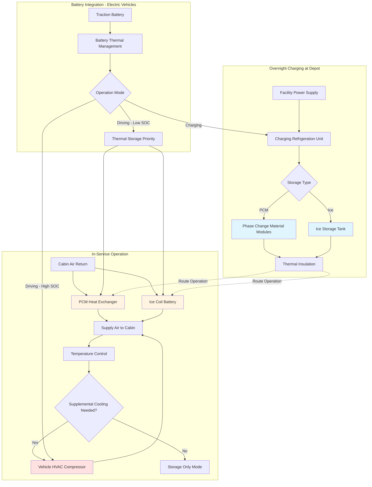

Thermal storage systems in mass transit HVAC applications decouple cooling production from cooling demand, enabling energy cost reduction, peak load shaving, and improved battery range for electric vehicles. By pre-conditioning vehicles during off-peak periods and storing thermal energy, transit agencies reduce demand charges and operational costs while maintaining passenger comfort.

## Thermal Storage Fundamentals

Thermal storage capacity depends on the storage medium mass, specific heat, and temperature differential for sensible storage, or latent heat of fusion for phase change materials.

**Sensible Heat Storage Capacity:**

$$Q_{\text{sensible}} = m \cdot c_p \cdot \Delta T$$

Where:
- $Q_{\text{sensible}}$ = storage capacity (Btu or kJ)
- $m$ = mass of storage medium (lb or kg)
- $c_p$ = specific heat (Btu/lb-°F or kJ/kg-K)
- $\Delta T$ = temperature difference (°F or K)

**Latent Heat Storage Capacity:**

$$Q_{\text{latent}} = m \cdot h_{fg}$$

Where:
- $Q_{\text{latent}}$ = storage capacity (Btu or kJ)
- $m$ = mass of phase change material (lb or kg)
- $h_{fg}$ = latent heat of fusion (Btu/lb or kJ/kg)

**Total Storage with PCM:**

$$Q_{\text{total}} = m \left[ c_{p,s} (T_m - T_1) + h_{fg} + c_{p,l} (T_2 - T_m) \right]$$

Where:
- $c_{p,s}$ = specific heat of solid phase
- $c_{p,l}$ = specific heat of liquid phase
- $T_m$ = melting temperature
- $T_1$ = initial temperature
- $T_2$ = final temperature

**Storage Efficiency:**

$$\eta_{\text{storage}} = \frac{Q_{\text{discharged}}}{Q_{\text{charged}}} = \frac{Q_{\text{useful}}}{Q_{\text{input}}}$$

Practical storage efficiency ranges from 75-90% accounting for heat gains during storage, incomplete phase transition, and distribution losses.

## Storage Technology Comparison

| Technology | Energy Density | Phase Change Temp | Thermal Conductivity | Cycle Life | Relative Cost | Transit Suitability |
|------------|----------------|-------------------|---------------------|------------|---------------|---------------------|
| Water (sensible) | 15-20 Btu/lb (40°F ΔT) | N/A | 0.35 Btu/hr-ft-°F | Unlimited | Low (1.0×) | Limited - volume |
| Ice (water) | 144 Btu/lb | 32°F | 1.28 Btu/hr-ft-°F (ice) | Unlimited | Low (1.2×) | Good - proven |
| Salt hydrates | 80-110 Btu/lb | 45-85°F | 0.3-0.5 Btu/hr-ft-°F | 5,000-10,000 | Medium (2-3×) | Good - tunable |
| Paraffin wax | 75-95 Btu/lb | 50-75°F | 0.12-0.15 Btu/hr-ft-°F | 10,000+ | Medium (2.5-4×) | Excellent - stable |
| Eutectic solutions | 90-120 Btu/lb | 25-60°F | 0.4-0.6 Btu/hr-ft-°F | 3,000-8,000 | High (4-5×) | Good - high density |
| Graphite-enhanced PCM | 70-90 Btu/lb | 50-75°F | 2-5 Btu/hr-ft-°F | 10,000+ | High (5-7×) | Excellent - fast response |

## Phase Change Material Storage Systems

PCM systems store cooling capacity in compact enclosures that undergo solid-liquid phase transitions within the desired temperature range.

**PCM Selection Criteria:**

Transit applications require PCMs with melting points between 50-65°F to maintain cabin temperatures while maximizing storage density. Key selection parameters include:

- **Melting temperature**: 55-60°F optimal for passenger comfort without overcooling
- **Latent heat**: Minimum 70 Btu/lb for acceptable energy density
- **Thermal conductivity**: Enhanced formulations (>0.5 Btu/hr-ft-°F) reduce charging time
- **Supercooling**: Less than 3-5°F to ensure reliable discharge initiation
- **Chemical stability**: No degradation over 10+ years and 10,000+ cycles
- **Containment compatibility**: Non-corrosive to aluminum, stainless steel, or polymer enclosures

**PCM System Configuration:**

PCM modules mount in overhead compartments, under seats, or in dedicated equipment bays. Typical configurations include:

- **Flat plate modules**: 1-3 inch thick panels with internal PCM pouches, air-side heat transfer
- **Tube-in-tank**: PCM surrounding refrigerant or glycol tubes for charging and air-side discharge
- **Microencapsulated PCM**: Slurry systems pumped through heat exchangers, higher thermal conductivity

**Charging Strategy:**

Overnight charging occurs during depot dwell when vehicles connect to facility electrical service. The charging process follows:

$$Q_{\text{charge}} = \dot{m}_{\text{ref}} \cdot \Delta h_{\text{ref}} \cdot t_{\text{charge}}$$

Where:
- $\dot{m}_{\text{ref}}$ = refrigerant mass flow rate
- $\Delta h_{\text{ref}}$ = refrigerant enthalpy change across evaporator
- $t_{\text{charge}}$ = charging duration (typically 6-8 hours)

Standard charging uses dedicated refrigeration systems operating at 40-45°F evaporator temperature to freeze PCM overnight. Charging power typically ranges 5-12 kW per vehicle.

**Discharge Performance:**

During vehicle operation, cabin air circulates across PCM modules, absorbing stored cooling. Discharge rate depends on air-side heat transfer:

$$Q_{\text{discharge}} = \dot{m}_{\text{air}} \cdot c_{p,air} \cdot (T_{\text{air,in}} - T_{\text{air,out}})$$

Discharge duration ranges from 2-4 hours at rated capacity before PCM fully melts and storage depletes. This covers typical bus routes or rail car cycles between depot returns.

## Ice Storage Systems

Ice-based thermal storage leverages water's high latent heat (144 Btu/lb) and predictable phase change at 32°F for reliable, proven performance.

**Ice Storage Configuration Types:**

1. **Ice-on-coil**: Refrigerant or glycol coils submerged in water tank, ice forms around tubes during charging
2. **Ice harvesting**: Ice forms on evaporator plates, periodic harvest cycle releases ice into storage bin
3. **Ice slurry**: Fine ice crystals suspended in carrier fluid, pumpable storage medium
4. **Encapsulated ice**: Water-filled spheres or pouches freeze during charging, immersed in heat transfer fluid

**System Sizing:**

Ice storage mass required to provide cooling capacity Q for duration t:

$$m_{\text{ice}} = \frac{Q \cdot t}{h_{fg,ice} \cdot \eta_{\text{discharge}}}$$

For a 60,000 Btu/hr cooling load over 3 hours with 80% discharge efficiency:

$$m_{\text{ice}} = \frac{60,000 \cdot 3}{144 \cdot 0.80} = 1,563 \text{ lb (190 gallons)}$$

This represents significant weight (3-4% of vehicle GVW for full route coverage), limiting ice storage to applications with short cycles or hybrid operation.

**Ice Storage Advantages:**

- Proven technology with 100+ year operational history
- High energy density per unit mass
- Predictable, consistent performance
- Low material cost
- Non-toxic, environmentally benign
- No degradation over unlimited freeze-thaw cycles

**Ice Storage Challenges:**

- High freezing temperature (32°F) requires sub-freezing refrigeration
- Volume expansion during freezing (9%) requires accommodation
- Weight penalty in mobile applications
- Slow charging due to ice thermal resistance buildup
- Requires containment for liquid water during discharge

## Thermal Storage System Design

## Overnight Pre-Conditioning Strategies

Pre-conditioning vehicles during overnight depot dwell reduces morning pullout energy consumption and ensures passenger comfort from service start.

**Pre-Conditioning Components:**

1. **Thermal storage charging**: Freeze PCM or ice using off-peak electricity at reduced rates
2. **Cabin temperature setback**: Maintain 55-65°F during storage to reduce heating recovery time
3. **Battery pre-heating** (electric vehicles): Warm traction battery to optimal operating temperature (68-77°F)
4. **HVAC system staging**: Sequence compressors and fans to avoid demand peaks during multiple vehicle preparation

**Energy Time-Shifting:**

Pre-conditioning shifts HVAC energy consumption from peak daytime periods (2-8 PM typical) to off-peak overnight (10 PM-6 AM). Utility rate structures provide economic incentive:

- **Peak period rates**: $0.15-0.35/kWh with demand charges $15-25/kW
- **Off-peak rates**: $0.05-0.12/kWh with reduced or zero demand charges
- **Potential savings**: 40-60% reduction in HVAC operating costs

**Departure-Ready Protocol:**

Automated pre-conditioning sequences initiate 1-3 hours before scheduled departure based on ambient conditions and route requirements:

1. **T-180 min**: Begin thermal storage charging if not completed
2. **T-120 min**: Energize cabin heating (winter) or activate storage discharge (summer)
3. **T-60 min**: Ramp HVAC to maintain setpoint (68-72°F)
4. **T-30 min**: Complete battery pre-conditioning for electric vehicles
5. **T-10 min**: Verify all systems operational, record energy consumption
6. **T-0**: Vehicle dispatched with cabin at temperature, storage charged

## Peak Shaving and Load Management

Thermal storage enables transit vehicles to operate HVAC systems with reduced or eliminated compressor runtime during peak electrical demand periods.

**Peak Shaving Principle:**

Total HVAC load consists of base cooling requirement plus supplemental capacity:

$$Q_{\text{total}}(t) = Q_{\text{base}}(t) + Q_{\text{supplemental}}(t)$$

Thermal storage provides $Q_{\text{base}}$ while compressor only operates when:

$$Q_{\text{required}}(t) > Q_{\text{storage}}(t)$$

**Demand Reduction Calculations:**

Average HVAC compressor power for 40-ft bus: 12-18 kW during peak cooling

With thermal storage covering 60% of cooling load:

$$P_{\text{reduction}} = 0.60 \times P_{\text{compressor}} = 0.60 \times 15\text{ kW} = 9\text{ kW}$$

For 100-vehicle fleet:

$$\text{Peak demand reduction} = 100 \times 9\text{ kW} = 900\text{ kW}$$

At $20/kW monthly demand charge:

$$\text{Monthly savings} = 900\text{ kW} \times \$20/\text{kW} = \$18,000$$

**Hybrid Operation Strategy:**

Optimal thermal storage operation balances storage discharge with compressor operation:

- **Early route segment** (0-90 min): Storage provides 80-100% of cooling, compressor off or minimal operation
- **Mid-route segment** (90-180 min): Storage contribution decreases to 40-60%, compressor cycles as needed
- **Late route segment** (180+ min): Storage depleted, compressor provides full load

This strategy maximizes demand reduction during system peak periods while ensuring continuous passenger comfort.

## Battery Integration for Electric Vehicles

Electric bus and rail car thermal storage integrates with traction battery systems to optimize total energy management.

**Battery State-of-Charge Integration:**

HVAC control algorithms adjust compressor operation based on battery SOC:

$$P_{\text{HVAC,max}}(t) = f(\text{SOC}, T_{\text{ambient}}, Q_{\text{required}})$$

Typical control thresholds:

- **SOC > 60%**: Normal HVAC operation, compressor unrestricted
- **SOC 40-60%**: Thermal storage priority, compressor limited to 50% capacity
- **SOC 20-40%**: Storage only mode, compressor disabled except safety override
- **SOC < 20%**: Reduced ventilation, emergency operation only

**Range Extension:**

Thermal storage reduces HVAC electrical consumption during route operation, extending vehicle range. For electric bus with 350 kWh battery and 200 kWh usable capacity:

Average HVAC consumption without storage: 25-30 kWh per 100 km

With 60% load coverage from thermal storage:

$$E_{\text{HVAC,reduced}} = 27.5 \times 0.40 = 11\text{ kWh per 100 km}$$

Range extension:

$$\Delta R = \frac{(27.5 - 11)\text{ kWh}}{200\text{ kWh}} \times R_{\text{base}} = 8.25\%$$

For 250 km base range, thermal storage adds approximately 20 km range.

**Regenerative Integration:**

Advanced systems capture regenerative braking energy for thermal storage charging during route operation:

$$E_{\text{regen,storage}} = \eta_{\text{regen}} \times \eta_{\text{conversion}} \times E_{\text{braking}}$$

With regenerative efficiency 65% and conversion efficiency 85%, approximately 55% of braking energy can charge thermal storage during frequent stop-go cycles.

## Standards and Regulatory Framework

Thermal storage systems in transit applications must comply with vehicle safety, electrical, and HVAC performance standards.

**Federal Motor Vehicle Safety Standards (FMVSS):**

- FMVSS 301: Fuel system integrity applies to glycol-based thermal storage fluids
- FMVSS 302: Flammability of interior materials governs PCM containment materials
- Weight distribution: Thermal storage mass must maintain front/rear axle load limits

**SAE J2889: Electric Vehicle Energy Storage System Safety:**

Addresses thermal management integration for electric vehicles including thermal storage interface with battery systems.

**IEEE 1143: Electrical Power Systems for Transit Vehicles:**

Governs charging infrastructure interface, overnight power supply requirements, and ground fault protection for thermal storage charging systems.

**APTA Standards:**

- **APTA PR-M-S-016**: HVAC cooling capacity requirements that thermal storage must satisfy
- **APTA BTS-VIM**: Vehicle inspection and maintenance addressing thermal storage system servicing

**International Standards:**

- **ISO 21363**: Fuel cell vehicles - Storage systems safety (applicable to thermal storage)
- **EN 14750-1**: Railway applications - Air conditioning for urban rail vehicles
- **VDI 2167**: Thermal energy storage (German engineering standard)

## Installation and Maintenance Considerations

**Mounting Requirements:**

Thermal storage modules experience vehicle acceleration, braking, and cornering forces requiring secure attachment:

- **Longitudinal acceleration**: ±0.3-0.5 g during normal operation, up to 1.0 g emergency braking
- **Lateral acceleration**: 0.2-0.4 g during cornering
- **Vertical acceleration**: 0.5-1.5 g over road irregularities or track joints

Mounting brackets must restrain storage mass under 3-5 g ultimate load in all axes.

**Maintenance Protocols:**

1. **Monthly inspection**: Visual check for leaks, mounting security, insulation condition
2. **Quarterly testing**: Verify charge/discharge capacity, temperature sensors, control functions
3. **Annual service**: Refrigerant leak check, heat exchanger cleaning, containment integrity
4. **3-year service**: PCM sample analysis (if applicable), replace degraded components

**Expected Service Life:**

- **Ice storage**: 15-20 years (tank and coil replacement intervals)
- **PCM storage**: 10-15 years (depends on cycling and formulation stability)
- **Controls and sensors**: 5-8 years
- **Insulation**: 10-15 years

Thermal storage systems provide transit operators effective energy cost reduction, improved operational efficiency, and enhanced passenger comfort through strategic load shifting and peak demand management. Integration with electric vehicle battery systems and intelligent control algorithms maximizes the value proposition for modern transit fleets.
