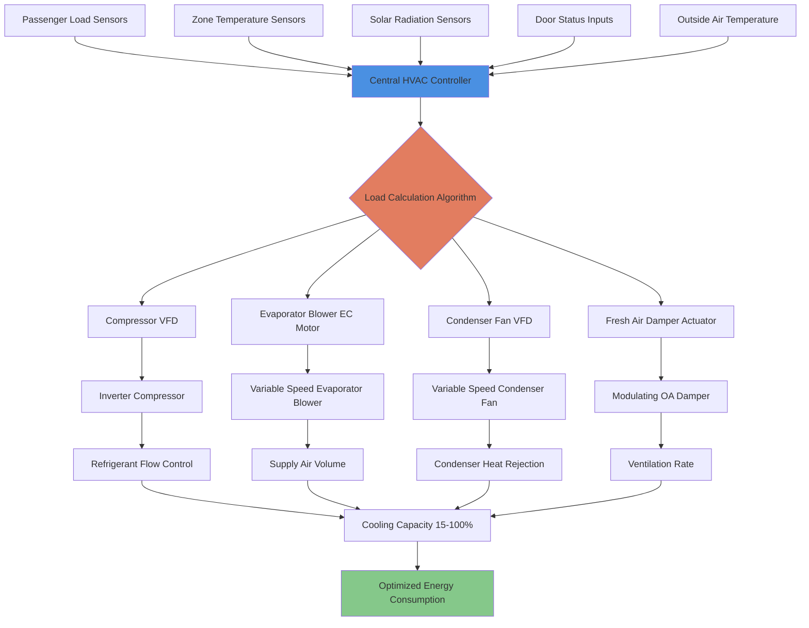

Variable-speed HVAC systems represent the most significant advancement in transit vehicle energy efficiency, reducing auxiliary power consumption by 25-45% compared to fixed-capacity systems. These systems utilize variable frequency drives (VFDs), electronically commutated motors, and inverter-driven compressors to modulate cooling and heating output in response to actual thermal loads rather than cycling on/off at full capacity.

## Variable Frequency Drive Fundamentals

VFD technology controls AC motor speed by varying both frequency and voltage supplied to the motor. The relationship between motor speed and power consumption follows the affinity laws, creating substantial energy savings at reduced loads.

**Power Consumption Relationship:**

$$P_2 = P_1 \left(\frac{N_2}{N_1}\right)^3$$

Where:
- $P_1$ = power at full speed (kW)
- $P_2$ = power at reduced speed (kW)
- $N_1$ = full motor speed (RPM)
- $N_2$ = reduced motor speed (RPM)

**Example Calculation:**

A 10 kW blower motor operating at 60% speed:

$$P_2 = 10 \text{ kW} \times (0.60)^3 = 10 \times 0.216 = 2.16 \text{ kW}$$

This represents a 78.4% power reduction, demonstrating the cubic relationship between speed and power consumption.

**VFD Energy Savings Factor:**

$$\text{ESF} = 1 - \left(\frac{N_2}{N_1}\right)^3$$

For typical transit operating conditions:

| Speed Ratio | Power Consumption | Energy Savings |
|-------------|-------------------|----------------|
| 100% | 100% | 0% |
| 90% | 72.9% | 27.1% |
| 80% | 51.2% | 48.8% |
| 70% | 34.3% | 65.7% |
| 60% | 21.6% | 78.4% |
| 50% | 12.5% | 87.5% |

## Inverter Compressor Technology

Transit HVAC systems increasingly employ inverter-driven scroll or rotary compressors that modulate capacity from 15-100% through variable-speed operation. This eliminates the inefficient on/off cycling characteristic of fixed-capacity systems.

**Compressor Capacity Modulation:**

$$\dot{Q}_c = \dot{Q}_{rated} \times \left(\frac{f_{inv}}{f_{rated}}\right)$$

Where:
- $\dot{Q}_c$ = compressor cooling capacity (Btu/hr)
- $\dot{Q}_{rated}$ = rated capacity at design frequency (Btu/hr)
- $f_{inv}$ = inverter frequency (Hz)
- $f_{rated}$ = rated frequency (typically 60 Hz)

**Compressor Power at Part Load:**

$$P_{comp} = P_{rated} \times \left[\left(\frac{f_{inv}}{f_{rated}}\right)^{0.8} \times 0.85 + 0.15\right]$$

The 0.15 constant represents fixed losses (lubrication pump, controls), while the exponential factor of 0.8 reflects improved efficiency at part-load compared to simple cubic relationship.

**Inverter Compressor Performance:**

| Frequency | Capacity | Power Input | COP | Efficiency vs Fixed |
|-----------|----------|-------------|-----|---------------------|
| 60 Hz | 100% | 100% | 3.0 | Baseline |
| 50 Hz | 83% | 73% | 3.4 | +13% |
| 40 Hz | 67% | 51% | 3.9 | +30% |
| 30 Hz | 50% | 33% | 4.5 | +50% |
| 20 Hz | 33% | 21% | 4.7 | +57% |

## Electronically Commutated Motor Applications

EC motors (brushless DC motors with integrated inverters) provide superior efficiency for blower applications in transit HVAC. These motors eliminate slip losses inherent in AC induction motors and maintain high efficiency across the entire speed range.

**EC Motor Efficiency Comparison:**

| Operating Point | AC Induction Motor | EC Motor | Efficiency Gain |
|----------------|-------------------|----------|-----------------|
| 100% Speed | 82% | 90% | +9.8% |
| 75% Speed | 78% | 89% | +14.1% |
| 50% Speed | 68% | 87% | +27.9% |
| 25% Speed | 45% | 82% | +82.2% |

**EC Motor Power Savings:**

$$\Delta P = P_{AC} \left(1 - \frac{\eta_{AC}}{\eta_{EC}}\right)$$

For a 3 kW blower at 50% speed:

$$P_{AC} = 3 \text{ kW} \times (0.50)^3 / 0.68 = 0.551 \text{ kW}$$
$$P_{EC} = 3 \text{ kW} \times (0.50)^3 / 0.87 = 0.431 \text{ kW}$$
$$\Delta P = 0.551 - 0.431 = 0.120 \text{ kW} \text{ (21.8% savings)}$$

## Demand-Based Control Strategies

Advanced transit HVAC systems employ real-time load sensing to optimize capacity delivery and minimize energy waste.

**Passenger Counting Integration:**

Modern transit vehicles incorporate automatic passenger counters (APC) using infrared, stereo vision, or weight sensors. HVAC systems utilize this data to modulate ventilation and cooling capacity.

$$\dot{Q}_{occ} = N_{passengers} \times (SHG + LHG)$$

Where:
- $N_{passengers}$ = real-time passenger count
- $SHG$ = sensible heat gain per passenger = 225 Btu/hr
- $LHG$ = latent heat gain per passenger = 175 Btu/hr

**Ventilation Modulation:**

$$CFM_{OA} = \max(CFM_{min}, N_{passengers} \times 15 \text{ CFM/person})$$

This ensures compliance with ASHRAE 62.1 requirements while avoiding over-ventilation energy penalties during low-occupancy periods.

**Zone-Based Load Distribution:**

Transit vehicles commonly employ 2-4 HVAC zones with independent temperature control:

$$\dot{Q}_{zone,i} = UA_i(T_{ambient} - T_{setpoint,i}) + \dot{Q}_{solar,i} + \dot{Q}_{occ,i} + \dot{Q}_{infiltration,i}$$

Variable-speed systems allocate compressor capacity proportionally:

$$f_{comp,i} = f_{min} + (f_{max} - f_{min}) \times \frac{\dot{Q}_{zone,i}}{\dot{Q}_{total}}$$

## Energy Savings by Operating Condition

Transit vehicles experience highly variable thermal loads throughout daily operation. Variable-speed systems adapt efficiently to these changing conditions.

**Daily Operating Profile Energy Comparison:**

| Operating Condition | Load Factor | Duration | Fixed System Energy | Variable System Energy | Savings |
|---------------------|-------------|----------|---------------------|------------------------|---------|
| Hot soak recovery | 100% | 15 min | 2.5 kWh | 2.5 kWh | 0% |
| Peak service (rush hour) | 80-100% | 90 min | 13.5 kWh | 11.2 kWh | 17% |
| Mid-day service | 50-70% | 180 min | 18.0 kWh | 10.8 kWh | 40% |
| Off-peak service | 30-50% | 120 min | 12.0 kWh | 5.4 kWh | 55% |
| Layover/standby | 15-25% | 75 min | 7.5 kWh | 2.1 kWh | 72% |
| **Daily Total** | Variable | 8 hours | **53.5 kWh** | **32.0 kWh** | **40.2%** |

**Seasonal Energy Impact:**

Variable-speed systems provide greatest savings during shoulder seasons when loads remain consistently below peak design conditions.

| Season | Average Load | Fixed System Daily Energy | Variable System Daily Energy | Savings |
|--------|--------------|---------------------------|------------------------------|---------|
| Summer peak | 85% | 51.0 kWh | 36.7 kWh | 28% |
| Summer average | 65% | 49.0 kWh | 28.4 kWh | 42% |
| Spring/Fall | 45% | 47.0 kWh | 22.1 kWh | 53% |
| Winter heating | 55% | 43.0 kWh | 25.8 kWh | 40% |

## Implementation Standards and Requirements

Transit agencies increasingly mandate variable-speed HVAC systems in procurement specifications to achieve energy and emissions reduction targets.

**FTA Energy Efficiency Requirements:**

The Federal Transit Administration's climate goals encourage variable-speed technology:

- Auxiliary power consumption targets: <30 kWh per vehicle per day for standard bus service
- Coefficient of Performance (COP) minimum: 2.8 at AHRI rating conditions
- Part-load efficiency rating required at 25%, 50%, and 75% capacity
- Idle HVAC power draw limited to <1.5 kW for occupied standby mode

**APTA Recommended Practices:**

American Public Transportation Association standards for modern transit HVAC:

- Variable-speed compressor with minimum 15-100% modulation range
- EC motor technology for all blower applications >250 watts
- Demand-controlled ventilation based on occupancy or CO₂ sensing
- Energy monitoring and reporting capability with 1-minute data resolution

**European EN Standards:**

EN 14750-1 (Railway applications - Air conditioning for urban and suburban rolling stock):

- Energy efficiency index (EEI) calculation methodology for comparative rating
- Seasonal energy efficiency ratio (SEER) requirements for variable-capacity systems
- Minimum COP at part-load conditions: 3.2 at 50% capacity, 3.5 at 25% capacity
- Standby power consumption limits: <500 watts for unoccupied vehicle conditioning

## Control Algorithm Optimization

Advanced variable-speed systems employ predictive algorithms that anticipate load changes and optimize compressor staging.

**Proportional-Integral Control:**

$$f_{inv}(t) = f_{base} + K_p \cdot e(t) + K_i \int_0^t e(\tau) d\tau$$

Where:
- $f_{inv}(t)$ = inverter frequency command (Hz)
- $f_{base}$ = baseline frequency from load model (Hz)
- $K_p$ = proportional gain (Hz/°F)
- $K_i$ = integral gain (Hz/°F-sec)
- $e(t)$ = temperature error (°F)

Typical tuning parameters for transit applications:
- $K_p$ = 2-4 Hz/°F (aggressive response for rapid load changes)
- $K_i$ = 0.1-0.3 Hz/°F-sec (limited integral action to prevent overshoot)

**Predictive Load Modeling:**

Route-based systems utilize GPS location and historical data to anticipate load changes:

$$\dot{Q}_{predicted}(t+\Delta t) = \dot{Q}_{historical}(location, time, DOW) + \Delta\dot{Q}_{weather}$$

This enables compressor pre-staging before high-load events (door openings, station stops) and aggressive setback during predictable low-load periods (tunnel operation, highway cruising).

Variable-speed HVAC systems deliver substantial energy savings, improved passenger comfort through consistent temperature control, reduced noise during low-load operation, and extended equipment life due to elimination of hard-start cycling. Initial cost premiums of 15-25% achieve payback within 2-4 years through reduced energy consumption and maintenance costs, making variable-speed technology the standard for modern transit vehicle climate control.
