## Equipment Placement Requirements

HVAC equipment placement in mass transit vehicles demands careful consideration of structural integrity, clearance envelopes, maintenance accessibility, and operational constraints. The selection between rooftop, underfloor, and end-of-car mounting directly impacts vehicle weight distribution, passenger capacity, and long-term serviceability.

## Placement Configuration Comparison

```mermaid
graph TD
    A[Transit HVAC Placement Options] --> B[Rooftop Mounting]
    A --> C[Underfloor Mounting]
    A --> D[End-of-Car Mounting]

    B --> B1[Center Roof]
    B --> B2[Split Roof Units]
    B --> B3[Low-Profile Design]

    C --> C1[Center Slung]
    C --> C2[Side Mounted]
    C --> C3[Modular Packages]

    D --> D1[Single End]
    D --> D2[Both Ends]
    D --> D3[Coupled Configuration]

    B1 --> E[Weight Distribution Analysis]
    C1 --> E
    D1 --> E

    E --> F[Structural Verification]
    F --> G[Clearance Validation]
    G --> H[Maintenance Access Review]

    style A fill:#1a472a
    style B fill:#2e7d32
    style C fill:#388e3c
    style D fill:#43a047
    style E fill:#ffa000
    style F fill:#ff6f00
    style G fill:#e65100
    style H fill:#d84315
```

## Rooftop Mounting Configuration

Rooftop HVAC placement remains the predominant configuration for rail vehicles and many bus applications due to maximized floor space utilization and simplified condensate drainage.

### Structural Considerations

The roof structure must support static and dynamic loads:

$$W_{total} = W_{equipment} + W_{mounting} + W_{ductwork} + W_{access}$$

where each component contributes to total supported weight, typically 800-1,500 lbs per HVAC unit.

Center of gravity elevation follows:

$$CG_{vertical} = \frac{\sum_{i=1}^{n} (W_i \times h_i)}{W_{total}}$$

where $h_i$ represents the vertical height of each component from the reference datum. Elevated CG affects vehicle stability, particularly during acceleration, braking, and cornering.

Dynamic loading amplification:

$$F_{dynamic} = W_{equipment} \times (1 + a_f)$$

where $a_f$ represents the acceleration factor, typically 2.0-3.0 for rail applications and 3.0-4.5 for bus applications per IEEE 1476 and SAE J2452 standards.

### Clearance Requirements

Rooftop equipment must maintain clearance from overhead catenary systems and tunnel profiles:

| Vehicle Type | Minimum Clearance | Standard Reference |
|--------------|------------------|-------------------|
| Subway (3rd rail) | 12.5 ft total height | NFPA 130 |
| Light rail (catenary) | 18 in below contact wire | IEEE 1476 |
| Commuter rail (catenary) | 24 in below contact wire | FRA standards |
| Trolley bus | 20 in below trolley wire | APTA RT-VIM |
| Diesel bus | Profile dependent | SAE J1263 |

Low-profile rooftop units achieve 8-12 inch heights through compact heat exchanger design and transverse fan arrangements.

## Underfloor Mounting Configuration

Underfloor placement preserves low vehicle profiles and protects equipment from vandalism, particularly suitable for low-floor bus designs and restricted-clearance rail operations.

### Space Allocation

Underfloor volume constraints require compact equipment packages:

$$V_{available} = L_{bay} \times W_{bay} \times H_{clearance}$$

Typical dimensions:
- Length ($L_{bay}$): 60-96 inches
- Width ($W_{bay}$): 24-36 inches
- Height ($H_{clearance}$): 18-24 inches

Equipment must maintain minimum 4-inch ground clearance under full load conditions, increasing to 6-8 inches for rough-terrain or snow-route operations.

### Thermal Management Challenges

Underfloor equipment faces elevated ambient temperatures from road surface radiation and drivetrain proximity:

$$T_{ambient,underfloor} = T_{ambient,air} + \Delta T_{road} + \Delta T_{proximity}$$

where $\Delta T_{road}$ ranges 10-20°F on summer pavement and $\Delta T_{proximity}$ adds 15-30°F near diesel engines or traction motors. Condenser sizing must account for these elevated conditions, typically requiring 115-125°F ambient design versus 95°F for rooftop units.

## End-of-Car Mounting

End-of-car placement positions HVAC equipment in vestibule areas or dedicated equipment compartments, common in articulated bus designs and some commuter rail configurations.

### Accessibility Advantages

End mounting provides ground-level or platform-level equipment access, reducing maintenance time and eliminating rooftop safety concerns. Technicians can service components without specialized access equipment or track occupation.

### Passenger Space Impact

Equipment encroachment analysis:

$$S_{lost} = (L_{equipment} + L_{access}) \times W_{equipment}$$

Typical losses range 40-60 sq ft per vehicle end, equivalent to 4-6 standing passengers or 2-3 seated positions.

## Placement Selection Matrix

| Criterion | Rooftop | Underfloor | End-of-Car |
|-----------|---------|------------|------------|
| Structural complexity | Moderate | High | Low |
| Clearance sensitivity | High | Moderate | Low |
| Maintenance access | Difficult | Very difficult | Easy |
| Passenger space impact | Minimal | Minimal | Moderate |
| Equipment protection | Moderate | High | Moderate |
| Initial cost | Baseline | +15-25% | +10-15% |
| Service life expectancy | 12-15 years | 8-12 years | 12-15 years |

## Weight Distribution Calculations

Proper weight distribution maintains vehicle dynamic performance:

$$\Delta CG_{longitudinal} = \frac{W_{HVAC} \times L_{offset}}{W_{vehicle}}$$

Maximum allowable CG shift typically limited to 2-3 inches to preserve braking balance and prevent wheel load imbalances exceeding 5%.

Axle loading verification:

$$Load_{axle} = \frac{W_{HVAC}}{2} \pm \frac{W_{HVAC} \times d_{CG}}{L_{wheelbase}}$$

where $d_{CG}$ represents the distance from equipment CG to vehicle centerline.

## Vibration Isolation Requirements

Transit vehicle environments impose severe vibration conditions:

$$f_{natural} = \frac{1}{2\pi}\sqrt{\frac{k}{m}}$$

where $k$ represents isolator spring rate and $m$ equals supported mass. Natural frequency must remain below 6-8 Hz for rooftop mounting and 8-10 Hz for underfloor mounting to prevent resonance with vehicle structural modes.

Isolation deflection under dynamic loading:

$$\delta_{max} = \frac{F_{dynamic}}{k \times n_{isolators}}$$

Typical deflections range 0.25-0.50 inches under maximum loading conditions.

## Maintenance Accessibility Standards

APTA guidelines specify:

- Minimum 24-inch working clearance on at least two equipment sides
- Tool access to all serviceable components without removal of adjacent equipment
- Filter access within 10 minutes from vehicle exterior
- Complete unit removal within 2-hour maintenance window

Rooftop equipment requires fall protection systems per OSHA 1910.23 when roof height exceeds 6 feet or platform access unavailable.

## Condensate Management

Drainage requirements vary by mounting location:

**Rooftop:** Gravity drainage through roof penetrations, minimum 1/4 inch per foot slope, termination below floor line with drip loops.

**Underfloor:** Forced drainage via condensate pumps, typically 0.5-1.0 GPH capacity with 6-10 ft lift capability, discharge routed to wheel wells or designated drain points.

**End-of-car:** Gravity or pump drainage depending on floor height relationship, compliance with Americans with Disabilities Act (ADA) requirements for floor surface water control.

## Conclusion

Equipment placement selection fundamentally shapes transit HVAC system performance, maintenance burden, and lifecycle economics. Rooftop mounting offers operational simplicity but introduces clearance constraints. Underfloor configurations maximize vertical clearance while demanding enhanced environmental protection. End-of-car placement prioritizes serviceability at the expense of passenger volume. The optimal selection balances structural capability, operational envelope, maintenance philosophy, and specific transit mission requirements within applicable FRA, FTA, and APTA regulatory frameworks.
