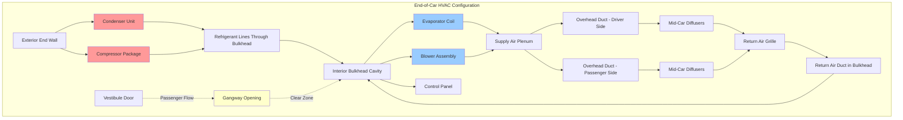

End-of-car HVAC equipment placement represents a specialized mounting strategy for rail transit vehicles where climate control components are integrated into the vehicle bulkhead area near vestibules and gangway connections. This configuration offers distinct advantages for passenger space maximization while presenting unique challenges in serviceability, crash energy management, and airflow distribution.

## End-of-Car Equipment Configuration

End-of-car mounting locates major HVAC components within or adjacent to the vehicle end bulkhead structure. This approach is common in commuter rail, light rail, and some subway applications where vehicle profile restrictions or operational requirements preclude rooftop mounting.

**Typical Component Distribution:**

The equipment is divided between interior bulkhead cavities and exterior end-wall mounting positions. Compressors, condensers, and electrical components typically mount on the exterior end wall or in protected equipment compartments accessible from outside. Evaporator coils, blowers, and air distribution plenums integrate into the interior bulkhead structure behind removable access panels.

**Space Allocation Requirements:**

Equipment cavities within the bulkhead structure must accommodate components while maintaining structural integrity and crash energy management capabilities. The allocation follows:

$$V_{equipment} = V_{compressor} + V_{condenser} + V_{evaporator} + V_{electrical} + V_{clearance}$$

Where clearance volume provides maintenance access and airflow. Typical values:

$$V_{clearance} = 1.3 \times (V_{compressor} + V_{condenser} + V_{evaporator})$$

The 30% additional volume accounts for service access, refrigerant line routing, and thermal management airflow around heat-generating components.

**Bulkhead Depth Calculation:**

The required bulkhead depth must accommodate equipment while minimizing intrusion into passenger space:

$$D_{bulkhead} = \max(D_{equipment} + C_{maintenance}, D_{structural}) + t_{insulation}$$

Where:
- $D_{equipment}$ = maximum equipment depth (compressor or evaporator housing)
- $C_{maintenance}$ = maintenance clearance (typically 6-12 inches)
- $D_{structural}$ = structural member depth for crash energy management
- $t_{insulation}$ = thermal and acoustic insulation thickness (2-4 inches)

Standard bulkhead depths range from 24-36 inches depending on vehicle size and equipment capacity.

## Gangway Integration Considerations

The gangway connection between rail cars creates specific constraints for end-of-car equipment placement. The gangway must provide unobstructed passenger passage while accommodating articulation movement between cars.

**Clearance Envelope:**

APTA PR-M-S-015 standard specifies minimum gangway clear passage dimensions:

| Gangway Type | Minimum Width | Minimum Height | Lateral Movement | Vertical Movement |
|--------------|---------------|----------------|------------------|-------------------|
| Enclosed Gangway | 32 inches | 78 inches | ±8 inches | ±3 inches |
| Diaphragm Only | 30 inches | 76 inches | ±6 inches | ±2 inches |
| Wide Body Gangway | 38 inches | 80 inches | ±10 inches | ±4 inches |

HVAC equipment and ducting must remain outside this clearance envelope under all operating conditions including maximum articulation angles during curve negotiation.

**Equipment Positioning Relative to Gangway:**

Components are arranged in one of three configurations:

1. **Overhead Placement**: Equipment mounted above the gangway passage in the bulkhead header space. Provides unobstructed floor space but increases vehicle height and complicates maintenance access.

2. **Lateral Placement**: Equipment mounted in side pockets flanking the gangway opening. Maintains low vehicle profile but reduces passenger circulation space at car ends.

3. **Split Configuration**: Condenser and compressor mounted externally on end wall, evaporator and blower in overhead bulkhead space. Optimizes space utilization but requires careful refrigerant line routing through articulation zone.

## Passenger Flow Optimization

End-of-car equipment placement directly affects passenger boarding, alighting, and circulation patterns. Design must minimize congestion while maintaining HVAC performance.

**Flow Analysis:**

Passenger flow rate through end vestibules and gangways follows:

$$Q_{passengers} = \frac{N_{boarding} + N_{alighting}}{t_{dwell}}$$

Peak flow rates at major stations range from 30-50 passengers per minute through each doorway. Equipment placement must not create bottlenecks that extend dwell time.

**Circulation Space Calculation:**

The effective circulation area in the vestibule accounts for equipment intrusion:

$$A_{circulation} = A_{vestibule} - A_{equipment} - A_{door\_swing} - A_{safety}$$

Where $A_{safety}$ represents buffer space (minimum 4 square feet) around equipment for passenger safety. Maintaining $A_{circulation} \geq 25$ square feet ensures adequate flow capacity for high-volume stations.

**Airflow Distribution from End-of-Car Units:**

Supply air from end-mounted equipment must distribute uniformly along the car length. The required duct velocity to overcome pressure losses:

$$V_{duct} = \sqrt{\frac{2 \Delta P}{\rho}} = \sqrt{\frac{2 \times \Delta P_{total}}{\rho_{air}}}$$

For typical 60-80 foot car lengths with end-mounted units, duct velocities of 1800-2500 FPM maintain adequate pressure to reach mid-car diffusers while limiting noise generation to acceptable levels below 68 dBA.

## Serviceability and Maintenance Access

End-of-car mounting presents unique serviceability challenges compared to rooftop or underfloor installations. Maintenance access must accommodate component removal without disrupting adjacent car operations.

**Access Panel Design:**

Interior access to bulkhead-mounted equipment requires removable panels sized for component extraction:

$$A_{panel} \geq 1.2 \times \max(A_{compressor}, A_{evaporator}, A_{blower})$$

The 20% oversizing allows clearance for component maneuvering during removal and installation. Panels incorporate quick-release fasteners for rapid access during troubleshooting.

**Exterior Service Access:**

Components mounted on the exterior end wall require service platforms or fall protection provisions when accessed from ground level. APTA guidelines specify:

| Component Height Above Rail | Access Method | Safety Equipment |
|------------------------------|---------------|------------------|
| 0-7 feet | Ground level access | None required |
| 7-12 feet | Step stool/platform | Handrails on vehicle |
| 12+ feet | Maintenance platform | Fall protection anchor points |

**Component Replaceability:**

Critical components must be removable without disturbing adjacent systems. Refrigerant lines incorporate service valves at the bulkhead penetration to isolate equipment without evacuating the entire system. Electrical connections use quick-disconnect plugs for rapid component swapping.

**Scheduled Maintenance Intervals:**

End-of-car equipment accessibility affects maintenance scheduling:

- Filter replacement: 500-1000 hours (monthly to quarterly depending on environment)
- Condenser coil cleaning: 2000-3000 hours (quarterly to semi-annually)
- Refrigerant charge verification: 4000-6000 hours (semi-annually to annually)
- Compressor overhaul: 20,000-30,000 hours (3-5 years)
- Complete system replacement: 80,000-120,000 hours (12-18 years)

## Component Placement Options

Multiple equipment arrangement strategies accommodate varying vehicle designs and operational requirements.

**Configuration Comparison:**

| Configuration Type | Compressor Location | Condenser Location | Evaporator Location | Advantages | Disadvantages |
|-------------------|---------------------|-------------------|---------------------|------------|---------------|
| Fully Exterior | Exterior end wall | Exterior end wall | Exterior end wall | Maximum interior space, weather exposure for maintenance | Increased vehicle length, complex ducting |
| Split Interior/Exterior | Exterior end wall | Exterior end wall | Interior bulkhead | Balanced space utilization, protected evaporator | Refrigerant line penetrations, articulation routing |
| Overhead Interior | Interior overhead | Interior overhead | Interior overhead | Protected from weather, simplified refrigerant piping | Reduced headroom, overhead maintenance |
| Lateral Pocket | Interior side pocket | Exterior end wall | Interior side pocket | Low profile, separated components | Reduced vestibule space, asymmetric weight distribution |
| Modular Package | Exterior end module | Exterior end module | Exterior end module | Field-replaceable unit, standardized interface | Increased vehicle length, limited customization |

**Weight Distribution:**

End-of-car equipment affects vehicle weight balance and must be considered in coupled-consist configurations:

$$W_{equipment\_total} = W_{compressor} + W_{condenser} + W_{evaporator} + W_{refrigerant} + W_{structure}$$

Typical end-of-car HVAC package weights range from 800-1500 pounds depending on cooling capacity. When multiple cars couple together, adjacent car ends may each carry HVAC equipment, creating localized weight concentration that affects wheel loading and suspension dynamics.

## Crash Energy Management Integration

Rail transit vehicles must meet FRA (Federal Railroad Administration) or international equivalent crashworthiness standards. End-of-car equipment placement must integrate with crash energy management systems.

**Structural Requirements:**

The bulkhead structure supporting HVAC equipment must maintain integrity during collision events. Equipment mounting provisions shall not compromise the primary crash energy absorption members. Anti-climbing devices and energy-absorbing structures take priority in space allocation.

**Equipment Securement:**

HVAC components must withstand crash deceleration loads without becoming projectiles. Mounting design follows:

$$F_{mounting} = m_{component} \times a_{crash} \times SF$$

Where:
- $m_{component}$ = component mass (pounds)
- $a_{crash}$ = crash deceleration (8-12 g for passenger rail applications per CFR 49 Part 238)
- $SF$ = safety factor (typically 2.0)

Mounting brackets and fasteners must sustain these loads without failure or deformation that could breach the pressure boundary in adjacent cars.

**Gangway Protection:**

Equipment positioning must not interfere with gangway collapse sequences during collision events. Gangways are designed to fail in controlled manner, allowing articulation beyond normal limits without tearing pressure boundaries. HVAC components located near gangways require protective guards or sacrificial mounting systems that release equipment rather than resist gangway movement.

## Thermal Performance Considerations

End-of-car mounting affects both equipment thermal efficiency and passenger compartment temperature distribution.

**Air Distribution Challenges:**

Supply air must traverse the full car length from end-mounted units. Temperature drop along the distribution path follows:

$$\Delta T_{duct} = \frac{Q_{loss}}{\.m \times c_p} = \frac{U \times A_{duct} \times (T_{supply} - T_{ambient})}{\.m \times c_p}$$

For poorly insulated overhead ducts, this temperature loss can reach 3-5°F over 60-70 foot car lengths, creating temperature gradients between car ends and center. Proper duct insulation (R-6 to R-8) limits losses to 1-2°F.

**Equipment Cooling Airflow:**

Exterior-mounted condensers require adequate cooling airflow while minimizing aerodynamic drag. The required condenser face velocity:

$$V_{condenser} = \frac{CFM_{required}}{A_{face}} = \frac{Q_{rejected}}{1.08 \times \Delta T_{air} \times A_{face}}$$

At train speeds above 40-50 mph, ram air pressure assists condenser cooling but creates additional noise and requires protective screening to prevent debris ingestion.

**Cold Weather Operation:**

End-of-car equipment mounted on exterior walls experiences greater temperature exposure than interior-mounted systems. Heating elements prevent compressor oil thickening and refrigerant migration during cold soaks below 0°F. Heat tracing on refrigerant lines prevents liquid refrigerant from pooling in low points and starving the compressor of oil.

## Standards and Specifications

End-of-car HVAC equipment placement follows multiple regulatory and industry standards:

**APTA (American Public Transportation Association):**
- APTA PR-M-S-015: Gangway Systems for Passenger Rail Equipment
- APTA PR-M-S-006: HVAC Systems for Passenger Rail Rolling Stock

**FRA (Federal Railroad Administration):**
- CFR 49 Part 238: Passenger Equipment Safety Standards
- Subpart C: Crashworthiness requirements affecting equipment placement

**International Standards:**
- EN 15380: Railway Applications - Designation System for Railway Vehicles
- EN 14750: Railway Applications - Air Conditioning for Urban and Suburban Rolling Stock
- EN 15227: Railway Applications - Crashworthiness Requirements for Railway Vehicle Bodies

**Electrical Standards:**
- IEEE 1653: Standard for Traction Power Distribution for Light Rail Transit
- IEC 60077: Electric Equipment for Railway Rolling Stock

These standards establish minimum clearances, structural requirements, performance criteria, and testing protocols for end-of-car HVAC installations.

End-of-car equipment placement represents an effective strategy for rail transit HVAC design when properly integrated with vehicle architecture, passenger circulation patterns, and maintenance requirements. Success depends on careful space allocation, adequate serviceability provisions, and attention to the unique operational environment of coupled rail vehicles with articulated gangway connections.
