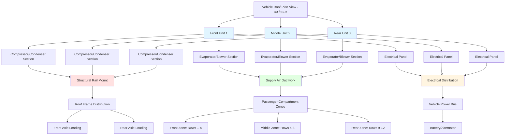

Rooftop equipment placement represents the dominant HVAC configuration for transit buses and select light rail vehicles. This mounting strategy offers superior maintenance accessibility and efficient use of vehicle interior space while introducing critical design constraints related to vehicle height, weight distribution, and aerodynamic performance. Engineering analysis must address structural loading, clearance envelope compliance, and operational efficiency to achieve reliable climate control without compromising vehicle dynamics.

## Rooftop Configuration Advantages

Rooftop mounting provides distinct operational benefits that make it the preferred configuration for most bus applications.

**Maintenance Accessibility:**

Service personnel access rooftop equipment from ground level using standard ladders or maintenance platforms, eliminating the need for pit access or vehicle lifting. Component replacement, refrigerant service, and filter changes proceed efficiently during routine maintenance intervals. Major overhauls complete in 4-6 hours compared to 8-12 hours for underfloor systems requiring extensive disassembly.

**Space Utilization:**

Rooftop placement preserves passenger compartment volume and avoids conflicts with seating, wheelchair securement areas, and fare collection equipment. A typical 40-foot transit bus gains 30-40 ft² of usable floor space compared to rear-bulkhead or underseat configurations.

**Condensate Management:**

Gravity drainage eliminates condensate pump requirements. Drain pans slope 1/4 inch per foot toward drain tubes that terminate below the roofline, preventing water accumulation and associated microbial growth. Systems operating in high-humidity climates discharge 2-5 gallons per hour during peak cooling.

**Thermal Efficiency:**

Rooftop condensers benefit from unrestricted airflow and avoid thermal recirculation issues common in underfloor installations. Condenser coils operate 5-10°F cooler than equivalent underfloor units, improving coefficient of performance by 8-12% and extending compressor service life.

## Weight Distribution Analysis

Rooftop HVAC equipment significantly affects vehicle center of gravity and axle loading.

**Equipment Mass:**

A complete rooftop HVAC package for a 40-foot transit bus weighs 1200-1800 pounds including:

- Compressor and refrigerant circuit: 300-450 lb
- Condenser coil and fan assembly: 250-350 lb
- Evaporator section and blower: 200-300 lb
- Housing and mounting structure: 350-500 lb
- Electrical components and controls: 100-150 lb

The center of gravity height increases by the equipment placement distance above the vehicle centerline.

**Center of Gravity Impact:**

Rooftop equipment raises the vehicle center of gravity, affecting roll stability during cornering and emergency maneuvers. The stability index calculation quantifies this effect:

$$SI = \frac{t}{2h_{cg}}$$

Where:
- $SI$ = stability index (dimensionless)
- $t$ = track width, axle to axle (typically 90-96 inches)
- $h_{cg}$ = center of gravity height above ground

Transit buses maintain $SI > 0.50$ to meet FMVSS 136 rollover protection standards. Adding 1500 pounds of rooftop equipment at 120 inches above ground to a 35,000-pound bus with original $h_{cg}$ of 48 inches produces a new center of gravity:

$$h_{cg,new} = \frac{(35000 \times 48) + (1500 \times 120)}{35000 + 1500} = 51.9 \text{ inches}$$

This 3.9-inch increase reduces the stability index from 0.52 to 0.48, approaching regulatory limits.

**Load Distribution Strategy:**

Multiple rooftop units distribute weight along the vehicle length to balance front and rear axle loading. A typical configuration places:

- Unit 1: 8-12 feet from front axle (cooling front 1/3 of passenger compartment)
- Unit 2: 20-24 feet from front axle (cooling middle 1/3)
- Unit 3: 32-36 feet from front axle (cooling rear 1/3)

This arrangement maintains axle weight ratios within 45-55% front/rear distribution limits for proper steering control and brake performance.

## Aerodynamic Housing Design

Rooftop equipment creates parasitic drag that directly impacts fuel economy and operational costs.

**Drag Force Calculation:**

The aerodynamic drag force from rooftop HVAC units follows:

$$F_D = \frac{1}{2} \rho V^2 C_D A_{frontal}$$

Where:
- $\rho$ = air density (0.075 lb/ft³ at sea level)
- $V$ = vehicle velocity (ft/s)
- $C_D$ = drag coefficient (0.8-1.2 for HVAC housings)
- $A_{frontal}$ = frontal area perpendicular to airflow (ft²)

A conventional box-style rooftop unit with 12 ft² frontal area at 55 mph (80.7 ft/s) generates:

$$F_D = \frac{1}{2} \times 0.075 \times (80.7)^2 \times 1.0 \times 12 = 2930 \text{ lb}_f$$

**Streamlined Housing Benefits:**

Aerodynamic housings with rounded leading edges, tapered trailing edges, and smooth surface transitions reduce drag coefficients to 0.5-0.7, cutting drag force by 30-40%. The fuel consumption penalty for a transit bus operating 40,000 miles annually decreases from 800 gallons to 500 gallons, saving $1,200-1,500 annually at typical diesel prices.

**Design Features:**

- **Leading edge radius**: 3-6 inch radius reduces flow separation
- **Top surface slope**: 5-8 degree angle toward rear minimizes wake turbulence
- **Side fairings**: Smooth transition from roof surface to equipment sides
- **Height minimization**: Overall profile limited to 12-16 inches above roof deck

## Clearance Envelope Requirements

Vehicle height including rooftop equipment must comply with infrastructure clearance limitations.

**Regulatory Standards:**

| Clearance Type | Minimum Height | Governing Standard | Typical Margin |
|----------------|----------------|-------------------|----------------|
| Bridge clearance (highway) | 14 ft 0 in | FHWA design standards | 6-12 inches |
| Bridge clearance (arterial) | 14 ft 6 in | State DOT specifications | 6-12 inches |
| Tunnel clearance (road) | 13 ft 6 in | Varies by facility | 3-6 inches |
| Garage clearance (depot) | 12 ft 6 in | Facility-specific | 6 inches |
| Tree clearance (route) | 13 ft 0 in | Transit agency routing | Variable |
| Parking structure | 8 ft 0 in - 12 ft 0 in | Building codes | 6 inches |

**Height Budget Analysis:**

A 40-foot transit bus clearance calculation:

$$H_{total} = H_{chassis} + H_{body} + H_{roof} + H_{HVAC}$$

Example calculation:
- Chassis height: 24 inches
- Body height: 96 inches
- Roof panel: 2 inches
- HVAC equipment: 14 inches
- Total: 136 inches = 11 ft 4 in

This configuration provides 30 inches clearance margin for a 14-foot bridge, adequate for route flexibility.

**Low-Profile Equipment:**

Restricted clearance routes require ultra-low-profile units:
- Standard profile: 14-18 inches above roof
- Low profile: 10-12 inches above roof
- Ultra-low profile: 7-9 inches above roof

Reduced height limits condenser fan diameter and evaporator depth, decreasing cooling capacity by 15-25% for equivalent footprint area.

## Structural Mounting Requirements

Rooftop equipment transfers static and dynamic loads to the vehicle roof structure.

**Load Components:**

$$F_{total} = F_{static} + F_{dynamic} + F_{wind}$$

Where:
- $F_{static}$ = equipment weight (1200-1800 lb)
- $F_{dynamic}$ = inertial loads during acceleration, braking, cornering
- $F_{wind}$ = aerodynamic uplift and side loading

**Dynamic Load Factors:**

Transit vehicles experience acceleration forces:
- Longitudinal (braking): 0.8-1.0 g
- Lateral (cornering): 0.4-0.6 g
- Vertical (road irregularities): 0.3-0.5 g

Combined loading during emergency braking while cornering:

$$F_{combined} = W_{eq} \sqrt{a_x^2 + a_y^2 + (1+a_z)^2}$$

For 1500 lb equipment:

$$F_{combined} = 1500 \sqrt{(0.8)^2 + (0.5)^2 + (1.3)^2} = 2430 \text{ lb}$$

**Mounting System Design:**

Rooftop units attach through:

1. **Structural rails**: Aluminum or steel channels welded/riveted to roof framing
2. **Mounting feet**: 4-8 attachment points with vibration isolators
3. **Fasteners**: 3/8-inch or 1/2-inch grade 5 bolts, minimum 4 per foot
4. **Load spreading plates**: Distribute concentrated loads over 6-12 inch² areas

The mounting structure must support 3-4 times static equipment weight to account for dynamic and impact loading.

## Maintenance Access Considerations

Service accessibility determines maintenance labor costs and system reliability.

**Access Methods:**

| Access Type | Equipment Required | Setup Time | Safety Considerations | Typical Cost |
|-------------|-------------------|------------|----------------------|--------------|
| Extension ladder | 12-16 ft ladder | 2-3 minutes | Fall protection required | $200-400 |
| Step ladder platform | Portable platform | 5-8 minutes | Guardrails provided | $800-1500 |
| Maintenance catwalk | Fixed facility structure | N/A | Permanent installation | $5000-15000 |
| Mobile lift platform | Scissor lift or boom | 10-15 minutes | Operator certification | $15000-35000 |
| Roof hatch access | Internal ladder | 3-5 minutes | Inside vehicle access | $500-1200 |

**Service Clearances:**

Maintenance personnel require working space around equipment:
- Front access (control panel): 30-36 inches
- Side access (filter service): 24-30 inches
- Rear access (electrical): 18-24 inches
- Top clearance (component removal): 48-60 inches

Multiple rooftop units must maintain 12-18 inch minimum spacing for technician movement between units.

**Component Accessibility:**

Critical service items require tool-free or simple hand-tool access:
- **Air filters**: Hinged access doors with quarter-turn fasteners, 2-5 minute replacement
- **Refrigerant service ports**: Accessible without panel removal, standard 1/4-inch and 3/8-inch SAE fittings
- **Electrical disconnects**: NEMA 3R weatherproof enclosures within 3 feet of equipment
- **Drain pans**: Removable for cleaning without refrigerant recovery

## Rooftop Equipment Arrangement

Multiple units require strategic placement for balanced performance and serviceability.

**Zoning Strategy:**

Each rooftop unit serves a dedicated passenger compartment zone to provide balanced temperature control and redundancy. Zone boundaries typically align with vehicle structure:

- Zone 1 (front): Driver area and rows 1-4, served by forward unit
- Zone 2 (middle): Rows 5-8, served by center unit
- Zone 3 (rear): Rows 9-12, served by rear unit

Independent zone control allows unoccupied areas to operate in setback mode, reducing energy consumption by 30-40% during light passenger loading.

## Equipment Type Selection

| Equipment Type | Capacity Range | Application | Advantages | Limitations |
|----------------|----------------|-------------|------------|-------------|
| Self-contained package | 18,000-36,000 Btu/hr | Single-zone buses | Simple installation, low cost | Limited capacity |
| Multi-zone package | 45,000-75,000 Btu/hr | Articulated buses | Centralized maintenance | Ductwork complexity |
| Split system | 24,000-48,000 Btu/hr | Light rail vehicles | Flexible placement | Refrigerant line length limits |
| Variable capacity | 20,000-60,000 Btu/hr | Modern transit fleets | Energy efficiency | Higher initial cost |
| Heat pump configuration | 18,000-42,000 Btu/hr | Moderate climates | Combined heating/cooling | Reduced heating at low ambient |

**Redundancy Considerations:**

Multiple independent units provide operational redundancy. A three-unit configuration maintains 67% cooling capacity with one unit failure, ensuring acceptable comfort during peak loading. Single large-capacity units eliminate redundancy, creating service disruption risk during component failure.

## Installation Standards and Specifications

Transit industry standards govern rooftop HVAC installation practices.

**Applicable Standards:**

- **APTA BUS-PSC-RP-002**: HVAC System Procurement Guidelines for Transit Buses
- **APTA RT-VIM-S-034**: Rail Transit Vehicle HVAC Standard
- **SAE J2765**: Roof-Mounted HVAC Systems for Transit Buses
- **ASHRAE Standard 169**: Climatic Data for Building Design Standards (adapted for mobile applications)

**Key Requirements:**

1. **Structural integration**: Mounting system designed by licensed professional engineer, calculations submitted with vehicle design package
2. **Vibration isolation**: 0.5-1.0 inch deflection isolators between equipment and mounting structure, natural frequency <10 Hz
3. **Electrical installation**: Wiring per SAE J1292, overcurrent protection sized at 125% of equipment full-load amperage
4. **Refrigerant containment**: Brazed copper refrigerant lines, pressure tested to 450 psig nitrogen, leak rate <0.5 oz/year
5. **Weather sealing**: All roof penetrations sealed with butyl tape and elastomeric sealant, IP-65 rating minimum

**Performance Testing:**

Installed systems undergo validation testing:
- **Pull-down test**: Achieve 75°F from 105°F ambient within 30 minutes
- **Capacity verification**: Maintain 72-76°F with 95°F ambient and full passenger load
- **Airflow measurement**: Verify 800-1200 CFM total supply air at design static pressure
- **Noise level**: Maximum 72 dBA at operator position during full cooling operation

## Electrified Rail Considerations

Light rail and electric trolleybus applications introduce rooftop space conflicts.

**Pantograph Interference:**

Electric vehicles using overhead catenary power require pantograph clearance:
- Pantograph width: 36-48 inches
- Raise/lower envelope: 60-72 inches
- Lateral movement: ±12 inches from centerline

HVAC equipment must maintain minimum 24-inch clearance from pantograph operating envelope to prevent electrical arcing and mechanical contact.

**Equipment Placement Options:**

1. **Split installation**: Place condenser/compressor sections on either side of centerline pantograph zone
2. **Offset mounting**: Shift HVAC units toward vehicle sides, accepting asymmetric ductwork routing
3. **Underfloor alternative**: Relocate HVAC to underfloor position, accepting maintenance access penalties

**Electromagnetic Compatibility:**

Pantograph operation generates electromagnetic interference affecting HVAC controls. Shielded control wiring and metal equipment enclosures provide EMI protection per EN 50121 railway EMC standards.

## Thermal Performance Optimization

Rooftop equipment placement affects system efficiency through environmental exposure.

**Solar Loading Effects:**

Rooftop condensers experience direct solar radiation adding thermal load:

$$Q_{solar,cond} = \alpha \times I \times A_{surface}$$

Where:
- $\alpha$ = absorptivity (0.3-0.5 for white/reflective coatings, 0.8-0.95 for dark surfaces)
- $I$ = incident solar radiation (250-300 Btu/hr-ft² peak)
- $A_{surface}$ = condenser top surface area (ft²)

A 30 ft² condenser top surface with dark coating absorbs:

$$Q_{solar,cond} = 0.85 \times 275 \times 30 = 7013 \text{ Btu/hr}$$

This additional load increases compressor work by 4-6%, reducing system efficiency. Reflective white coatings (solar reflectance index 85-95) cut solar gain by 60-70%.

**Airflow Optimization:**

Condenser fans must overcome roof airflow interference. Vehicle motion creates low-pressure wake zones behind rooftop equipment, reducing natural convection. Proper fan selection accounts for:
- Static pressure penalty: 0.1-0.2 inches w.g. additional resistance
- Airflow recirculation: 10-15% of condenser air may recirculate in wake zone
- Crosswind effects: Lateral airflow disrupts condenser fan performance at vehicle speeds above 40 mph

Forward-facing condenser orientation minimizes recirculation but increases aerodynamic drag. Side-facing or vertical discharge configurations balance airflow and drag considerations.

Rooftop HVAC equipment placement for transit vehicles demands integrated analysis of structural mechanics, aerodynamics, thermal performance, and maintenance logistics. Successful installations balance these competing requirements while maintaining compliance with clearance envelopes and achieving reliable passenger comfort across diverse operating conditions. Proper engineering during initial design prevents operational limitations and excessive maintenance costs throughout the vehicle service life.
