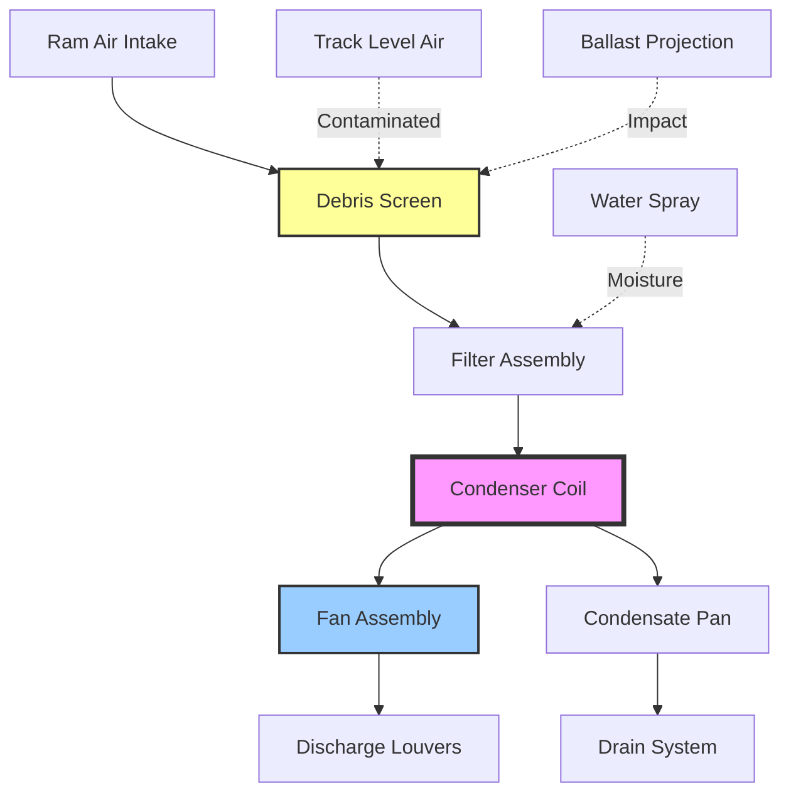

## Underfloor Equipment Configuration

Underfloor HVAC equipment placement represents a critical design strategy in mass transit vehicles, particularly for subway cars, commuter rail, and light rail vehicles where roof space is limited by clearance envelopes or occupied by pantographs and other electrical equipment. This configuration presents unique engineering challenges related to debris ingestion, acoustic management, thermal performance, and maintenance accessibility.

## Space Utilization Analysis

The available underfloor volume for HVAC equipment is constrained by multiple factors including truck clearances, track geometry, and structural members. The effective equipment volume can be calculated:

$$V_{eff} = L_{car} \times W_{frame} \times (h_{floor} - h_{truck} - C_{min})$$

where $L_{car}$ is the usable car length between truck centers, $W_{frame}$ is the frame width available for equipment, $h_{floor}$ is floor height above rail, $h_{truck}$ is maximum truck envelope height, and $C_{min}$ is minimum clearance to track structure.

The volume utilization efficiency considering equipment packaging:

$$\eta_{vol} = \frac{V_{equipment}}{V_{eff}} \times 100\%$$

Typical utilization ranges from 35-55% due to air circulation requirements, structural reinforcement, and service access needs.

## Debris Protection Requirements

Underfloor equipment operates in an extremely harsh environment with continuous exposure to ballast projection, water spray, ice accumulation, and airborne contaminants. Protection systems must address multiple threat vectors simultaneously.

### Physical Barriers

| Protection Level | Material | Thickness | Application |
|-----------------|----------|-----------|-------------|
| Primary screen | Stainless steel mesh | 14-16 gauge | Coil intake guards |
| Impact shield | Aluminum plate | 0.125-0.188 in | Compressor housing |
| Debris deflector | Composite panel | 0.25-0.375 in | Leading edge protection |
| Drain pan | Stainless steel | 12-14 gauge | Condensate collection |

Intake air filtration for underfloor units typically employs a three-stage approach:

1. **Coarse screen** (6-12 mm openings): Prevents large debris ingestion
2. **Fine mesh** (2-4 mm): Captures smaller particles and ice fragments
3. **Disposable filter** (MERV 8-11): Final particulate removal

The pressure drop across protection barriers impacts system performance:

$$\Delta P_{total} = \Delta P_{screen} + \Delta P_{mesh} + \Delta P_{filter}$$

Design must maintain $\Delta P_{total} < 0.3$ in w.g. to avoid excessive fan power consumption.

## Cooling Challenges

Underfloor equipment faces significant thermal management constraints due to limited airflow availability and elevated ambient temperatures from nearby traction equipment.

### Heat Rejection Analysis

The effective heat rejection capacity decreases with reduced air velocity and increased contamination:

$$Q_{reject} = \dot{m}_{air} \times c_p \times (T_{out} - T_{amb}) \times \eta_{HX}$$

where $\eta_{HX}$ represents heat exchanger effectiveness degraded by surface contamination:

$$\eta_{HX,actual} = \eta_{HX,clean} \times (1 - F_{fouling})$$

Fouling factors for underfloor condensers range from 0.15-0.30 depending on service environment and maintenance intervals.

### Condenser Air Supply

## Clearance Requirements

Underfloor equipment must maintain strict dimensional envelopes to prevent contact with track infrastructure, platforms, and grade-level obstructions.

### Dimensional Standards

| Standard | Minimum Clearance | Application |
|----------|------------------|-------------|
| AAR M-1001 | 3.5 in above TOR | Freight interchange |
| APTA PR-M-S-006 | 2.75 in above TOR | Rapid transit systems |
| FRA 213.9 | 3.0 in above TOR | Commuter rail operations |
| IEC 62278 | Per route survey | International rail systems |

TOR = Top of Rail reference point

The equipment envelope must also account for:

- **Suspension travel**: ±2-3 in vertical displacement under dynamic loading
- **Carbody lean**: 4-6° maximum in curves (centripetal acceleration)
- **Thermal expansion**: 0.5-1.0 in dimensional change over operating range
- **Track irregularities**: Additional 1-2 in safety margin

## Noise Isolation Strategies

Underfloor compressor and fan noise directly couples to carbody structure, requiring comprehensive acoustic treatment to meet interior sound level requirements (typically 68-72 dBA maximum).

### Vibration Isolation

Isolation effectiveness depends on the frequency ratio:

$$TR = \frac{f_{excite}}{f_{natural}}$$

Effective isolation requires $TR > 2.5$, achieved through:

- **Elastomeric mounts**: Natural frequency 8-12 Hz, deflection 0.25-0.5 in
- **Spring isolators**: Natural frequency 3-6 Hz, deflection 1.0-2.0 in
- **Combination systems**: Optimized for multi-frequency content

The transmissibility through isolation mounts:

$$T = \frac{1}{\sqrt{(1-TR^2)^2 + (2\zeta TR)^2}}$$

where $\zeta$ is the damping ratio (typically 0.05-0.10 for transit HVAC applications).

### Acoustic Enclosures

Sound transmission loss through composite enclosure panels:

$$TL = 20\log_{10}(f \times m) - 47 \text{ dB}$$

where $f$ is frequency (Hz) and $m$ is surface mass density (lb/ft²).

Multi-layer constructions with air gaps provide enhanced performance:

$$TL_{total} = TL_1 + TL_2 + 6\log_{10}(d \times f) - 5 \text{ dB}$$

where $d$ is air gap thickness (inches).

## Equipment Configuration Options

### Split System Arrangement

**Advantages:**
- Evaporator placement in optimal interior location
- Condenser positioned for maximum airflow
- Refrigerant line lengths typically 10-25 ft
- Reduced interior noise transmission

**Disadvantages:**
- Additional refrigerant charge requirements
- Potential vibration from dual mounting locations
- Complex service access for split components

### Packaged Underfloor Units

**Advantages:**
- Single-point mounting reduces carbody penetrations
- Integrated refrigerant circuit minimizes leak points
- Simplified maintenance procedures
- Reduced installation complexity

**Disadvantages:**
- Compromised air circulation patterns
- Increased weight concentration
- Limited cooling capacity (typically 24,000-48,000 BTU/h per unit)

## Maintenance Accessibility

Service access design significantly impacts vehicle availability and lifecycle costs. Underfloor equipment requires:

| Component | Access Method | Service Interval |
|-----------|--------------|------------------|
| Air filters | Side panel removal | 500-1000 miles |
| Condenser coils | Hinged access door | 5,000-10,000 miles |
| Compressor unit | Equipment drop-down | Annual inspection |
| Refrigerant service | Quick-connect ports | As needed |
| Condensate drains | Tool-free access | Monthly inspection |

Drop-down equipment designs allow complete unit removal in 15-30 minutes using overhead lifting equipment, critical for depot maintenance efficiency.

## Environmental Sealing

All underfloor enclosures must achieve IP65 (NEMA 4) minimum protection against:

- **Water ingress**: From track drainage, precipitation, and pressure washing
- **Dust penetration**: Ballast dust, brake residue, and environmental particulates
- **Ice formation**: Accumulated spray freezing in cold weather operations
- **Corrosive exposure**: Road salt, de-icing chemicals, and industrial fallout

Gasket materials must withstand temperature extremes from -40°F to +160°F while maintaining sealing effectiveness through thermal cycling and vibration.

## Performance Degradation Factors

Underfloor equipment experiences accelerated degradation compared to rooftop installations:

$$Q_{actual} = Q_{rated} \times (1 - F_{debris}) \times (1 - F_{corrosion}) \times (1 - F_{vibration})$$

where degradation factors typically range:

- $F_{debris}$: 0.05-0.15 (debris accumulation impact)
- $F_{corrosion}$: 0.02-0.08 (heat exchanger surface degradation)
- $F_{vibration}$: 0.03-0.10 (mounting and fastener loosening)

Aggressive preventive maintenance schedules mitigate these effects, with high-frequency cleaning (500-1000 mile intervals) essential for maintaining design performance.

## Design Recommendations

1. **Oversizing strategy**: Specify 15-20% additional capacity to compensate for environmental degradation
2. **Redundancy**: Implement multiple smaller units rather than single large unit for fault tolerance
3. **Filtration**: Maximize filter area to extend service intervals while minimizing pressure drop
4. **Drainage**: Provide positive-slope condensate removal with freeze protection
5. **Monitoring**: Integrate pressure differential sensors to detect filter loading and coil fouling
6. **Materials**: Specify marine-grade alloys and coatings for corrosive environment resistance

Underfloor HVAC equipment placement demands comprehensive understanding of the unique operational environment, balancing space constraints, environmental protection, thermal performance, and maintainability to achieve reliable climate control in mass transit applications.
