Internal heat sources from lighting, electronic displays, and auxiliary equipment contribute measurably to the total cooling load in mass transit vehicles. While individually smaller than passenger or solar loads, these continuous heat sources become significant over extended operating periods and directly impact HVAC system sizing and energy consumption.

## Lighting System Heat Generation

Transit vehicle lighting represents a continuous internal heat load that varies with technology type. The industry-wide transition from fluorescent to LED lighting has substantially reduced both electrical consumption and thermal loading.

### LED Lighting Systems

Modern LED lighting dominates new transit vehicle specifications due to superior energy efficiency and reduced heat output.

**LED Heat Load Calculation:**

$$Q_{\text{LED}} = P_{\text{lighting}} \times 3.412 \times F_{\text{ballast}}$$

Where:
- $Q_{\text{LED}}$ = heat output (BTU/hr)
- $P_{\text{lighting}}$ = total electrical power (watts)
- $3.412$ = conversion factor (BTU/hr per watt)
- $F_{\text{ballast}}$ = driver efficiency factor (typically 1.05-1.10 for LED drivers)

**Typical LED Lighting Power Densities:**

| Vehicle Type | Power Density (W/linear ft) | Total Vehicle Power (W) | Heat Load (BTU/hr) |
|--------------|----------------------------|------------------------|-------------------|
| 40-ft transit bus | 5-7 | 200-280 | 730-1,020 |
| 60-ft articulated bus | 6-8 | 360-480 | 1,310-1,750 |
| Light rail vehicle | 8-10 | 560-700 | 2,040-2,550 |
| Subway car | 7-9 | 490-630 | 1,785-2,295 |
| Commuter rail car | 6-8 | 420-560 | 1,530-2,040 |

For a 40-foot bus with 250 watts of LED lighting:

$$Q_{\text{LED}} = 250 \times 3.412 \times 1.08 = 922 \text{ BTU/hr}$$

This represents a 60-70% reduction compared to legacy fluorescent systems, significantly decreasing HVAC cooling requirements.

### Fluorescent Lighting (Legacy Systems)

Older transit vehicles equipped with fluorescent lighting experience substantially higher heat loads.

**Fluorescent Heat Load:**

$$Q_{\text{fluor}} = P_{\text{lamps}} \times 3.412 \times F_{\text{ballast}}$$

Where $F_{\text{ballast}}$ ranges 1.15-1.25 for magnetic ballasts, 1.10-1.15 for electronic ballasts.

**Fluorescent Lighting Comparison:**

| Lamp Type | Power Density (W/linear ft) | Total Power (40-ft bus) | Heat Load (BTU/hr) |
|-----------|----------------------------|------------------------|-------------------|
| T12 with magnetic ballast | 14-16 | 560-640 | 2,320-2,650 |
| T8 with electronic ballast | 11-13 | 440-520 | 1,720-2,030 |
| Compact fluorescent | 12-14 | 480-560 | 1,875-2,190 |

The temperature sensitivity of fluorescent ballasts creates additional challenges in transit applications, with performance degradation above 50°C ambient temperature common in roof-mounted fixtures exposed to solar loading.

### LED Conversion Benefits

Retrofit conversion from fluorescent to LED lighting delivers quantifiable HVAC benefits:

**Annual Cooling Energy Reduction:**

$$\Delta E_{\text{cool}} = \frac{(Q_{\text{fluor}} - Q_{\text{LED}}) \times t_{\text{operate}}}{12,000 \times \text{EER}}$$

Where:
- $\Delta E_{\text{cool}}$ = annual cooling energy savings (kWh)
- $t_{\text{operate}}$ = annual operating hours
- $\text{EER}$ = HVAC system energy efficiency ratio

For a transit bus operating 4,000 hours annually with EER 9.0:

$$\Delta E_{\text{cool}} = \frac{(2,100 - 920) \times 4,000}{12,000 \times 9.0} = 44 \text{ kWh/year}$$

Beyond direct cooling savings, LED systems reduce heat accumulation in ceiling plenums, improving thermal comfort distribution and reducing local hot spots in passenger spaces.

## Passenger Information and Display Systems

Electronic displays and communication systems represent growing heat sources as transit agencies deploy enhanced passenger information technologies.

### Display Heat Output by Type

| Display Technology | Typical Size | Power Consumption (W) | Heat Output (BTU/hr) |
|-------------------|--------------|----------------------|---------------------|
| LED destination sign (front) | 96" × 16" | 80-120 | 275-410 |
| LED side route sign | 84" × 12" | 60-90 | 205-310 |
| LCD passenger display | 17"-19" | 35-50 | 120-170 |
| LED interior signage | 42" × 8" | 45-70 | 155-240 |
| Driver display/HMI | 10"-12" | 25-40 | 85-135 |

**Total Display System Load:**

$$Q_{\text{displays}} = \sum_{i=1}^{n} (P_i \times 3.412 \times F_{\text{electronics}})$$

Where $F_{\text{electronics}} = 1.0$ (power dissipated as heat approaches 100% for displays).

A modern transit bus with destination signs, interior displays, and driver interface:

$$Q_{\text{displays}} = (100 + 75 + 40 + 50 + 30) \times 3.412 = 1,007 \text{ BTU/hr}$$

High-brightness displays required for sunlight readability consume substantially more power than interior displays, with heat output concentrated at mounting locations that may create localized thermal discomfort.

## HVAC Auxiliary Power Consumption

The HVAC system itself generates internal heat through electrical motor inefficiency, control electronics, and auxiliary components.

### HVAC Electrical Component Heat Loads

| Component | Power Range (W) | Heat to Passenger Space (BTU/hr) | Notes |
|-----------|----------------|--------------------------------|-------|
| Blower motor (cooling) | 800-1,500 | 2,050-3,850 | Motor inefficiency only |
| Blower motor (heating) | 400-800 | 1,025-2,050 | Lower airflow requirement |
| Control electronics | 50-120 | 170-410 | Continuous operation |
| Actuators (dampers, valves) | 30-80 | 100-275 | Transient during movement |
| Fresh air damper motor | 15-35 | 50-120 | Intermittent operation |
| Recirculation damper motor | 15-35 | 50-120 | Intermittent operation |

**Blower Motor Heat Contribution:**

$$Q_{\text{blower}} = \frac{P_{\text{motor}} \times (1 - \eta_{\text{motor}})}{1} \times 3.412$$

Where $\eta_{\text{motor}}$ = motor efficiency (typically 0.80-0.88 for transit HVAC blowers).

For a 1,200-watt blower motor with 85% efficiency:

$$Q_{\text{blower}} = 1,200 \times (1 - 0.85) \times 3.412 = 614 \text{ BTU/hr}$$

This heat enters the supply airstream, effectively reducing net cooling capacity. High-efficiency EC (electronically commutated) motors reduce this parasitic load by 30-40% compared to conventional AC motors.

### HVAC System Power Consumption Impact

Total HVAC auxiliary electrical consumption creates both direct heat loads and electrical generation requirements:

**Peak HVAC Electrical Demand:**

| Vehicle Type | Cooling Mode (kW) | Heating Mode (kW) | Ventilation Only (kW) |
|--------------|-------------------|-------------------|----------------------|
| 40-ft transit bus | 6.5-8.5 | 4.0-6.0 | 0.8-1.2 |
| 60-ft articulated bus | 10.0-13.0 | 6.5-9.0 | 1.2-1.8 |
| Light rail vehicle | 12.0-18.0 | 8.0-12.0 | 1.5-2.5 |
| Subway car | 14.0-20.0 | 9.0-14.0 | 2.0-3.5 |

For electric vehicles, HVAC electrical consumption directly impacts range. A 40-foot electric bus consuming 7.5 kW for HVAC reduces range by approximately 10-15% compared to operation in mild weather with ventilation only.

## Communication and Monitoring Equipment

Modern transit vehicles incorporate extensive electronic systems for operations, security, and passenger services.

### Electronic Equipment Heat Sources

**WiFi and Communication Systems:**

$$Q_{\text{comm}} = (P_{\text{router}} + P_{\text{modem}} + P_{\text{antennas}}) \times 3.412$$

Typical values:
- WiFi router/access point: 20-40 watts → 70-135 BTU/hr
- Cellular modem: 15-30 watts → 50-100 BTU/hr
- Radio communication: 25-50 watts → 85-170 BTU/hr

**Security and Monitoring:**

| Component | Quantity (typical bus) | Power per Unit (W) | Total Heat (BTU/hr) |
|-----------|----------------------|-------------------|---------------------|
| Security cameras | 6-10 | 4-8 | 80-270 |
| Digital video recorder | 1 | 35-60 | 120-205 |
| Fare collection system | 1 | 30-50 | 100-170 |
| Automatic passenger counter | 2-4 | 5-10 | 35-135 |
| Vehicle monitoring system | 1 | 25-45 | 85-155 |

**Total Auxiliary Equipment Load:**

$$Q_{\text{aux}} = \sum (P_{\text{comm}} + P_{\text{security}} + P_{\text{fare}} + P_{\text{monitor}}) \times 3.412$$

For a fully-equipped modern transit bus:

$$Q_{\text{aux}} = (35 + 25 + 40 + 170 + 15 + 35) \times 3.412 = 1,094 \text{ BTU/hr}$$

## Emergency and Specialty Lighting

Emergency lighting and specialty systems add supplementary heat loads with specific operational patterns.

**Emergency Lighting Systems:**

| System Type | Normal Operation (W) | Emergency Mode (W) | Heat Load Normal (BTU/hr) |
|-------------|---------------------|-------------------|--------------------------|
| Battery-backed LED exit signs | 3-6 per unit | 8-12 | 35-70 (4 units) |
| Emergency pathway lighting | Switched with main | Battery operation | Included in main lighting |
| Emergency egress lighting | 0 (standby) | 40-80 | 0 (standby mode) |

Emergency lighting heat loads remain minimal during normal operation but provide critical illumination during HVAC system failure scenarios.

## Internal Heat Sources System Diagram

```mermaid
graph TD
    A[Total Internal Equipment Heat] --> B[Lighting Systems]
    A --> C[Electronic Displays]
    A --> D[HVAC Auxiliary Power]
    A --> E[Communication Systems]

    B --> B1[LED Interior: 730-1,020 BTU/hr]
    B --> B2[Destination Signs: 275-410 BTU/hr]
    B --> B3[Emergency Lighting: 35-70 BTU/hr]

    C --> C1[Passenger Displays: 120-340 BTU/hr]
    C --> C2[Route Information: 155-240 BTU/hr]
    C --> C3[Driver Interface: 85-135 BTU/hr]

    D --> D1[Blower Motors: 2,050-3,850 BTU/hr]
    D --> D2[Control Electronics: 170-410 BTU/hr]
    D --> D3[Damper Actuators: 100-275 BTU/hr]

    E --> E1[WiFi Systems: 70-135 BTU/hr]
    E --> E2[Security Cameras: 80-270 BTU/hr]
    E --> E3[Fare Collection: 100-170 BTU/hr]
    E --> E4[Vehicle Monitoring: 85-155 BTU/hr]

    A --> F[Total Equipment Load<br/>40-ft Bus: 4,000-7,500 BTU/hr<br/>3-7% of Total Cooling Load]

    style A fill:#e1f5ff
    style F fill:#ffe1e1
    style B fill:#f0f0f0
    style C fill:#f0f0f0
    style D fill:#f0f0f0
    style E fill:#f0f0f0
```

## Combined Equipment Heat Load Calculation

The total equipment and lighting heat load combines all internal sources:

$$Q_{\text{total,equip}} = Q_{\text{LED}} + Q_{\text{displays}} + Q_{\text{blower}} + Q_{\text{controls}} + Q_{\text{comm}} + Q_{\text{aux}}$$

**Example Calculation - Modern 40-Foot Transit Bus:**

| Component | Heat Load (BTU/hr) |
|-----------|-------------------|
| LED interior lighting | 920 |
| Destination/route signs | 350 |
| Passenger information displays | 275 |
| HVAC blower motor heat | 615 |
| HVAC controls & actuators | 325 |
| WiFi and communications | 105 |
| Security and monitoring | 460 |
| Fare collection system | 135 |
| **Total Equipment Load** | **3,185** |

For comparison, a legacy bus with fluorescent lighting:

$$Q_{\text{total,legacy}} = 2,100 + 350 + 275 + 850 + 325 + 105 + 460 + 135 = 4,600 \text{ BTU/hr}$$

LED conversion reduces equipment heat loads by approximately 1,400 BTU/hr (30% reduction), allowing downsized HVAC equipment or improved thermal comfort margins.

## Heat Distribution Considerations

Equipment heat distribution affects local thermal comfort and HVAC system performance:

**Ceiling-Mounted Sources:**
- LED fixtures and destination signs create warm air stratification
- Heat rises to ceiling plenum, drawing return air from hottest zone
- Reduces effective sensible cooling if return grilles positioned at ceiling

**Floor/Dashboard-Mounted Sources:**
- Driver displays and control electronics create localized hot spots
- Requires dedicated air distribution to maintain operator comfort
- May necessitate spot cooling or increased airflow to driver area

**Distributed Sources:**
- Communication equipment throughout vehicle
- Security cameras create minimal localized heating
- Generally well-mixed with cabin air

## ASHRAE and APTA Standards

Equipment heat load calculations for transit applications should reference:

**ASHRAE Handbook - HVAC Applications, Chapter 11:**
- Recommends including all electrical loads as internal heat gains
- Provides conversion factors: 1 watt = 3.412 BTU/hr
- Notes that 100% of electrical energy dissipates as heat within conditioned space

**APTA Standards:**
- **APTA PR-M-S-015-06**: HVAC systems for mass transit vehicles
- Requires accounting for all onboard electrical equipment heat
- Specifies testing conditions including full electrical load operation

**IEEE Standards:**
- **IEEE 1835**: Power and energy requirements for rail transit vehicles
- Documents typical auxiliary power consumption ranges
- Provides guidance on electrical load diversity factors

## Load Diversity and Operational Factors

Not all equipment operates simultaneously at maximum capacity. Apply diversity factors:

| Equipment Category | Diversity Factor | Application |
|-------------------|-----------------|-------------|
| Interior lighting | 1.0 | Continuous operation |
| Destination signs | 1.0 | Continuous operation |
| Interior displays | 0.9 | Some may be in standby |
| WiFi/communications | 1.0 | Continuous operation |
| Security systems | 1.0 | Continuous recording |
| HVAC controls | 1.0 | Continuous operation |
| Fare collection | 0.7 | Intermittent transactions |

**Diversified Equipment Load:**

$$Q_{\text{design}} = \sum (Q_i \times DF_i)$$

Where $DF_i$ = diversity factor for each equipment type.

For design purposes, use diversity factors only when validated by operational data. Conservative designs assume 1.0 diversity (all equipment at full load) to ensure adequate capacity under all operating scenarios.

## Energy Efficiency Optimization

Reducing equipment heat loads decreases both cooling energy consumption and peak electrical demand:

**LED Retrofit ROI:**
- Lighting energy savings: 250-350 watts continuous
- Cooling load reduction: 1,200-1,500 BTU/hr
- Annual energy savings: 1,000-1,400 kWh (combined lighting + cooling)
- Typical payback period: 2-4 years including installation

**High-Efficiency HVAC Motors:**
- Blower motor efficiency improvement: 80% → 90%
- Heat load reduction: 200-400 BTU/hr
- Annual energy savings: 400-800 kWh
- Reduced inverter/VFD cooling requirements

**Smart Display Management:**
- Automatic brightness reduction in low-light conditions
- Power consumption reduction: 20-40%
- Heat load reduction: 150-300 BTU/hr during evening operation

Modern transit vehicle specifications increasingly mandate high-efficiency electrical components to minimize both operational costs and HVAC system requirements, creating a beneficial cycle of reduced energy consumption and improved thermal performance.

## Conclusion

Equipment and lighting heat loads, while individually smaller than passenger or solar components, contribute 3-7% of total transit vehicle cooling requirements. The transition to LED lighting technology reduces this load by 30-60% compared to legacy fluorescent systems, with corresponding reductions in HVAC energy consumption. Accurate quantification of all electrical loads ensures proper HVAC system sizing and identifies opportunities for energy optimization through high-efficiency component selection.
