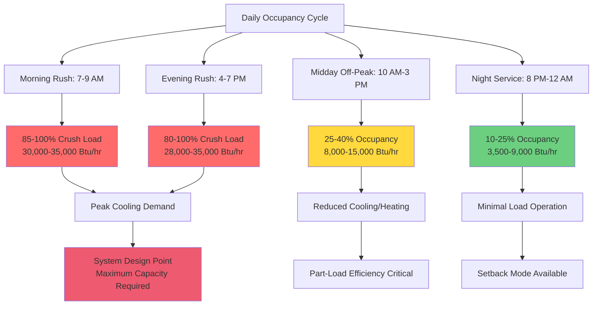

Passenger occupant loads constitute the most variable and often dominant component of mass transit HVAC cooling requirements. Unlike stationary buildings where occupancy remains relatively stable, transit vehicles experience extreme occupancy fluctuations ranging from empty off-peak conditions to crush loads during rush hours. Accurate load calculation requires understanding metabolic heat generation rates, activity level variations, and temporal occupancy patterns.

## Metabolic Heat Generation Fundamentals

Human metabolic processes convert chemical energy into mechanical work and thermal energy. The thermal component must be rejected to the environment to maintain core body temperature. Heat transfer from passengers occurs through:

1. **Sensible heat**: Convection and radiation to surrounding air and surfaces
2. **Latent heat**: Evaporation of perspiration and respiration moisture
3. **Total heat**: Sum of sensible and latent components

The ratio between sensible and latent heat depends on activity level, clothing, and ambient conditions. Transit environments typically operate at sensible heat ratios (SHR) of 0.55-0.65 during cooling seasons.

**Sensible Heat Ratio Calculation:**

$$\text{SHR} = \frac{q_{\text{sensible}}}{q_{\text{sensible}} + q_{\text{latent}}} = \frac{q_{\text{sensible}}}{q_{\text{total}}}$$

Where:
- $q_{\text{sensible}}$ = sensible heat gain (Btu/hr per person)
- $q_{\text{latent}}$ = latent heat gain (Btu/hr per person)
- $q_{\text{total}}$ = total metabolic heat rejection (Btu/hr per person)

## Heat Gain by Activity Level

ASHRAE Fundamentals Chapter 9 provides metabolic heat generation rates for various activity levels. Transit-specific values account for the unique postures and movements within vehicle environments.

**Passenger Heat Gain Rates:**

| Activity State | Sensible (Btu/hr) | Latent (Btu/hr) | Total (Btu/hr) | SHR | Typical Duration |
|----------------|-------------------|-----------------|----------------|-----|------------------|
| Seated, at rest | 225 | 125 | 350 | 0.64 | Continuous riders |
| Seated, light fidgeting | 235 | 140 | 375 | 0.63 | Normal seated |
| Standing, stationary | 250 | 175 | 425 | 0.59 | Standees at capacity |
| Standing, swaying/balancing | 265 | 190 | 455 | 0.58 | Standees during motion |
| Walking, slow boarding | 275 | 225 | 500 | 0.55 | Active boarding |
| Walking with luggage | 315 | 260 | 575 | 0.55 | Airport/station service |
| Climbing stairs (rail platforms) | 450 | 375 | 825 | 0.55 | Entry/exit events |

For design load calculations, use weighted averages based on expected activity distribution. A typical urban transit scenario assumes:

- 60% seated passengers: 350 Btu/hr average
- 35% standing passengers: 440 Btu/hr average
- 5% actively boarding/alighting: 500 Btu/hr average

**Weighted Average Passenger Load:**

$$q_{\text{avg}} = \sum (f_i \times q_i)$$

$$q_{\text{avg}} = (0.60 \times 350) + (0.35 \times 440) + (0.05 \times 500) = 389 \text{ Btu/hr per person}$$

## Total Occupant Load Calculation

The total cooling load from passengers scales linearly with occupancy count:

$$Q_{\text{occupants}} = N \times (q_{\text{sensible}} + q_{\text{latent}})$$

$$Q_{\text{occupants,sensible}} = N \times q_{\text{sensible}}$$

$$Q_{\text{occupants,latent}} = N \times q_{\text{latent}}$$

Where:
- $N$ = number of passengers
- $Q_{\text{occupants}}$ = total occupant load (Btu/hr)

**Example Calculation - 40-Foot Transit Bus:**

Given:
- Seated capacity: 40 passengers
- Crush load capacity: 75 passengers (design condition)
- Average heat gain: 400 Btu/hr per person (mixed activity)
- Sensible fraction: 245 Btu/hr (SHR = 0.61)
- Latent fraction: 155 Btu/hr

Total occupant load at crush capacity:

$$Q_{\text{occupants,total}} = 75 \times 400 = 30,000 \text{ Btu/hr}$$

$$Q_{\text{occupants,sensible}} = 75 \times 245 = 18,375 \text{ Btu/hr}$$

$$Q_{\text{occupants,latent}} = 75 \times 155 = 11,625 \text{ Btu/hr}$$

This single load component equals or exceeds the entire HVAC capacity of a 2,000 square foot residence, illustrating the severity of transit thermal loads.

## Occupancy Variation Patterns

Transit occupancy follows predictable daily and weekly patterns that significantly impact HVAC load profiles.

**Peak vs. Off-Peak Load Differential:**

| Time Period | Average Occupancy | % of Capacity | Occupant Load (Btu/hr) | Load Factor |
|-------------|-------------------|---------------|------------------------|-------------|
| Morning rush (7-9 AM) | 70 passengers | 93% | 28,000 | 1.00 |
| Late morning (9-11 AM) | 25 passengers | 33% | 10,000 | 0.36 |
| Midday (11 AM-2 PM) | 30 passengers | 40% | 12,000 | 0.43 |
| Afternoon (2-4 PM) | 28 passengers | 37% | 11,200 | 0.40 |
| Evening rush (4-7 PM) | 68 passengers | 91% | 27,200 | 0.97 |
| Evening (7-10 PM) | 20 passengers | 27% | 8,000 | 0.29 |
| Night service (10 PM-12 AM) | 12 passengers | 16% | 4,800 | 0.17 |

The 6:1 load ratio between peak and off-peak periods demands HVAC systems with excellent part-load performance and rapid capacity modulation.

## Standing vs. Seated Load Differences

Standing passengers generate 20-30% higher thermal loads than seated passengers due to increased muscle tension required for balance and stability.

**Comparative Analysis:**

| Position | Sensible (Btu/hr) | Latent (Btu/hr) | Total (Btu/hr) | Load Increase |
|----------|-------------------|-----------------|----------------|---------------|
| Seated, relaxed | 225 | 125 | 350 | Baseline |
| Standing, stationary | 250 | 175 | 425 | +21% |
| Standing, vehicle motion | 265 | 190 | 455 | +30% |

At crush load conditions, the proportion of standing passengers increases from 0% at seated capacity to 45-50% at maximum loading.

**Load Calculation with Mixed Seating:**

For a 40-seat bus carrying 75 passengers:
- 40 seated passengers: $40 \times 350 = 14,000$ Btu/hr
- 35 standing passengers: $35 \times 440 = 15,400$ Btu/hr
- Total occupant load: $29,400$ Btu/hr

Compare to all-seated scenario (40 passengers):
- 40 seated passengers: $40 \times 350 = 14,000$ Btu/hr
- Load increase from standees: 110%

## Seasonal and Climate Variations

Passenger heat gain characteristics vary with outdoor conditions and seasonal clothing.

**Winter Conditions:**
- Heavy clothing reduces latent heat rejection through skin
- Increased sensible heat from insulation effect
- SHR increases to 0.68-0.72
- Passenger loads become a heating credit during peak occupancy

**Summer Conditions:**
- Light clothing increases evaporative cooling from skin
- Higher latent fraction due to perspiration
- SHR decreases to 0.55-0.60
- Maximum cooling load scenario

**Humidity Impact on Latent Loads:**

$$q_{\text{latent}} = h_{fg} \times \dot{m}_{\text{moisture}}$$

Where:
- $h_{fg}$ = latent heat of vaporization (1,050 Btu/lb at 70°F)
- $\dot{m}_{\text{moisture}}$ = moisture generation rate (lb/hr)

At 75% outdoor relative humidity, reduced evaporative potential forces higher skin temperatures and increased perspiration rates, elevating latent loads by 15-25% compared to dry conditions.

## Design Recommendations

**Load Calculation Guidelines:**

1. **Use crush load capacity** for cooling system sizing, not seated capacity
2. **Apply 400-425 Btu/hr per person** for urban transit mixed activity
3. **Calculate sensible at SHR = 0.60** for summer design conditions
4. **Include 10-15% diversity factor** for large vehicles (articulated buses, multi-car trains) where not all zones reach peak simultaneously
5. **Verify latent capacity** to handle moisture loads and maintain humidity below 60% RH

**Occupancy Assumptions by Service Type:**

| Service Type | Design Occupancy | Seated % | Standing % | Load/Person |
|--------------|------------------|----------|------------|-------------|
| Urban local bus | 100% crush | 55% | 45% | 410 Btu/hr |
| Express/commuter bus | 100% seated | 100% | 0% | 350 Btu/hr |
| Light rail | 90% crush | 50% | 40% | 400 Btu/hr |
| Subway | 100% crush | 45% | 55% | 425 Btu/hr |
| Commuter rail | 110% seated (aisles) | 90% | 10% | 365 Btu/hr |

Accurate occupant load calculation forms the foundation for proper HVAC system sizing in mass transit applications. The extreme variability between peak and off-peak conditions demands equipment with wide capacity modulation ranges and control strategies that respond to real-time occupancy rather than fixed schedules.
