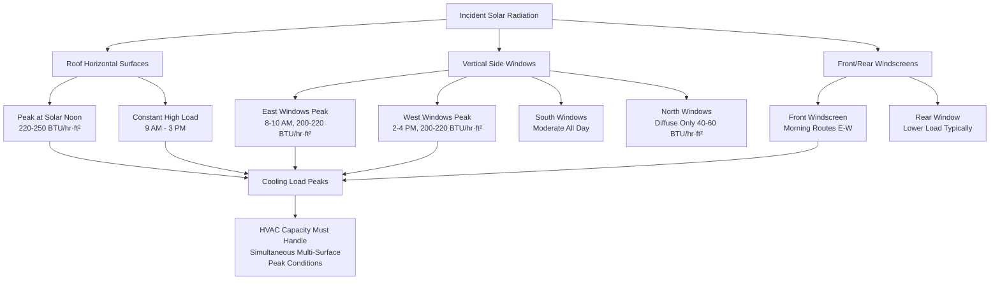

Solar radiation represents the single most significant and variable thermal load component in mass transit vehicle HVAC design. Transit vehicles present extensive glazed surface areas with minimal exterior shading, creating solar heat gains that can exceed 40,000-60,000 BTU/hr for a single 40-foot bus under peak conditions. The combination of large glass-to-wall ratios (20-35%), thin-skinned construction, and constantly changing orientation relative to the sun creates complex thermal dynamics requiring sophisticated calculation methods and effective mitigation strategies.

## Solar Radiation Fundamentals for Transit Applications

Solar heat gain through transit vehicle glazing follows the same physical principles as building applications but with several critical distinctions that amplify thermal loading.

**Direct and Diffuse Radiation Components:**

Transit vehicles receive solar radiation from three sources simultaneously:

1. **Direct beam radiation**: Collimated sunlight striking surfaces at the solar altitude and azimuth angles
2. **Diffuse sky radiation**: Scattered radiation from atmospheric particulates and water vapor, approximately 10-20% of clear-sky total
3. **Ground-reflected radiation**: Albedo effect from pavement, water, or surrounding surfaces contributing 5-15% additional load

The total incident solar radiation on any vehicle surface combines these components based on surface orientation and atmospheric conditions.

**Solar Intensity Variation by Latitude and Season:**

| Latitude | Summer Solstice Peak (BTU/hr·ft²) | Winter Solstice Peak (BTU/hr·ft²) | Equinox Peak (BTU/hr·ft²) |
|----------|-----------------------------------|-----------------------------------|---------------------------|
| 25°N (Miami) | 285-295 | 240-250 | 270-280 |
| 35°N (Los Angeles) | 275-285 | 220-230 | 260-270 |
| 40°N (New York) | 265-275 | 200-210 | 250-260 |
| 45°N (Minneapolis) | 255-265 | 180-190 | 240-250 |
| 50°N (Vancouver) | 245-255 | 160-170 | 230-240 |

These values represent normal incidence on a surface perpendicular to solar rays under clear-sky conditions at solar noon. Actual vehicle surface loads require trigonometric corrections for surface orientation.

## Solar Heat Gain Calculation Methodology

The fundamental equation for solar heat gain through transit glazing extends the ASHRAE building methodology with mobile-specific factors.

**Complete Solar Load Formula:**

$$Q_{solar} = \sum_{i=1}^{n} A_i \times SHGC_i \times SHGF_i \times CLF_i \times F_{orientation}$$

Where:
- $A_i$ = glazed surface area for surface $i$ (ft²)
- $SHGC_i$ = solar heat gain coefficient for glazing type (dimensionless, 0-1)
- $SHGF_i$ = solar heat gain factor, incident radiation intensity (BTU/hr·ft²)
- $CLF_i$ = cooling load factor accounting for thermal storage effects (0.6-1.0)
- $F_{orientation}$ = orientation correction factor for vehicle heading

**Incident Angle Correction:**

Solar radiation striking glass at oblique angles experiences reduced transmittance. The incident angle modifier follows:

$$SHGF_{effective} = SHGF_{normal} \times \cos(\theta)$$

Where $\theta$ is the angle between the surface normal and the solar beam. For vertical transit windows, this becomes:

$$\cos(\theta) = \sin(\beta) \times \cos(\gamma - \psi)$$

Where:
- $\beta$ = solar altitude angle (degrees above horizon)
- $\gamma$ = solar azimuth angle (degrees from north)
- $\psi$ = surface azimuth angle (vehicle orientation)

**Thermal Storage and Cooling Load Factor:**

Unlike buildings with substantial thermal mass, transit vehicles have minimal heat storage capacity in lightweight aluminum and steel construction. The cooling load factor for transit applications typically ranges 0.85-0.95, indicating that 85-95% of instantaneous solar gain becomes immediate cooling load rather than being absorbed and re-radiated later.

## Transit Glazing Solar Heat Gain Coefficients

Transit vehicle glazing specifications balance passenger visibility, structural requirements, and solar control performance.

**Standard Transit Glazing SHGC Values:**

| Glazing Type | SHGC | Visible Transmittance | U-Factor (BTU/hr·ft²·°F) | Typical Application |
|--------------|------|----------------------|-------------------------|---------------------|
| Single-pane clear, 1/4" | 0.82-0.86 | 0.88-0.90 | 1.10-1.15 | Legacy vehicles (pre-2000) |
| Single-pane tinted green, 1/4" | 0.68-0.72 | 0.75-0.78 | 1.08-1.12 | Standard bus glazing |
| Single-pane tinted bronze, 1/4" | 0.62-0.66 | 0.60-0.65 | 1.08-1.12 | High-solar-load climates |
| Single-pane reflective film | 0.45-0.55 | 0.50-0.65 | 1.05-1.10 | Retrofit solar control |
| Laminated tinted, 5/16" | 0.58-0.64 | 0.70-0.75 | 1.05-1.08 | Safety glass applications |
| Double-pane low-E, 1" overall | 0.38-0.42 | 0.70-0.75 | 0.45-0.52 | Premium rail cars |
| Double-pane tinted low-E | 0.28-0.34 | 0.55-0.65 | 0.42-0.48 | High-speed rail, climate-controlled |
| Electrochromic smart glass | 0.08-0.48 | 0.05-0.60 | 0.25-0.32 | Emerging technology |

**SHGC Impact on Cooling Load:**

The difference between clear single-pane glazing (SHGC = 0.84) and double-pane low-E tinted glass (SHGC = 0.32) for a 40-foot bus with 250 ft² of glazing under peak conditions (SHGF = 220 BTU/hr·ft²):

Clear glass: $Q = 250 \times 0.84 \times 220 \times 0.90 = 41,580$ BTU/hr

Low-E glass: $Q = 250 \times 0.32 \times 220 \times 0.90 = 15,840$ BTU/hr

Reduction: 25,740 BTU/hr (62% decrease in solar load, equivalent to 2.1 tons of cooling capacity)

## Orientation Effects and Dynamic Loading

Transit vehicles experience continuously varying solar exposure as routes change orientation relative to sun position.

**Solar Load by Surface Orientation:**

**Directional Load Calculation Example:**

For a 40-foot bus traveling east-west on a summer afternoon (2 PM, 40°N latitude):

**Surface solar loads:**

| Surface | Area (ft²) | Orientation | SHGF (BTU/hr·ft²) | SHGC | Load (BTU/hr) |
|---------|-----------|-------------|------------------|------|---------------|
| Roof | 320 | Horizontal | 235 | 0.15 (opaque) | 11,280 |
| North side windows | 95 | Vertical N | 65 | 0.68 | 4,199 |
| South side windows | 95 | Vertical S | 185 | 0.68 | 11,951 |
| East windscreen | 18 | Vertical E | 95 | 0.72 | 1,231 |
| West rear window | 12 | Vertical W | 215 | 0.72 | 1,857 |
| **Total Solar Load** | **540** | - | - | - | **30,518** |

The south-facing windows contribute 39% of total solar load despite representing only 18% of vehicle surface area, demonstrating the critical importance of orientation-specific glazing treatments.

## Solar Control Films and Retrofit Solutions

Aftermarket solar control films provide cost-effective thermal performance upgrades for existing transit fleets without replacing glazing.

**Solar Control Film Performance:**

| Film Type | SHGC Reduction | Visible Light Reduction | Payback Period (Years) | Durability |
|-----------|----------------|------------------------|----------------------|------------|
| Dyed absorptive film | 15-25% | 20-40% | 3-5 | 5-7 years |
| Metallized reflective film | 35-50% | 25-45% | 2-4 | 7-10 years |
| Ceramic non-metallic film | 40-55% | 10-25% | 2.5-4.5 | 10-12 years |
| Spectrally selective film | 45-60% | 5-15% | 2-3 | 10-15 years |
| Multi-layer nano-ceramic | 50-65% | 8-20% | 1.5-3 | 12-15 years |

**Installation Considerations:**

Solar control films must withstand transit-specific stresses absent in building applications:

- **Vibration resistance**: Adhesive systems must maintain bond integrity under continuous 5-15 Hz vibration
- **Thermal cycling**: Daily temperature swings from -20°F to 160°F create expansion/contraction stress
- **Curved glazing**: Many transit windows feature compound curves requiring skilled installation
- **Vandalism resistance**: Scratch-resistant hard coats essential for passenger-accessible surfaces
- **Regulatory compliance**: Films must not reduce visibility below FMVSS 205 requirements (70% minimum front windscreen transmittance)

**Energy Savings Calculation:**

For a 50-vehicle transit fleet operating in Phoenix, AZ (6,500 cooling degree days annually):

Baseline cooling energy: 50 vehicles × 8 tons average × 1,200 hours × 1.0 kW/ton = 480,000 kWh/year

With 50% SHGC reduction from ceramic film: 480,000 × 0.28 (solar load fraction) × 0.50 = 67,200 kWh/year savings

At $0.12/kWh: $8,064/year savings
Film cost: $150/vehicle × 50 = $7,500
Simple payback: 0.93 years

## Standards and Testing Requirements

Transit vehicle glazing and solar control products must meet multiple performance and safety standards.

**ASHRAE Standards:**

- **ASHRAE 90.1**: Energy standard for buildings (adapted for transit vehicle fenestration)
- **ASHRAE Handbook - HVAC Applications, Chapter 11**: Mass transit specific solar load factors and calculation procedures
- **ASHRAE Standard 55**: Thermal comfort conditions applicable to passenger compartments

**Federal Motor Vehicle Safety Standards (FMVSS):**

- **FMVSS 205**: Glazing materials - safety glass requirements for all transit windows
- **FMVSS 217**: Bus window retention and release mechanisms
- **FMVSS 302**: Flammability of interior materials including window films

**ANSI/NFRC Standards:**

- **NFRC 200**: Procedure for determining fenestration product U-factors
- **NFRC 201**: Procedure for interim standard test method for measuring center-of-glazing SHGC
- **NFRC 300**: Test method for determining visible transmittance and solar heat gain coefficient

**Testing Protocols:**

Solar heat gain coefficient verification follows NFRC 201 spectrophotometric measurement:

1. Sample preparation with representative glazing assembly
2. Spectral transmittance measurement from 300-2,500 nm wavelength
3. Spectral reflectance measurement (interior and exterior surfaces)
4. Integration against standard solar spectrum (ASTM G173)
5. Calculation of directly transmitted, absorbed, and re-radiated components

Results must be verified within ±0.02 SHGC units across three sample specimens to achieve certification.

## Design Strategies for Solar Load Mitigation

Effective transit HVAC design employs multiple complementary strategies to manage solar thermal gains.

**Glazing Area Optimization:**

While passenger comfort demands adequate daylighting and exterior visibility, excessive glazing creates unmanageable solar loads. Optimal design balances:

- Minimum glazing: 18-22% of total surface area for adequate daylighting
- Maximum practical glazing: 32-35% before solar loads dominate cooling requirements
- Window placement: Prioritize north-facing surfaces, minimize low-angle east/west exposure
- Roof glazing: Avoid transparent roof panels except for small clerestory features with high-performance glazing

**Zoned HVAC Capacity:**

Distributing cooling capacity to match asymmetric solar loading:

- East/west split systems for vehicles operating predominantly in cardinal directions
- Differential supply air volumes to sunny versus shaded zones
- Temperature sensors on glazing surfaces trigger localized capacity boost
- Variable-speed compressors modulate to instantaneous rather than average solar load

**Exterior Shading Elements:**

Permanent or deployable shading reduces solar gain before radiation enters the conditioned space:

- Deep roof overhangs at window head (6-12 inches) block high summer sun
- Horizontal louvers above windows reduce solar altitude exposure
- Interior roller shades or automated blinds provide passenger control (15-30% SHGC reduction when deployed)

Comprehensive solar load analysis and mitigation represent essential elements of successful transit vehicle HVAC design, directly impacting equipment sizing, energy consumption, and passenger thermal comfort under the severe operating conditions characteristic of mobile mass transit applications.
