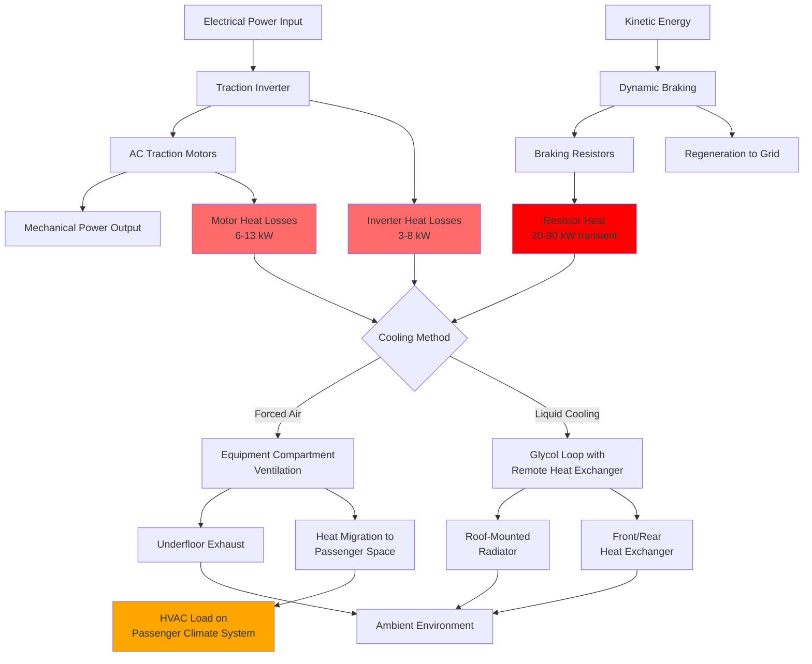

Electrical traction systems in modern transit vehicles generate substantial thermal loads that directly impact HVAC system design and passenger space conditioning. Unlike the relatively constant heat loads from lighting or steady-state occupancy, traction equipment produces highly variable thermal outputs that correlate with acceleration, deceleration, and sustained speed operation. Proper characterization of these heat sources ensures adequate cooling capacity while preventing thermal-related failures in critical propulsion components.

## Traction Motor Heat Dissipation

Electric traction motors convert electrical energy to mechanical work with typical efficiencies ranging from 92-96% under rated load conditions. The rejected heat manifests as $I^2R$ losses in windings, core losses from magnetic hysteresis, and mechanical friction losses in bearings and air gaps.

**Motor Heat Generation:**

$$Q_{motor} = \frac{P_{shaft}}{\eta_{motor}} - P_{shaft} = P_{shaft} \left(\frac{1}{\eta_{motor}} - 1\right)$$

Where:
- $Q_{motor}$ = heat rejected by motor (kW)
- $P_{shaft}$ = mechanical shaft power output (kW)
- $\eta_{motor}$ = motor efficiency (dimensionless, typically 0.92-0.96)

For a 150 kW traction motor operating at 94% efficiency:

$$Q_{motor} = 150 \left(\frac{1}{0.94} - 1\right) = 150 \times 0.0638 = 9.57 \text{ kW} = 32,650 \text{ BTU/hr}$$

This heat dissipation occurs continuously during traction, with peak values during hill climbing or acceleration events when motors operate at maximum current draw.

**Motor Heat Load by Type:**

| Motor Type | Rated Power (kW) | Efficiency (%) | Heat Rejection (kW) | BTU/hr | Typical Application |
|------------|------------------|----------------|---------------------|---------|---------------------|
| AC Induction (small) | 75 | 92 | 6.5 | 22,180 | Light rail, trams |
| AC Induction (medium) | 150 | 94 | 9.6 | 32,750 | Transit buses, subway |
| AC Induction (large) | 250 | 95 | 13.2 | 45,020 | Commuter rail, heavy metro |
| Permanent Magnet (PM) | 150 | 96 | 6.3 | 21,480 | Modern electric buses |
| Permanent Magnet (PM) | 250 | 97 | 7.7 | 26,280 | High-efficiency rail |

Permanent magnet motors demonstrate superior efficiency, reducing heat rejection by 30-40% compared to equivalent-power induction motors. This thermal advantage translates directly to reduced cooling system capacity requirements.

## Inverter and Power Electronics Heat Load

Traction inverters convert DC bus voltage to variable-frequency AC power for motor control. Modern IGBT (insulated-gate bipolar transistor) inverters operate at 97-99% efficiency, but the absolute magnitude of heat rejection remains substantial due to high power throughput.

**Inverter Heat Dissipation:**

$$Q_{inverter} = P_{output} \left(\frac{1}{\eta_{inverter}} - 1\right) + P_{losses,switching}$$

Where:
- $Q_{inverter}$ = inverter heat rejection (kW)
- $P_{output}$ = inverter output power (kW)
- $\eta_{inverter}$ = inverter efficiency (0.97-0.99)
- $P_{losses,switching}$ = switching losses (typically 0.5-1.0% of rated power)

**Inverter Thermal Loads:**

| Inverter Rating (kW) | Efficiency (%) | Conduction Losses (kW) | Switching Losses (kW) | Total Heat (kW) | BTU/hr |
|----------------------|----------------|------------------------|-----------------------|-----------------|--------|
| 200 | 98.0 | 3.1 | 1.0 | 4.1 | 13,990 |
| 400 | 98.5 | 4.5 | 2.0 | 6.5 | 22,180 |
| 600 | 98.8 | 5.4 | 3.0 | 8.4 | 28,660 |
| 800 | 99.0 | 6.4 | 4.0 | 10.4 | 35,480 |

Power electronics generate localized heat concentrations requiring dedicated cooling systems. Air-cooled inverters use forced ventilation with heat sinks, while liquid-cooled designs employ glycol circuits to manage thermal density exceeding 50 W/cm² on semiconductor junction surfaces.

## Dynamic Braking and Regenerative Heat

Dynamic braking systems dissipate kinetic energy as heat during deceleration, creating transient thermal loads that can exceed steady-state traction loads by factors of 2-4.

**Regenerative Braking Efficiency:**

Modern transit vehicles recover 15-35% of braking energy through regeneration back to the electrical distribution system or onboard energy storage. The remaining energy dissipates as heat through:

1. **Dynamic braking resistors** (non-regenerative systems)
2. **Motor copper losses** during regenerative mode
3. **Inverter losses** during power reversal

**Braking Heat Load:**

$$Q_{braking} = \frac{m v^2}{2 t} (1 - \eta_{regen}) \times \frac{1}{3412}$$

Where:
- $Q_{braking}$ = average braking heat power (kW)
- $m$ = vehicle mass (kg)
- $v$ = initial velocity (m/s)
- $t$ = braking duration (s)
- $\eta_{regen}$ = regenerative efficiency (0.15-0.35)
- 3412 = conversion factor BTU/hr to kW

For a 40,000 kg transit bus decelerating from 60 km/h (16.7 m/s) over 10 seconds with 25% regenerative efficiency:

$$Q_{braking} = \frac{40000 \times (16.7)^2}{2 \times 10} (1 - 0.25) \times \frac{1}{3412} = \frac{5,577,800}{68,240} = 81.7 \text{ kW}$$

This yields 278,800 BTU/hr instantaneous heat rejection during braking events. While transient, frequent stop patterns in urban transit create nearly continuous braking thermal loads averaging 20,000-40,000 BTU/hr.

## Heat Flow Paths and Thermal Management

Traction equipment heat follows multiple rejection paths depending on component location and cooling system architecture.

## Equipment Compartment Thermal Design

Traction equipment compartments require dedicated thermal management to maintain component temperatures within operational limits while minimizing heat transfer to passenger spaces.

**Equipment Temperature Limits:**

| Component | Maximum Operating Temp (°C) | Maximum Junction Temp (°C) | Derate Threshold (°C) |
|-----------|----------------------------|---------------------------|---------------------|
| IGBT inverters | 85 | 125-150 | 75 |
| Traction motors | 155 (winding) | - | 140 |
| Braking resistors | 400 | - | - |
| DC link capacitors | 85 | - | 70 |
| Gate drivers | 85 | 110 | 75 |

**Compartment Ventilation Requirements:**

$$CFM = \frac{Q_{total} \times 3.412}{\rho \times c_p \times \Delta T \times 60}$$

For air cooling ($\rho = 0.075$ lb/ft³, $c_p = 0.24$ BTU/lb·°F):

$$CFM = \frac{Q_{BTU/hr}}{1.08 \times \Delta T}$$

Where $\Delta T$ represents allowable temperature rise (typically 15-25°F for equipment compartments).

For 40,000 BTU/hr equipment heat load with 20°F temperature rise:

$$CFM = \frac{40,000}{1.08 \times 20} = 1,852 \text{ CFM}$$

This airflow requires substantial fan power (1-3 kW) and careful duct design to prevent recirculation or dead zones around critical components.

## Liquid Cooling Systems

High-power traction systems increasingly employ liquid cooling for inverters and motors, offering superior thermal performance in compact installations.

**Liquid Cooling Heat Transfer:**

$$Q = \dot{m} \times c_p \times \Delta T = \rho \times GPM \times c_p \times \Delta T \times 60$$

For 50/50 ethylene glycol solution ($\rho = 8.54$ lb/gal, $c_p = 0.76$ BTU/lb·°F):

$$Q_{BTU/hr} = 389 \times GPM \times \Delta T$$

To remove 50,000 BTU/hr with 15°F temperature rise:

$$GPM = \frac{50,000}{389 \times 15} = 8.6 \text{ GPM}$$

Liquid-cooled systems transfer equipment heat to remote heat exchangers where airflow does not compete with passenger space ventilation. Roof-mounted radiators or front-end heat exchangers reject this thermal load directly to ambient air.

## Heat Transfer to Passenger Spaces

Despite thermal barriers, 15-30% of traction equipment heat typically migrates into passenger compartments through:

1. **Conduction through floors and bulkheads** separating equipment bays
2. **Convection from warm surfaces** exposed to passenger areas
3. **Radiation from hot components** visible in open configurations
4. **Air leakage** from equipment compartments into passenger zones

**Conductive Heat Transfer:**

$$Q_{cond} = \frac{k \times A \times \Delta T}{L}$$

For a 50 ft² aluminum floor panel (k = 120 BTU/hr·ft·°F, L = 0.5 inches) with 40°F temperature differential:

$$Q_{cond} = \frac{120 \times 50 \times 40}{0.5/12} = 2,880,000 \text{ BTU/hr}$$

This unrealistic value demonstrates why insulation layers (fiberglass, foam) reduce effective conductivity to U = 0.15-0.25 BTU/hr·ft²·°F:

$$Q = U \times A \times \Delta T = 0.20 \times 50 \times 40 = 400 \text{ BTU/hr}$$

## Standards and Design References

Transit vehicle traction thermal design follows multiple standards addressing both electrical and thermal performance:

- **IEEE 1572**: Standard for Propulsion System Control in Electric Rail Rapid Transit Vehicles
- **IEC 60349**: Electric traction - Rotating electrical machines for rail and road vehicles
- **APTA RT-VIM**: Recommended Practice for HVAC Systems for Passenger Rail Cars
- **EN 50155**: Electronic equipment used on rolling stock (temperature ratings)
- **UL 2267**: Fuel Cell Power Systems for Installation in Industrial Electric Vehicles

Thermal management systems must maintain component temperatures within these standard limits across ambient conditions ranging from -40°F to 125°F, representing global transit operating environments.

## Integration with Passenger HVAC Systems

Effective thermal design coordinates traction equipment cooling with passenger climate control to:

1. **Prevent thermal interference** between equipment ventilation and passenger air supply
2. **Minimize auxiliary power consumption** for cooling fans and pumps
3. **Enable waste heat recovery** during cold weather operation (heating passenger spaces)
4. **Optimize overall vehicle energy efficiency** through integrated thermal management

Modern transit vehicles achieve 5-15% energy savings through integrated thermal systems that recover inverter and motor waste heat for passenger compartment heating, reducing demand on dedicated electric heaters during winter operations.

Traction equipment represents the largest variable thermal load in electric transit vehicles, requiring sophisticated cooling approaches that balance component protection with overall system energy efficiency and passenger comfort.
