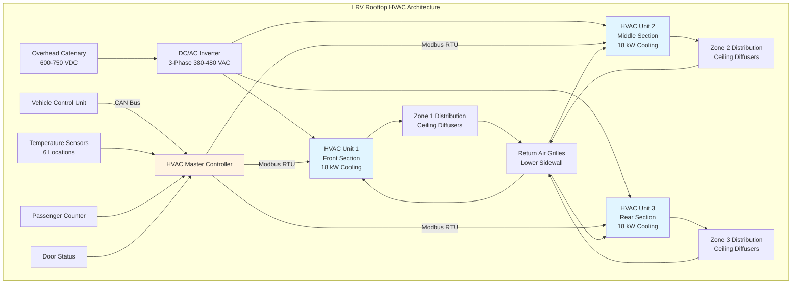
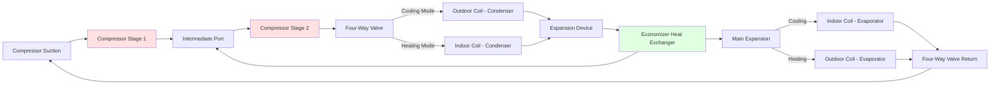

Light rail vehicle climate systems employ specialized HVAC configurations designed to operate reliably in mobile environments while managing severe thermal loads within strict weight and space constraints. System selection depends on vehicle architecture, low-floor design requirements, and operational climate conditions. The three primary configurations—packaged rooftop units, split systems, and heat pump architectures—each offer distinct advantages for specific LRV applications.

## Cooling Capacity Requirements

LRV cooling capacity calculations account for the combined effects of solar radiation, passenger loads, equipment heat rejection, and infiltration during frequent station stops.

### Design Load Calculation

The total cooling load for a single LRV section follows:

$$Q_{total} = Q_{solar} + Q_{trans} + Q_{occupants} + Q_{infiltration} + Q_{equipment} + Q_{ventilation}$$

**Solar load** dominates in modern LRVs with extensive glazing:

$$Q_{solar} = A_{glass} \cdot SHGC \cdot I_{solar} \cdot CLF \cdot SF$$

where:
- $A_{glass}$ = glazed area (m² or ft²)
- $SHGC$ = solar heat gain coefficient (0.25-0.55)
- $I_{solar}$ = incident solar radiation (800 W/m² or 250 Btu/hr-ft²)
- $CLF$ = cooling load factor (0.75-0.90)
- $SF$ = shading factor from external shading devices (0.85-1.0)

For a typical 24-meter articulated LRV with 35 m² of glazing and SHGC of 0.40:

$$Q_{solar} = 35 \text{ m}^2 \cdot 0.40 \cdot 800 \text{ W/m}^2 \cdot 0.85 \cdot 1.0 = 9,520 \text{ W}$$

**Passenger load** varies with occupancy density:

$$Q_{occupants} = N \cdot (q_{sensible} + q_{latent}) = N \cdot (100 + 50) = 150N \text{ W}$$

At design occupancy of 80 passengers per section:

$$Q_{occupants} = 80 \cdot 150 = 12,000 \text{ W}$$

**Transmission load** through the vehicle envelope:

$$Q_{trans} = \sum (U_i \cdot A_i \cdot \Delta T)$$

| Component | U-value (W/m²-K) | Area (m²) | ΔT (K) | Heat Gain (W) |
|-----------|------------------|-----------|--------|---------------|
| Roof panel | 0.35 | 45 | 15 | 236 |
| Side panels | 0.45 | 55 | 12 | 297 |
| End walls | 0.50 | 12 | 12 | 72 |
| Floor | 0.60 | 40 | 8 | 192 |
| Windows | 1.20 | 35 | 12 | 504 |
| **Total** | — | — | — | **1,301** |

**Infiltration load** from door openings:

$$Q_{infiltration} = 1.23 \cdot \dot{V} \cdot \Delta T + 3010 \cdot \dot{V} \cdot \Delta \omega$$

where:
- $\dot{V}$ = infiltration airflow rate (m³/s)
- $\Delta T$ = temperature difference (K)
- $\Delta \omega$ = humidity ratio difference (kg water/kg dry air)

Assuming 0.35 m³/s average infiltration at design conditions (35°C outdoor, 24°C indoor, 60% RH outdoor):

$$Q_{infiltration,sensible} = 1.23 \cdot 0.35 \cdot 11 = 4.74 \text{ kW}$$
$$Q_{infiltration,latent} = 3010 \cdot 0.35 \cdot 0.010 = 10.54 \text{ kW}$$

**Equipment heat rejection** from traction systems:

$$Q_{equipment} = \frac{P_{inverter} \cdot (1 - \eta)}{\eta} + Q_{lighting}$$

For a 300 kW inverter at 97.5% efficiency:

$$Q_{equipment} = \frac{300,000 \cdot 0.025}{0.975} + 1,200 = 8,900 \text{ W}$$

**Ventilation load** for outdoor air requirement:

$$Q_{ventilation} = \dot{m}_{oa} \cdot (h_{oa} - h_{ra})$$

At 15 CFM/person (0.007 m³/s-person), 80 passengers require 0.56 m³/s outdoor air. With enthalpy difference of 25 kJ/kg:

$$Q_{ventilation} = 0.68 \cdot 0.56 \cdot 25 = 9.5 \text{ kW}$$

### Total Capacity

Summing all components:

| Load Component | Cooling Load (kW) | Percentage |
|----------------|-------------------|------------|
| Solar radiation | 9.5 | 20% |
| Passengers | 12.0 | 25% |
| Transmission | 1.3 | 3% |
| Infiltration (sensible) | 4.7 | 10% |
| Infiltration (latent) | 10.5 | 22% |
| Equipment | 8.9 | 19% |
| Ventilation | 0.5 | 1% |
| **Total** | **47.4** | **100%** |

Adding 10% safety factor for transient conditions:

$$Q_{design} = 47.4 \cdot 1.10 = 52.1 \text{ kW (15 tons)}$$

This drives selection of HVAC equipment with total cooling capacity of 50-55 kW for a three-section articulated LRV.

## Packaged Rooftop Unit Configuration

Rooftop HVAC packages represent the most common LRV climate system architecture, offering accessibility, modularity, and proven reliability.

### System Architecture

### Component Specifications

Each rooftop package integrates all refrigeration components in a compact, weatherproof enclosure:

| Component | Specification | Notes |
|-----------|---------------|-------|
| Compressor | Scroll, 3-5 kW input | Variable speed drive, 30-100% capacity |
| Condenser | Microchannel, 0.45 m² face area | Aluminum construction, 300-400 FPM face velocity |
| Evaporator | Copper-aluminum, 0.55 m² face area | Sloped drain pan, 400-500 FPM face velocity |
| Expansion device | Electronic expansion valve (EEV) | Stepper motor, 0-100% modulation |
| Condenser fan | EC motor, 1200 m³/hr | Variable speed, 200-1500 RPM |
| Evaporator fan | EC motor, 1800 m³/hr | Centrifugal blower, forward-curved |
| Refrigerant | R134a or R513A | Charge 3.5-5.0 kg per unit |
| Unit weight | 280-350 kg | Including mounting frame |
| Dimensions | 1800 × 900 × 400 mm | Height includes 100 mm clearance |

### Thermal Performance

The coefficient of performance (COP) at design conditions determines electrical power consumption:

$$COP = \frac{Q_{cooling}}{W_{comp} + W_{fans}} = \frac{h_1 - h_4}{(h_2 - h_1) + W_{fans}/\dot{m}_{ref}}$$

where enthalpies correspond to refrigeration cycle state points:
- $h_1$ = evaporator outlet (compressor suction)
- $h_2$ = compressor discharge
- $h_4$ = evaporator inlet (post-expansion)

At design conditions (35°C ambient, 24°C return air, 18 kW cooling):

$$COP = \frac{18,000}{6,500 + 850} = 2.45$$

Part-load performance improves through variable-speed compressor operation. At 50% cooling load:

$$COP_{part} = \frac{9,000}{2,800 + 450} = 2.77$$

Seasonal energy efficiency accounts for varying load conditions throughout operating hours.

### Air Distribution Design

Ceiling-mounted linear diffusers deliver conditioned air along vehicle length:

$$\dot{V}_{supply} = \frac{Q_{sensible}}{1.23 \cdot \rho \cdot c_p \cdot \Delta T} = \frac{Q_{sensible}}{1.23 \cdot \Delta T}$$

For 18 kW sensible cooling with 12°C supply-to-room temperature difference:

$$\dot{V}_{supply} = \frac{18,000}{1.23 \cdot 12} = 1,220 \text{ m}^3\text{/hr}$$

This provides approximately 10 air changes per hour for the 120 m³ vehicle section volume.

Throw distance from ceiling diffusers must reach floor level while avoiding occupant discomfort:

$$L_{throw} = \frac{T_0 \cdot v_0}{T_x} \cdot K$$

where:
- $T_0$ = initial temperature difference (°C)
- $v_0$ = discharge velocity (m/s)
- $T_x$ = temperature difference at distance $L$ (°C)
- $K$ = diffuser-specific constant (0.9-1.2)

For 3.5 m ceiling height, diffusers sized for 3.0-3.5 m throw at 0.25 m/s terminal velocity.

### Mounting and Vibration Isolation

Rooftop units mount to structural crossbeams through elastomeric isolators:

**Isolation system design:**

Natural frequency must remain below vehicle body resonance:

$$f_n = \frac{1}{2\pi} \sqrt{\frac{k}{m}}$$

where:
- $k$ = isolator stiffness (N/m)
- $m$ = equipment mass (kg)

For 300 kg unit mass, target natural frequency of 8-10 Hz requires:

$$k = (2\pi f_n)^2 \cdot m = (2\pi \cdot 9)^2 \cdot 300 = 95,500 \text{ N/m}$$

Four isolators per unit: $k_{individual} = 95,500/4 = 23,900$ N/m

Transmissibility at vehicle body frequency (18 Hz):

$$TR = \frac{1}{\sqrt{(1-r^2)^2 + (2\zeta r)^2}}$$

where $r = f_{excitation}/f_n = 18/9 = 2.0$ and damping ratio $\zeta = 0.10$:

$$TR = \frac{1}{\sqrt{(1-4)^2 + (0.4)^2}} = 0.33$$

This provides 67% vibration reduction, equivalent to 10 dB attenuation.

## Split System Architecture

Split HVAC systems separate compressor/condenser units from evaporator sections, optimizing space utilization in low-floor LRV designs.

### Configuration Options

**Option 1: Rooftop Condenser, Distributed Evaporators**

Condensing units mount on roof above high-floor sections, with refrigerant lines feeding underfloor evaporators in low-floor zones.

| Component Location | Equipment | Capacity | Installation |
|-------------------|-----------|----------|--------------|
| Rooftop (×2 units) | Compressor, condenser, receiver | 25 kW each | Standard roof mounting |
| Underfloor (×4 units) | Evaporator, blower, EEV | 12 kW each | Shallow-profile 200 mm height |
| Structure | Refrigerant lines | Liquid/suction | Insulated, vibration loops |

**Option 2: Underfloor Condenser, Ceiling Evaporators**

Entire refrigeration system mounts underfloor with ducted air distribution to ceiling outlets.

**Option 3: End-Mounted Condensing, Mid-Section Evaporators**

Condensing units at vehicle ends serve evaporator sections throughout vehicle length.

### Refrigerant Line Sizing

Proper refrigerant line sizing prevents excessive pressure drop while ensuring oil return:

**Liquid line sizing:**

$$\Delta P_{liquid} = \frac{f \cdot L \cdot \rho \cdot v^2}{2 \cdot D}$$

where:
- $f$ = friction factor (0.015-0.025 for refrigerant flow)
- $L$ = equivalent length including fittings (m)
- $\rho$ = liquid refrigerant density (kg/m³)
- $v$ = refrigerant velocity (m/s)
- $D$ = pipe diameter (m)

Target pressure drop: <0.5°C saturation temperature equivalent (<70 kPa for R134a)

**Suction line sizing:**

Velocity must exceed minimum for oil entrainment:

$$v_{min} = \sqrt{\frac{4 \cdot \sigma}{\rho_{gas} \cdot D}} \cdot 2.5$$

For R134a at 5°C evaporating temperature:
- Surface tension $\sigma = 0.010$ N/m
- Gas density $\rho_{gas} = 15$ kg/m³
- Minimum velocity for 22 mm ID: $v_{min} = 4.0$ m/s

| Capacity (kW) | Liquid Line OD (mm) | Suction Line OD (mm) | Max Length (m) |
|---------------|---------------------|----------------------|----------------|
| 10-12 | 9.5 | 22 | 15 |
| 12-15 | 12.7 | 28 | 20 |
| 15-20 | 15.9 | 35 | 25 |
| 20-25 | 15.9 | 42 | 30 |

### Control Challenges

Split systems require coordinated control across multiple evaporator sections:

**Refrigerant distribution:**

Each evaporator employs independent EEV controlled for target superheat:

$$SH_{target} = T_{suction} - T_{sat,evap}$$

Typical superheat setpoint: 5-7°C at design load, 8-12°C at part load

**Capacity balancing:**

Evaporator loading varies with local zone conditions. Electronic expansion valves modulate to maintain:

$$\sum \dot{m}_{evap,i} = \dot{m}_{compressor}$$

Master controller sequences compressor capacity to match total evaporator demand while preventing liquid floodback.

### Installation Complexity

Split system installation requires skilled refrigeration technicians for:

1. Refrigerant line routing through vehicle structure with vibration compensation loops every 3-4 meters
2. Nitrogen pressure testing at 400 psig (2.76 MPa) for 24 hours
3. Vacuum evacuation to 500 microns absolute pressure
4. Refrigerant charging using subcooling method (10-15°F target)
5. Superheat verification and EEV calibration at each evaporator
6. System balancing under loaded conditions

Labor hours: 80-120 hours per vehicle compared to 40-60 hours for packaged rooftop systems.

## Heat Pump Configurations

Heat pump systems provide both heating and cooling from a single refrigeration circuit, eliminating dedicated electric resistance heaters.

### Reverse Cycle Operation

Heat pump systems employ four-way reversing valves to switch between cooling and heating modes:

**Cooling mode:**

$$Q_{cooling} = \dot{m}_{ref} \cdot (h_1 - h_4)$$

Evaporator inside vehicle, condenser rejecting heat to outdoor air.

**Heating mode:**

$$Q_{heating} = \dot{m}_{ref} \cdot (h_2 - h_3)$$

Condenser inside vehicle, evaporator extracting heat from outdoor air.

### Heating Capacity Analysis

Heat pump heating capacity degrades as outdoor temperature decreases:

$$Q_{heating,T} = Q_{heating,rated} \cdot \left(1 - 0.015 \cdot (T_{rated} - T_{outdoor})\right)$$

| Outdoor Temp (°C) | Heating Capacity (kW) | COP | Supplemental Heat (kW) |
|-------------------|----------------------|-----|------------------------|
| 10 | 22 | 3.2 | 0 |
| 5 | 20 | 2.8 | 0 |
| 0 | 18 | 2.4 | 5 |
| -5 | 16 | 2.0 | 10 |
| -10 | 14 | 1.6 | 15 |
| -15 | 12 | 1.3 | 20 |

Below -10°C, heat pump efficiency approaches electric resistance heating (COP ≈ 1.0), diminishing energy savings.

### Enhanced Vapor Injection (EVI)

Advanced heat pump systems employ vapor injection to extend low-temperature heating capacity:

EVI systems maintain COP > 2.0 at temperatures down to -20°C, expanding viable heat pump operating range.

### Defrost Cycle Management

Outdoor coil frosting occurs when operating in heating mode below 5°C with high humidity. Defrost cycles reverse to cooling mode briefly:

**Defrost initiation criteria:**

$$\Delta P_{coil} > 150 \text{ Pa} \quad \text{OR} \quad T_{coil} < -2°C \quad \text{for} \quad t > 30 \text{ min}$$

**Defrost duration:**

$$t_{defrost} = \frac{m_{frost} \cdot (h_{fusion} + c_p \cdot \Delta T)}{Q_{defrost}}$$

For 2 kg accumulated frost:

$$t_{defrost} = \frac{2 \cdot (334 + 4.2 \cdot 10)}{25,000} = 30 \text{ seconds}$$

Passenger compartment temperature droop during defrost limited to 1-2°C through thermal mass and reduced airflow.

### Application Suitability

Heat pump viability depends on climate conditions:

| Climate Zone | Winter Design Temp | Heat Pump Recommended | Configuration |
|--------------|-------------------|----------------------|---------------|
| Mild (coastal) | 0 to 10°C | Yes | Standard reverse cycle |
| Moderate | -10 to 0°C | Yes | EVI or dual-fuel |
| Cold | -20 to -10°C | Marginal | EVI + electric backup |
| Severe cold | Below -20°C | No | Electric resistance primary |

## System Selection Criteria

LRV climate system configuration depends on multiple factors:

| Selection Factor | Rooftop Package | Split System | Heat Pump |
|------------------|-----------------|--------------|-----------|
| Initial cost | $ | $$ | $$$ |
| Installation labor | 40-60 hrs | 80-120 hrs | 60-90 hrs |
| Maintenance access | Excellent | Poor to moderate | Good |
| Low-floor compatibility | Limited | Excellent | Moderate |
| Weight distribution | Top-heavy | Balanced | Top-heavy |
| Energy efficiency | COP 2.3-2.6 | COP 2.4-2.8 | COP 1.5-3.2 |
| Redundancy options | Excellent | Good | Moderate |
| Climate flexibility | Cooling-focused | Cooling-focused | Heating + cooling |

## Standards and Testing Requirements

LRV climate systems must comply with multiple standards:

**IEEE 1475-2014:** Standard for Functional Safety of Passenger Rail Vehicle Systems
- Emergency ventilation requirements
- Fail-safe temperature control
- Fire detection integration

**EN 14750-1:** Railway Applications - Air Conditioning for Urban and Suburban Rolling Stock
- Comfort categories: A (±2°C), B (±3°C), C (±4°C)
- Cooling capacity verification testing
- Energy consumption limits

**EN 13129:** Railway Applications - Air Conditioning for Driving Cabs
- Driver compartment independent control
- Rapid cooling for solar-heated cabs
- Fresh air provisions

**Testing protocols:**

Climatic chamber validation at:
- Extreme heat: 43°C ambient, 1000 W/m² solar, full passenger load
- Extreme cold: -25°C ambient, heating capacity verification
- Humidity: 32°C, 90% RH, latent load performance
- Pull-down: 60°C soak temperature to 24°C in <30 minutes

Systems must demonstrate 20,000+ hours MTBF in revenue service conditions.

---

Climate system selection for light rail vehicles balances thermal performance, installation complexity, maintenance accessibility, and energy efficiency within the constraints of vehicle architecture and operating environment. Packaged rooftop units offer simplicity and accessibility for standard floor designs, split systems enable low-floor vehicle configurations, and heat pump systems provide heating-cooling versatility in moderate climates. Proper engineering analysis using rigorous load calculations and refrigeration system design ensures passenger comfort across the vehicle service life.
