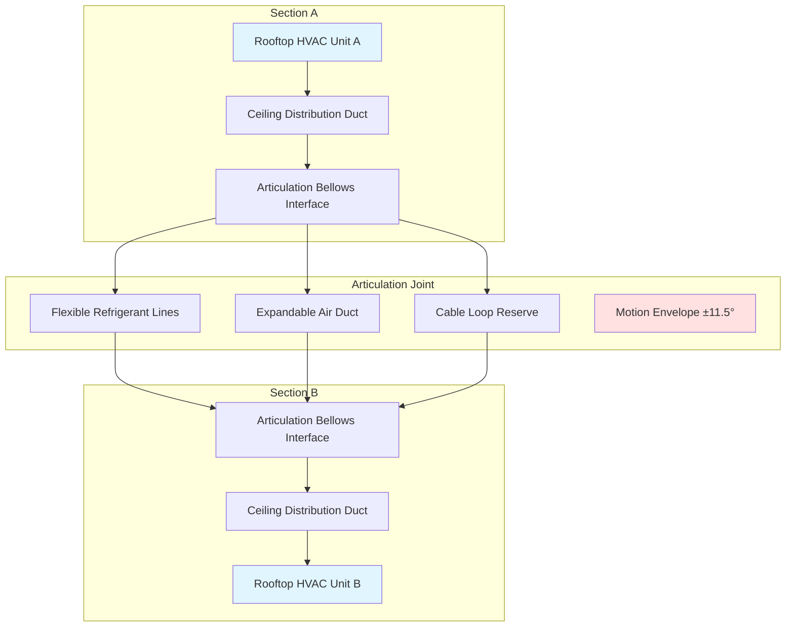
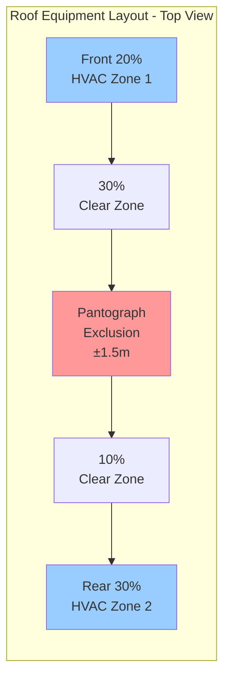

HVAC system integration in light rail vehicles presents challenges distinct from heavy rail and bus applications. The combination of low-floor accessibility requirements, articulated multi-section configurations, overhead power collection systems, and strict weight limits creates a complex three-dimensional design problem where mechanical, structural, and electrical systems compete for limited space while maintaining operational reliability over 25-30 year service lives.

## Low-Floor Design Constraints

Low-floor LRVs provide level boarding at platform heights of 300-350 mm above rail, eliminating steps and improving accessibility. This design philosophy reduces available vertical space for HVAC equipment by 60-75% compared to high-floor rail vehicles.

### Vertical Space Limitations

Standard rail vehicles offer 400-600 mm clearance beneath the floor for underfloor equipment mounting. Low-floor designs reduce this to 150-250 mm in low-floor sections, creating fundamental constraints for component packaging.

Available vertical envelope in low-floor zones:

$$h_{available} = h_{floor} - h_{rail} - h_{clearance} - h_{truck}$$

where:
- $h_{floor}$ = floor height above rail (300-350 mm typical)
- $h_{rail}$ = rail head to top of tie (150-165 mm)
- $h_{clearance}$ = minimum clearance for track irregularities (25-40 mm)
- $h_{truck}$ = truck frame intrusion (0-60 mm depending on location)

This yields net equipment mounting height of 115-185 mm in the most constrained zones, insufficient for conventional HVAC compressors (250-350 mm) or standard air handling units (300-500 mm).

| Component | Conventional Height | Low-Floor Compatible Height | Design Approach |
|-----------|-------------------|---------------------------|----------------|
| Scroll Compressor | 280-340 mm | N/A - roof mount required | Remote placement |
| Condenser Coil | 450-550 mm | 120-180 mm | Microchannel, multi-pass |
| Evaporator Assembly | 350-450 mm | 140-200 mm | Split into distributed sections |
| Centrifugal Blower | 220-280 mm | 100-140 mm | Tangential/cross-flow design |
| Air Filter Housing | 150-200 mm | 80-120 mm | Pleated media, reduced depth |

### Equipment Distribution Strategies

Low-floor constraints drive distributed HVAC architectures where components occupy any available space rather than consolidated packages:

**Rooftop compressor placement** positions the largest components (compressor, condenser) on the vehicle roof where vertical space is unlimited. Refrigerant lines run through the vehicle structure to underfloor or overhead evaporator sections. This approach:

- Eliminates low-floor height constraints for major components
- Provides accessible maintenance without vehicle disassembly
- Increases roof loading by 350-600 kg per vehicle section
- Requires refrigerant line lengths of 8-15 m, reducing system efficiency by 8-12%

**Modular evaporator sections** distribute cooling capacity across multiple small evaporator units rather than centralized air handlers. A typical 3-section articulated LRV employs 4-6 evaporator modules, each serving 8-12 m of vehicle length:

$$\dot{Q}_{total} = \sum_{i=1}^{n} \dot{Q}_{evap,i}$$

where individual evaporator capacity $\dot{Q}_{evap,i}$ ranges from 3.5-5.5 kW (12,000-18,000 BTU/hr).

**High-floor section concentration** places maximum equipment mass over truck locations where floor height increases to 600-900 mm. This creates asymmetric loading addressed through:

- Ballast weights in low-floor sections (150-300 kg)
- Structural reinforcement of high-floor zones
- Careful distribution of auxiliary equipment (batteries, inverters)

### Maintenance Access Challenges

Underfloor components in low-floor sections require invasive access procedures. Standard maintenance operations:

| Task | High-Floor Access Time | Low-Floor Access Time | Method |
|------|----------------------|---------------------|---------|
| Filter Replacement | 15-25 min | 45-90 min | Floor panel removal, 4-8 fasteners |
| Compressor Service | 2-3 hours | 6-10 hours | Truck lowering or roof hatch access |
| Evaporator Coil Cleaning | 1-2 hours | 3-5 hours | Multiple floor panels, restricted tools |
| Refrigerant Leak Repair | 3-4 hours | 8-14 hours | May require truck removal |

Extended service times increase vehicle out-of-service duration, directly impacting fleet availability. Design strategies to mitigate access challenges:

- Quick-disconnect refrigerant fittings enabling component removal without full system evacuation
- Modular assemblies replacing entire sections rather than component-level repair
- Extended maintenance intervals through robust component selection (6,000-8,000 hour filter life, 12,000-15,000 hour compressor service)
- Strategic placement of high-wear items (filters, drain pans) in accessible locations

## Articulated Vehicle Integration

Articulated LRVs employ 2-5 vehicle sections connected by articulation joints, creating continuous passenger space while negotiating curves. HVAC systems must span these articulation interfaces while accommodating relative motion between sections.

### Articulation Joint Constraints

Articulation joints permit angular rotation between sections during curve negotiation. Maximum articulation angles:

$$\theta_{max} = \pm \arcsin\left(\frac{R_{min} - L_{section}/2}{R_{min}}\right)$$

For minimum curve radius $R_{min}$ = 25 m and section length $L_{section}$ = 15 m:

$$\theta_{max} = \pm 11.5°$$

This creates dynamic spacing variations at the articulation joint:

| Condition | Lateral Offset | Vertical Displacement | Longitudinal Gap Change |
|-----------|---------------|---------------------|----------------------|
| Straight Track | 0 mm | 0 mm | ±5 mm (suspension travel) |
| 25 m Radius Curve | ±180 mm | ±30 mm | +15 mm (outer) / -10 mm (inner) |
| Maximum Pitch (4% grade transition) | 0 mm | ±60 mm | ±8 mm |
| Combined Loading | ±180 mm | ±75 mm | ±20 mm |

### HVAC Routing Across Articulation

Refrigerant lines, air ducts, and electrical conduits must cross articulation joints while accommodating this motion envelope:

**Flexible refrigerant connections** employ braided stainless steel hoses or coiled copper tubing with minimum bend radius 8-12 times tube diameter:

$$R_{bend,min} = (8-12) \times D_{tube}$$

For 15.9 mm (5/8") liquid line: $R_{bend,min}$ = 127-191 mm

Vibration-induced fatigue limits flexible section life to 2-3 million cycles. At 0.5 Hz articulation frequency during curve negotiation and 800 curves per day average:

$$N_{cycles} = 0.5 \text{ Hz} \times 10 \text{ s/curve} \times 800 \text{ curves/day} \times 365 \times 25 \text{ years} = 36.5 \text{ million cycles}$$

This requires 12-15 replacements over vehicle life, or permanent installation of redundant flex loops sized for 8-10 million cycle life.

**Air distribution continuity** across articulation employs fabric bellows or telescoping duct sections. Bellows material must maintain:

- Tear strength >200 N (textile standards)
- Temperature range -40°C to +80°C
- UV resistance for rooftop exposure
- Fire performance per NFPA 130 (flame spread <25, smoke developed <50)

Telescoping ducts provide superior environmental protection but add weight (15-25 kg per joint) and require careful alignment during assembly.

**Control and Power Wiring** crosses articulation joints through:

- Cable loops with 300-500 mm service reserve suspended from cable carriers
- Multi-conductor umbilical cables rated for 5 million flex cycles
- Redundant signal paths for critical temperature sensors and compressor control

### Independent Zone Control

Articulated sections often operate as independent climate zones due to:

- Thermal load variations between sections (sun angle, occupancy)
- Separate HVAC equipment serving each section
- Passenger preference for local control

Control architecture implements distributed temperature regulation:

$$T_{section,i} = T_{setpoint,i} + K_p(T_{ambient} - T_{setpoint,i}) + K_s \cdot SHG_i$$

where section temperature setpoint adjusts based on ambient conditions and solar heat gain ($SHG_i$) specific to that section's orientation.

Typical zoning configuration:

| Vehicle Section | Climate Zones | Cooling Capacity per Zone | Independent Control |
|----------------|--------------|------------------------|-------------------|
| 3-Section Articulated | 4-6 zones | 5-8 kW (17-27 kBTU/hr) | Temperature, airflow |
| 5-Section Articulated | 6-10 zones | 4-7 kW (14-24 kBTU/hr) | Temperature, airflow, mode |

## Pantograph and Catenary Clearances

Light rail vehicles collect electrical power through roof-mounted pantographs contacting overhead catenary wire at 600-750 VDC. HVAC equipment must maintain clearance from this energized system while optimizing available roof space.

### Electrical Clearance Requirements

Minimum clearances from energized conductors to grounded equipment per IEC 62128-1 and local electrical codes:

$$d_{clearance} = d_{base} + k_1 \cdot V_{nominal} + k_2 \cdot h_{altitude}$$

For 750 VDC nominal voltage at sea level:

| Voltage Level | Base Clearance | Voltage Factor | Minimum Safe Distance |
|--------------|---------------|----------------|---------------------|
| 600 VDC | 100 mm | 0.15 mm/V | 190 mm |
| 750 VDC | 100 mm | 0.15 mm/V | 213 mm |
| 750 VDC + transients | 100 mm | 0.20 mm/V | 250 mm |

Design practice establishes 300-400 mm clearance accounting for:

- Pantograph skate arc transients (±50-100 mm horizontal displacement)
- Vehicle body roll during curve negotiation (±30 mm effective clearance reduction)
- Catenary vertical tolerance band (±75 mm)
- Installation tolerances (±25 mm)

### Roof Equipment Layout

Pantograph placement dictates available roof zones for HVAC equipment. Standard configuration positions pantograph at vehicle centerline, 60-70% of length from front end:

**Pantograph exclusion zone** extends ±1.5 m longitudinally and ±1.2 m laterally from pantograph centerline, eliminating 3.0 m × 2.4 m = 7.2 m² of potential equipment mounting area per vehicle section.

**Available HVAC mounting zones** in 24 m long vehicle section:

- Front zone: 4.8 m × 2.4 m = 11.5 m²
- Rear zone: 7.2 m × 2.4 m = 17.3 m²
- Total available: 28.8 m² (51% of total roof area)

This drives high equipment density on remaining roof space:

$$\rho_{roof} = \frac{m_{HVAC}}{A_{available}} = \frac{450-650 \text{ kg}}{28.8 \text{ m}^2} = 15.6-22.6 \text{ kg/m}^2$$

### Aerodynamic Considerations

Rooftop HVAC equipment disrupts airflow over the vehicle, creating aerodynamic drag that increases energy consumption. Drag force:

$$F_d = \frac{1}{2} \rho_{air} \cdot v^2 \cdot C_d \cdot A_{frontal}$$

For typical HVAC unit frontal area $A_{frontal}$ = 0.8-1.2 m² and drag coefficient $C_d$ = 0.6-0.9:

| Vehicle Speed | Air Density | Drag Force per Unit | Power Loss |
|--------------|-------------|-------------------|-----------|
| 40 km/h (11.1 m/s) | 1.2 kg/m³ | 33-80 N | 0.37-0.89 kW |
| 60 km/h (16.7 m/s) | 1.2 kg/m³ | 75-180 N | 1.25-3.0 kW |
| 80 km/h (22.2 m/s) | 1.2 kg/m³ | 133-320 N | 2.95-7.1 kW |

For 2-unit HVAC installation, aerodynamic losses at 60 km/h average speed consume 2.5-6.0 kW continuously, equivalent to 15-30% of HVAC compressor power. Streamlined equipment fairings reduce $C_d$ to 0.3-0.4, cutting drag by 50-67%.

### Pantograph Arc Interference

Pantograph contact interruptions create electrical arcing that generates electromagnetic interference (EMI) and ozone. HVAC control electronics require:

- Shielded enclosures providing 40-60 dB attenuation at 100 kHz-10 MHz
- Ferrite filters on power and control lines
- Physical separation >2 m from pantograph when practical
- Conformal coating on circuit boards for ozone resistance

## Weight and Structural Constraints

LRV weight directly impacts energy consumption, track loading, and braking performance. HVAC systems must minimize weight while maintaining structural integrity under dynamic loading.

### Weight Budget Allocation

Typical 24 m low-floor LRV tare weight: 38,000-42,000 kg

| System | Weight Allocation | Percentage |
|--------|------------------|------------|
| Car Body Structure | 12,000-14,000 kg | 31-33% |
| Trucks and Suspension | 8,000-9,500 kg | 21-23% |
| Propulsion System | 3,500-4,200 kg | 9-10% |
| **HVAC System** | **800-1,200 kg** | **2.1-2.9%** |
| Interior Furnishings | 3,200-3,800 kg | 8-9% |
| Electrical Systems | 2,800-3,400 kg | 7-8% |
| Doors and Access | 1,800-2,200 kg | 4-5% |
| Other Auxiliaries | 5,900-6,700 kg | 15-16% |

HVAC weight budget breakdown:

| Component Category | Weight Range | Notes |
|-------------------|-------------|--------|
| Compressors (2 units) | 180-280 kg | Scroll type, hermetic |
| Condensers (2 units) | 120-180 kg | Microchannel aluminum |
| Evaporators (4-6 units) | 160-240 kg | Distributed placement |
| Blowers and Motors | 80-140 kg | EC motors, aluminum impellers |
| Refrigerant and Oil | 35-55 kg | System charge |
| Ductwork and Diffusers | 140-220 kg | Fiberglass/polymer |
| Control Systems | 25-40 kg | Controllers, sensors, wiring |
| Mounting Hardware | 60-85 kg | Vibration isolators, brackets |

### Center of Gravity Impact

Rooftop HVAC equipment raises vehicle center of gravity (CG), affecting roll stability. Maximum CG height constrained by curve negotiation stability:

$$h_{CG,max} = \frac{g \cdot t}{2v^2/R + g\phi/t}$$

where:
- $g$ = 9.81 m/s² (gravitational acceleration)
- $t$ = 2.65 m (track gauge for standard gauge)
- $v$ = design speed (m/s)
- $R$ = minimum curve radius (m)
- $\phi$ = maximum superelevation (rad)

For 70 km/h design speed, 25 m minimum radius, 100 mm superelevation:

$$h_{CG,max} = \frac{9.81 \times 2.65}{2(19.4)^2/25 + 9.81(0.038)/2.65} = 1.78 \text{ m above rail}$$

HVAC equipment adds moment about rail centerline:

$$\Delta M = m_{HVAC} \cdot (h_{roof} - h_{CG,initial})$$

For 900 kg HVAC system mounted at 3.2 m height with initial vehicle CG at 1.45 m:

$$\Delta M = 900 \text{ kg} \times (3.2 - 1.45) \text{ m} = 1,575 \text{ kg·m}$$

New CG height:

$$h_{CG,new} = \frac{m_{vehicle} \cdot h_{CG,initial} + m_{HVAC} \cdot h_{roof}}{m_{vehicle} + m_{HVAC}}$$

$$h_{CG,new} = \frac{40,000 \times 1.45 + 900 \times 3.2}{40,900} = 1.49 \text{ m}$$

The 40 mm CG rise requires verification of roll stability, particularly for high-speed curve negotiation.

### Dynamic Loading Conditions

HVAC equipment and mounting structures must withstand operational loads:

**Longitudinal acceleration** during braking and traction:
- Service braking: 1.2-1.5 m/s² (0.12-0.15 g)
- Emergency braking: 2.5-3.0 m/s² (0.25-0.30 g)
- Maximum traction: 1.0-1.3 m/s² (0.10-0.13 g)

**Lateral acceleration** during curve negotiation:
- Comfort limit: 0.10-0.12 g
- Maximum operating: 0.15-0.18 g
- Exceptional (track defect): 0.30 g

**Vertical acceleration** from track irregularities:
- Normal operation: ±0.15-0.20 g at 2-8 Hz
- Special trackwork: ±0.30-0.40 g transient
- Structural modes: ±0.10 g at 12-18 Hz

Combined load case for roof equipment:

$$F_{total} = m \sqrt{a_x^2 + a_y^2 + (g + a_z)^2}$$

For emergency braking with lateral deflection and vertical bump:

$$F_{total} = 900 \text{ kg} \times \sqrt{3.0^2 + 1.5^2 + (9.81 + 2.0)^2} = 11,100 \text{ N}$$

Safety factor 2.0-2.5 applied to mounting structure yields design load 22,200-27,750 N.

Mounting bolt shear stress for 8× M12 fasteners:

$$\tau = \frac{F_{total}}{n \cdot A_{bolt} \cdot SF} = \frac{27,750}{8 \times 84.3 \times 2.0} = 20.6 \text{ MPa}$$

Well below M12 Grade 8.8 shear strength of 400 MPa, confirming adequate fastener sizing.

## Standards and Compliance

LRV HVAC integration must satisfy multiple regulatory frameworks:

**EN 50125-1**: Railway Applications - Environmental Conditions
- Temperature range: -40°C to +50°C ambient operation
- Humidity: 5-100% RH, non-condensing
- Altitude: 0-2,000 m standard (derated above)

**IEEE 1475**: Standard for Functional Safety of Passenger Rail Vehicles
- HVAC failure modes shall not create safety hazards
- Emergency ventilation independent of primary power
- Fire detection integration

**EN 45545**: Railway Applications - Fire Protection
- Material fire performance: HL2 or HL3 hazard level
- HVAC must not propagate fire between vehicle sections
- Emergency mode: purge smoke, maintain egress routes

**EN 50155**: Electronic Equipment for Rolling Stock
- EMC immunity: 100 V/m field strength, 0.15-1000 MHz
- Vibration: IEC 61373 Class 1B (carbody mounted)
- Voltage variation: ±30% nominal DC bus voltage

Compliance verification requires extensive testing including climatic chamber validation, structural dynamics testing, and electromagnetic compatibility assessment prior to revenue service authorization.

---

LRV HVAC integration represents a multidisciplinary optimization challenge balancing thermal performance, structural constraints, electrical safety, and operational reliability. Successful designs emerge from early collaboration between vehicle manufacturers, HVAC suppliers, and transit operators to develop solutions customized for each vehicle platform and operating environment. The trend toward modular, distributed architectures continues as low-floor percentages increase and vehicle articulation becomes standard, driving innovation in compact components and flexible interconnection systems.
