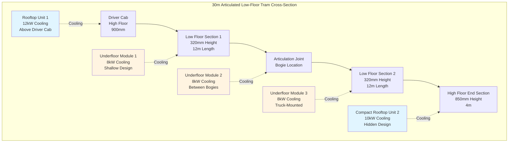

Tram and streetcar HVAC systems represent a specialized subset of light rail climate control, addressing unique challenges including ultra-low floor heights (280-350 mm), frequent station stops in street-running environments, heritage vehicle preservation requirements, and aesthetic constraints that prohibit visible rooftop equipment. These vehicles operate in mixed-traffic urban corridors with stop spacing of 200-500 m, creating thermal loads dominated by continuous door cycling, solar radiation through extensive glazing, and variable passenger densities ranging from 4 passengers/m² off-peak to 8 passengers/m² during rush periods.

## Thermal Load Analysis for Street-Running Operation

Tram thermal loads differ fundamentally from segregated light rail due to street-level operation, slower speeds with reduced ram air cooling, and frequent stops that eliminate velocity-dependent heat rejection. Peak cooling loads reach 25,000-40,000 BTU/hr for single-section vehicles and 60,000-110,000 BTU/hr for articulated formations.

### Solar Load Calculation

Street-running trams employ extensive glazing (45-55% of sidewall area) for passenger visibility and urban aesthetic integration. Solar heat gain dominates cooling requirements:

$$Q_{solar} = \sum_{i} A_{glass,i} \cdot SHGC_i \cdot I_i(\theta, \phi) \cdot CLF_i$$

where $A_{glass,i}$ is glazed area for each surface orientation (m²), $SHGC_i$ is solar heat gain coefficient (0.25-0.55 depending on glazing technology), $I_i(\theta, \phi)$ is incident solar radiation as a function of sun angles (W/m²), and $CLF_i$ is cooling load factor accounting for thermal storage effects.

For a standard 30 m articulated low-floor tram with 85 m² total glazing:

**Design conditions (July, 3 PM, 35°C ambient):**
- East/west facing glass: 15 m² × 0.40 SHGC × 680 W/m² × 0.85 CLF = 3,468 W
- North/south facing glass: 40 m² × 0.40 SHGC × 420 W/m² × 0.90 CLF = 6,048 W
- Roof glazing: 30 m² × 0.35 SHGC × 850 W/m² × 0.75 CLF = 6,694 W

Total solar load: **16,210 W (55,300 BTU/hr)**

Low-E and spectrally selective glazing reduces SHGC to 0.25-0.32 while maintaining visible light transmission above 65%, cutting solar loads by 30-40% at additional cost of $80-150/m².

### Door Cycling Infiltration Load

Street-running operation creates extreme infiltration conditions. A typical 30 m articulated tram with 6 door pairs experiences:

**Stop frequency:** 40-60 stops per hour during urban operation
**Door open duration:** 15-30 seconds per stop
**Infiltration rate:** 600-900 CFM per door pair when open

Infiltration heat load during door opening:

$$Q_{infiltration} = \dot{V} \cdot \rho \cdot c_p \cdot \Delta T + \dot{V} \cdot \rho \cdot h_{fg} \cdot \Delta \omega$$

For 6 door pairs open simultaneously for 20 seconds with 750 CFM per pair:

$$Q_{sens} = (6 \times 750 \text{ CFM}) \times 1.08 \times (35-24)°C = 53,460 \text{ BTU/hr (instantaneous)}$$

$$Q_{latent} = (6 \times 750 \text{ CFM}) \times 0.68 \times (0.020-0.012) = 24,480 \text{ BTU/hr (instantaneous)}$$

Time-averaged over 90-second station cycle (20 seconds open, 70 seconds closed):

$$Q_{infiltration,avg} = (53,460 + 24,480) \times \frac{20}{90} = 17,320 \text{ BTU/hr}$$

### Passenger Load Variability

Urban tram passenger density varies dramatically by time and route segment:

| Operating Condition | Passengers/m² | Occupant Heat (W) | Total Load (30 m tram) |
|---------------------|---------------|-------------------|------------------------|
| Off-peak seated only | 2.0 | 100 sensible + 50 latent | 27,000 W (92,100 BTU/hr) |
| Standard loading | 4.5 | 100 sensible + 50 latent | 60,750 W (207,300 BTU/hr) |
| Peak crush loading | 7.5 | 110 sensible + 65 latent | 118,125 W (403,000 BTU/hr) |

Floor area calculation: 30 m length × 2.3 m effective width × 70% low-floor percentage = 90 m² passenger area

The 4:1 variation in occupant loads necessitates capacity modulation through variable-speed compressors and staged equipment operation.

## System Configurations for Low-Floor Trams

Modern low-floor trams with 70-100% low-floor sections and floor heights of 280-350 mm above rail eliminate traditional mounting zones. Three primary configurations address these constraints.

### Distributed Underfloor Systems

The most common approach places multiple compact HVAC modules in available underfloor pockets between bogies and around truck assemblies:

**Component specifications for underfloor modules:**

| Component | Dimensions (mm) | Weight (kg) | Capacity |
|-----------|-----------------|-------------|----------|
| Shallow evaporator unit | 1200 × 800 × 180 | 45-65 | 8-12 kW cooling |
| Truck-mounted condenser | 900 × 600 × 220 | 55-75 | 10-14 kW rejection |
| Rotary compressor | 350 × 280 × 320 | 28-38 | 2.5-3.8 kW input |
| Tangential blower | 600 × 150 × 150 | 8-12 | 800-1200 m³/hr |

Refrigerant lines run through protected channels welded to vehicle underframe, with brazed connections at service points. Line lengths remain below 15 m to minimize pressure drop and refrigerant charge.

### Hybrid Rooftop-Underfloor Architecture

Articulated trams combine visible rooftop units over high-floor sections (driver cab, equipment bays) with concealed underfloor equipment serving low-floor areas:

**Advantages:**
- Rooftop units provide 40-50% of total capacity with easy maintenance access
- Underfloor units maintain low-floor profile where required
- Segregated refrigerant circuits provide redundancy
- Service access through removable floor panels and roof hatches

**Design considerations:**
- Weight distribution: Rooftop units add 350-550 kg at 3.2 m height, raising center of gravity by 12-18 mm
- Aesthetic integration: Rooftop housings styled to match vehicle architecture, powder-coated to match body color
- Vibration isolation: Elastomeric mounts with 10-14 Hz natural frequency prevent resonance coupling

Total system capacity split: 55-65% underfloor, 35-45% rooftop, ensuring operation with either subsystem failed.

### Ultra-Compact Split Systems

Newest low-floor trams employ split architecture with space-intensive components externally mounted:

**Component placement:**
- Variable-speed scroll compressor (3.2-4.5 kW): Rooftop or end-wall mounted
- Microchannel condenser (32 mm depth): Side-wall mounted with protective grille
- Slim-line evaporator (140 mm height): Underfloor distributed sections
- Electronic expansion valve: Near each evaporator for precise control

Refrigerant charge reduced by 15-25% through microchannel technology and optimized line sizing. R-513A refrigerant provides GWP of 631 versus 1,430 for R-134a while maintaining similar thermodynamic performance.

## Heritage Tram and Historic Streetcar Retrofits

Heritage tram operations (San Francisco F-line, Melbourne City Circle, Lisbon Route 28) present unique HVAC challenges balancing passenger comfort with historic preservation requirements.

### Preservation Constraints

Heritage vehicle regulations typically mandate:

- **No visible external modifications:** Rooftop equipment prohibited, condenser grilles must match original aesthetic
- **Minimal structural changes:** Mounting systems cannot compromise historic framing
- **Reversibility:** Modifications must be removable to restore original condition
- **Historic materials:** Visible components must match original finishes and hardware

These constraints eliminate conventional HVAC configurations, requiring creative engineering solutions.

### Concealed Ventilation Systems

Early approach for heritage vehicles employs natural and forced ventilation without vapor-compression cooling:

**Ceiling fans (1890s-1920s reproduction):**
- Brushless DC motors in cast-brass housings matching historic appearance
- 400-600 mm diameter, 8-12 blade designs
- Air circulation: 800-1200 m³/hr per fan, 6-10 fans per vehicle
- Power consumption: 25-45 W per fan from 24 VDC vehicle battery

**Forced ventilation:**
- Underfloor intake fans drawing exterior air through floor registers
- Flow rate: 1500-2500 m³/hr total vehicle ventilation
- Discharge through original ceiling vent grilles and window headers
- Effectiveness: 3-5°C temperature reduction from air movement alone

These systems provide acceptable comfort in temperate climates (San Francisco, Melbourne winter) but insufficient cooling for hot summer operation.

### Minimal-Impact Cooling Retrofits

Modern heritage trams increasingly incorporate concealed air conditioning:

**Underfloor packaged units:**
- Complete DX cooling system in 1200 × 900 × 380 mm enclosure
- Capacity: 10-15 kW (34,000-51,000 BTU/hr) cooling
- Installation in former battery compartment or under longitudinal bench seating
- Condenser air discharge through original underfloor vent openings

**Concealed ductwork:**
- Supply air through original floor registers and restored ceiling grilles
- Sheet metal ductwork hidden within bench seat structures
- Diffuser grilles match historic brass or bronze finish
- Return air through sidewall registers concealed behind period-appropriate grillework

**Power integration:**
- Modern traction inverters provide 480 VAC three-phase for HVAC compressors
- Alternatively, 600-750 VDC catenary power converted through DC-AC inverter
- Battery backup maintains fan operation during power interruptions

### Case Study: San Francisco Historic Streetcar Retrofit

The San Francisco Municipal Railway F-line operates 1920s-1950s PCC streetcars with concealed HVAC retrofits implemented 2015-2018:

**Vehicle specifications:**
- Length: 14 m (46 ft)
- Width: 2.6 m (8.5 ft)
- Glazing: 28 m² total, SHGC 0.75 (original single-pane glass retained)
- Seating: 52 passengers, crush load 100 passengers

**HVAC system installed:**
- 2 × 7.5 kW (25,600 BTU/hr) underfloor DX units
- Total cooling: 15 kW (51,200 BTU/hr)
- Compressor: Variable-speed scroll, 2.8-4.2 kW input
- Refrigerant: R-513A, 2.8 kg total charge
- Mounting: Suspended from underframe with 12 mm rubber isolators

**Performance results:**
- Interior temperature: 24-26°C maintained with 32°C ambient
- Cool-down time: 35 minutes from 45°C hot-soak to 26°C
- Noise level: 68 dBA at passenger ear height (acceptable)
- Visual impact: No external visibility of HVAC equipment
- Energy consumption: 4.5-6.2 kW average during cooling operation

## Street-Running Thermal Challenges

Tram operation in shared traffic lanes creates thermal conditions distinct from segregated rail corridors.

### Reduced Heat Rejection at Low Speeds

Condenser heat rejection depends critically on air velocity across coil surfaces. Street-running trams operate at 15-25 km/hr average speed versus 35-50 km/hr for segregated light rail.

Condenser heat transfer coefficient:

$$h = C \cdot \left(\frac{V_{air}}{\nu}\right)^{0.6}$$

where $V_{air}$ is air velocity (m/s) and $\nu$ is kinematic viscosity. Heat rejection capacity varies as:

$$Q_{rejection} \propto V_{air}^{0.6}$$

**Velocity impact on capacity:**

| Vehicle Speed | Ram Air Velocity | Heat Rejection Factor |
|---------------|------------------|------------------------|
| 10 km/hr (streetcar) | 2.8 m/s | 0.72 |
| 25 km/hr (typical) | 6.9 m/s | 1.00 (baseline) |
| 50 km/hr (LRT) | 13.9 m/s | 1.35 |

At streetcar speeds of 10-15 km/hr, condenser capacity drops 25-30% compared to design conditions at 25 km/hr. Systems compensate through:

- **Electric condenser fans:** Axial fans providing 3.5-5.5 m/s forced airflow at standstill and low speeds
- **Oversized condensers:** 25-35% additional surface area versus velocity-dependent designs
- **Variable compressor speed:** Reduce capacity 15-20% when heat rejection limited at low vehicle speed

### Urban Heat Island Effects

Street-running operation exposes trams to elevated ambient temperatures from pavement thermal mass, vehicle exhaust, and building heat rejection:

$$T_{ambient,street} = T_{ambient,rural} + \Delta T_{UHI}$$

Typical urban heat island intensity: $\Delta T_{UHI}$ = 3-7°C during daytime, 5-10°C overnight in dense urban cores.

Design implications:
- Cooling capacity sized for 38-42°C condenser inlet temperature versus 35°C for suburban light rail
- Compressor discharge pressures reach 24-28 bar versus 20-24 bar at standard conditions
- System COP degrades from 2.5 (35°C ambient) to 2.0-2.2 (40°C ambient)

### Stop-and-Go Operation Cycle

Frequent stops with 15-30 second door-open periods create sawtooth thermal load profiles:

**Acceleration phase (30-45 seconds):**
- Doors closed, occupant and solar loads only
- Compressor load reduced 10-20% to maximize traction power availability
- Interior temperature drifts upward 0.3-0.6°C

**Constant speed phase (45-90 seconds):**
- Full HVAC capacity restored
- Temperature recovery toward setpoint
- Condenser heat rejection optimized with vehicle airflow

**Deceleration and stop (60-90 seconds):**
- Doors open, infiltration load spikes 40-60%
- Compressor operates at maximum capacity
- Condenser fans activate to maintain heat rejection at standstill
- Interior temperature increases 0.4-0.8°C

Control system employs predictive algorithms using GPS and schedule data to pre-cool interior 0.5-1.0°C before station stops, maintaining average temperature within ±1.5°C of setpoint.

## Low-Floor Design Integration

Ultra-low floor heights of 280-350 mm impose severe space constraints requiring specialized component selection and placement strategies.

### Space Utilization Mapping

Low-floor tram underframe contains limited equipment zones:

| Location | Height Available | Length | Width | Volume | Suitable Components |
|----------|------------------|--------|-------|--------|---------------------|
| Between bogies | 220-280 mm | 2.5-3.5 m | 1.8-2.2 m | 1.1-2.2 m³ | Evaporator, blowers, controls |
| Truck-mounted | 300-400 mm | 1.2-1.8 m | 0.8-1.2 m | 0.3-0.9 m³ | Compressor, condenser |
| End sections (high floor) | 600-900 mm | 2.0-4.0 m | 2.0-2.4 m | 2.4-8.6 m³ | Complete HVAC packages |
| Rooftop (where permitted) | 400-550 mm | 3.0-5.0 m | 2.2-2.5 m | 2.6-6.9 m³ | Rooftop units |

Total HVAC equipment volume: 4-8 m³ for 30 m articulated vehicle, representing 0.5-0.8% of total vehicle volume.

### Microchannel Heat Exchanger Technology

Aluminum microchannel heat exchangers enable shallow-depth designs essential for low-floor applications:

**Condenser specifications:**
- Depth: 25-35 mm versus 50-65 mm for conventional fin-tube
- Face area: 0.8-1.4 m² per 10 kW heat rejection
- Refrigerant channels: 1.0-1.5 mm hydraulic diameter, 15-25 parallel ports
- Air-side pressure drop: 25-40 Pa at 3.5 m/s face velocity
- Weight: 35-45% reduction versus fin-tube equivalent

**Evaporator specifications:**
- Depth: 30-45 mm versus 50-75 mm for fin-tube
- Face area: 1.2-2.0 m² per 10 kW cooling capacity
- Drain pan: Integrated aluminum construction, 8-12 mm depth
- Condensate management: Positive drainage during vehicle pitch/roll up to ±5°

Microchannel technology reduces HVAC module height by 35-50%, enabling installation in 180-220 mm underfloor cavities.

### Weight Distribution Optimization

HVAC equipment represents 6-9% of empty vehicle weight (900-1400 kg for 30 m articulated tram). Strategic placement maintains axle load balance within ±4% tolerance:

**Weight allocation strategy:**
- Truck-mounted components: 45-55% of HVAC weight (compressors, condensers)
- Between-bogie zones: 25-35% of HVAC weight (evaporators, controls)
- Vehicle ends: 15-25% of HVAC weight (driver cab units, auxiliary equipment)

Asymmetric loading from unequal passenger distribution (typically 60% in forward 2/3 of vehicle) requires careful HVAC weight placement to maintain 48-52% front/rear weight split.

## Standards and Performance Requirements

Tram HVAC systems comply with regional transit standards and local authority specifications.

### European Standards (EN 14750-1, EN 13129-1)

**Thermal comfort categories:**
- Category A: ±2°C variation from setpoint (22-24°C cooling, 20-22°C heating)
- Category B: ±3°C variation from setpoint
- Design conditions: 35°C ambient, 800 W/m² solar, 4 passengers/m² loading

**Fresh air requirements:**
- Minimum: 7 L/s (14.8 CFM) per passenger at normal loading
- Enhanced: 10 L/s (21.2 CFM) per passenger for high-quality systems
- CO₂ limit: 1000 ppm above outdoor ambient (typically 1400 ppm absolute)

**Energy efficiency:**
- Maximum auxiliary power: 350-450 W per meter of vehicle length for HVAC
- Seasonal COP: ≥2.3 averaged over regional climate profile
- Standby power: <50 W per vehicle for controls and monitoring

### North American Transit Standards

**APTA RT-VIM-S-034-03 (HVAC Performance):**
- Cooling capacity: Maintain 75°F (24°C) ±3°F with 95°F (35°C) ambient
- Heating capacity: Maintain 68°F (20°C) ±3°F with 0°F (-18°C) ambient
- Ventilation: 15 CFM (25.5 m³/hr) per passenger minimum
- Temperature pulldown: 85°F to 75°F in 30 minutes maximum

**FTA guidelines for transit vehicles:**
- Reliability: MTBF ≥8,000 hours for complete HVAC system
- Maintainability: MTTR ≤4 hours for component replacement
- Availability: ≥98% during revenue service hours
- Design life: 12-15 years or 800,000-1,200,000 km operation

### Testing and Validation

**Climatic chamber testing:**
- Soak test: Vehicle at ambient temperature ±2°C for 4+ hours
- Cooldown test: Measure time to achieve setpoint from hot soak
- Thermal mapping: 20-30 sensor locations verify temperature uniformity
- Capacity verification: Measure power input and thermal output at design conditions

**Revenue service validation:**
- 90-day monitoring period with data logging at 1-minute intervals
- Performance metrics: Average temperature, excursion frequency, energy consumption
- Acceptance criteria: ≥95% of operating time within specified temperature range

---

Tram and streetcar HVAC systems exemplify constrained engineering optimization, balancing thermal performance against space, weight, aesthetic, and heritage preservation requirements. Modern systems achieve cooling capacities of 35-45 W per meter of vehicle length while consuming only 300-400 W/m in auxiliary power, maintaining passenger comfort across urban street-running environments with frequent stops and variable loading. Heritage vehicle retrofits demonstrate that contemporary climate control can be successfully integrated into historic rolling stock while preserving aesthetic integrity and operational authenticity.
