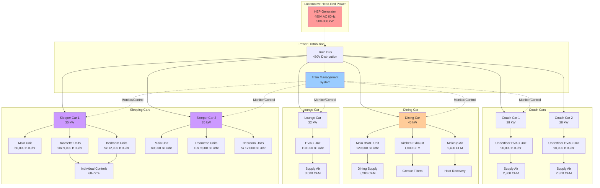

Amtrak long-distance train HVAC systems provide continuous climate control for journeys lasting 15 to 65 hours across routes such as the California Zephyr, Empire Builder, and Southwest Chief. These systems must maintain precise comfort conditions in sleeping compartments, manage high ventilation loads in dining cars, and operate reliably for multiple days without maintenance intervention.

## Long-Distance Service Requirements

### Multi-Day Journey Comfort Criteria

Long-distance passenger rail demands tighter comfort control than commuter operations due to extended exposure periods and overnight occupancy.

**Temperature Control Specifications**

Amtrak service standards require:

| Car Type | Daytime Setpoint | Nighttime Setpoint | Control Tolerance | Noise Limit |
|----------|-----------------|-------------------|------------------|-------------|
| Coach seating | 72°F | 70°F | ±2°F | 45 dBA |
| Sleeping compartments | 68-72°F (adjustable) | 68-72°F (adjustable) | ±1°F | 35 dBA |
| Dining cars | 70°F | N/A | ±2°F | 48 dBA |
| Lounge/observation | 72°F | 71°F | ±2°F | 46 dBA |

**Relative Humidity Management**

Multi-day journeys cross diverse climate zones requiring active humidity control:
- Target range: 40-50% RH
- Maximum: 55% RH (prevents condensation on windows during overnight operation)
- Minimum: 35% RH (prevents occupant discomfort and respiratory irritation)

The cumulative thermal comfort for extended rail journeys follows the predicted mean vote (PMV) model:

$$\text{PMV} = \left[0.303 \exp(-0.036M) + 0.028\right] \times L$$

where $M$ represents metabolic rate (1.0 met for seated passengers) and $L$ is the thermal load on the body. For overnight sleeping compartments, the relationship between air temperature $T_a$, mean radiant temperature $T_r$, and air velocity $v$ determines comfort:

$$\text{SET} = T_a + 0.5(T_r - T_a) - 8v^{0.5}$$

where SET (standard effective temperature) should remain between 68-74°F for sleeping occupants.

## Sleeping Car Climate Control

### Individual Compartment Systems

Amtrak Superliner and Viewliner sleeping cars employ dedicated HVAC units for each private room.

**Roomette and Bedroom Configuration**

Each compartment features:
- Capacity: 9,000-12,000 BTU/hr cooling, 3-4 kW heating
- Refrigerant: R-410A (transitioning to R-452B in new equipment)
- Evaporator: Compact coil with 300-450 CFM airflow
- Supply: Ceiling-mounted linear diffuser with adjustable louvers
- Control: Digital thermostat with 0.5°F increments
- Sound level: Maximum 32-35 dBA at low fan speed

**Family Bedroom and Accessible Room Systems**

Larger compartments utilize higher-capacity equipment:
- Cooling capacity: 15,000-18,000 BTU/hr
- Heating capacity: 5-6 kW electric resistance
- Dual-fan evaporator for improved air distribution
- Zone dampers for separate sleeping and seating areas

### Quiet Operation Requirements

FRA regulations and Amtrak specifications mandate reduced noise levels in sleeping cars operating between 10:00 PM and 6:00 AM.

**Acoustic Design Features**

- Variable-speed scroll compressors (noise reduction: 6-8 dBA vs. fixed-speed)
- Acoustically lined air distribution plenums
- Vibration isolation mounts (deflection: 0.25-0.50 inches)
- Low-velocity ductwork (maximum 400 FPM in occupied spaces)
- Solid-state fan controls eliminating transformer hum

**Night Mode Operation**

Microprocessor controls automatically reduce fan speeds and extend compressor cycle times after 10:00 PM:
- Fan speed reduction: 70-80% of daytime setting
- Setpoint deadband: Increased from ±1°F to ±1.5°F
- Compressor cycling: Minimum 8-minute off-time between starts
- Total sound power reduction: 4-6 dBA

## Dining Car Ventilation

### High-Occupancy Design

Amtrak dining cars accommodate 72-80 passengers during meal service periods, creating substantial sensible and latent loads from occupancy and food service equipment.

**Ventilation Rate Requirements**

ASHRAE Standard 62.1 specifies minimum outdoor air based on occupancy and floor area. For dining cars:

$$Q_{OA} = R_p \times P_z + R_a \times A_z$$

where:
- $Q_{OA}$ = outdoor air flow rate (CFM)
- $R_p$ = outdoor air rate per person = 7.5 CFM/person (dining spaces)
- $P_z$ = zone population = 72-80 persons
- $R_a$ = outdoor air rate per unit area = 0.18 CFM/ft²
- $A_z$ = zone floor area = 2,400-2,800 ft²

This yields minimum outdoor air requirements:

$$Q_{OA} = (7.5 \times 75) + (0.18 \times 2,600) = 562.5 + 468 = 1,030 \text{ CFM}$$

**Kitchen Area Exhaust**

Galley equipment generates substantial heat and odors requiring dedicated exhaust:

| Equipment Type | Heat Output (BTU/hr) | Exhaust Rate (CFM) |
|----------------|---------------------|-------------------|
| Convection ovens (2) | 18,000 | 400 |
| Griddle/range | 24,000 | 500 |
| Coffee makers | 6,000 | 150 |
| Steam equipment | 12,000 | 350 |
| Dishwasher | 8,000 | 200 |
| **Total** | **68,000** | **1,600** |

Makeup air systems provide 85-90% of exhaust volume to prevent excessive negative pressure and prevent smoke/odor migration into passenger areas.

### Grease and Odor Control

Unlike stationary restaurants, rail dining cars cannot employ conventional grease hoods and exhaust systems.

**Filtration Requirements**

- Pre-filters: MERV 8 (protects coils from particulate)
- Main filters: MERV 13 (captures cooking particulate)
- Activated carbon filters: 2-inch pleated media (odor control)
- Grease filters: Stainless steel baffle type, UL 1046 listed
- Filter replacement: Every 5,000-7,500 miles or monthly

**Interlocking Controls**

Exhaust fans activate automatically when galley equipment operates, with 15-minute post-operation purge cycles to clear residual odors before deactivation.

## 24-Hour Continuous Operation

### System Reliability Requirements

Long-distance trains operate for 2-3 days between maintenance facilities, demanding exceptional HVAC reliability.

**Component Selection Criteria**

- MTBF (mean time between failures): Minimum 15,000 hours
- Vibration rating: IEC 61373 Category 1 (mainline service)
- Temperature range: -40°F to +125°F ambient
- Compressor type: Scroll (preferred) or rotary with crankcase heaters
- Redundancy: Dual compressors in critical cars (dining, lounge)

**Preventive Monitoring**

Modern Amtrak equipment employs CAN-bus communication networks linking all HVAC components:
- Continuous monitoring of compressor discharge pressure and temperature
- Evaporator/condenser coil temperature differential tracking
- Filter pressure drop measurement (replacement alerts at 0.5 in. w.c.)
- Refrigerant charge monitoring via subcooling/superheat calculations
- Predictive maintenance alerts transmitted to maintenance facilities

### Power Management

Long-distance trains draw head-end power (HEP) from diesel-electric locomotives or electric locomotives, with total available power limited to 400-800 kW for the entire train consist.

**Load Allocation Strategy**

For a typical 10-car long-distance train:

| Car Position | Car Type | HVAC Load (kW) | Priority Level |
|--------------|----------|---------------|---------------|
| 1 | Baggage | 12 | Low |
| 2 | Transition/crew dorm | 22 | Medium |
| 3-4 | Coach | 28 each | High |
| 5 | Dining car | 45 | Critical |
| 6 | Lounge/observation | 32 | High |
| 7-9 | Sleeper | 35 each | Critical |
| 10 | Sleeper | 35 | Critical |
| **Total** | | **324 kW** | |

Total HVAC demand represents 40-50% of available HEP, requiring sophisticated load management:

$$P_{available} = P_{HEP} - P_{lighting} - P_{galley} - P_{auxiliary}$$

where typical values during peak cooling:
- $P_{HEP}$ = 500-800 kW (locomotive-dependent)
- $P_{lighting}$ = 30-45 kW
- $P_{galley}$ = 45-60 kW
- $P_{auxiliary}$ = 25-35 kW

**Shedding Protocol**

When HEP approaches capacity (>90%), the train management system implements staged load reduction:

1. Reduce baggage car HVAC to minimum ventilation
2. Increase cooling setpoints in coach cars by 2°F
3. Cycle compressors in alternating coach cars
4. Maintain full operation in sleeping and dining cars (passenger comfort critical)

## System Architecture

## Fresh Air Requirements for Overnight Operation

### Extended Occupancy Ventilation

ASHRAE Standard 62.1 provides baseline requirements, but overnight sleeping compartments demand enhanced consideration for CO₂ accumulation and air quality maintenance.

**Sleeping Compartment Ventilation**

For a typical roomette (48 ft³ volume) with single occupancy:

$$C_{CO_2}(t) = C_{ambient} + \frac{G \cdot t}{V \cdot E_v}$$

where:
- $C_{CO_2}(t)$ = CO₂ concentration at time $t$ (ppm)
- $C_{ambient}$ = outdoor CO₂ concentration = 400-450 ppm
- $G$ = CO₂ generation rate = 0.3 CFH per person (sleeping)
- $t$ = time (hours)
- $V$ = compartment volume = 48 ft³
- $E_v$ = ventilation effectiveness = 0.8-0.9

For 8-hour overnight period maintaining CO₂ below 1,000 ppm:

$$Q_{min} = \frac{G \cdot N}{(C_{max} - C_{ambient}) \cdot E_v}$$

$$Q_{min} = \frac{0.3 \times 1}{(1000 - 450) \times 0.85} = 0.00064 \text{ CFM}$$

However, this calculation addresses only CO₂. Body odor control requires minimum 15 CFM per person, establishing the design criterion.

**Overnight Ventilation Strategy**

| Compartment Type | Occupants | Fresh Air (CFM) | Air Changes/Hour |
|-----------------|-----------|----------------|------------------|
| Roomette | 1 | 15-20 | 12-15 |
| Bedroom | 2 | 30-35 | 8-10 |
| Family bedroom | 4 | 50-60 | 10-12 |
| Accessible room | 2 | 35-40 | 9-11 |

### Energy Recovery Systems

Modern Amtrak long-distance equipment incorporates energy recovery ventilation to reduce outdoor air conditioning loads while maintaining air quality.

**Enthalpy Wheel Performance**

Total energy recovery effectiveness:

$$\varepsilon_{total} = \frac{h_{supply} - h_{outdoor}}{h_{exhaust} - h_{outdoor}}$$

where $h$ represents enthalpy of respective airstreams. Typical railroad-rated enthalpy wheels achieve 65-75% effectiveness, reducing annual HVAC energy consumption by 25-35% compared to non-recovery systems.

## Humidity Control for Long-Distance Travel

### Climate Zone Transition Challenges

Transcontinental routes traverse multiple climate zones within single journeys:
- California Zephyr: Dry desert (10% RH) to humid Midwest (70% RH)
- Empire Builder: Continental climate variations (±40% RH daily swings)
- Sunset Limited: Gulf Coast humidity to arid Southwest

**Adaptive Humidity Control**

Modern systems employ GPS-linked controls adjusting humidity targets based on geographical location and outdoor conditions:

$$RH_{target} = RH_{base} + K_1(T_{outdoor} - T_{base}) + K_2(RH_{outdoor} - RH_{base})$$

where:
- $RH_{target}$ = target indoor relative humidity (%)
- $RH_{base}$ = baseline target = 45%
- $K_1$ = temperature coefficient = 0.3
- $K_2$ = outdoor humidity coefficient = 0.15
- Temperature and humidity limits: 40-50% RH range

**Dehumidification Methods**

- Subcooling coils: Reduce air temperature below dewpoint, then reheat
- Desiccant systems: Rotating silica gel wheels (emerging technology in rail)
- Hot gas reheat: Use compressor discharge gas for simultaneous cooling and dehumidification

**Humidification Systems**

Winter operation through northern routes requires humidification preventing occupant discomfort and static electricity:
- Steam-to-steam humidifiers (locomotive steam supply where available)
- Electrode steam humidifiers (480V AC powered)
- Ultrasonic atomizing humidifiers (low maintenance, compact)

## Standards and Regulatory Compliance

### Federal Railroad Administration (FRA)

**49 CFR Part 238 - Passenger Equipment Safety Standards**

Subpart C addresses passenger car climate control:
- § 238.309: Heating system integrity and performance
- § 238.311: Ventilation system requirements
- § 238.313: Emergency ventilation provisions

Specific requirements:
- Minimum heating capacity: Maintain 50°F interior with -25°F outdoor
- Emergency ventilation: Operate without external power for 30 minutes
- Smoke detection integration with HVAC shutdown capability

### ASHRAE Standards Application

**Standard 62.1: Ventilation for Acceptable Indoor Air Quality**

Rail-specific interpretation requires adaptation for mobile environments:
- Infiltration credit: Not applicable due to continuous motion and pressure control
- Demand-controlled ventilation: CO₂ sensors permitted for coach seating areas
- Air cleaning: Enhanced filtration may substitute for portion of outdoor air

**Standard 55: Thermal Environmental Conditions for Human Occupancy**

Comfort criteria establish acceptable temperature and humidity ranges for 80% occupant satisfaction. Long-distance rail applies more stringent 90% satisfaction target due to captive occupancy and overnight operation.

## Maintenance and Serviceability

### Scheduled Maintenance Intervals

Amtrak long-distance equipment maintenance follows mileage-based schedules:

| Interval | Mileage | Maintenance Tasks |
|----------|---------|------------------|
| Daily inspection | N/A | Visual check, filter inspection, leak detection |
| Running maintenance | 3,000 mi | Filter replacement, belt inspection, refrigerant check |
| Light maintenance | 6,000 mi | Coil cleaning, electrical testing, control calibration |
| Heavy maintenance | 18,000 mi | Compressor service, bearing lubrication, full system test |
| Component overhaul | 250,000 mi | Complete HVAC system rebuild |

### Remote Diagnostics

CAN-bus networks enable real-time monitoring at maintenance facilities and operating centers:
- Compressor running hours and start counts
- Refrigerant pressure and temperature trends
- Filter pressure drop history
- Fault code logging with GPS location stamps
- Predictive failure alerts (24-48 hours advance warning)

This data-driven approach reduces unscheduled failures by 35-40% compared to reactive maintenance strategies, critical for equipment operating 3,000+ miles between heavy maintenance facilities.

---

**Related Topics:**
- Regional commuter rail HVAC configurations
- Equipment mounting and vibration isolation
- Head-end power distribution systems
- Passenger comfort standards for extended travel
