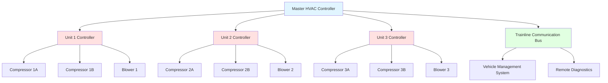
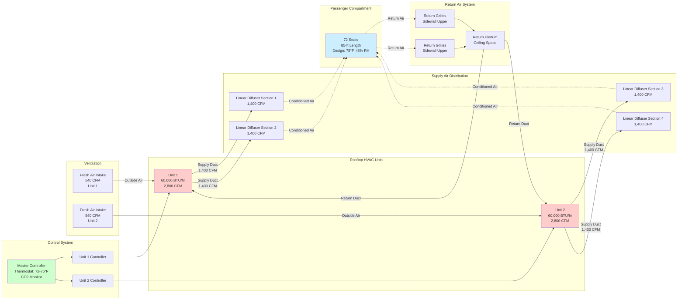

Passenger rail car HVAC equipment configuration determines system reliability, maintenance accessibility, and passenger comfort delivery. Design decisions regarding unit placement, ducting arrangement, and redundancy architecture must account for space constraints, weight distribution requirements, and operational demands spanning multiple climatic zones during extended journeys.

## Equipment Placement Strategies

Rail car HVAC equipment location is constrained by carbody geometry, axle loading limits, clearance diagrams, and maintenance access requirements.

### Rooftop Installation

Rooftop mounting places HVAC packages above the passenger compartment with supply air delivered through ceiling diffusers.

**Advantages:**

- Direct condenser airflow without recirculation
- Gravity-assisted condensate drainage
- Simplified maintenance access from car roof
- Minimal carbody penetrations for ducting
- Protection from tunnel water and trackbed debris

**Limitations:**

- Adds 8-14 inches to overall vehicle height
- May violate clearance envelopes on legacy infrastructure
- Increases aerodynamic drag (2-4% at speeds above 80 mph)
- Roof loading restricts unit weight to 1,800-2,400 lb per position
- Snow and ice accumulation in northern climates

**Typical Configuration:**

Rail cars employ 2-3 rooftop units depending on carbody length:

| Car Length | Number of Units | Individual Capacity | Total Capacity | Airflow per Unit |
|------------|-----------------|---------------------|----------------|------------------|
| 65 ft (commuter) | 2 units | 45,000 BTU/hr | 90,000 BTU/hr | 2,200 CFM |
| 85 ft (intercity) | 2 units | 60,000 BTU/hr | 120,000 BTU/hr | 2,800 CFM |
| 85 ft (coach) | 3 units | 50,000 BTU/hr | 150,000 BTU/hr | 2,400 CFM |

Multiple-unit installations provide N+1 redundancy with each unit capable of maintaining minimum comfort conditions if one unit fails.

### Underfloor Installation

Underfloor equipment suspends HVAC packages beneath the carbody between truck centers, maximizing interior space and maintaining low vehicle profile.

**Advantages:**

- Preserves clearance envelope for tunnels and overhead structures
- Reduces aerodynamic drag compared to rooftop mounting
- Lower center of gravity improves ride stability
- Protected from vandalism in passenger compartment
- Allows full-height interior ceilings

**Limitations:**

- Exposure to splash, snow, ice, and trackbed debris
- Complex ducting through floor structure to reach ceiling distribution
- Difficult maintenance access requiring pits or jacks
- Vibration and shock loading from track irregularities
- Limited to 24-30 inches vertical clearance in most installations

**Typical Configuration:**

| Equipment Type | Mounting Method | Capacity Range | Weight | Protection Rating |
|----------------|-----------------|----------------|--------|-------------------|
| Package unit | Suspended by hangers | 80,000-120,000 BTU/hr | 1,200-1,800 lb | IP65 (dust/water jet) |
| Split system condenser | Frame-mounted | 100,000-150,000 BTU/hr | 800-1,200 lb | IP65 |
| Electric heater banks | Duct-mounted | 15-30 kW | 150-300 lb | IP54 |

Underfloor units require protective enclosures with sealed electrical penetrations, sloped drain pans, and coated heat exchangers for corrosion resistance.

### Carbody-Integrated Installation

Modern rail cars increasingly employ distributed systems with components integrated within the carbody structure.

**Split System Configuration:**

- Condensing units: Roof-mounted or underfloor positions
- Evaporator sections: Distributed along sidewall or ceiling plenums
- Refrigerant lines: Run through structural channels with isolation loops
- Controls: Networked via train communication bus

This arrangement optimizes weight distribution while providing zoned temperature control for different passenger areas.

## Ducting Layout Design

Rail car duct systems distribute conditioned air throughout the passenger compartment while accounting for carbody structural members, door mechanisms, and interior finish constraints.

### Supply Air Distribution Patterns

**Ceiling Linear Diffuser System:**

The most common arrangement for rooftop HVAC installations employs continuous linear slot diffusers along the centerline or both sides of the passenger compartment.

Design parameters:
- Diffuser width: 1.5-3.0 inches
- Discharge velocity: 600-800 FPM at full load
- Throw distance: 12-16 feet (reaches floor level)
- Air pattern: Vertical discharge with entrainment spreading
- Spacing: Continuous or 3-4 foot segments

Supply plenum typically runs longitudinally within the ceiling structure with transverse branches feeding diffuser sections. Plenum cross-section area maintains velocities below 1,200 FPM to minimize noise transmission.

**Sidewall High-Velocity Distribution:**

High-speed rail and premium intercity services employ sidewall discharge to reduce ceiling clutter and accommodate luggage racks.

Characteristics:
- Discharge velocity: 800-1,200 FPM
- Nozzle spacing: 30-40 inches
- Throw angle: 15-25° downward
- Supply temperature: 15-20°F below space temperature (cooling mode)

High-velocity systems require careful balancing to prevent drafts on seated passengers adjacent to outlets.

**Underfloor Supply System:**

Underfloor HVAC units discharge through floor-level grilles with upward air pattern.

Configuration details:
- Grille size: 8" × 24" to 10" × 36"
- Spacing: 4-6 feet along carbody length
- Discharge velocity: 400-600 FPM (low to prevent debris entrainment)
- Boot connections: Flexible to accommodate carbody flexing
- Temperature rise: 70-85°F supply air in heating mode

Underfloor supply creates vertical air pattern that naturally rises due to thermal buoyancy, mixing with return air at ceiling level.

### Return Air Systems

Return air collection determines air circulation effectiveness and occupant thermal comfort.

**Ceiling Return Configuration:**

Most common in rooftop HVAC installations:
- Return grilles: Sidewall-mounted near ceiling or ceiling-integrated
- Grille area: 1.5-2.0× supply diffuser area (low velocity)
- Return plenum: Above ceiling panels or within wall cavities
- Path to HVAC unit: Direct or through filter compartment

Design maintains return velocities below 500 FPM at grilles to minimize noise generation and prevent paper/debris entrainment.

**Sidewall Return Configuration:**

Used in underfloor HVAC systems:
- Return location: Upper sidewall or luggage rack underside
- Grille type: Perforated panels or linear slots
- Collection plenum: Runs longitudinally connecting to underfloor unit intake
- Filter location: At unit inlet or distributed at return grilles

Sidewall returns require baffling to prevent short-circuiting of supply air before mixing with room air.

### Ductwork Sizing Methodology

Rail car duct sizing balances pressure drop, noise generation, and available installation space.

**Friction Loss Calculation:**

Pressure drop per 100 feet of duct follows standard friction equations:

$$\Delta P = \frac{f \cdot L \cdot \rho \cdot V^2}{2 \cdot D \cdot 12}$$

Where:
- $\Delta P$ = pressure drop (in. w.c.)
- $f$ = friction factor (0.02-0.035 for galvanized steel)
- $L$ = duct length (ft)
- $\rho$ = air density (0.075 lb/ft³ at standard conditions)
- $V$ = air velocity (ft/s)
- $D$ = duct diameter (inches)

Design targets:
- Main trunk ducts: 0.08-0.12 in. w.c. per 100 ft
- Branch ducts: 0.10-0.15 in. w.c. per 100 ft
- Maximum system static pressure: 1.2-1.8 in. w.c.

**Velocity Limits:**

| Duct Section | Maximum Velocity | Noise Criterion |
|--------------|------------------|-----------------|
| Main supply trunk | 1,500 FPM | NC-40 |
| Branch ducts | 1,200 FPM | NC-35 |
| Return ducts | 1,000 FPM | NC-35 |
| At diffusers | 800 FPM | NC-30 |

Passenger rail applications target NC-35 to NC-40 background noise from HVAC systems to avoid interfering with conversations or announcements.

### Outside Air Intake Design

Fresh air ventilation introduces outdoor air for occupant comfort and pressure control.

**Intake Location:**

- Rooftop units: Dedicated intake hoods on unit exterior
- Underfloor units: Screened intakes on carbody underside
- Positioning: Forward of return air inlet to prevent recirculation
- Protection: Screens (1/4" mesh) and drainage to prevent water ingestion

**Ventilation Capacity:**

APTA Standard PR-M-S-015-06 requires minimum outside air provision:

$$\dot{Q}_{OA} = N_{pax} \times \text{OA}_{rate}$$

Where:
- $\dot{Q}_{OA}$ = outside air flow rate (CFM)
- $N_{pax}$ = design occupancy (passengers)
- $\text{OA}_{rate}$ = 15 CFM per person (ASHRAE 62.1 basis)

For an 85-foot coach car with 72 seated passengers:

$$\dot{Q}_{OA} = 72 \times 15 = 1,080 \text{ CFM minimum}$$

Systems typically provide 20-30% outside air at design conditions, increasing to 100% when outdoor conditions permit (economizer mode).

## HVAC System Capacity Sizing

Rail car cooling and heating loads account for envelope transmission, solar gains, occupancy, infiltration, and ventilation air conditioning.

### Cooling Load Calculation

**Total Cooling Capacity:**

$$Q_{total} = Q_{envelope} + Q_{solar} + Q_{occupant} + Q_{infiltration} + Q_{ventilation}$$

**Envelope Transmission Load:**

$$Q_{envelope} = \sum (U_i \cdot A_i \cdot \Delta T)$$

Where:
- $U_i$ = thermal conductance for surface $i$ (BTU/hr·ft²·°F)
- $A_i$ = surface area (ft²)
- $\Delta T$ = temperature difference, indoor to outdoor (°F)

Typical U-values for rail car construction:

| Surface | Construction | U-value | Area (85-ft car) |
|---------|-------------|---------|------------------|
| Roof | Insulated aluminum | 0.18 BTU/hr·ft²·°F | 1,020 ft² |
| Sidewalls | Aluminum skin, 2" insulation | 0.25 BTU/hr·ft²·°F | 1,360 ft² |
| Floor | Insulated aluminum pan | 0.30 BTU/hr·ft²·°F | 1,020 ft² |
| Windows | Tinted double-pane | 0.55 BTU/hr·ft²·°F | 320 ft² |
| End walls | Insulated with door | 0.35 BTU/hr·ft²·°F | 180 ft² |

For design conditions of 95°F outdoor, 75°F indoor:

$$Q_{envelope} = (0.18 \times 1020 + 0.25 \times 1360 + 0.30 \times 1020 + 0.55 \times 320 + 0.35 \times 180) \times 20$$

$$Q_{envelope} = (184 + 340 + 306 + 176 + 63) \times 20 = 21,380 \text{ BTU/hr}$$

**Solar Heat Gain:**

$$Q_{solar} = A_{window} \times SHGC \times I_{solar} \times CLF$$

Where:
- $A_{window}$ = window area (ft²)
- $SHGC$ = solar heat gain coefficient (0.40-0.60 for tinted glass)
- $I_{solar}$ = incident solar radiation (180-240 BTU/hr·ft²)
- $CLF$ = cooling load factor (0.85-0.95 for lightweight construction)

Peak solar load (west-facing windows at 4 PM):

$$Q_{solar} = 320 \times 0.50 \times 220 \times 0.90 = 31,680 \text{ BTU/hr}$$

**Occupant Load:**

$$Q_{occupant} = N_{pax} \times (SHG + LHG)$$

For 72 seated passengers (250 BTU/hr sensible + 200 BTU/hr latent):

$$Q_{occupant} = 72 \times (250 + 200) = 32,400 \text{ BTU/hr}$$

**Infiltration Load:**

Door openings at stations introduce substantial loads. For 8 door cycles per hour during commuter service:

$$Q_{infiltration} = 8 \times 2,500 = 20,000 \text{ BTU/hr sensible}$$

**Ventilation Load:**

Outdoor air conditioning load:

$$Q_{ventilation} = 1.08 \times CFM \times \Delta T + 0.68 \times CFM \times \Delta \omega$$

For 1,080 CFM at 95°F outdoor, 75°F indoor, and humidity ratio difference of 0.008 lb/lb:

$$Q_{ventilation} = 1.08 \times 1080 \times 20 + 0.68 \times 1080 \times 0.008$$

$$Q_{ventilation} = 23,328 + 5,875 = 29,200 \text{ BTU/hr}$$

**Total Cooling Load:**

$$Q_{total} = 21,380 + 31,680 + 32,400 + 20,000 + 29,200 = 134,660 \text{ BTU/hr}$$

Including 15% safety factor for transient conditions:

$$Q_{design} = 134,660 \times 1.15 = 154,860 \text{ BTU/hr} \approx 13 \text{ tons}$$

This design capacity matches typical installations of 2-3 units totaling 12-15 tons for 85-foot coach cars.

### Heating Load Calculation

**Total Heating Capacity:**

$$Q_{heating} = Q_{transmission} + Q_{infiltration} + Q_{ventilation}$$

**Transmission Heat Loss:**

$$Q_{transmission} = \sum (U_i \cdot A_i \cdot \Delta T)$$

For design conditions of 0°F outdoor, 70°F indoor ($\Delta T = 70°F$):

$$Q_{transmission} = (184 + 340 + 306 + 176 + 63) \times 70 = 75,110 \text{ BTU/hr}$$

**Infiltration Heat Loss:**

Door openings during winter introduce cold air:

$$Q_{infiltration} = 1.08 \times CFM_{infiltration} \times \Delta T$$

For 200 CFM average infiltration:

$$Q_{infiltration} = 1.08 \times 200 \times 70 = 15,120 \text{ BTU/hr}$$

**Ventilation Heat Loss:**

$$Q_{ventilation} = 1.08 \times 1080 \times 70 = 81,650 \text{ BTU/hr}$$

**Total Heating Load:**

$$Q_{heating} = 75,110 + 15,120 + 81,650 = 171,880 \text{ BTU/hr}$$

Actual heating capacity must also provide rapid warm-up from overnight cold soak (typically requires 200-250% of steady-state load), resulting in installed heating capacity of 30-40 kW electric resistance or equivalent combustion heating.

## Redundancy and Reliability Design

Rail car HVAC systems incorporate redundancy to maintain minimum comfort levels during equipment failures.

### Multi-Unit Redundancy

**N+1 Configuration:**

Standard practice employs multiple HVAC units with overlapping coverage zones.

Redundancy strategies:

| Configuration | Normal Operation | Failure Mode | Comfort Level |
|---------------|------------------|--------------|---------------|
| 2 units × 60,000 BTU/hr | Each serves 50% of load | Single failure: 50% capacity remains | Maintains 78-80°F in summer |
| 3 units × 50,000 BTU/hr | Each serves 33% of load | Single failure: 67% capacity remains | Maintains 76-78°F in summer |
| 2 units + 1 backup (N+1) | Two active, one standby | Single failure: Backup activates | Maintains design conditions |

APTA standards require systems to maintain interior temperature within 10°F of setpoint with one unit failed under design outdoor conditions.

### Component-Level Redundancy

**Dual Compressor Systems:**

Individual HVAC units incorporate two compressors for capacity modulation and redundancy:

- Lead-lag operation: Compressors alternate to equalize runtime
- Partial capacity: Single compressor provides 40-50% of unit capacity
- Failure mode: Unit continues operation at reduced capacity

**Redundant Blower Motors:**

Critical installations employ dual blower configurations:

- Independent motors: Each capable of 60-70% airflow
- Automatic switchover: Control system activates backup on failure detection
- Minimal comfort degradation: Maintains air circulation for temperature distribution

### Control System Redundancy

Modern rail HVAC employs networked controls with multiple failure prevention strategies.

**Distributed Control Architecture:**

**Failure Detection and Mitigation:**

- Refrigerant pressure monitoring: Detects compressor failure or refrigerant loss
- Discharge air temperature: Identifies failed heating or cooling operation
- Blower current monitoring: Detects motor failure or blocked airflow
- Network communication: Master controller detects failed unit controllers

Upon failure detection, the control system:

1. Sheds failed unit from service
2. Commands remaining units to maximum capacity
3. Logs fault codes with timestamp for maintenance
4. Transmits alert to vehicle management system
5. Adjusts passenger comfort expectations through display messages

## System Configuration Diagram

Typical passenger rail car HVAC equipment arrangement:

## Installation Requirements and Standards

Rail car HVAC installations follow industry standards for mounting, electrical, and refrigerant systems.

### Mechanical Mounting

**Vibration Isolation:**

- Spring isolators: 1.5-2.5 inch deflection (4-6 Hz natural frequency)
- Elastomeric mounts: 1/2-1 inch deflection for lighter components
- Isolation efficiency: 85-95% at operating frequencies (15-30 Hz)

**Structural Attachment:**

- Roof-mounted units: 8-12 attachment points per unit, fastened to carbody structural members
- Underfloor units: Suspended by hanger rods with vibration isolators, connected to underframe crossbearers
- Seismic restraint: Not typically required for rail applications (covered by shock loading criteria)

### Electrical Installation

**Power Supply:**

Rail cars receive head-end power (HEP) through trainline cables:

- Voltage: 480V AC, 3-phase, 60 Hz (North America)
- HVAC load per car: 15-30 kW (varies by configuration)
- Circuit protection: Molded-case circuit breakers at power distribution panel
- Voltage tolerance: Equipment rated for ±10% voltage variation

**Control Wiring:**

- 24V AC control circuits for thermostat, safeties, and relays
- Network communication: RS-485, CANbus, or Ethernet (varies by manufacturer)
- Shielded cables: Required for control circuits to prevent EMI interference

### Refrigerant System Requirements

**Line Routing:**

- Minimize bends: Use long-radius elbows (5× line diameter minimum)
- Support spacing: 4-6 feet for liquid lines, 6-8 feet for suction lines
- Vibration loops: Provide flexible sections at equipment connections
- Insulation: 1/2-3/4 inch closed-cell elastomeric on suction lines

**Refrigerant Charge:**

Typical rail car systems contain 15-30 pounds of refrigerant per unit (R-134a, R-513A, or R-452B). Installation follows EPA regulations for refrigerant handling and leak testing:

- Leak test pressure: 150 psig nitrogen (10-minute hold)
- Vacuum level: 500 microns or below before charging
- Operating charge: Per manufacturer specifications based on line lengths

## Maintenance Access Design

Serviceability directly impacts system lifecycle costs and availability.

### Access Provisions

**Rooftop Units:**

- Car roof walkways: 24-30 inches wide with handrails
- Access hatches: 24" × 30" minimum for component removal
- Lighting: 30-50 footcandles at working height
- Filter access: Tool-free filter compartment doors

**Underfloor Units:**

- Maintenance platforms: Shop-installed platforms or portable stands
- Lifting provisions: Hoist points for unit removal (requires raising car on jacks)
- Electrical disconnects: Accessible without entering under-car space
- Component accessibility: Compressor, controls accessible from one side

### Service Intervals

| Component | Inspection Frequency | Replacement Interval | Access Required |
|-----------|---------------------|----------------------|-----------------|
| Air filters | Monthly (in service) | 3-6 months | Tool-free panels |
| Compressor oil | Quarterly | Per oil analysis | Unit access required |
| Condenser coils | Quarterly cleaning | N/A (cleaning only) | External access |
| Blower motors | Annual lubrication | 5-8 years | Unit access required |
| Refrigerant charge | Annual leak check | As needed | Refrigerant ports |
| Drive belts | Annual inspection | 3-5 years | Blower compartment |

## Relevant Industry Standards

Rail car HVAC design and installation follows multiple standards:

**APTA (American Public Transportation Association):**

- **APTA PR-M-S-015-06**: Standard for HVAC systems for rail passenger vehicles
  - Capacity sizing methodology
  - Performance testing requirements
  - Reliability and maintainability criteria

**EN Standards (European):**

- **EN 14750-1**: Railway applications - Air conditioning for urban and suburban rolling stock
  - Comfort categories based on climate zones
  - Energy efficiency requirements
  - Noise and vibration limits

- **EN 14813-1**: Railway applications - Air conditioning for driving cabs
  - Operator comfort criteria
  - Equipment specifications

**IEC Standards:**

- **IEC 61373**: Railway applications - Rolling stock equipment - Shock and vibration tests
  - Vibration testing protocols
  - Component mounting requirements

**ASHRAE Standards:**

- **ASHRAE Standard 55**: Thermal Environmental Conditions for Human Occupancy
  - Thermal comfort criteria adapted for rail applications

- **ASHRAE Standard 62.1**: Ventilation for Acceptable Indoor Air Quality
  - Outdoor air requirements
  - Filtration standards

**NFPA Standards:**

- **NFPA 130**: Standard for Fixed Guideway Transit and Passenger Rail Systems
  - Fire safety requirements for HVAC systems
  - Smoke control provisions
  - Emergency ventilation

Compliance with these standards ensures passenger safety, comfort, and system reliability across the operational life of rail vehicles spanning 25-40 years.

Proper HVAC equipment configuration design balances performance, reliability, and maintainability while meeting space and weight constraints inherent to rail car applications. Multi-unit redundancy, distributed ducting, and standardized mounting provisions create systems capable of delivering consistent comfort across diverse operating conditions and climate zones.
