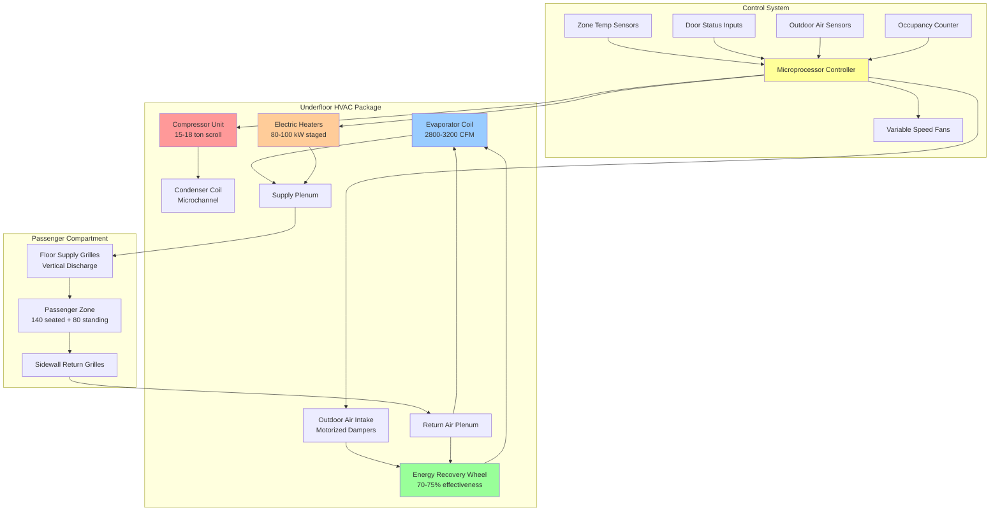
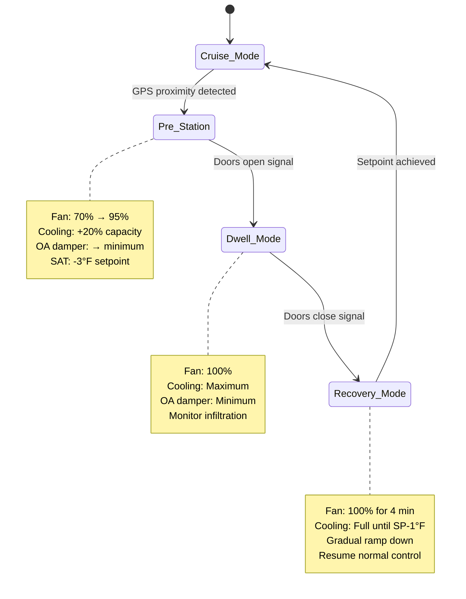

Regional commuter rail HVAC systems operate under the most demanding conditions in passenger rail service. Frequent station stops create continuous infiltration loads, peak-hour crush capacity generates extreme occupant loads, and rapid temperature cycling requires aggressive capacity modulation. Design strategies must balance passenger comfort during 30-90 minute journeys with energy efficiency constraints imposed by limited head-end power availability.

## Operational Load Profile

Commuter rail thermal loads vary dramatically throughout the service day, driven by occupancy patterns, station stop frequency, and ambient conditions.

### Peak Period Characteristics

Morning and evening rush hours impose maximum system loads:

**Typical Peak Service Parameters**

| Parameter | Value | Impact |
|-----------|-------|--------|
| Seated capacity | 120-160 passengers | Design baseline |
| Peak crush load | 180-240 passengers | 150-200% of seated capacity |
| Station stop frequency | Every 2-5 minutes | Continuous infiltration |
| Door open time | 30-60 seconds | 8,000-15,000 BTU/hr per door |
| Dwell recovery period | 3-6 minutes | Limits temperature stability |
| Trip duration | 30-90 minutes | Moderate comfort expectations |
| Daily cycles | 40-60 station stops | Thermal fatigue on equipment |

### Off-Peak and Midday Service

Reduced occupancy allows for energy conservation strategies:

| Parameter | Off-Peak Value | Reduction from Peak |
|-----------|----------------|---------------------|
| Average occupancy | 30-60 passengers | 60-75% reduction |
| Stop frequency | Every 5-10 minutes | 50% fewer infiltration events |
| HVAC capacity utilization | 40-65% | Opportunity for staging |
| Ventilation requirement | 450-900 CFM | Proportional to occupancy |

## Peak Cooling Load Calculations

Commuter rail cooling loads combine continuous base loads with transient infiltration spikes.

### Total Cooling Load Formula

$$Q_{\text{total}} = Q_{\text{envelope}} + Q_{\text{occupant}} + Q_{\text{infiltration}} + Q_{\text{equipment}} + Q_{\text{ventilation}}$$

Where each component is calculated as follows:

**Envelope Load**

$$Q_{\text{envelope}} = \sum (U_i \cdot A_i \cdot \Delta T) + \sum (A_{\text{glass},j} \cdot \text{SHGC}_j \cdot I_{\text{solar}})$$

**Parameters:**
- $U_i$ = thermal transmittance for surface $i$ (BTU/hr·ft²·°F)
  - Roof: 0.15-0.20
  - Sidewalls: 0.25-0.30
  - Windows: 0.95-1.05
- $A_i$ = surface area (ft²)
- $\Delta T$ = indoor-outdoor temperature difference (°F)
- SHGC = solar heat gain coefficient (0.35-0.45 for tinted glass)
- $I_{\text{solar}}$ = incident solar radiation (180-250 BTU/hr·ft²)

**Occupant Load**

$$Q_{\text{occupant}} = N_{\text{seated}}(250) + N_{\text{standing}}(350)$$

Where:
- $N_{\text{seated}}$ = number of seated passengers
- $N_{\text{standing}}$ = number of standing passengers
- Seated: 250 BTU/hr total (200 sensible + 50 latent)
- Standing: 350 BTU/hr total (250 sensible + 100 latent)

For peak design at 200% seated capacity with 60% standing:

$$Q_{\text{occupant,peak}} = 140(250) + 80(350) = 35{,}000 + 28{,}000 = 63{,}000 \text{ BTU/hr}$$

**Door Infiltration Load**

$$Q_{\text{door}} = 1.08 \cdot \text{CFM}_{\text{infiltration}} \cdot \Delta T + 0.68 \cdot \text{CFM}_{\text{infiltration}} \cdot \Delta \omega$$

For commuter service with 4 doors per car:

$$\text{CFM}_{\text{infiltration}} = N_{\text{doors}} \cdot \text{CFM}_{\text{per door}} \cdot \text{duty cycle}$$

Typical values:
- $\text{CFM}_{\text{per door}}$ = 800-1,200 during 45-second opening
- Duty cycle = 0.15-0.25 (doors open 15-25% of travel time)
- Effective continuous infiltration: 480-1,200 CFM

At design conditions (95°F DB, 75°F WB outdoor; 75°F DB, 50% RH indoor):

$$Q_{\text{infiltration}} = 1.08(800)(20) + 0.68(800)(0.008) = 17{,}280 + 4{,}352 = 21{,}632 \text{ BTU/hr}$$

**Equipment Heat Gain**

$$Q_{\text{equipment}} = P_{\text{lighting}} + P_{\text{motors}} + P_{\text{electronics}}$$

Typical commuter car:
- LED lighting: 2,500-3,500 BTU/hr
- Traction motor waste heat (transmitted): 1,500-2,500 BTU/hr
- Electronics and displays: 1,000-1,500 BTU/hr
- Total: 5,000-7,500 BTU/hr

**Outdoor Air Ventilation Load**

$$Q_{\text{ventilation}} = 1.08 \cdot \text{CFM}_{\text{OA}} \cdot \Delta T + 0.68 \cdot \text{CFM}_{\text{OA}} \cdot \Delta \omega$$

Minimum ventilation per ASHRAE 62.1 and APTA standards:
- 15 CFM per seated passenger
- 7.5 CFM per standing passenger (reduced due to short duration)

Peak ventilation requirement:

$$\text{CFM}_{\text{OA}} = 140(15) + 80(7.5) = 2{,}100 + 600 = 2{,}700 \text{ CFM}$$

At design conditions:

$$Q_{\text{vent}} = 1.08(2700)(20) + 0.68(2700)(0.008) = 58{,}320 + 14{,}688 = 73{,}008 \text{ BTU/hr}$$

### Total Design Cooling Capacity

$$Q_{\text{total}} = 45{,}000 + 63{,}000 + 21{,}632 + 6{,}500 + 73{,}008 = 209{,}140 \text{ BTU/hr} \approx 17.4 \text{ tons}$$

Standard commuter rail car capacity: **180,000-220,000 BTU/hr (15-18 tons)**

Safety factor accounts for:
- Simultaneous door openings at busy stations
- Extended dwell times during service disruptions
- Aging equipment degradation (10-15% capacity loss over 15-year service life)

## Heating Load Analysis

Winter heating loads must overcome envelope losses and provide rapid warm-up from overnight cold soak.

### Steady-State Heating Load

$$Q_{\text{heating}} = \sum (U_i \cdot A_i \cdot \Delta T) + 1.08 \cdot \text{CFM}_{\text{infiltration}} \cdot \Delta T + 1.08 \cdot \text{CFM}_{\text{OA}} \cdot \Delta T$$

At design winter conditions (0°F outdoor, 70°F indoor):

**Envelope Loss:**
- Roof (800 ft² × 0.18 × 70°F): 10,080 BTU/hr
- Sidewalls (1,200 ft² × 0.28 × 70°F): 23,520 BTU/hr
- Windows (350 ft² × 1.00 × 70°F): 24,500 BTU/hr
- Floor (700 ft² × 0.30 × 70°F): 14,700 BTU/hr
- Subtotal: 72,800 BTU/hr

**Infiltration (800 CFM average):**

$$Q_{\text{inf}} = 1.08(800)(70) = 60{,}480 \text{ BTU/hr}$$

**Ventilation (2,100 CFM at peak occupancy):**

$$Q_{\text{vent}} = 1.08(2100)(70) = 158{,}760 \text{ BTU/hr}$$

**Total steady-state:** 292,040 BTU/hr

### Warm-Up Capacity Requirement

Cars stored overnight in unheated yards reach thermal equilibrium with outdoor temperature. Morning start-up requires rapid heating:

$$Q_{\text{warm-up}} = \frac{m \cdot c_p \cdot \Delta T}{t_{\text{recovery}}}$$

Where:
- $m$ = carbody thermal mass (interior surfaces, seats, structure)
- $c_p$ = specific heat of materials
- $\Delta T$ = temperature rise from soak to comfort (typically 50-90°F)
- $t_{\text{recovery}}$ = acceptable warm-up time (15-20 minutes)

For aluminum carbody with interior furnishings:

$$Q_{\text{warm-up}} \approx 150{,}000-200{,}000 \text{ BTU/hr additional capacity}$$

**Total Design Heating Capacity:** 450,000-500,000 BTU/hr (90-100 kW electric resistance or diesel-fired heater)

## System Architecture and Equipment Selection

### Underfloor Package Configuration

The dominant architecture places all HVAC equipment beneath the passenger floor, providing:

**Advantages:**
- Maximum seating capacity preservation
- Vandalism protection
- Noise isolation from passenger space
- Low vehicle profile clearance
- Aerodynamic efficiency

**Component Specifications:**

| Component | Specification | Performance |
|-----------|--------------|-------------|
| Compressor | Scroll, 15-18 ton, variable speed | 1,200-3,600 RPM modulation |
| Refrigerant | R-513A (GWP 631) or R-452B (GWP 676) | Transitioning from R-134a |
| Evaporator | Copper tube/aluminum fin, 12-16 rows | 2,800-3,200 CFM @ 0.6-0.8 in. w.c. |
| Condenser | Microchannel aluminum, dual circuit | Operating to 125°F ambient |
| Heater banks | Electric resistance, 4-5 stages | 16-20 kW per stage |
| Supply fans | Centrifugal, variable speed EC motors | 70-85% fan efficiency |
| Filtration | MERV 8 pre-filter + MERV 11 final | 400-450 FPM face velocity |

## Energy Recovery Integration

Energy recovery substantially reduces ventilation loads during peak occupancy periods.

### Enthalpy Wheel Performance

Modern commuter rail installations incorporate rotary enthalpy wheels between exhaust and outdoor air streams:

$$\text{Effectiveness} = \frac{h_{\text{OA,leaving}} - h_{\text{OA,entering}}}{h_{\text{exhaust}} - h_{\text{OA,entering}}}$$

**Design Parameters:**

| Parameter | Summer Cooling | Winter Heating |
|-----------|----------------|----------------|
| Wheel diameter | 24-30 inches | 24-30 inches |
| Wheel depth | 8-12 inches | 8-12 inches |
| Rotation speed | 15-25 RPM | 15-25 RPM |
| Sensible effectiveness | 75-80% | 75-80% |
| Latent effectiveness | 65-70% | 65-70% |
| Total effectiveness | 70-75% | 70-75% |
| Pressure drop | 0.4-0.6 in. w.c. | 0.4-0.6 in. w.c. |
| Cross-contamination | <2% | <2% |

### Energy Savings Calculation

At peak occupancy requiring 2,700 CFM outdoor air:

**Summer Condition (95°F DB / 75°F WB outdoor, 75°F DB / 50% RH return):**

Without energy recovery:

$$Q_{\text{cooling,OA}} = 2700(30.5 - 25.3) = 14{,}040 \text{ BTU/hr per Btu/lb}$$

Converting to BTU/hr using psychrometric properties:

$$Q_{\text{no-ERV}} = 73{,}000 \text{ BTU/hr}$$

With 72% effective energy recovery wheel:

$$Q_{\text{with-ERV}} = 73{,}000(1 - 0.72) = 20{,}440 \text{ BTU/hr}$$

**Annual energy savings:** 52,560 BTU/hr reduction × 2,000 operating hours/year = 105 million BTU/year

At $0.12/kWh electric rate and 3.0 COP:

**Annual savings:** $1,200-1,500 per car

**Winter Condition (15°F outdoor, 70°F return):**

Preheat reduction through enthalpy recovery:

$$Q_{\text{preheat,saved}} = 1.08 \times 2700 \times (70-15) \times 0.75 = 120{,}285 \text{ BTU/hr}$$

Over 1,200 heating season hours: 144 million BTU/year = $500-700 electric heat savings

## Rapid Cycling Response Strategies

Frequent station stops create continuous thermal disturbances requiring active control compensation.

### Door Opening Compensation

**Predictive Boost Algorithm:**

When door opening is anticipated (GPS proximity to station, deceleration detection):

1. **Increase supply air volume:** Fan speed ramps from 70% to 95% (30 seconds before arrival)
2. **Reduce outdoor air damper:** Close to minimum position during dwell (reduce infiltration load)
3. **Activate supplemental cooling:** Stage additional compressor capacity or boost fan speed
4. **Decrease discharge temperature:** Lower setpoint by 3-5°F to pre-cool space

**Recovery Phase:**

After doors close:

1. **Maintain elevated capacity:** Continue 100% output for 3-5 minutes
2. **Gradual reset:** Ramp fan speed and capacity down over 2-3 minutes
3. **Return to cruise mode:** Resume normal modulation based on load

### Control Logic Implementation

## Occupancy-Based Demand Control

Commuter rail loading varies 3:1 between peak and off-peak service, enabling substantial energy savings through demand-controlled ventilation.

### Passenger Counting Integration

Modern systems incorporate automatic passenger counters (APC) using:
- Infrared beam breaks at doorways
- Stereoscopic cameras with computer vision
- Weight-based floor sensors

**Ventilation Modulation:**

$$\text{CFM}_{\text{OA,required}} = N_{\text{passengers}} \times 12 \text{ CFM/person}$$

(Using blended rate for seated/standing mix)

**Control Algorithm:**

| Passenger Count | OA Damper Position | Fan Speed | Compressor Stages |
|-----------------|--------------------|-----------|--------------------|
| 0-40 | 20% (minimum) | 50% | 1 of 2 |
| 41-100 | 40% | 65% | 1 of 2 |
| 101-160 | 70% | 80% | 2 of 2 |
| 161-240 | 90% | 95-100% | 2 of 2 + boost |

### Energy Impact Analysis

**Peak vs. Off-Peak Comparison:**

| Parameter | Off-Peak (50 pax) | Peak (200 pax) | Energy Ratio |
|-----------|-------------------|----------------|--------------|
| OA ventilation | 600 CFM | 2,400 CFM | 4.0× |
| Cooling load | 65,000 BTU/hr | 209,000 BTU/hr | 3.2× |
| Fan power | 3.2 kW | 8.5 kW | 2.7× |
| Compressor power | 12 kW | 32 kW | 2.7× |
| Total HVAC power | 15.2 kW | 40.5 kW | 2.7× |

Demand control reduces average daily energy consumption by 25-35% compared to constant-volume operation.

## Maintenance Considerations

Commuter rail HVAC systems experience accelerated wear due to continuous cycling and environmental exposure.

### Preventive Maintenance Schedule

| Component | Inspection Interval | Service Action |
|-----------|---------------------|----------------|
| Air filters | 10,000-15,000 miles | Replace (3-4 weeks peak season) |
| Condenser coil | 5,000 miles | Clean (monthly urban service) |
| Evaporator coil | 25,000 miles | Inspect, clean if needed |
| Compressor oil | 50,000 miles | Sample analysis, replace if degraded |
| Refrigerant charge | 25,000 miles | Check pressures, leak test |
| Energy recovery wheel | 15,000 miles | Clean, check rotation |
| Belt drives (if present) | 10,000 miles | Tension check, replace |
| Control calibration | 50,000 miles | Temperature sensor verification |
| Complete overhaul | 150,000-200,000 miles | Full system rebuild |

### Common Failure Modes

**High-Cycle Components:**

1. **Compressor failures:** Liquid slugging from rapid cycling (30,000-50,000 hour MTBF)
2. **Fan motor bearings:** Vibration and continuous operation (40,000-60,000 hour MTBF)
3. **Expansion valve hunting:** Rapid load changes causing instability
4. **Control sensor drift:** Temperature and humidity sensors in harsh environment

**Mitigation Strategies:**
- Compressor soft-start delays (3-minute minimum off-cycle)
- Suction accumulator installation (prevents liquid return)
- Crankcase heaters for overnight protection
- Premium vibration-isolated fan bearings
- Annual control sensor calibration

## Relevant Standards and Specifications

### North American Standards

**APTA PR-M-S-015-06:** HVAC Systems for Rail Passenger Vehicles
- Temperature control: 68-76°F at design conditions
- Humidity: Dehumidification to maintain <65% RH when ambient permits
- Ventilation: 15 CFM per passenger minimum
- Pull-down performance: 95°F to 75°F interior in 30 minutes maximum

**ASHRAE Standard 62.1:** Ventilation for Acceptable Indoor Air Quality
- Transit vehicle adaptation with reduced rates for short-duration exposure
- CO₂ monitoring recommended (maintain <1,500 ppm peak periods)

**IEEE 1573:** Recommended Practice for Electronic Equipment in Rail Transit Vehicles
- EMI/RFI immunity for HVAC controls
- Vibration resistance: 5-15 Hz at 0.5g continuous

### International Standards

**EN 14750-1:** Railway Applications - Air Conditioning for Urban and Suburban Rolling Stock
- Comfort categories based on climatic zones
- Performance testing protocols
- Energy efficiency requirements

**EN 13129-1:** Railway Applications - Air Conditioning for Driving Cabs
- Applies to operator compartments requiring tighter control

## Future Technology Trends

**Variable Refrigerant Flow (VRF) Systems:**
- Multi-zone independent control
- Heat recovery between heating and cooling zones
- 15-25% energy savings vs. conventional systems

**CO₂ Refrigerant Systems (R-744):**
- Near-zero GWP (GWP = 1)
- Superior heating performance in cold climates
- Transcritical cycle operation >87°F ambient

**Thermoelectric Cooling Supplements:**
- Solid-state heat pumps for localized cooling
- No moving parts, silent operation
- Integrated into seat backs or overhead consoles

**Predictive Maintenance:**
- Machine learning algorithms analyzing operational data
- Failure prediction 30-60 days in advance
- Optimized service scheduling reducing unplanned downtime

Regional commuter rail HVAC systems represent the most challenging passenger rail climate control application, requiring robust equipment, sophisticated controls, and aggressive capacity sizing to maintain comfort during extreme loading and rapid thermal cycling events that define peak-hour service.
