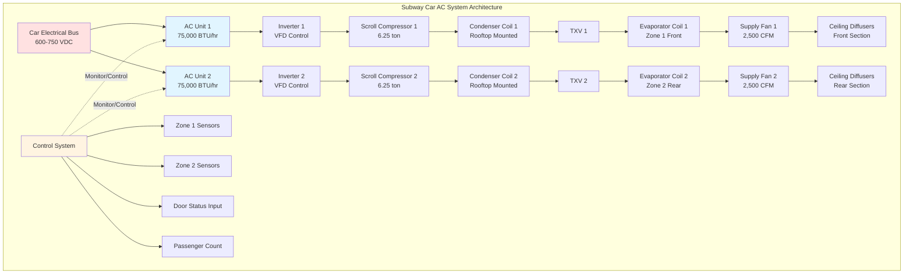

Subway rail car air conditioning systems operate under the most demanding conditions in transportation HVAC, combining extreme tunnel ambient temperatures, high occupant density, constrained heat rejection, and critical reliability requirements. The underground environment creates a closed thermal loop where equipment heat rejection continuously elevates tunnel temperatures, degrading system performance while cooling demand peaks. Proper AC system design requires careful analysis of load components, refrigeration cycle performance at elevated condensing temperatures, and redundancy architecture to maintain passenger comfort.

## Cooling Load Calculation Framework

Accurate load quantification forms the foundation of subway AC system sizing. The total cooling requirement combines sensible and latent components from multiple simultaneous sources.

### Solar and Transmission Loads

Surface sections expose cars to solar radiation through windows and roof surfaces. Underground operation eliminates direct solar gain but substitutes conducted heat from elevated tunnel air temperatures:

$$Q_{\text{cond}} = \sum_{i} U_i \cdot A_i \cdot (T_{\text{tunnel}} - T_{\text{interior}})$$

Where:
- $U_i$ = thermal transmittance of surface element $i$ (BTU/hr·ft²·°F)
- $A_i$ = surface area of element $i$ (ft²)
- $T_{\text{tunnel}}$ = tunnel air temperature (°F)
- $T_{\text{interior}}$ = target interior temperature (°F)

For a standard 75-foot subway car with 3,800 ft² total envelope area:

| Surface Component | Area (ft²) | U-Value (BTU/hr·ft²·°F) | ΔT (°F) | Load (BTU/hr) |
|-------------------|-----------|------------------------|---------|---------------|
| Roof panels | 900 | 0.18 | 30 | 4,860 |
| Sidewall panels | 1,800 | 0.25 | 30 | 13,500 |
| Floor assembly | 900 | 0.30 | 15 | 4,050 |
| Windows/doors | 200 | 0.95 | 30 | 5,700 |
| **Total Conduction** | **3,800** | - | - | **28,110** |

At tunnel temperature of 105°F and interior setpoint of 75°F, conduction contributes approximately 28,000 BTU/hr sensible load.

### Occupant Heat Gain

Passenger metabolic heat dominates peak cooling requirements. Standing passengers in subway conditions generate higher heat release rates than seated occupants:

$$Q_{\text{occupant}} = N_{\text{seated}} \cdot q_{\text{seated}} + N_{\text{standing}} \cdot q_{\text{standing}}$$

Standard passenger heat gain values:
- Seated passenger: 400 BTU/hr (300 sensible + 100 latent)
- Standing passenger: 450 BTU/hr (350 sensible + 100 latent)

Subway car capacity calculation:

| Loading Condition | Seated | Standing | Total | Sensible (BTU/hr) | Latent (BTU/hr) | Total (BTU/hr) |
|-------------------|--------|----------|-------|-------------------|-----------------|----------------|
| Normal capacity | 40 | 80 | 120 | 40,000 | 10,400 | 50,400 |
| Design capacity | 40 | 110 | 150 | 50,500 | 13,000 | 63,500 |
| Crush capacity | 40 | 140 | 180 | 61,000 | 15,600 | 76,600 |

Design capacity (150 passengers) generates 63,500 BTU/hr total, representing the largest single load component.

### Infiltration and Ventilation Loads

Station door openings introduce massive infiltration loads as platform air exchanges with conditioned interior air. Each door cycle at a typical station stop:

$$Q_{\text{infiltration}} = \rho \cdot V_{\text{exchange}} \cdot c_p \cdot (T_{\text{platform}} - T_{\text{interior}}) + h_{fg} \cdot \Delta W$$

Door opening infiltration analysis:
- Number of doors: 8 (4 per side, 2 sides)
- Air exchange per door cycle: 50 ft³
- Door cycles per hour: 40 (20 stations, 2 cycles per station)
- Total infiltration: 16,000 ft³/hr = 267 CFM effective

At 95°F platform temperature, 60% RH, and 75°F interior at 50% RH:
- Sensible infiltration: 267 CFM × 1.08 × 20°F = 5,760 BTU/hr
- Latent infiltration: 267 CFM × 0.68 × 0.008 lb/lb = 1,450 BTU/hr
- Total infiltration load: 7,210 BTU/hr

Fresh air ventilation requirement per APTA standards: 7.5 CFM/passenger minimum
- Design occupancy: 150 passengers
- Required ventilation: 1,125 CFM
- Ventilation sensible load: 1,125 × 1.08 × 30 = 36,450 BTU/hr
- Ventilation latent load: 1,125 × 0.68 × 0.012 = 9,180 BTU/hr
- Total ventilation load: 45,630 BTU/hr

### Equipment and Lighting Loads

Internal heat sources include LED lighting, traction motor heat conducted through floor, auxiliary power systems, and passenger electronics charging:

| Equipment Source | Power (kW) | Heat Release (BTU/hr) |
|------------------|------------|----------------------|
| LED ceiling lighting | 1.8 | 6,140 |
| Door motors and controls | 0.5 | 1,705 |
| HVAC system fans | 2.2 | 7,505 |
| Auxiliary electronics | 1.0 | 3,410 |
| Traction heat conduction | - | 4,500 |
| USB charging ports | 0.8 | 2,730 |
| **Total Equipment** | **6.3** | **21,990** |

### Total System Cooling Capacity

Combining all load components for design conditions:

$$Q_{\text{total}} = Q_{\text{cond}} + Q_{\text{occupant}} + Q_{\text{infiltration}} + Q_{\text{ventilation}} + Q_{\text{equipment}}$$

| Load Component | Sensible (BTU/hr) | Latent (BTU/hr) | Total (BTU/hr) |
|----------------|-------------------|-----------------|----------------|
| Conduction | 28,110 | 0 | 28,110 |
| Occupants (150) | 50,500 | 13,000 | 63,500 |
| Infiltration | 5,760 | 1,450 | 7,210 |
| Ventilation | 36,450 | 9,180 | 45,630 |
| Equipment | 21,990 | 0 | 21,990 |
| **Design Total** | **142,810** | **23,630** | **166,440** |

Sensible heat ratio: 142,810 / 166,440 = 0.858

Standard practice applies safety factors and operational margins:
- Load calculation factor: 1.10 (accounts for calculation uncertainties)
- Adjusted design load: 166,440 × 1.10 = 183,084 BTU/hr
- Nominal system capacity: 180,000 BTU/hr (15 tons)

Most modern subway cars install 120,000-150,000 BTU/hr nominal capacity with understanding that tunnel temperatures may limit actual delivered cooling during extreme conditions.

## Tunnel Heat Rejection Challenges

The fundamental constraint in subway AC design stems from heat rejection into confined tunnel spaces. Unlike surface vehicles rejecting heat to unlimited atmospheric volume, subway systems create a closed thermal environment.

### Heat Rejection Analysis

The total heat rejected by the AC system exceeds cooling capacity by the compressor work input:

$$Q_{\text{reject}} = Q_{\text{cooling}} + W_{\text{compressor}} = Q_{\text{cooling}} \cdot \left(1 + \frac{1}{\text{EER} \times 3.412}\right)$$

For a 150,000 BTU/hr system operating at EER = 8.0:
- Compressor power: 150,000 / 8.0 = 18,750 Watt = 64,000 BTU/hr
- Total heat rejection: 150,000 + 64,000 = 214,000 BTU/hr per car

A 10-car train operating at full capacity:
- Train heat rejection: 214,000 × 10 = 2,140,000 BTU/hr (178 tons)

This enormous heat load continuously warms tunnel air. Without adequate tunnel ventilation, ambient temperature rises 2-5°F per train passage in poorly ventilated sections.

### Performance Degradation Curve

Refrigeration system capacity decreases as condenser entering air temperature rises, following manufacturer performance maps. Typical degradation:

$$Q_{\text{actual}} = Q_{\text{rated}} \cdot \left[1 - k \cdot (T_{\text{ECAT}} - T_{\text{rated}})\right]$$

Where $k$ = performance degradation coefficient (typically 0.015-0.020 per °F)

| Condenser Temperature | Capacity (% rated) | Power (% rated) | EER (% rated) |
|----------------------|-------------------|----------------|---------------|
| 85°F (rated) | 100% | 100% | 100% |
| 95°F | 92% | 107% | 86% |
| 105°F | 84% | 115% | 73% |
| 115°F | 76% | 124% | 61% |
| 125°F | 68% | 134% | 51% |

At 115°F tunnel temperature (common during rush hours), a nominally rated 150,000 BTU/hr system delivers only 114,000 BTU/hr while consuming 24% more power. This nonlinear degradation necessitates either oversized equipment or coordinated tunnel ventilation infrastructure.

### Condenser Design Requirements

Subway AC condensers must maximize heat transfer despite elevated ambient temperatures and limited airflow volume:

**Condenser specifications:**
- Coil face area: 18-24 ft² per 60,000 BTU/hr capacity
- Airflow rate: 800-1,000 CFM per ton of cooling
- Face velocity: 400-550 FPM
- Fin density: 12-14 fins per inch
- Tube material: Copper with enhanced internal rifling
- Fin material: Aluminum with hydrophilic coating

Rooftop condenser configuration allows mounting above car envelope, utilizing piston effect airflow from train motion to supplement fan-driven airflow. At 40 mph train speed, ram air contributes 15-25% of total condenser airflow.

## System Architecture and Configuration

### Redundancy Architecture

Subway operations demand extremely high reliability since AC system failure creates unsafe conditions when cars cannot be quickly evacuated from tunnels. Standard practice employs multiple smaller units rather than single large systems:

**N+0 Configuration (Minimum Acceptable):**
- Two 75,000 BTU/hr units per car
- Total capacity: 150,000 BTU/hr
- Single unit failure reduces capacity to 75,000 BTU/hr (50%)
- Acceptable only with guaranteed rapid car removal from service

**N+1 Configuration (Preferred):**
- Three 60,000 BTU/hr units per car
- Total capacity: 180,000 BTU/hr
- Single unit failure maintains 120,000 BTU/hr (67%)
- Allows continued operation during repair scheduling

**Distributed Configuration (High-Density Lines):**
- Four 40,000 BTU/hr units per car
- Total capacity: 160,000 BTU/hr
- Single unit failure maintains 120,000 BTU/hr (75%)
- Improved weight distribution and zone control

### Equipment Location Strategies

Rooftop mounting dominates subway car AC installation due to several advantages:

**Rooftop advantages:**
- Accessible maintenance without car interior disruption
- Natural condensate drainage away from occupied space
- Condenser coil exposure to train-motion induced airflow
- Protection from tunnel debris and standing water
- Simplified refrigerant piping runs to ceiling-mounted evaporators

**Rooftop design constraints:**
- Tunnel clearance envelope restrictions (typically 13.5-14.5 ft maximum)
- Aerodynamic drag considerations at speeds above 45 mph
- Roof loading limits (150-250 lb per unit including mounting)
- Vibration isolation requirements (0.5g continuous, 2.5g shock)
- Weatherproofing and debris shields

Underfloor mounting appears in some modern designs where tunnel clearances permit and low car profile is priority. Underfloor systems require enhanced sealing against water ingress and complex ducting to ceiling distribution points.

## Refrigerant System Components

### Compressor Selection

Scroll compressors dominate modern subway AC applications, replacing reciprocating designs:

**Scroll compressor advantages:**
- Lower vibration amplitude (important for passenger comfort)
- Higher volumetric efficiency at partial loads
- Integrated inverter control for capacity modulation 25-100%
- Fewer moving parts reducing maintenance intervals
- Better liquid refrigerant tolerance during startup

Typical specifications:
- Capacity: 50,000-80,000 BTU/hr per compressor
- Refrigerant: R-134a (legacy) or R-513A (modern low-GWP)
- Operating envelope: -20°F to 140°F condensing temperature
- Electrical: 600-750 VDC with inverter drive
- Mounting: Spring-isolated with braided refrigerant connections

### Heat Exchanger Design

Condenser coils employ microchannel aluminum construction for superior performance:

**Microchannel condenser specifications:**
- Tube geometry: 1.0-1.5 mm hydraulic diameter parallel flow
- Header design: Extruded aluminum with integrated distributor
- Coil depth: 1.5-2.0 inches (significantly thinner than tube-fin)
- Subcooling section: Dedicated final passes for 12-18°F subcooling
- Charge reduction: 40-50% less refrigerant than equivalent tube-fin design

Evaporator coils use conventional copper tube/aluminum fin construction:
- Tube diameter: 3/8 inch or 1/2 inch copper
- Fin spacing: 10-12 FPI for subway applications
- Fin coating: Hydrophilic for improved condensate drainage
- Face velocity: 450-550 FPM at design airflow
- Rows deep: 4-6 rows depending on required capacity

### Expansion and Control Devices

Electronic expansion valves (EEV) enable precise superheat control and capacity optimization:

**EEV advantages:**
- Superheat control: 5-8°F target (vs. 8-12°F for TXV)
- Load response time: <30 seconds full range
- Integration with system controller for optimized efficiency
- Reverse cycle capability (if heat pump operation included)

Superheat setpoint optimization:

$$\dot{m}_{\text{refrigerant}} = \frac{Q_{\text{evaporator}}}{h_{fg} \cdot \eta_{\text{evap}}}$$

Tighter superheat control increases evaporator effectiveness, delivering 3-7% higher capacity at equivalent power input.

## Control System Integration

Modern subway AC systems employ distributed control architecture integrated with train management computers:

**Control inputs:**
- Temperature sensors: 4-6 per car (ceiling return, supply air, ambient)
- Humidity sensor: Single car average
- Door status: Boolean for each door set
- Passenger count: Vision-based or load-cell floor sensors
- Train speed: From traction control system
- Tunnel temperature: Wayside sensors transmitted to train

**Control outputs:**
- Compressor speed: 25-100% via inverter frequency
- Condenser fan speed: Variable speed 40-100%
- Evaporator fan speed: Variable speed 60-100%
- EEV position: 0-100% open
- Fresh air damper: Modulating 10-100% open

**Control strategies:**

*Demand-based capacity modulation:*
- Passenger count input adjusts target capacity 50-100%
- Door open status boosts ventilation airflow to 125%
- Tunnel temperature input modifies compressor staging logic

*Efficiency optimization:*
- Supply air temperature reset based on return air temperature
- Condenser fan speed modulation maintaining minimum 10°F subcooling
- Economizer mode when tunnel temperature permits (rare but possible during overnight operations)

## Reliability and Maintenance Requirements

APTA Standard APTA PR-M-S-016-06 specifies subway HVAC reliability targets:

**Performance requirements:**
- Mean time between failures (MTBF): 12,000 hours minimum
- Mean time to repair (MTTR): 2 hours maximum for modular replacement
- Service life: 15-20 years with scheduled component replacement
- Availability: 98.5% minimum (allowing 1.5% downtime for maintenance)

**Scheduled maintenance intervals:**

| Component | Inspection Interval | Replacement Interval |
|-----------|-------------------|---------------------|
| Air filters | 500 operating hours | 1,000 hours |
| Condenser coil cleaning | 1,000 hours | - |
| Evaporator coil inspection | 2,000 hours | - |
| Compressor oil analysis | 4,000 hours | 8,000 hours (oil change) |
| Fan motor bearings | 4,000 hours | 12,000 hours |
| EEV calibration | - | 6,000 hours |
| Refrigerant charge verification | 2,000 hours | As needed |
| Control system diagnostics | 1,000 hours | - |

Predictive maintenance monitoring tracks compressor runtime, power consumption, refrigerant pressures, and superheat/subcooling to identify degradation before failure. Remote telemetry transmits diagnostic data to central maintenance facilities for analysis.

The integration of high cooling capacity, tunnel heat rejection constraints, redundant architecture, and sophisticated controls makes subway rail car AC systems among the most complex and demanding transportation HVAC applications. Successful designs balance passenger comfort, energy efficiency, and operational reliability while operating in the thermally hostile underground environment.
