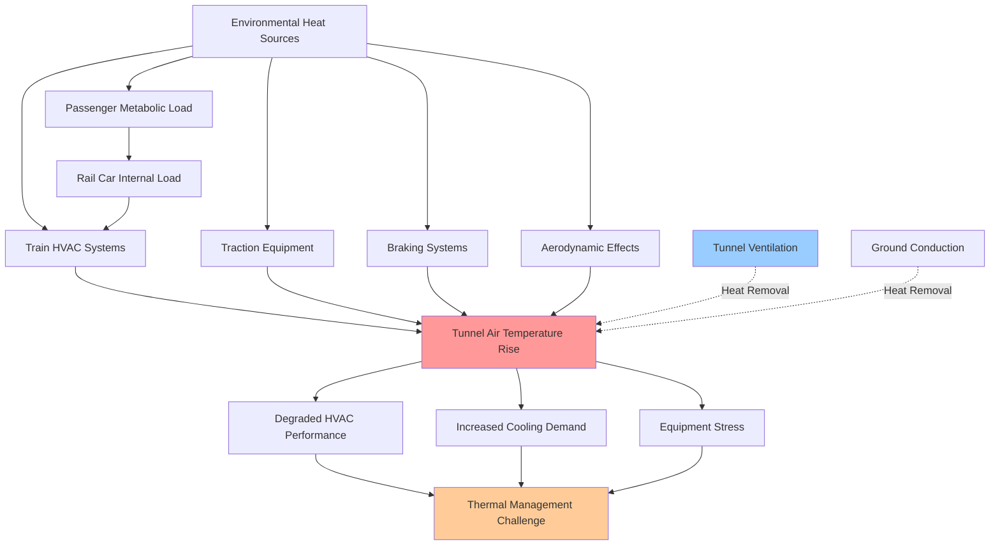

Underground rail environments present extreme thermal conditions that fundamentally differ from surface transit applications. Tunnel ambient temperatures routinely exceed outside air conditions by 15-30°F, creating hostile operating environments for HVAC equipment while simultaneously increasing cooling demands. The confined space, cumulative heat accumulation from multiple trains, traction equipment waste heat, and aerodynamic phenomena combine to produce challenging thermal management requirements.

## Tunnel Temperature Rise Mechanisms

Multiple concurrent heat sources contribute to tunnel temperature elevation above ground-level ambient conditions.

**Train Heat Rejection**

Each operating train discharges substantial thermal energy into tunnel infrastructure through HVAC condenser operation, traction equipment cooling, and brake dissipation. The cumulative tunnel heating from a single train passage:

$$Q_{train} = Q_{HVAC} + Q_{traction} + Q_{braking} + Q_{auxiliary}$$

Where:
- $Q_{HVAC}$ = Air conditioning heat rejection (120,000-140,000 BTU/hr per car)
- $Q_{traction}$ = Traction motor and inverter cooling (25,000-40,000 BTU/hr per car)
- $Q_{braking}$ = Dynamic and friction brake dissipation (variable, 50,000-200,000 BTU/hr during braking events)
- $Q_{auxiliary}$ = Lighting, controls, and ancillary systems (3,000-5,000 BTU/hr per car)

For a 10-car train operating continuously, total heat rejection reaches 1.5-2.0 million BTU/hr (125-167 tons).

**Tunnel Temperature Equilibrium**

Tunnel air temperature stabilizes when heat addition equals heat removal through ventilation and conduction to surrounding earth. The quasi-steady-state tunnel temperature:

$$T_{tunnel} = T_{ambient} + \frac{\sum Q_{sources}}{\.{m}_{vent} \times c_p}$$

Where:
- $T_{ambient}$ = Outside air temperature (°F)
- $\sum Q_{sources}$ = Total heat addition rate (BTU/hr)
- $\.{m}_{vent}$ = Ventilation air mass flow rate (lb/hr)
- $c_p$ = Specific heat of air (0.24 BTU/lb·°F)

Inadequate tunnel ventilation allows temperature to rise continuously during operating hours. Deep tunnels with minimal natural ventilation can reach 105-115°F during peak service periods, creating a thermal penalty that degrades HVAC system performance precisely when maximum capacity is required.

## Piston Effect and Aerodynamic Heating

Train movement through confined tunnel cross-sections creates significant air motion and aerodynamic heating through the piston effect.

**Piston Effect Fundamentals**

A moving train displaces air volume approximately equal to its cross-sectional area multiplied by velocity. In confined tunnels, this displaced air must accelerate around and past the train, creating:

1. **Forward air movement** ahead of the train (40-60% of train velocity)
2. **Backward flow** along train sides and over/under the train
3. **Wake turbulence** behind the train

The volumetric airflow induced by piston effect:

$$Q_{piston} = A_{train} \times V_{train} \times \eta_{displacement}$$

Where:
- $A_{train}$ = Train cross-sectional area (typically 90-120 ft²)
- $V_{train}$ = Train velocity (ft/min)
- $\eta_{displacement}$ = Displacement efficiency (0.4-0.7 depending on tunnel/train area ratio)

For a train traveling 45 mph (3,960 ft/min) with 100 ft² cross-section in a tunnel providing 60% displacement efficiency, induced airflow equals 237,600 CFM.

**Aerodynamic Heating**

Air compression ahead of the moving train and friction along train/tunnel surfaces converts kinetic energy to thermal energy. The temperature rise from aerodynamic compression:

$$\Delta T_{aero} = \frac{V^2}{2 \times c_p \times J}$$

Where:
- $V$ = Air velocity relative to train (ft/s)
- $c_p$ = Specific heat (0.24 BTU/lb·°F)
- $J$ = Mechanical equivalent of heat (778 ft·lbf/BTU)

At 45 mph (66 ft/s), aerodynamic compression produces approximately 0.3°F temperature rise in the displaced air. While modest per train, this effect compounds with multiple trains and contributes to overall tunnel heating.

## Design Conditions by Tunnel Configuration

Tunnel design parameters significantly influence environmental conditions and HVAC system requirements.

| Tunnel Type | Typical Ambient Range | Peak Temperature | Ventilation Strategy | Heat Removal Capacity |
|-------------|----------------------|------------------|----------------------|----------------------|
| **Cut-and-Cover Shallow** | 85-100°F | 105°F | Natural + mechanical shafts | 60-80% of heat load |
| **Bored Deep Tunnel** | 90-110°F | 115°F | Forced mechanical ventilation | 40-60% of heat load |
| **Station Areas** | 80-95°F | 100°F | Station ventilation systems | 70-90% of heat load |
| **Underwater Tunnel** | 75-90°F | 95°F | Mechanical ventilation only | 50-70% of heat load |
| **Mountain Tunnel** | 85-105°F | 110°F | Portal ventilation + shafts | 50-70% of heat load |

**Tunnel/Train Blockage Ratio Impact**

| Blockage Ratio (A_train/A_tunnel) | Piston Effect Efficiency | Air Velocity Past Train | Pressure Rise |
|-----------------------------------|--------------------------|------------------------|---------------|
| 0.30-0.40 | 40-50% | 18-22 mph | 0.05-0.10 psi |
| 0.40-0.50 | 50-60% | 22-27 mph | 0.10-0.15 psi |
| 0.50-0.60 | 60-70% | 27-32 mph | 0.15-0.25 psi |
| 0.60-0.70 | 70-80% | 32-36 mph | 0.25-0.40 psi |

Higher blockage ratios increase piston effect efficiency but also elevate aerodynamic resistance and energy consumption.

## Humidity Control Challenges

Underground environments typically exhibit high relative humidity due to groundwater infiltration, limited air exchange, and continuous moisture addition from passengers and equipment.

**Moisture Sources**

- **Passenger perspiration**: 0.5-0.8 lb/hr per person at sedentary activity
- **Groundwater seepage**: 10-100 lb/hr per 1,000 feet of tunnel depending on construction quality
- **Equipment condensate**: If not properly drained, re-evaporates into tunnel air
- **Station cleaning operations**: Significant moisture introduction during off-peak hours

**Dehumidification Limitations**

Rail car HVAC systems provide some latent cooling capacity, but tunnel air humidity cannot be effectively controlled by vehicle systems alone. When tunnel air dew point exceeds 65-70°F, individual car dehumidification becomes impractical due to excessive latent load. The latent cooling requirement:

$$Q_{latent} = \.{m}_{air} \times \Delta W \times h_{fg}$$

Where:
- $\.{m}_{air}$ = Air mass flow rate (lb/hr)
- $\Delta W$ = Humidity ratio reduction (lb moisture/lb dry air)
- $h_{fg}$ = Latent heat of vaporization (1,060 BTU/lb at typical conditions)

For 1,500 CFM outdoor air intake (approximately 6,750 lb/hr) with humidity ratio reduction from 0.016 to 0.010 (approximately 80°F, 70% RH to 75°F, 50% RH), latent load equals 42,975 BTU/hr, consuming significant cooling capacity.

**Tunnel-Level Humidity Management**

Effective humidity control requires infrastructure-level intervention:

- **Mechanical dehumidification** at tunnel ventilation stations
- **Ground water drainage systems** to intercept seepage before air contact
- **Air exchange** with outside air during favorable conditions
- **Station platform HVAC** to condition air entering tunnels

## Subway Environmental Standards

Multiple standards govern acceptable environmental conditions in subway operations.

**ASHRAE Subway Environment Guidelines**

ASHRAE research projects and Subway Environmental Design Handbook establish recommended conditions:

- **Platform temperature**: 78-82°F maximum during summer design conditions
- **Tunnel temperature**: Not to exceed 100°F under normal operating conditions
- **Relative humidity**: 60% maximum on platforms; tunnel humidity uncontrolled
- **Air velocity**: 500-1,000 FPM maximum on platforms from piston effect
- **CO₂ concentration**: Below 1,000 ppm on platforms and in vehicles

**IEEE 1635 - Rail Transit HVAC Standard**

Specifies vehicle HVAC performance under defined tunnel ambient conditions:

- **Design condition 1**: 95°F tunnel ambient, 50% RH
- **Design condition 2**: 105°F tunnel ambient, 40% RH
- **Extreme condition**: 115°F tunnel ambient, 30% RH

Systems must maintain 75°F ± 3°F interior temperature under design conditions with specified passenger loading.

**NFPA 130 - Fixed Guideway Transit and Passenger Rail Systems**

Addresses emergency ventilation requirements:

- **Smoke control**: Capability to control smoke movement in fire scenarios
- **Tenable conditions**: Maintain breathable air quality during emergency egress
- **Ventilation capacity**: Sufficient airflow to manage 30 MW fire event in critical tunnel sections

## Seasonal Variations and Daily Cycles

Tunnel temperatures exhibit both seasonal and daily variation patterns, though with significant thermal lag compared to surface conditions.

**Summer Peak Conditions**

Tunnel temperatures reach annual maximum 2-4 weeks after peak outdoor temperatures due to thermal mass of surrounding earth. Maximum tunnel temperature typically occurs in late August or early September even when peak outdoor temperature occurred in July. This thermal lag must be considered in annual maintenance scheduling.

**Winter Operation**

Shallow tunnels may approach outdoor temperature during extended cold periods, requiring heating rather than cooling. Deep tunnels maintain 60-75°F year-round due to geothermal effect and insulation from seasonal temperature swings. The effective tunnel temperature in winter:

$$T_{tunnel,winter} = T_{ground} + \frac{Q_{trains}}{UA_{tunnel} + \.{m}_{vent} c_p}$$

Where $T_{ground}$ represents undisturbed earth temperature at tunnel depth (typically 50-60°F).

**Daily Cycling**

During operating hours, tunnel temperature rises 5-15°F from heat accumulation. Night-time shutdown allows partial cooling through:

- Natural convection and ventilation
- Conduction to tunnel walls and surrounding earth
- Reduced heat input from station activities

This daily temperature swing necessitates designing HVAC systems for end-of-service-day conditions when tunnel temperature peaks rather than average daily conditions.

## Thermal Stratification Effects

Temperature stratification develops vertically in station areas and along tunnel gradients, creating non-uniform thermal environments.

**Vertical Stratification**

Heat rises naturally, creating elevated temperatures at platform ceiling level compared to track level. Temperature differential can reach 10-15°F between floor and ceiling in poorly-mixed station volumes. This stratification:

- Concentrates hot air near train roofs, increasing condenser entering air temperature
- Creates uncomfortable conditions for standing passengers
- Reduces effectiveness of overhead ventilation systems
- Requires destratification fans or mixing strategies in deep stations

**Longitudinal Gradients**

Tunnel temperature increases along service routes as each station and intermediate section accumulates heat. Temperature rise of 0.5-2.0°F per mile of tunnel length is common in heavily-utilized routes during peak periods.

The cumulative nature of tunnel heating creates a positive feedback loop where elevated tunnel temperature degrades HVAC efficiency, increasing heat rejection, which further raises tunnel temperature. Breaking this cycle requires substantial tunnel ventilation infrastructure operating continuously during service hours.

Understanding and accurately predicting subway environmental conditions is essential for proper HVAC system design, capacity selection, and operational strategies that maintain passenger comfort in these uniquely challenging underground transit environments.
