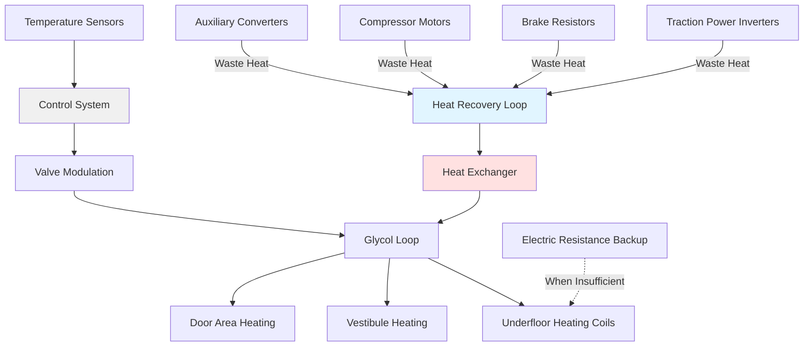

Subway rail car heating systems must provide reliable thermal comfort during cold weather operations while operating from high-voltage DC traction power, withstanding extreme vibration, and minimizing energy consumption. Unlike cooling systems that face heat rejection challenges in confined tunnels, heating systems benefit from the thermal mass of underground infrastructure, which moderates winter temperature extremes. Nevertheless, surface running sections, station platforms, and vestibule areas require substantial heating capacity to maintain passenger comfort.

## Heating Load Calculations

The winter heating load for subway cars involves conduction through the vehicle envelope, cold air infiltration at door openings, and ventilation air heating requirements.

**Envelope Conduction Load**

Heat loss through walls, floor, roof, and windows follows the fundamental conduction equation:

$$Q_{cond} = U \times A \times (T_{interior} - T_{ambient})$$

For a standard 75-foot subway car with the following characteristics:

| Surface | Area (ft²) | U-Value (BTU/hr·ft²·°F) | ΔT (°F) | Heat Loss (BTU/hr) |
|---------|-----------|------------------------|---------|-------------------|
| Walls | 1,800 | 0.28 | 90 | 45,360 |
| Roof | 900 | 0.25 | 95 | 21,375 |
| Floor | 800 | 0.30 | 75 | 18,000 |
| Windows | 400 | 0.45 | 90 | 16,200 |
| **Total** | **3,900** | - | - | **100,935** |

*Design conditions: -20°F exterior, 70°F interior*

**Infiltration Load**

Door openings at station stops introduce massive quantities of cold air. Each door cycle exchanges approximately 50-80 cubic feet of interior air with platform air. For a car with four door sets making 25 station stops per hour:

$$Q_{inf} = \rho \times c_p \times V \times n \times (T_{interior} - T_{platform})$$

Where:
- ρ = air density = 0.075 lbm/ft³
- c_p = specific heat = 0.24 BTU/lbm·°F
- V = volume per door cycle = 60 ft³
- n = cycles per hour = 100 (4 doors × 25 stops)
- ΔT = temperature difference

For platform temperature of 20°F and interior temperature of 70°F:

$$Q_{inf} = 0.075 \times 0.24 \times 60 \times 100 \times 50 = 5,400 \text{ BTU/hr}$$

**Ventilation Air Heating**

Fresh air requirements per ASHRAE 62.1 and transit standards specify 7-10 CFM per passenger. For 150 passengers at 8 CFM each:

$$Q_{vent} = 1.08 \times CFM \times (T_{interior} - T_{outdoor})$$

$$Q_{vent} = 1.08 \times 1,200 \times (70 - (-20)) = 116,640 \text{ BTU/hr}$$

**Total Heating Load**

Combining envelope, infiltration, and ventilation loads:

$$Q_{total} = Q_{cond} + Q_{inf} + Q_{vent} = 100,935 + 5,400 + 116,640 = 223,000 \text{ BTU/hr}$$

This requires approximately 65 kW heating capacity for extreme cold climate operations.

## Electric Resistance Heating Systems

Electric resistance heating dominates subway applications due to simplicity, reliability, and compatibility with DC traction power systems.

**Undercar Heating Elements**

Undercar heaters mount beneath passenger compartment flooring, providing radiant and convective heat transfer. Typical configurations employ 10-15 kW heating elements distributed along the car length. Operating from 600-750 VDC traction power, these heaters achieve near-instantaneous response through direct resistive conversion:

$$P_{heating} = \frac{V^2}{R}$$

For 600 VDC systems with 24Ω resistance per element:

$$P = \frac{600^2}{24} = 15,000 \text{ W} = 51,180 \text{ BTU/hr}$$

**Overhead Electric Heaters**

Ceiling-mounted or sidewall resistance heaters provide supplemental heating and rapid warm-up capability. These units typically operate at 3-5 kW per zone, with 4-6 zones per car allowing independent temperature control. Fan-forced units improve heat distribution but add mechanical complexity and noise.

**Baseboard Heaters**

Located along sidewalls beneath windows, baseboard heaters combat cold downdrafts and provide localized comfort. Operating at 1-2 kW per section, these units maintain perimeter warmth without requiring forced air circulation.

## Heat Pump Systems

Reversible heat pump HVAC systems provide both cooling and heating from a single refrigeration circuit, offering improved energy efficiency compared to separate systems.

**Coefficient of Performance**

Heat pump heating efficiency significantly exceeds resistance heating:

$$COP_{heating} = \frac{Q_{heating}}{W_{input}}$$

Modern transit heat pumps achieve COP of 2.5-3.5 at moderate outdoor temperatures, delivering 2.5-3.5 kW thermal output per kW electrical input. This represents 250-350% efficiency compared to resistance heating's theoretical 100%.

**Operating Limitations**

Heat pump capacity and efficiency decline as outdoor temperature decreases. Below approximately 20°F, most systems require supplemental resistance heating. The relationship between capacity and temperature:

$$Q_{available} = Q_{rated} \times \left(1 - k \times (T_{rated} - T_{ambient})\right)$$

Where k represents the capacity degradation coefficient (typically 0.02-0.03 per °F).

**Defrost Cycles**

During cold weather heating, outdoor coils accumulate frost requiring periodic defrost cycles. Systems reverse to cooling mode for 3-8 minutes every 30-90 minutes, temporarily reducing heating capacity. Demand defrost control monitors coil temperature differential to optimize defrost frequency.

## Waste Heat Recovery Systems

Modern subway systems increasingly recover waste heat from auxiliary equipment to reduce heating energy consumption.

**Inverter Waste Heat Recovery**

Traction power inverters convert 600-750 VDC to variable frequency AC for motor control, with typical efficiency of 95-97%. For a subway car consuming 200 kW during acceleration, inverter losses reach 6-10 kW (20,000-34,000 BTU/hr). Liquid cooling loops extract this heat for passenger compartment heating.

**Brake Resistor Heat Recovery**

During regenerative braking, excess electrical energy dissipates through brake resistor grids. While some systems return power to the traction network, resistor grids often dissipate 50-150 kW during braking events. Capturing even 30% of this intermittent heat source provides 17,000-51,000 BTU/hr averaged over typical duty cycles.

**Heat Recovery Effectiveness**

The effectiveness of heat recovery systems:

$$\varepsilon = \frac{Q_{recovered}}{Q_{available}} = \frac{T_{fluid,out} - T_{fluid,in}}{T_{source} - T_{fluid,in}}$$

Well-designed systems achieve effectiveness of 60-75%, recovering substantial thermal energy that would otherwise require external heat rejection.

## Heating Capacity by Climate Zone

Transit agencies specify heating capacity based on local climate severity and operational profile:

| Climate Zone | Design Temp (°F) | Heating Capacity (kW/car) | Primary System | Backup/Supplemental |
|--------------|------------------|---------------------------|----------------|---------------------|
| Warm (Miami, Los Angeles) | 35 | 15-20 | Heat pump only | 5 kW resistance |
| Moderate (San Francisco, Seattle) | 20 | 25-35 | Heat pump + recovery | 15 kW resistance |
| Cold (New York, Chicago) | 0 | 40-50 | Resistance + recovery | Heat pump assist |
| Severe Cold (Boston, Toronto) | -10 | 55-70 | Resistance primary | Waste heat recovery |
| Extreme Cold (Montreal, Minneapolis) | -20 | 65-85 | Resistance primary | All available recovery |

**System Selection Criteria**

Climate zone determines optimal heating system configuration:

- **Warm climates**: Heat pump systems provide adequate capacity with minimal backup resistance heating
- **Moderate climates**: Combined heat pump and waste heat recovery with resistance supplement
- **Cold climates**: Resistance heating primary with heat recovery and heat pump assist
- **Extreme cold**: Maximum resistance heating capacity with all available waste heat recovery

## Vestibule and Door Area Heating

Vestibule areas experience the most severe thermal stress due to direct exposure during door openings and reduced insulation at door mechanisms.

**Door Area Heat Requirements**

Vestibule heating typically requires 150-200% of the capacity per square foot compared to the main passenger compartment. Dedicated resistance heaters or heated air curtains maintain comfort and prevent ice formation on door tracks and threshold plates.

**Air Curtain Systems**

High-velocity heated air curtains across door openings reduce infiltration losses during station dwells. Operating at 1,000-1,500 FPM velocity and 90-110°F discharge temperature, air curtains create a thermal barrier while minimizing cold drafts entering the passenger space.

## Control Systems and Optimization

Modern microprocessor-based controls optimize heating system operation through multiple sensor inputs:

**Temperature Control Strategy**

Proportional-integral-derivative (PID) control maintains setpoint temperature while minimizing energy consumption and thermal cycling. Multi-zone systems allow independent control of:

- Operator cab (68-72°F)
- Passenger compartment (70-74°F)
- Vestibule areas (65-70°F)

**Load Anticipation**

Advanced systems integrate with train management computers to anticipate heating demands based on:

- Route topology (underground vs. surface sections)
- Station dwell patterns (door opening frequency)
- Predicted passenger loading
- Weather forecasts

This predictive control pre-conditions spaces before thermal load changes occur, improving comfort while reducing peak power demand.

## Standards and Specifications

Transit heating systems must comply with multiple industry standards:

- **IEEE 1635**: Standard for ventilation and thermal management of DC transit vehicles
- **APTA PR-M-S-016**: Performance requirements for HVAC systems
- **NFPA 130**: Fixed guideway transit fire protection
- **EN 14750**: Railway applications - air conditioning for urban and suburban rolling stock (European)

Reliability requirements specify mean time between failures (MTBF) exceeding 15,000 hours for heating systems, with redundant elements ensuring no single failure causes complete heating loss.

The integration of electric resistance heating, heat pump technology, and waste heat recovery creates efficient, reliable subway rail car heating systems capable of maintaining passenger comfort across the full range of transit operating conditions.
