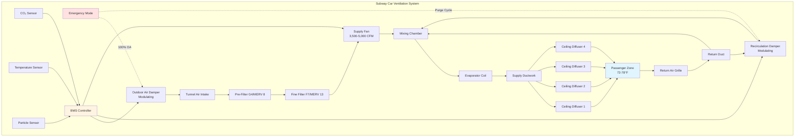

Subway car ventilation systems operate in the most demanding environment of any mass transit application. Unlike surface vehicles that draw outdoor air from clean atmospheric sources, subway cars must ventilate with tunnel air contaminated by brake dust, wheel-rail particulates, diesel exhaust (in mixed-use tunnels), and accumulated heat from train operations. The ventilation system must balance fresh air delivery for passenger health with filtration requirements to prevent particulate ingestion while maintaining thermal comfort in an environment where tunnel temperatures routinely exceed 100°F.

## Fresh Air Requirements

Transit ventilation standards establish minimum outdoor air delivery rates based on passenger loading and occupancy duration. ASHRAE Standard 62.1 and APTA guidelines specify fresh air provision for subway applications.

**Per-Passenger Ventilation Rate**

The fundamental ventilation equation for subway cars:

$$Q_{oa} = N \times V_{pp} + A \times V_{area}$$

Where:
- $Q_{oa}$ = outdoor air flow rate (CFM)
- $N$ = number of passengers
- $V_{pp}$ = ventilation rate per person (CFM/person)
- $A$ = car floor area (ft²)
- $V_{area}$ = area-based ventilation rate (CFM/ft²)

Transit standards typically specify 7-10 CFM per passenger for subway operations. For a standard 75-foot car with 150-passenger crush load capacity:

$$Q_{oa} = 150 \times 10 = 1,500 \text{ CFM minimum}$$

**CO₂ Concentration Control**

Carbon dioxide accumulation provides the primary indicator of ventilation adequacy. The steady-state CO₂ concentration relationship:

$$C_{ss} = C_{oa} + \frac{G}{Q_{oa}}$$

Where:
- $C_{ss}$ = steady-state CO₂ concentration (ppm)
- $C_{oa}$ = outdoor air CO₂ concentration (ppm)
- $G$ = CO₂ generation rate from occupants (CFM at CO₂ concentration)

Each passenger generates approximately 0.3 CFM of CO₂ at 1,000,000 ppm concentration (100% CO₂). For acceptable indoor air quality, subway car CO₂ levels should not exceed 1,000 ppm above outdoor levels. With tunnel air at 600-800 ppm CO₂ (elevated from outdoor atmospheric 400 ppm due to train exhaust and tunnel confinement):

$$Q_{oa} = \frac{N \times 0.3 \times 10^6}{1,000} = \frac{150 \times 0.3 \times 10^6}{1,000} = 45,000 \text{ CFM}$$

This theoretical requirement conflicts with practical limitations. Actual systems target 1,200-1,500 ppm peak CO₂ during crush loading, relying on station dwell time for air exchange.

## Ventilation System Architecture

Subway car ventilation employs multiple operating modes to accommodate varying tunnel conditions, passenger loads, and emergency scenarios.

**Ventilation Operating Modes**

| Mode | Outdoor Air % | Application | Tunnel Conditions | Fan Speed |
|------|--------------|-------------|-------------------|-----------|
| Maximum Fresh Air | 100% | Station dwell, emergency | Platform air < 85°F | 100% |
| Normal Ventilation | 30-50% | Standard operation | Tunnel air 85-100°F | 75-100% |
| Minimum Fresh Air | 15-20% | Extreme tunnel heat | Tunnel air > 100°F | 60-80% |
| Recirculation | 0-10% | Tunnel fire upstream | Contaminated tunnel air | 100% |
| Emergency Purge | 100% | Post-incident | Smoke clearance | 100% |

## Tunnel Air Quality Challenges

Subway tunnel air contains multiple contaminants that distinguish it from outdoor atmospheric air. Effective ventilation must address both gaseous and particulate pollutants.

**Particulate Matter Composition**

Tunnel particulate matter originates primarily from mechanical sources rather than combustion (except diesel-electric systems). Composition analysis shows:

| Particle Source | Size Range | Mass Fraction | Health Concern |
|----------------|------------|---------------|----------------|
| Brake wear (iron, copper, barium) | 0.1-10 μm | 35-45% | Respiratory irritation |
| Wheel-rail contact (iron oxide) | 0.5-50 μm | 25-35% | PM₁₀, PM₂.₅ |
| Track bed dust (silica, minerals) | 1-100 μm | 15-25% | Silicosis risk |
| Electrical arcing (carbon, metals) | 0.01-1 μm | 5-10% | Ultrafine particles |
| Skin, clothing fibers | 10-100 μm | 5-10% | Allergens |

Tunnel PM₁₀ concentrations frequently reach 200-500 μg/m³ during peak operations, compared to outdoor urban levels of 20-80 μg/m³. PM₂.₅ levels in tunnels measure 100-300 μg/m³, substantially exceeding EPA air quality standards.

**Gaseous Contaminants**

Beyond CO₂, tunnel air contains:

- **Ozone (O₃)**: 10-40 ppb from electrical arcing (outdoor levels 20-60 ppb)
- **Nitrogen oxides (NOₓ)**: 50-200 ppb in diesel-electric tunnels
- **Carbon monoxide (CO)**: 2-8 ppm in diesel operations (< 1 ppm electric-only)
- **Volatile organic compounds (VOCs)**: From lubricants, cleaners, materials outgassing

## Particle Filtration Systems

Subway car air filtration must remove particulate matter while maintaining sufficient airflow against the additional pressure drop imposed by filters.

**Filter Selection and Specification**

| Filter Stage | Filter Class | Efficiency | Particle Size | Pressure Drop | Replacement Interval |
|--------------|-------------|-----------|---------------|---------------|---------------------|
| Pre-filter | MERV 8 (G4) | 70-85% | > 3 μm | 0.15-0.25 in. w.g. | 1,000-1,500 hours |
| Primary filter | MERV 13 (F7) | 85-95% | > 1 μm | 0.35-0.50 in. w.g. | 1,500-2,500 hours |
| Fine filter (optional) | MERV 14-15 (F8-F9) | > 95% | > 0.3 μm | 0.50-0.80 in. w.g. | 2,000-3,000 hours |

MERV 13 filtration provides optimal balance between particulate capture efficiency and system airflow capacity. Higher-efficiency filters (MERV 15-16) reduce PM₂.₅ exposure by 60-80% but require larger filter housings and more powerful fans to overcome pressure drop.

**Filter Pressure Drop Impact**

The fan power requirement increases with filter loading:

$$P_{fan} = \frac{Q \times \Delta P_{total}}{6356 \times \eta_{fan}}$$

Where:
- $P_{fan}$ = fan power (hp)
- $Q$ = airflow rate (CFM)
- $\Delta P_{total}$ = total system pressure drop (in. w.g.)
- $\eta_{fan}$ = fan efficiency (typically 0.65-0.75)

For a 4,500 CFM supply fan with clean filter pressure drop of 0.40 in. w.g. and loaded filter pressure drop of 0.85 in. w.g., the power increase:

Clean filter: $P_{fan} = \frac{4,500 \times 0.40}{6356 \times 0.70} = 0.40$ hp

Loaded filter: $P_{fan} = \frac{4,500 \times 0.85}{6356 \times 0.70} = 0.86$ hp

This 115% power increase justifies filter monitoring systems that track pressure differential and alert maintenance personnel when replacement becomes necessary.

## Emergency Ventilation Modes

Emergency scenarios require immediate ventilation system reconfiguration to protect passenger safety during tunnel fires, smoke incidents, or hazardous material releases.

**Fire Mode Operation**

When fire detection systems activate or manual emergency controls engage:

1. **Outdoor air dampers close** to prevent smoke ingestion from tunnel
2. **Recirculation mode activates** at 100% return air
3. **Supply fans maintain operation** to pressurize car interior relative to tunnel
4. **Air conditioning continues** to maintain habitability during evacuation delays

Interior pressurization creates 0.05-0.15 in. w.g. positive pressure preventing smoke infiltration through door seals and ventilation openings. The required pressurization airflow:

$$Q_{press} = \frac{A_{leak} \times \sqrt{\Delta P}}{\rho}$$

Maintaining positive pressure requires 800-1,500 CFM depending on car construction tightness and door seal integrity.

**Smoke Purge Mode**

After evacuation or tunnel ventilation system smoke clearance:

1. **Outdoor air dampers open 100%**
2. **Supply fans operate at maximum speed**
3. **Emergency exhaust fans activate** (if equipped)
4. **Return air dampers modulate** to create through-ventilation

This configuration achieves 20-30 air changes per hour, purging residual smoke in 5-10 minutes.

## Ventilation Rate Standards and Performance Targets

Transit agencies establish ventilation performance specifications based on air quality targets, thermal comfort requirements, and energy efficiency considerations.

**Air Quality Targets**

| Parameter | Maximum Limit | Measurement Condition | Standard Reference |
|-----------|--------------|----------------------|-------------------|
| CO₂ concentration | 1,200 ppm | Peak loading, tunnel operation | ASHRAE 62.1 |
| PM₁₀ concentration | 150 μg/m³ | 8-hour time-weighted average | WHO guidelines |
| PM₂.₅ concentration | 50 μg/m³ | 8-hour time-weighted average | EPA NAAQS |
| Temperature | 78°F max | Design outdoor conditions | ASHRAE 55 |
| Relative humidity | 65% max | Thermal comfort limit | ASHRAE 55 |
| Air velocity (occupied zone) | 50 FPM max | Prevent draft complaints | ASHRAE 55 |

**Ventilation Performance Metrics**

| Metric | Target Value | Application |
|--------|-------------|-------------|
| Air changes per hour (ACH) | 12-18 ACH | Normal operation |
| Fresh air fraction | 20-40% | Mixed tunnel/recirculated |
| Supply air volume | 3,500-5,000 CFM | Per 75-ft car |
| Ventilation effectiveness | > 0.90 | Distribution uniformity |
| Filter efficiency (PM₂.₅) | > 85% | MERV 13 minimum |

## Coordination with Tunnel Ventilation Systems

Subway car ventilation does not operate independently but functions as one component in the integrated tunnel environmental control system. Tunnel ventilation fans, station exhaust systems, and emergency smoke extraction equipment collectively manage underground air quality.

**Tunnel Ventilation Effects**

Large tunnel ventilation fans (500,000-2,000,000 CFM capacity) create bulk airflow through subway tunnels at velocities of 500-1,200 FPM. This tunnel airflow:

- Supplies outdoor air to underground stations
- Removes heat rejected by train air conditioning systems
- Dilutes brake dust and particulate accumulation
- Provides emergency smoke extraction during tunnel fires

Moving trains create piston effect airflow proportional to train speed and tunnel cross-sectional area. A 10-car train moving at 40 mph in a confined tunnel generates approximately 800,000 CFM air displacement. This air movement either supplements or opposes mechanical tunnel ventilation depending on train direction and system configuration.

**Station Dwell Time Air Exchange**

During the 20-45 second station stop, doors open and massive air exchange occurs between car interior and station platform. Each door opening introduces 60-100 CFM of platform air through passenger movement and pressure equalization. With 8-12 doors per car, total door infiltration reaches 500-1,200 CFM during dwell time.

If platform air quality exceeds car interior conditions (cleaner, cooler, less contaminated), this infiltration provides beneficial ventilation. Systems often program outdoor air dampers to close during station dwell, allowing natural air exchange through doors rather than energy-intensive mechanical ventilation of hot tunnel air.

## Control Strategies and Monitoring

Modern subway ventilation systems employ sophisticated control algorithms integrating multiple sensor inputs to optimize air quality while minimizing energy consumption.

**Demand-Controlled Ventilation**

CO₂-based demand control modulates outdoor air damper position based on measured concentration:

$$\text{OA Damper Position} = \frac{C_{measured} - C_{target}}{C_{max} - C_{target}} \times 100\%$$

When measured CO₂ concentration exceeds target setpoint (typically 1,000 ppm), outdoor air damper opens incrementally. Temperature override prevents excessive outdoor air intake when tunnel temperatures exceed acceptable supply air limits.

**Air Quality Monitoring**

Continuous monitoring systems track:

- CO₂ concentration (NDIR sensors, ±50 ppm accuracy)
- PM₂.₅ concentration (optical particle counters)
- Temperature and relative humidity (multiple zones)
- Filter differential pressure (magnehelic gauges or pressure transducers)

Data logging enables trend analysis identifying air quality degradation patterns, filter loading rates, and ventilation system performance over time.

The integration of passenger health protection, energy efficiency, and operational reliability makes subway car ventilation among the most technically demanding HVAC applications. Successful systems balance competing requirements through intelligent control strategies and robust filtration while maintaining thermal comfort in extreme underground environments.
