Transit vehicle ventilation systems must provide adequate fresh air to maintain acceptable indoor air quality while accommodating extreme variations in passenger density, frequent door openings, and rapid load changes. Ventilation requirements balance occupant health, energy consumption, and system capacity constraints unique to mobile environments.

## Regulatory Framework and Standards

Transit vehicle ventilation is governed by multiple overlapping standards addressing public health, safety, and passenger comfort.

**ASHRAE Standard 62.1 Adaptation:**

While ASHRAE 62.1 primarily addresses stationary buildings, transit agencies apply its principles to mobile applications with modifications for operational realities. The standard's ventilation rate procedure forms the basis for transit-specific requirements.

**Federal Transit Administration (FTA) Requirements:**

- Minimum outside air delivery: 15 CFM per passenger under normal operating conditions
- CO₂ concentration limit: 1000 ppm above outdoor ambient during typical loading scenarios
- Emergency ventilation mode: 100% outside air capability for smoke or contamination events
- Ventilation continuity: Systems must maintain minimum fresh air during all operational modes including idle and low-speed operation

**APTA Standards:**

The American Public Transportation Association publishes recommended practices that supplement regulatory minimums:

- Fresh air delivery: 20-25 CFM per passenger for enhanced comfort
- Air exchange rate: 10-15 complete air changes per hour minimum
- Filtration: Minimum MERV 8 for recirculated air, MERV 11-13 recommended
- Temperature differential: Maximum 5°F variation within passenger compartment

**International Standards:**

European EN 13129 and EN 14750 standards specify comfort classes based on ambient conditions and establish minimum ventilation independent of cooling capacity, typically requiring 7-10 liters/second (15-21 CFM) per passenger.

## Ventilation Rate Calculations

Transit vehicle ventilation requirements depend on passenger capacity, vehicle volume, and operational duty cycle.

### Outside Air per Passenger Method

The fundamental requirement establishes minimum fresh air based on occupancy:

$$Q_{oa} = N_{pass} \times V_{pp} + Q_{infiltration}$$

Where:
- $Q_{oa}$ = total outside air requirement (CFM)
- $N_{pass}$ = passenger count (persons)
- $V_{pp}$ = ventilation rate per passenger (CFM/person)
- $Q_{infiltration}$ = infiltration credit from door openings (CFM)

Standard values for $V_{pp}$:
- Regulatory minimum: 15 CFM/person
- Recommended practice: 20 CFM/person
- Premium service: 25-30 CFM/person

### Air Changes Per Hour Method

An alternative approach specifies volumetric air exchange independent of instantaneous occupancy:

$$ACH = \frac{Q_{oa} \times 60}{V_{interior}}$$

Where:
- $ACH$ = air changes per hour (hr⁻¹)
- $Q_{oa}$ = outside air flow rate (CFM)
- $V_{interior}$ = interior cabin volume (ft³)

Target ACH values by vehicle type:

| Vehicle Type | Interior Volume | Minimum ACH | Recommended ACH |
|--------------|-----------------|-------------|-----------------|
| Standard Bus (40 ft) | 2,800-3,200 ft³ | 8-10 | 12-15 |
| Articulated Bus (60 ft) | 4,200-4,800 ft³ | 8-10 | 12-15 |
| Light Rail Car | 3,500-4,200 ft³ | 10-12 | 14-18 |
| Subway Car | 3,200-3,800 ft³ | 10-12 | 15-20 |
| Commuter Rail | 4,500-5,500 ft³ | 8-10 | 12-16 |

### CO₂-Based Ventilation Control

Demand-controlled ventilation adjusts outside air based on measured CO₂ concentration as a proxy for occupancy and air quality:

$$Q_{oa} = \frac{N \times G_{co2}}{\rho_{air} \times (C_{interior} - C_{ambient}) \times 10^6}$$

Where:
- $N$ = number of occupants
- $G_{co2}$ = CO₂ generation rate per person (0.012 CFM at moderate activity)
- $\rho_{air}$ = air density (0.075 lb/ft³ at standard conditions)
- $C_{interior}$ = target interior CO₂ concentration (ppm)
- $C_{ambient}$ = outdoor CO₂ concentration (typically 400-450 ppm)

For a target limit of 1000 ppm above ambient (1400-1450 ppm total):

$$Q_{oa} = N \times 15 \text{ CFM/person}$$

This derivation confirms the 15 CFM/person regulatory minimum.

## Ventilation Rates by Transit Mode

Different transit applications require varying ventilation strategies based on passenger density, dwell time, and operational patterns.

| Transit Mode | Passenger Capacity | Crush Load | Min OA (CFM) | Recommended OA (CFM) | ACH Target |
|--------------|-------------------|------------|--------------|---------------------|------------|
| Local Bus | 35-45 seated, 20-30 standing | 75 | 1,125 | 1,500 | 12-15 |
| Express Bus | 55-60 seated | 60 | 900 | 1,200 | 10-12 |
| Articulated Bus | 50-60 seated, 40-60 standing | 120 | 1,800 | 2,400 | 12-15 |
| Light Rail Vehicle | 60-80 seated, 80-120 standing | 200 | 3,000 | 4,000 | 14-18 |
| Subway Car | 40-50 seated, 100-150 standing | 200 | 3,000 | 4,000 | 15-20 |
| Commuter Rail | 90-110 seated, 20-40 standing | 130 | 1,950 | 2,600 | 12-16 |

## Air Quality Criteria

Ventilation systems must maintain acceptable concentrations of key air quality parameters.

**Carbon Dioxide Limits:**

CO₂ serves as the primary indicator for ventilation adequacy:

- Target concentration: 1000 ppm above outdoor ambient
- Maximum allowable: 1500 ppm above outdoor ambient (2000 ppm total in urban environments)
- Measurement location: Breathing zone height (48-60 inches) at mid-vehicle
- Response time: Ventilation must reduce elevated CO₂ to target within 10 minutes of passenger load reduction

**Particulate Matter:**

- PM₂.₅: Maintain below 35 μg/m³ when outdoor levels permit
- PM₁₀: Maintain below 150 μg/m³
- Filtration efficiency: Minimum 35% arrestance (MERV 8), recommended 50-65% (MERV 11-13)

**Volatile Organic Compounds:**

Interior materials contribute VOC emissions, particularly in new vehicles:

- Total VOC (TVOC): Target below 500 μg/m³
- Formaldehyde: Maximum 50 ppb
- Fresh air dilution provides primary control strategy

**Temperature and Humidity:**

While not strictly ventilation parameters, thermal comfort relates directly to air distribution:

- Temperature range: 68-76°F under design conditions
- Relative humidity: 30-60% when outdoor conditions permit
- Vertical temperature gradient: Maximum 5°F floor to ceiling

## System Architecture and Air Distribution

Transit ventilation systems integrate fresh air delivery with heating and cooling functions through various configurations.

```mermaid
graph TB
    subgraph "Transit Vehicle Ventilation System"
        OA[Outside Air Intake<br/>Variable Position<br/>Filtered MERV 8-13]
        RA[Return Air<br/>From Passenger Cabin]
        MIX[Mixing Chamber<br/>Damper Control]
        FILTER[Recirculation Filter<br/>MERV 11-13]
        EVAP[Evaporator Coil<br/>Cooling & Dehumidification]
        HEAT[Heating Coil<br/>Electric or Hydronic]
        FAN[Supply Fan<br/>Variable Speed 800-2000 CFM]
        DIST[Distribution Ductwork<br/>Overhead or Underfloor]
        DIFF[Supply Diffusers<br/>Linear or Circular]
        CABIN[Passenger Cabin<br/>2800-5500 ft³]
        CO2[CO₂ Sensors<br/>3-4 per vehicle]
        CTRL[Ventilation Controller<br/>BACnet/LonWorks]
        DOOR[Door Status Input]
        PASS[Passenger Counter]

        OA --> MIX
        RA --> MIX
        MIX --> FILTER
        FILTER --> EVAP
        EVAP --> HEAT
        HEAT --> FAN
        FAN --> DIST
        DIST --> DIFF
        DIFF --> CABIN
        CABIN --> RA

        CO2 -.->|Feedback| CTRL
        DOOR -.->|Status| CTRL
        PASS -.->|Count| CTRL
        CTRL -.->|Damper Position| MIX
        CTRL -.->|Fan Speed| FAN
    end

    style OA fill:#e1f5ff
    style CABIN fill:#fff4e1
    style CTRL fill:#f0e1ff
    style CO2 fill:#ffe1e1
```

**Fresh Air Intake Location:**

- Buses: Rooftop intake forward of HVAC unit to avoid diesel exhaust contamination
- Subway cars: Underfloor intake with tunnel air filtration
- Light rail: Rooftop or side intake depending on platform configuration
- Intake velocity: 300-500 FPM to prevent rain ingestion while maintaining adequate flow

**Economizer Operation:**

Modern transit HVAC systems employ air-side economizers to reduce mechanical cooling:

- Enthalpy-based control: Compare outdoor vs. return air enthalpy
- Temperature-based control: Increase outside air when $T_{outdoor} < T_{return} - 5°F$
- Maximum outside air mode: 80-100% during favorable conditions
- Lockout: Prevent economizer when outdoor temperature exceeds 65-70°F or humidity exceeds 70% RH

**Demand-Controlled Ventilation:**

CO₂-based DCV modulates outside air damper position:

$$D_{position} = D_{min} + \frac{(CO_2 - CO_{2,min}) \times (D_{max} - D_{min})}{(CO_{2,max} - CO_{2,min})}$$

Where:
- $D_{position}$ = damper position (% open)
- $D_{min}$ = minimum damper position (typically 20-30%)
- $D_{max}$ = maximum damper position (typically 80-100%)
- $CO_{2,min}$ = setpoint (typically 800-1000 ppm)
- $CO_{2,max}$ = upper limit (typically 1200-1500 ppm)

## Passenger Loading Scenarios

Transit ventilation must accommodate extreme variations in occupancy between off-peak and rush hour service.

**Design Loading Conditions:**

| Scenario | Occupancy Level | Duration | Ventilation Strategy |
|----------|-----------------|----------|----------------------|
| Off-peak | 10-20% capacity | 40-60% of service hours | Reduced outside air, economizer priority |
| Normal | 40-60% capacity | 25-35% of service hours | Standard ventilation rates |
| Peak | 80-100% capacity | 10-15% of service hours | Maximum outside air, reduced recirculation |
| Crush | 120-150% capacity | <5% of service hours | 100% outside air if capacity permits |

**Door Opening Impact:**

Frequent station stops introduce significant infiltration that can credit toward ventilation requirements:

$$Q_{door} = A_{door} \times V_{air} \times t_{open} \times f_{stops}$$

Where:
- $A_{door}$ = door opening area (typically 20-35 ft² per door pair)
- $V_{air}$ = air velocity through opening (100-300 FPM depending on vehicle pressurization)
- $t_{open}$ = average dwell time (15-45 seconds)
- $f_{stops}$ = stop frequency (stops/hour)

For a typical bus with 2 door pairs, 30-second dwell, and 20 stops/hour:

$$Q_{door} = 50 \text{ ft}^2 \times 200 \text{ FPM} \times 0.5 \text{ min} \times 20 = 100,000 \text{ ft}^3\text{/hr} = 1,667 \text{ CFM average}$$

This infiltration provides substantial outside air, though its contribution is intermittent and uncontrolled. Conservative designs credit only 30-50% of calculated infiltration toward ventilation requirements.

## Filtration Requirements

Transit vehicle filtration balances air quality improvement against airflow resistance and maintenance burden.

**Minimum Standards:**

- Outside air intake: MERV 8 (35% arrestance)
- Recirculation air: MERV 8-11 (35-65% efficiency)
- Filter replacement interval: 3-6 months or per differential pressure switch

**Enhanced Filtration:**

High-ridership systems increasingly specify MERV 13 or HEPA filtration:

- MERV 13: 50% efficiency at 0.3-1.0 μm, effective for most particulates
- MERV 14-15: 75-90% efficiency at 0.3-1.0 μm
- HEPA (H13): 99.95% at 0.3 μm, used in pandemic response applications

Pressure drop considerations:

| Filter Type | Initial ΔP | Final ΔP (Replacement) | Impact on Airflow |
|-------------|------------|------------------------|-------------------|
| MERV 8 | 0.15-0.25 in. w.g. | 0.50-0.60 in. w.g. | Minimal (<5%) |
| MERV 11 | 0.25-0.35 in. w.g. | 0.70-0.90 in. w.g. | Moderate (5-10%) |
| MERV 13 | 0.40-0.55 in. w.g. | 1.00-1.30 in. w.g. | Significant (10-15%) |
| HEPA | 0.80-1.20 in. w.g. | 2.00-2.50 in. w.g. | Severe (20-30%) |

High-efficiency filtration requires fan motor upsizing or variable-speed drives to maintain design airflow throughout filter service life.

## Performance Verification and Testing

Transit vehicle acceptance testing includes ventilation performance verification.

**Airflow Measurement:**

- Total supply airflow: Traverse measurement at supply duct or fan outlet
- Outside air fraction: CO₂ decay test or tracer gas dilution
- Distribution uniformity: Velocity measurements at 8-12 diffuser locations
- Acceptance criteria: ±10% of design airflow, ±15% diffuser-to-diffuser variation

**CO₂ Testing Protocol:**

1. Load vehicle to design occupancy with metabolic simulators (heat lamps) or test passengers
2. Operate with minimum outside air until CO₂ stabilizes at elevated level (>1500 ppm)
3. Return to normal ventilation mode and record CO₂ decay
4. Calculate effective ventilation rate from decay curve:

$$Q_{oa} = \frac{V \times ln\left(\frac{C_1 - C_{amb}}{C_2 - C_{amb}}\right)}{t_2 - t_1} \times 60$$

Where $V$ is cabin volume, $C_1$ and $C_2$ are concentrations at times $t_1$ and $t_2$.

**Thermal Comfort Validation:**

Under design load conditions (maximum occupancy, maximum ambient temperature):
- Measure dry-bulb temperature at 15-20 locations in passenger space
- Record relative humidity at 4-6 locations
- Verify all measurements within specified comfort range
- Document pull-down time from hot-soak condition

Transit vehicle ventilation requirements ensure passenger health and comfort through prescriptive minimum outside air rates, air quality limits, and filtration standards. Proper system design accounts for extreme occupancy variations, integration with thermal control, and mobile-environment challenges to deliver reliable performance across all operating conditions.
