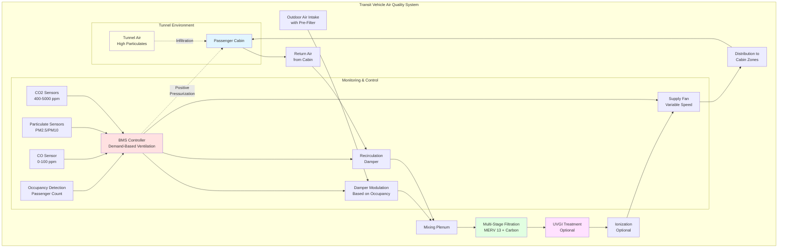

Air quality control in mass transit vehicles presents unique challenges due to high occupant density, variable ventilation rates, tunnel operation, and the need to balance passenger comfort with energy efficiency. Effective air quality management requires continuous monitoring, appropriate filtration, and optimized ventilation strategies.

## CO2 and Pollutant Monitoring

Carbon dioxide monitoring serves as the primary indicator of ventilation effectiveness in transit vehicles. The relationship between CO2 concentration and outdoor air supply follows the steady-state mass balance equation:

$$C_{ss} = C_o + \frac{N \cdot G}{Q}$$

where $C_{ss}$ is steady-state CO2 concentration (ppm), $C_o$ is outdoor CO2 concentration (typically 400-450 ppm), $N$ is number of occupants, $G$ is CO2 generation rate per person (0.3-0.5 CFM CO2 at sea level), and $Q$ is outdoor air ventilation rate (CFM).

For a fully loaded subway car with 150 passengers and 750 CFM outdoor air:

$$C_{ss} = 400 + \frac{150 \times 0.4}{750} = 400 + 80 = 480 \text{ ppm}$$

Transit systems monitor additional pollutants including:

- **Particulate Matter (PM2.5, PM10)**: Critical in tunnel environments where diesel particulates and brake dust accumulate
- **Volatile Organic Compounds (VOCs)**: From materials, cleaning products, and passengers
- **Carbon Monoxide (CO)**: Particularly important for diesel bus systems and underground operations
- **Nitrogen Oxides (NOx)**: From diesel engines and combustion processes
- **Ozone (O3)**: Can infiltrate from outdoor air in high-pollution areas

Real-time monitoring systems enable dynamic ventilation control, increasing outdoor air supply when pollutant levels exceed thresholds.

## Particulate Filtration Requirements

Transit vehicles require robust filtration to protect passengers from both outdoor and tunnel-generated particulates. Filtration efficiency directly impacts indoor particle concentration:

$$C_i = \frac{(1-\eta) \cdot Q_o \cdot C_o + S}{Q_o + Q_r + k \cdot V}$$

where $\eta$ is filter efficiency, $Q_o$ is outdoor air flow rate, $Q_r$ is recirculation air flow rate, $C_o$ is outdoor particle concentration, $S$ is internal generation rate, $k$ is deposition rate constant, and $V$ is vehicle volume.

Standard filtration requirements by transit mode:

| Transit Mode | Minimum Filter | Recommended Filter | Special Requirements |
|--------------|----------------|-------------------|----------------------|
| Subway/Metro | MERV 11 | MERV 13-14 | Activated carbon for tunnel gases |
| Light Rail | MERV 8 | MERV 11 | Electrostatic pre-filter option |
| Commuter Rail | MERV 8 | MERV 11 | High dust-holding capacity |
| Bus (Urban) | MERV 8 | MERV 11 | Diesel particulate filtration |
| Bus (Diesel) | MERV 11 | MERV 13 + Carbon | CO and NOx removal |

HEPA filtration (MERV 17+) is becoming standard for new subway cars operating in tunnels with high particulate loads, achieving 99.97% removal of particles ≥0.3 μm.

## Tunnel Air Quality Considerations

Underground transit systems face severe air quality challenges due to confined spaces, limited ventilation, and accumulation of:

- **Brake Dust**: Iron oxide particles from friction braking (PM10, PM2.5)
- **Wheel-Rail Wear**: Metallic particles from rolling contact
- **Diesel Particulates**: From maintenance vehicles and older rolling stock
- **Accumulated Pollutants**: Limited air exchange in tunnels concentrates contaminants

The tunnel-to-vehicle pressure differential governs infiltration rate:

$$Q_{inf} = C_d \cdot A \cdot \sqrt{\frac{2\Delta P}{\rho}}$$

where $C_d$ is discharge coefficient (0.6-0.7), $A$ is effective leakage area (ft²), $\Delta P$ is pressure differential (in. w.g.), and $\rho$ is air density (lb/ft³).

Strategies to minimize tunnel air infiltration:

- **Positive Pressurization**: Maintain 0.05-0.15 in. w.g. positive pressure inside vehicles
- **Air Curtains**: At door openings during station stops
- **Sealed Car Bodies**: Minimize infiltration through envelope leaks
- **Tunnel Ventilation Systems**: Dilute tunnel air with fresh air between trains

## Recirculation Ratios for Efficiency

Recirculation reduces energy consumption while maintaining acceptable air quality. The optimal recirculation ratio depends on occupancy and outdoor air quality:

$$\text{Recirculation Ratio} = \frac{Q_r}{Q_o + Q_r}$$

Typical recirculation ratios:

- **Low Occupancy** (0-25% capacity): 70-80% recirculation
- **Medium Occupancy** (25-75% capacity): 50-60% recirculation
- **High Occupancy** (75-100% capacity): 30-40% recirculation
- **Peak/Crush Load**: 20-30% recirculation (maximum outdoor air)

Energy savings from recirculation:

$$\text{Energy Savings} = Q_o \cdot \rho \cdot c_p \cdot (T_o - T_i) \cdot \frac{\text{RR}}{1-\text{RR}}$$

where RR is recirculation ratio, $T_o$ is outdoor temperature, and $T_i$ is indoor temperature.

For a subway car with 1000 CFM total airflow, 70% recirculation saves approximately:

$$Q_o = 300 \text{ CFM}, \, Q_r = 700 \text{ CFM}$$
$$\text{Energy Reduction} \approx 70\% \text{ vs. 100% outdoor air}$$

## Air Cleaning Technologies for Transit

Advanced air cleaning technologies supplement filtration:

**Ultraviolet Germicidal Irradiation (UVGI)**
- Upper-air or in-duct UV-C lamps (254 nm wavelength)
- Inactivates airborne pathogens (bacteria, viruses)
- Dose requirement: 1500-5000 μW·s/cm² for 90% inactivation
- Increasingly common post-pandemic for disease transmission control

**Photocatalytic Oxidation (PCO)**
- UV light activates titanium dioxide catalyst
- Oxidizes VOCs and odors into CO2 and water
- Effective for organic contaminant removal
- Limited particulate removal capability

**Ionization Systems**
- Bipolar ionization or needlepoint ionization
- Generates positive and negative ions that cluster around particles
- Enhances particle removal and reduces airborne pathogens
- Requires validation testing for ozone generation limits

**Activated Carbon Filtration**
- Essential for diesel buses and tunnel-operating trains
- Removes CO, NOx, VOCs, and odors
- Typical service life: 6-12 months depending on pollution levels
- Often combined with particulate filters in layered media

## Standards and Regulations for Transit IAQ

### International Standards

| Standard | Jurisdiction | Key Requirements |
|----------|--------------|------------------|
| EN 13129 | European Union | Railway applications—air conditioning for main line rolling stock |
| EN 14750 | European Union | Railway applications—air conditioning for urban and suburban rolling stock |
| IEEE 1653 | International | HVAC for rail transit vehicles (recommended practices) |
| ASHRAE 62.1 | North America | Ventilation for acceptable IAQ (adapted for transit) |
| ISO 16000 | International | Indoor air quality standards series |

### North American Requirements

**FTA (Federal Transit Administration) Guidelines**:
- Minimum outdoor air: 7.5 CFM/passenger or 0.25 air changes per minute
- CO2 limit: <2500 ppm in occupied spaces
- CO limit: <9 ppm (8-hour average), 35 ppm (1-hour peak)
- Particulate filtration: Minimum MERV 8, MERV 11+ recommended

**APTA (American Public Transportation Association) Standards**:
- APTA RT-HVAC-S-001: Standard for HVAC systems on rail transit vehicles
- Specifies performance testing, filtration requirements, and maintenance protocols
- Requires validation testing of air quality under design conditions

### Air Quality Targets

| Parameter | Target Level | Maximum Level | Measurement Method |
|-----------|--------------|---------------|-------------------|
| CO2 | <1000 ppm | 2500 ppm | NDIR sensor, continuous |
| PM2.5 | <25 μg/m³ | 75 μg/m³ | Optical particle counter |
| PM10 | <50 μg/m³ | 150 μg/m³ | Gravimetric or optical |
| CO | <5 ppm | 9 ppm (8-hr) | Electrochemical sensor |
| VOCs | <500 μg/m³ | 1000 μg/m³ | PID or FID sensor |
| Relative Humidity | 30-60% | 20-70% | Capacitive sensor |

Effective air quality control in mass transit requires integrated systems that monitor multiple parameters, adjust ventilation dynamically based on occupancy and pollution levels, and employ appropriate filtration and air cleaning technologies. As ridership returns post-pandemic and environmental concerns intensify, transit agencies are investing in advanced air quality management systems to ensure passenger health and comfort while maintaining operational efficiency.