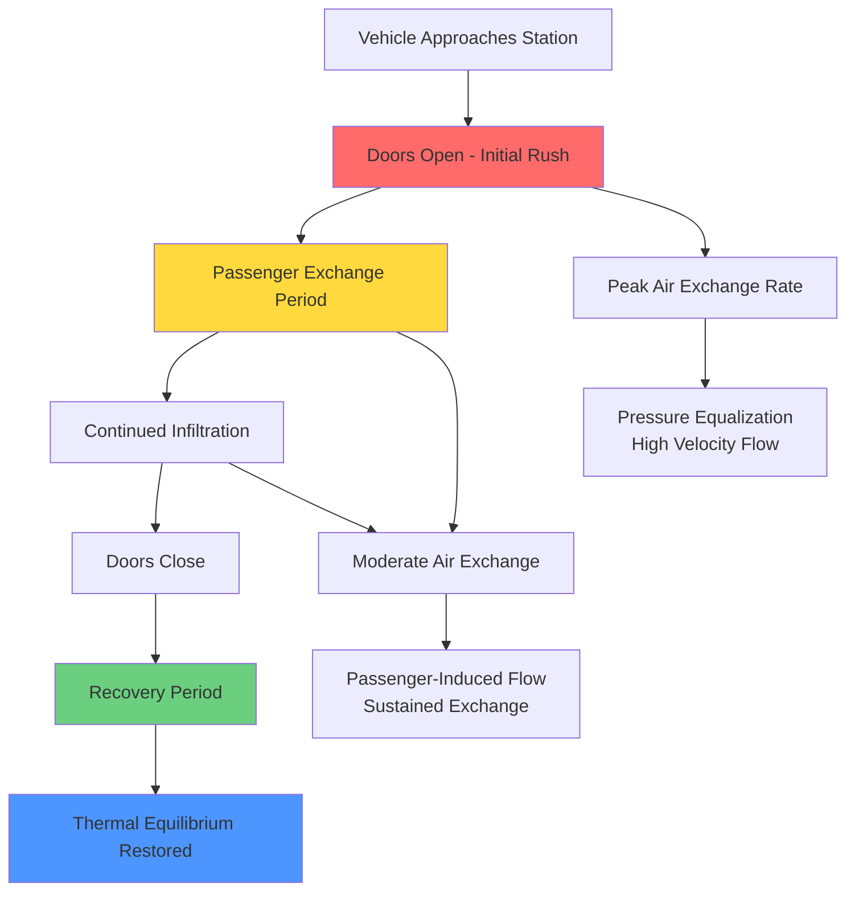

Door opening events represent a significant and often underestimated source of infiltration load in mass transit HVAC systems. Each door cycle introduces unconditioned station air into the vehicle, creating instantaneous thermal and humidity loads that the HVAC system must compensate for during subsequent travel segments.

## Air Exchange During Door Opening Events

The air exchange rate during door opening depends on the pressure differential between vehicle and station, door geometry, opening duration, and airflow patterns created by passenger movement. The infiltration volume per door opening event is:

$$Q_{inf} = A_{door} \cdot v_{avg} \cdot t_{open} \cdot E$$

Where $A_{door}$ is the door opening area (m²), $v_{avg}$ is the average air velocity through the opening (m/s), $t_{open}$ is the door open duration (s), and $E$ is the mixing effectiveness factor (typically 0.6-0.8).

The instantaneous sensible load from infiltration is:

$$q_s = \dot{m}_{air} \cdot c_p \cdot (T_{station} - T_{vehicle})$$

$$q_s = \rho \cdot Q_{inf} \cdot c_p \cdot \Delta T$$

For a typical subway car with 4 doors, each 1.5 m wide × 2.0 m high, open for 30 seconds with 1.0 m/s average air velocity:

$$Q_{inf} = 4 \times (1.5 \times 2.0) \times 1.0 \times 30 \times 0.7 = 252 \text{ m}^3$$

At summer conditions with $\Delta T$ = 15°C, this creates an instantaneous sensible load of approximately 3,150 kJ per stop.

## Station Dwell Time Impact on Loads

Dwell time directly correlates with total infiltration volume. Urban transit systems typically exhibit:

- **Express routes**: 15-20 seconds dwell time
- **Local service**: 30-45 seconds dwell time
- **Terminal stations**: 60-120 seconds dwell time
- **Peak hour congestion**: 45-90 seconds dwell time

The cumulative daily infiltration load becomes:

$$Q_{daily} = n_{stops} \cdot Q_{inf,avg} \cdot \rho \cdot c_p \cdot |\Delta T_{avg}|$$

Where $n_{stops}$ is the number of stops per operating day. For a subway car making 600 stops per day with average infiltration of 250 m³ per stop and $\Delta T$ = 12°C, the daily sensible load from infiltration alone is approximately 2,160 MJ (600 kWh).

## Infiltration Rates by Door Configuration

| Door Type | Opening Area (m²) | Typical Dwell (s) | Air Exchange Rate (m³/s) | Volume per Cycle (m³) | Relative Load |
|-----------|-------------------|-------------------|--------------------------|------------------------|---------------|
| Single Leaf Sliding | 3.0 | 30 | 2.1 | 63 | 1.0× |
| Double Leaf Sliding | 3.0 | 30 | 1.8 | 54 | 0.86× |
| Plug Door | 2.8 | 25 | 1.6 | 40 | 0.63× |
| Bi-Parting Center | 3.4 | 35 | 2.3 | 81 | 1.29× |
| Wide ADA Door | 4.5 | 40 | 3.2 | 128 | 2.03× |
| Vestibule Entry | 3.0 | 30 | 1.2 | 36 | 0.57× |

## Vestibule and Air Curtain Strategies

Vestibules create a thermal buffer zone that reduces direct infiltration into conditioned spaces. The vestibule effectiveness depends on its volume and door sequencing:

$$\eta_{vestibule} = 1 - \frac{Q_{into\_cabin}}{Q_{into\_vestibule}}$$

Well-designed vestibules achieve 40-60% reduction in cabin infiltration. Critical design parameters include:

**Vestibule Volume**: Minimum 3-4 m³ per door opening to provide adequate buffer capacity.

**Door Interlock Timing**: Sequential operation prevents simultaneous opening of both vestibule and cabin doors, maintaining the air lock function.

**Pressure Control**: Slight positive pressurization (5-10 Pa) of the vestibule relative to both cabin and station reduces bi-directional flow.

Air curtains provide an alternative or complementary strategy using high-velocity air jets (8-15 m/s) across the door opening. The sealing effectiveness is:

$$\eta_{curtain} = \frac{v_{jet}}{v_{jet} + v_{infiltration}}$$

Effective air curtain installation requires 250-400 W per linear meter of door width. For transit applications, air curtains are most practical on single-door commuter rail vestibules rather than multi-door subway cars due to power and space constraints.

## Recovery Time After Door Closing

After doors close, the HVAC system must restore cabin conditions. Recovery time depends on system capacity margin:

$$t_{recovery} = \frac{m_{air} \cdot c_p \cdot \Delta T_{rise}}{q_{cooling} - q_{baseline}}$$

Where $q_{cooling}$ is total cooling capacity and $q_{baseline}$ is the load from all other sources. Transit systems designed with 25-35% capacity margin above baseline loads can restore temperature within 2-4 minutes at typical inter-station travel times.

The temperature rise from a single door opening event is:

$$\Delta T_{rise} = \frac{Q_{inf} \cdot \rho \cdot c_p \cdot (T_{station} - T_{initial})}{m_{cabin} \cdot c_p}$$

For a 20,000 kg vehicle with 250 m³ infiltration and $\Delta T$ = 15°C, the instantaneous temperature rise is approximately 0.5-0.8°C, perceptible to passengers.

## Energy Impact of Frequent Stops

High-frequency service routes with closely-spaced stations experience the greatest energy penalty from door infiltration. The annual energy consumption attributable to infiltration is:

$$E_{annual} = n_{stops,annual} \cdot Q_{inf} \cdot \rho \cdot c_p \cdot \overline{|\Delta T|} \cdot \frac{1}{COP}$$

For a subway line operating 20 hours/day, 365 days/year with trains stopping every 90 seconds (800 stops per train per day):

- Annual stops per vehicle: 292,000
- Infiltration volume per stop: 250 m³
- Average temperature differential: 10°C
- System COP: 2.5

This yields approximately 120,000 kWh annual energy consumption per vehicle solely from door infiltration, representing 15-25% of total HVAC energy use on high-frequency urban routes.

## Design for High-Frequency Service Routes

Transit HVAC systems serving routes with stops every 1-2 minutes require specific design considerations:

**Oversized Capacity**: Provide 30-40% capacity margin above calculated steady-state loads to handle repeated infiltration pulses without cabin temperature drift.

**Rapid Response Controls**: Fast-acting thermostatic expansion valves and variable-speed compressors that respond within 10-15 seconds to sudden load changes.

**Thermal Mass Integration**: Strategic placement of thermal mass (water tanks, phase-change materials) to absorb temperature spikes and reduce cycling.

**Predictive Algorithms**: GPS-based control systems that anticipate upcoming station stops and pre-cool the cabin to compensate for expected infiltration.

**Door Optimization**: Minimize dwell time through improved passenger flow, platform screen doors at stations, and faster door actuation (reducing 30s dwell to 20s saves 33% infiltration per stop).

Platform screen doors, increasingly common in modern metro systems, virtually eliminate infiltration when properly sealed, reducing HVAC energy consumption by 20-30% while improving platform thermal comfort and safety.
