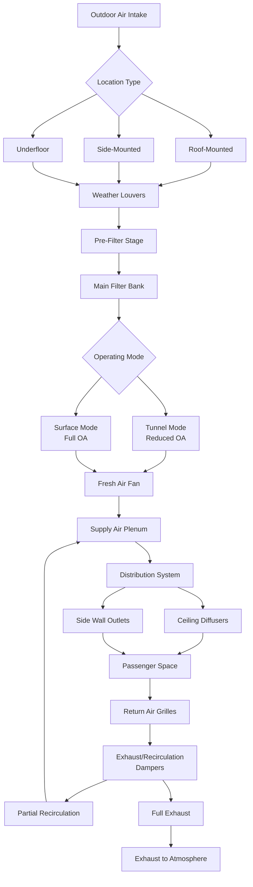

# Outdoor Air Requirements for Mass Transit HVAC Systems

Outdoor air ventilation in mass transit vehicles presents unique challenges compared to stationary buildings. Transit systems must provide adequate fresh air for highly variable occupancy levels while operating in diverse environments including tunnels, elevated structures, and at-grade sections. Proper outdoor air management directly impacts passenger comfort, air quality, and system energy efficiency.

## Per-Passenger Outdoor Air Standards

Transit vehicle ventilation follows guidelines from ASHRAE Standard 62.1 and 62.2, adapted for mobile applications. The recommended outdoor air rate per passenger varies by transit type and operating conditions.

The basic outdoor air requirement is expressed as:

$$Q_{oa} = N_{pass} \times V_{pp} + A_{floor} \times V_{area}$$

where $Q_{oa}$ is total outdoor air (CFM), $N_{pass}$ is the number of passengers, $V_{pp}$ is outdoor air per person (typically 7.5-15 CFM), $A_{floor}$ is floor area (ft²), and $V_{area}$ is area-based ventilation rate (0.06 CFM/ft²).

| Transit Type | Outdoor Air per Passenger | Design Occupancy | Total OA Requirement |
|--------------|---------------------------|------------------|----------------------|
| Subway/Metro Rail | 10 CFM/person | 150 passengers | 1,500 CFM |
| Light Rail Vehicle | 12 CFM/person | 80 passengers | 960 CFM |
| Commuter Rail | 15 CFM/person | 120 passengers | 1,800 CFM |
| Bus (City Transit) | 12 CFM/person | 40 passengers | 480 CFM |
| Bus (Coach/Intercity) | 15 CFM/person | 55 passengers | 825 CFM |
| Bus Rapid Transit | 10 CFM/person | 60 passengers | 600 CFM |

These values represent minimum requirements under normal operating conditions. Actual design values often incorporate safety factors of 1.2-1.5 to account for door openings, infiltration losses, and degraded filter performance.

## High Occupancy Design Considerations

Transit vehicles frequently operate at or above their seated capacity, with standing passengers significantly increasing occupant density. High occupancy conditions demand robust ventilation strategies.

Design approaches for crowded conditions include:

**Peak Load Calculations**: Base outdoor air systems on crush load conditions (typically 6-8 standing passengers per square meter) rather than seated capacity alone. This results in outdoor air systems 1.5-2.0 times larger than seated-only calculations would suggest.

**Distribution Uniformity**: With standing passengers blocking airflow paths, outdoor air must be introduced at multiple locations. Ceiling-mounted diffusers with high induction ratios provide better mixing than concentrated side-wall outlets.

**CO₂ Monitoring**: Real-time carbon dioxide sensing enables dynamic outdoor air adjustment. Target CO₂ levels of 800-1000 ppm above ambient indicate adequate ventilation even during peak crowding.

The effective ventilation rate accounting for mixing is:

$$Q_{eff} = Q_{oa} \times \epsilon_{mixing}$$

where $\epsilon_{mixing}$ is the ventilation effectiveness factor, typically 0.8-0.95 for well-designed transit systems.

## Outdoor Air Intake Location

Intake placement critically affects air quality and system performance. Design considerations vary by vehicle type and operating environment.

**Ground-Level Vehicles (Buses, Trams)**: Intakes mounted on the roof minimize exposure to street-level exhaust, dust, and pollutants. Roof-mounted intakes should be positioned:
- Minimum 1.5 meters above ground level
- Forward-facing to utilize ram air pressure during motion
- With louvers angled 30-45° to prevent rain ingress
- Away from exhaust outlets by at least 3 meters

**Rail Vehicles**: Underfloor intakes are common but expose the system to track-level contaminants, wheel dust, and brake particulates. Roof-mounted intakes provide cleaner air but require weather protection and may create aerodynamic drag. Side-mounted intakes at window level offer compromise solutions.

**Tunnel Operations**: Intakes must account for tunnel air quality, which may be degraded by:
- Diesel particulate matter (in non-electrified tunnels)
- Brake dust and rail grinding particles
- Reduced oxygen levels in long tunnels
- Temperature extremes (tunnels often 5-15°F warmer than surface)

## Filtration of Outdoor Air

Transit outdoor air requires aggressive filtration due to elevated particulate exposure and inability to control source air quality.

**Filter Selection**: Multi-stage filtration is standard:
- Pre-filters (MERV 8-10): Remove large particles, protect downstream equipment
- Main filters (MERV 13-14): Capture fine particulates, PM2.5, diesel soot
- Optional activated carbon: Absorb odors, VOCs, and gaseous pollutants

Rail systems in tunnels or diesel-contaminated environments often employ MERV 14 or HEPA filters (MERV 17-20) despite the increased fan energy penalty.

**Filter Maintenance**: Transit filter replacement intervals are substantially shorter than building applications:
- Pre-filters: 1-3 months
- Main filters: 3-6 months
- Heavy particulate environments: monthly replacement required

Differential pressure monitoring across filter banks triggers maintenance alerts, typically at 0.5-1.0 in. w.g. for final filters.

## Variable Outdoor Air for Efficiency

Fixed outdoor air delivery wastes energy during low occupancy periods. Variable outdoor air systems adjust ventilation to actual passenger loads.

**Demand-Controlled Ventilation (DCV)**: CO₂ sensors modulate outdoor air dampers to maintain target levels. The outdoor air damper position is controlled by:

$$POS_{damper} = POS_{min} + K \times (CO_2_{actual} - CO_2_{setpoint})$$

where $POS_{min}$ is minimum damper position (typically 20-30% for code compliance), $K$ is the control gain, and CO₂ values are in ppm.

**Occupancy-Based Control**: Automated passenger counting systems (APC) enable direct correlation between passenger load and ventilation:

$$Q_{oa,variable} = \max(Q_{min}, N_{counted} \times V_{pp})$$

This approach provides more responsive control than CO₂-based systems, which lag occupancy changes by 10-20 minutes.

Energy savings from variable outdoor air control typically range from 15-30% of total HVAC energy, with greater savings on lightly-loaded routes and during off-peak hours.

## Tunnel vs Surface Operation Differences

Operating environment dramatically affects outdoor air strategy. Rail systems must adapt ventilation to tunnel and surface conditions.

**Tunnel Operation Considerations**:

- **Reduced Air Quality**: Tunnel air contains elevated CO₂, particulates, and heat from previous trains. Outdoor air dampers may close partially, increasing recirculation ratios from typical 60-70% to 80-90%.

- **Temperature Differential**: Tunnels often run 10-20°F warmer than surface, reducing the cooling benefit of outdoor air and potentially requiring full recirculation during summer.

- **Pressure Transients**: Train passage through tunnels creates pressure waves affecting intake performance. Intakes require backdraft dampers and pressure relief to prevent system damage.

- **Ventilation Shaft Locations**: Outdoor air drawn near tunnel ventilation shafts benefits from shaft-supplied fresh air. Systems coordinate with tunnel ventilation schedules.

**Surface Operation**:

- **Weather Exposure**: Direct exposure to ambient conditions enables economizer operation during mild weather. Free cooling becomes available when $T_{outdoor} < T_{return} - 5°F$.

- **Maximum Outdoor Air**: Surface operation allows 100% outdoor air during moderate weather, improving air quality and reducing recirculation-related concerns.

- **Aerodynamic Effects**: Vehicle speed creates ram air pressure at forward-facing intakes, providing 0.05-0.15 in. w.g. boost at 60 mph, slightly reducing fan power requirements.

**Mode Switching**: Automated control systems detect tunnel entry/exit and adjust outdoor air dampers accordingly. Typical transition sequence:
1. Tunnel entry detected (GPS, track beacon, or light sensor)
2. Outdoor air dampers close to minimum position over 10-30 seconds
3. Recirculation increases to maintain total airflow
4. Upon tunnel exit, dampers reopen to surface settings over 30-60 seconds

This environmental adaptation maintains acceptable air quality while minimizing energy consumption and protecting passengers from tunnel-specific air quality issues.

## Conclusion

Outdoor air requirements for mass transit HVAC systems balance code compliance, passenger comfort, air quality, and energy efficiency under uniquely challenging conditions. Proper design accounts for extreme occupancy variations, diverse operating environments, and mobile platform constraints. Variable outdoor air strategies combined with robust filtration and environmentally-adaptive control deliver optimal performance across the full range of transit operating conditions.