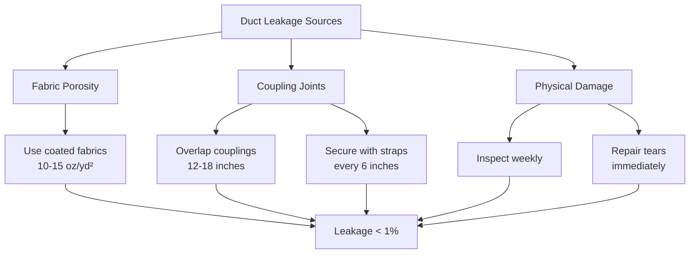

## Duct System Types

Mine auxiliary ventilation ducts transport air from fans to working faces through confined spaces where main ventilation cannot reach. The duct selection directly impacts delivered airflow, system pressure requirements, and operational costs.

### Flexible Ducting

**Layflat (Collapsible) Duct** consists of coated fabric material reinforced with steel wire or synthetic cord. When pressurized, the duct inflates to circular cross-section; when deflated, it collapses flat for transport. Common materials include:

- PVC-coated polyester (most common, -20°F to 150°F operating range)
- Neoprene-coated nylon (fire-resistant applications)
- Urethane-coated fabric (abrasion resistance)

**Rigid Spiral Duct** uses helically-wound steel with interlocking seams. While heavier and costlier than layflat, spiral duct provides:

- Lower friction losses (smoother internal surface)
- Resistance to collapse in negative pressure applications
- Extended service life in permanent installations

### Duct Type Comparison

| Parameter | Layflat Duct | Rigid Spiral Duct |
|-----------|--------------|-------------------|
| Friction factor (f) | 0.025-0.035 | 0.018-0.022 |
| Weight (lb/ft, 36" dia) | 1.2-1.8 | 4.5-6.0 |
| Transport volume ratio | 1:20 collapsed | 1:1 |
| Typical lifespan | 2-5 years | 10-15 years |
| Pressure limit | 8-12 in wg | 20-30 in wg |
| Cost ($/ft, 36" dia) | $8-12 | $25-40 |

## Duct Sizing Methodology

Duct diameter selection balances delivered airflow against fan power consumption. Undersized ducts create excessive pressure losses; oversized ducts increase leakage and material costs.

### Velocity-Based Sizing

MSHA recommendations suggest maintaining duct velocities between 2500-4000 fpm for optimal performance. The required diameter follows from continuity:

$$D = \sqrt{\frac{4Q}{\pi V}}$$

Where:
- $D$ = duct diameter (ft)
- $Q$ = required airflow (cfm)
- $V$ = design velocity (fpm)

**Example:** For $Q = 20{,}000$ cfm at $V = 3500$ fpm:

$$D = \sqrt{\frac{4 \times 20{,}000}{\pi \times 3500}} = \sqrt{7.28} = 2.70 \text{ ft} = 32.4 \text{ inches}$$

Standard size selection: 36-inch diameter duct.

### Pressure Loss Calculations

Total pressure loss in flexible duct systems exceeds predictions from smooth-pipe equations due to surface roughness and duct movement. The pressure drop per unit length is:

$$\Delta P_L = f \frac{L}{D} \frac{\rho V^2}{2}$$

Where:
- $\Delta P_L$ = pressure loss (lb/ft²)
- $f$ = friction factor (dimensionless)
- $L$ = duct length (ft)
- $D$ = duct diameter (ft)
- $\rho$ = air density (lb/ft³, typically 0.075)
- $V$ = velocity (ft/s)

**Converting to practical units (inches water gauge):**

$$\Delta P_{iwg} = \frac{f L V^2}{1097 D}$$

With $V$ in fpm and $D$ in feet.

For the previous example with 1000 ft of 36-inch layflat duct ($f = 0.030$):

$$\Delta P_{iwg} = \frac{0.030 \times 1000 \times 3500^2}{1097 \times 3} = 11.1 \text{ in wg}$$

### Friction Factor Considerations

Flexible duct friction factors exceed rigid duct values due to:

1. **Surface irregularities** from fabric weave and coating texture
2. **Duct sag** between suspension points creating turbulence
3. **Longitudinal wrinkles** in partially inflated sections
4. **Joint misalignment** at coupling connections

Actual friction factors vary with duct age, installation quality, and operating pressure. Use conservative values (upper range) for preliminary design.

## Leakage Allowances

Duct leakage occurs through fabric porosity, coupling gaps, and damage. MSHA 30 CFR 75.330 requires sufficient airflow delivery after accounting for leakage.

### Leakage Calculation

Empirical leakage rate for flexible duct:

$$Q_L = k P^{0.6} D L$$

Where:
- $Q_L$ = leakage airflow (cfm)
- $k$ = leakage coefficient (0.002-0.006 for new duct, 0.008-0.015 for aged duct)
- $P$ = duct static pressure (in wg)
- $D$ = diameter (inches)
- $L$ = length (hundreds of feet)

**Example:** 1000 ft of 36-inch duct at 8 in wg pressure, aged condition ($k = 0.010$):

$$Q_L = 0.010 \times 8^{0.6} \times 36 \times 10 = 0.010 \times 3.03 \times 360 = 10.9 \text{ cfm/100 ft}$$

Total leakage: $10.9 \times 10 = 109$ cfm (0.55% of 20,000 cfm delivery).

### Leakage Mitigation

## Duct Suspension Methods

Proper suspension prevents sagging, maintains airflow capacity, and reduces physical damage. MSHA mandates secure hanging to prevent falls onto workers or equipment.

### Suspension Spacing

Maximum spacing between hangers depends on duct diameter and material:

| Duct Diameter | Layflat (ft) | Rigid Spiral (ft) |
|---------------|--------------|-------------------|
| 18-24 inches | 8-10 | 12-15 |
| 30-36 inches | 6-8 | 10-12 |
| 42-48 inches | 5-6 | 8-10 |
| 54-60 inches | 4-5 | 6-8 |

### Hanger Types

1. **Cable slings** - Wire rope looped around duct, suspended from roof bolts
2. **Strap hangers** - Nylon or steel straps with adjustable tension
3. **Rigid brackets** - Steel brackets bolted to ribs (permanent installations)
4. **Monorail systems** - Overhead rail with sliding hangers (mobile applications)

**Critical installation practice:** Suspend duct at coupling joints to prevent separation under weight. Allow 2-3% sag between hangers to avoid tension damage.

## Damage Prevention

Physical damage reduces delivered airflow and creates safety hazards. Common failure modes include:

### Mechanical Impact

- Position duct minimum 12 inches from mobile equipment paths
- Install protective barriers at crossings
- Use spiral duct in high-traffic areas

### Thermal Exposure

Duct materials degrade when exposed to excessive heat:

- PVC-coated fabrics: Maximum 150°F continuous, 180°F intermittent
- Heat from blasting operations requires 24-hour cooling before duct re-entry
- Use high-temperature materials (silicone-coated fiberglass) near heat sources

### Chemical Attack

- Diesel particulate matter accumulates on duct interior (clean annually)
- Acid mine drainage contact degrades PVC coatings
- Use chemically-resistant materials in corrosive environments

## Duct Extension Procedures

MSHA 30 CFR 75.330(a)(1) requires duct termination within 50 feet of working face for coal mines. Metal/nonmetal mines follow similar state-specific requirements.

## Performance Verification

Delivered airflow verification confirms system adequacy:

1. **Measure velocity** at duct outlet using vane anemometer
2. **Calculate flow rate**: $Q = V \times A$ where $A = 0.785D^2$
3. **Compare to required ventilation** per MSHA Table 70-1
4. **Document measurements** monthly per 30 CFR 75.361

**Acceptance criteria:** Delivered airflow must meet or exceed calculated requirement including leakage allowance and face ventilation standard.

---

**Related Topics:**
- Auxiliary fan selection and sizing
- Mine ventilation planning
- Air quality monitoring requirements
