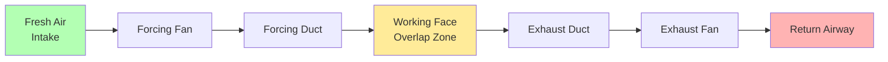

# Auxiliary Fan Placement in Mine Ventilation Systems

Proper auxiliary fan placement determines the effectiveness of face ventilation, methane dilution performance, energy efficiency, and worker safety. Fan positioning involves balancing aerodynamic efficiency against practical constraints of mining operations, equipment placement, and advance rates. The fundamental challenge lies in delivering adequate airflow to the working face while minimizing system resistance and avoiding recirculation patterns that compromise ventilation effectiveness.

## Forcing System Placement

### Fan Positioning Requirements

Forcing systems position the fan in the intake airway with ductwork extending toward the working face. The fan inlet draws fresh air from the main ventilation circuit, and the duct outlet discharges this air toward the face.

**Critical placement parameters:**

| Parameter | Typical Value | Rationale |
|-----------|---------------|-----------|
| Fan setback from face | 200-500 ft | Prevents dust/debris damage, allows equipment maneuvering |
| Duct outlet to face | 30-50 ft | Balances air velocity at face vs methane sweepback |
| Fan inlet clearance | 5-10 ft from rib | Maintains unrestricted intake, prevents recirculation |
| Mounting height | 6-12 inches above floor | Protects from water accumulation, equipment traffic |

The fan must install sufficiently far from the face to avoid damage from blasting operations, falling rock, and mobile equipment traffic. MSHA guidelines recommend minimum 200-foot setback in coal mines, with greater distances for aggressive mining methods.

### Duct Outlet Distance Analysis

The critical dimension in forcing systems is the distance from duct outlet to working face, termed the overlap distance. This parameter directly impacts airflow patterns and contaminant dilution effectiveness.

**Velocity decay relationship:**

$$V_x = V_0 \left(\frac{D}{D + 2\alpha x}\right)^2$$

Where:
- $V_x$ = air velocity at distance $x$ from duct outlet (fpm)
- $V_0$ = discharge velocity at duct outlet (fpm)
- $D$ = duct diameter (ft)
- $\alpha$ = jet expansion coefficient (0.10-0.14 for circular jets)
- $x$ = distance from duct outlet (ft)

**Example calculation:** A 36-inch diameter duct discharges 10,000 cfm. Calculate air velocity at the face located 40 feet from the duct outlet.

Discharge velocity: $V_0 = \frac{10,000}{(\pi/4)(3)^2 \times 144} = 1,415$ fpm

Face velocity with $\alpha = 0.12$:

$$V_{40} = 1,415 \left(\frac{3}{3 + 2(0.12)(40)}\right)^2 = 1,415 \left(\frac{3}{12.6}\right)^2 = 80 \text{ fpm}$$

This demonstrates the rapid velocity decay beyond the duct outlet, necessitating close duct positioning to maintain effective face velocities above 50-60 fpm required for methane dilution.

### Recirculation Prevention

Forcing systems risk short-circuiting where discharged air recirculates back to the fan inlet rather than sweeping the face. This occurs when insufficient pressure differential exists to drive airflow through the face area and into the return.

**Recirculation resistance:**

$$\Delta P_{recirc} = \frac{\rho V_{jet}^2}{2} \left(1 - \frac{A_{duct}}{A_{entry}}\right)^2$$

Where:
- $\Delta P_{recirc}$ = pressure barrier to recirculation (in. w.g.)
- $\rho$ = air density (lbm/ft³)
- $V_{jet}$ = duct outlet velocity (fpm)
- $A_{duct}$ = duct outlet area (ft²)
- $A_{entry}$ = entry cross-sectional area (ft²)

Recirculation becomes probable when fan inlet locates too close to the face or when inadequate general body airflow exists in the entry. Minimum fan setback of 50 feet typically prevents recirculation in standard development entries with 100-150 ft² cross-sections.

## Exhausting System Placement

### Fan and Duct Inlet Positioning

Exhausting systems remove contaminated air from the face, requiring the duct inlet to position near the working face to capture methane and dust before dilution. The fan installs at the opposite end, discharging into the return airway.

**Exhaust system placement criteria:**

| Parameter | Typical Value | Justification |
|-----------|---------------|---------------|
| Duct inlet to face | 10-20 ft | Capture methane before stratification |
| Duct inlet height | 6-12 inches below roof | Remove buoyant methane layers |
| Fan discharge location | Return airway | Prevent contaminated air reentry |
| Fan to face distance | 500-2,000 ft | Minimize negative pressure duct section |

The shorter duct inlet distance in exhausting systems reflects the need to capture methane near the liberation source. Methane released from freshly cut coal face rises to the roof due to buoyancy (methane density 0.042 lbm/ft³ versus air 0.075 lbm/ft³ at standard conditions).

### Methane Capture Effectiveness

Exhausting systems achieve superior methane capture when the duct inlet positions within the buoyant plume rising from the face. The critical capture distance depends on face height, methane emission rate, and entry ventilation velocity.

**Plume rise calculation:**

$$h_{plume} = 1.6 \left(\frac{Q_{CH_4} T_{excess}}{V_{entry} W_{entry}}\right)^{1/3}$$

Where:
- $h_{plume}$ = plume rise height above floor (ft)
- $Q_{CH_4}$ = methane emission rate (cfm)
- $T_{excess}$ = temperature excess of methane above ambient (°F)
- $V_{entry}$ = entry ventilation velocity (fpm)
- $W_{entry}$ = entry width (ft)

For typical coal mine conditions with 10-15 cfm methane emissions and 50-100 fpm entry velocities, the buoyant plume reaches roof height within 15-30 feet of the face. Positioning the exhaust duct inlet within this capture zone maximizes methane removal efficiency.

### Dead Heading Considerations

Dead heading occurs when the duct inlet positions too close to a dead end, causing excessive static pressure that reduces fan performance or induces flow reversal. The duct inlet must maintain adequate distance from the face to prevent this condition.

**Dead heading pressure:**

$$P_{dead} = \frac{\rho V_{inlet}^2}{2} \left(1 + K_{sudden}\right)$$

Where:
- $P_{dead}$ = dead heading pressure rise (in. w.g.)
- $V_{inlet}$ = duct inlet velocity (fpm)
- $K_{sudden}$ = sudden contraction loss coefficient (0.5 typical)

When the duct inlet approaches within 5-10 feet of a solid face, the kinetic energy of air approaching the inlet cannot fully convert to static pressure entering the duct. This creates a pressure barrier that reduces effective fan performance and may cause flow separation at the duct inlet.

**Minimum inlet setback:** $L_{min} = 1.5 \sqrt{A_{duct}}$

For a 48-inch diameter duct ($A_{duct} = 12.6$ ft²), minimum setback equals $1.5 \sqrt{12.6} = 5.3$ feet. Practical installations use 10-20 feet to provide operational margin.

## Overlap Ventilation Systems

### Dual Duct Configuration

Overlap systems employ two duct sections—one forcing and one exhausting—operating simultaneously to provide complete face coverage. This configuration maximizes methane control while delivering fresh air to the working face.

**Overlap zone characteristics:**
- Length: 20-50 feet between forcing outlet and exhaust inlet
- Airflow: Forcing discharge plus entry body airflow
- Pressure: Near atmospheric with balanced forcing/exhausting flows
- Purpose: Mixing zone for contaminant dilution before removal

### Pressure Balance Requirements

Overlap systems require careful pressure balancing to prevent airflow short-circuiting between ducts. The forcing fan static pressure must exceed exhaust fan suction pressure within the overlap zone.

**Pressure balance criterion:**

$$P_{forcing} - P_{friction,forcing} > P_{exhaust} + P_{friction,exhaust}$$

Imbalanced systems cause forcing air to enter the exhaust duct directly, bypassing the face area and negating ventilation effectiveness. Control strategies include:

- Variable frequency drives on either fan to modulate pressure
- Dampers at duct outlets/inlets for manual balance
- Pressure sensors monitoring overlap zone static pressure
- Interlock controls preventing single-fan operation

## Duct Leakage Impact on Placement

### Leakage Rate Quantification

Duct leakage represents air lost through joints, coupling gaps, and fabric damage. Leakage rates depend on duct construction, pressure differential, and installation quality.

**Exponential leakage model:**

$$Q_x = Q_0 e^{-\beta L}$$

Where:
- $Q_x$ = airflow at distance $L$ from fan (cfm)
- $Q_0$ = airflow at fan discharge or duct inlet (cfm)
- $\beta$ = leakage coefficient (per 100 ft)
- $L$ = duct length (ft)

**Typical leakage coefficients:**

| Duct Type | Construction | Leakage β (per 100 ft) |
|-----------|--------------|------------------------|
| Rigid steel | Welded joints | 0.001-0.002 |
| Rigid fiberglass | Gasketed flanges | 0.0015-0.003 |
| Flexible wire-reinforced | Banding clamps | 0.015-0.025 |
| Lay-flat fabric | Zipper/overlap | 0.025-0.040 |

**Example:** A forcing system uses 600 feet of flexible duct ($\beta = 0.02$) delivering 12,000 cfm at the fan. Calculate face airflow.

$$Q_{face} = 12,000 \times e^{-0.02 \times 6} = 12,000 \times 0.887 = 10,644 \text{ cfm}$$

Leakage reduces delivered airflow by 11.3%, requiring oversized fan selection or shorter duct runs to compensate.

### Leakage Direction Effects

Leakage direction differs between forcing and exhausting systems, producing distinct operational consequences:

**Forcing systems (positive pressure):** Air leaks outward from duct into surrounding entry. Delivered airflow reduces, but leaked air contributes to general entry ventilation. No contaminated air infiltration occurs.

**Exhausting systems (negative pressure):** Entry air infiltrates into duct through leaks. Captured face airflow reduces as infiltration dilutes the suction effect at the duct inlet. Methane control effectiveness degrades more severely than in forcing systems.

Exhausting systems suffer greater performance degradation from equivalent leakage rates, favoring rigid duct construction and meticulous maintenance to preserve capture effectiveness.

### Fan Placement to Minimize Leakage

Strategic fan positioning reduces the duct section operating under negative pressure (exhausting) or high positive pressure (forcing):

**Exhausting systems:** Position fan closer to face, minimizing negative pressure duct length. Fan discharge section operates at low positive pressure with minimal leakage impact.

**Forcing systems:** Fan location flexibility exists since entire duct operates at positive pressure. Position fan to minimize total duct length and maximize advancement convenience.

## Mobile Fan Systems

### Trackless Mining Applications

Metal and nonmetal mines using trackless equipment require mobile auxiliary fans that relocate with mining operations. These systems mount on wheeled chassis or skids for repositioning.

**Mobile system considerations:**
- Quick-disconnect duct couplings enable rapid relocation
- Electrical supply via trailing cable or portable substations
- Fan capacity 5,000-25,000 cfm typical for development headings
- Repositioning frequency every 20-100 feet of advance

Mobile fans position 100-300 feet from the active face, advancing as development proceeds. The fan remains outside the blast exclusion zone while maintaining effective face ventilation through moderate duct overlap.

## Dead Heading Prevention

### Dead Heading Mechanism

Dead heading describes the condition where a fan operates against a closed or severely restricted discharge. In auxiliary ventilation, dead heading occurs when:

1. Duct outlet obstructed by rock fall, equipment, or collapsed duct section
2. Duct inlet positioned flush against dead end face (exhausting systems)
3. Excessive duct length causes pressure rise exceeding fan surge point
4. Backdraft damper inadvertently closes during operation

**Performance impact:** Dead heading forces fan operation at zero flow on the fan curve, corresponding to maximum pressure (shutoff head) and minimum efficiency. Motor current increases 20-50% due to air churning and recirculation within the fan housing.

### Dead Heading Detection

**Pressure monitoring:** Static pressure sensors at fan discharge (forcing) or inlet (exhausting) detect abnormal pressure rise indicating flow restriction.

$$P_{DH} > 1.5 \times P_{design}$$

When measured static pressure exceeds 1.5 times design pressure, dead heading investigation should initiate.

**Current monitoring:** Motor current rise above rated full-load amps indicates potential dead heading:

$$I_{motor} > 1.2 \times I_{rated}$$

**Airflow monitoring:** Velocity sensors in ductwork detect flow reduction or reversal indicating system blockage.

### Prevention Strategies

**Proper placement spacing:** Maintain minimum duct outlet/inlet distances from face per overlap requirements (10-50 feet depending on system type).

**Duct inspection protocols:** Regular visual inspection identifies collapsed sections, obstructions, or damage requiring repair.

**Pressure relief provisions:** Automatic backdraft dampers or pressure relief doors prevent excessive pressure buildup during transient conditions.

**Monitoring systems:** Continuous pressure, flow, and current monitoring with alarm setpoints alert operators to abnormal conditions before equipment damage occurs.

## Regulatory Compliance

### MSHA Placement Requirements

**30 CFR 75.323 - Coal mine ventilation:**
- Forcing systems: Duct outlet within 50 feet of face or 100 feet if approved in ventilation plan
- Exhausting systems: Duct inlet within 10 feet of face
- Duct repair: Damaged sections replaced immediately to maintain effectiveness

**30 CFR 57.8520 - Metal/nonmetal ventilation:**
- Auxiliary ventilation extends to within 50 feet of all working faces
- Alternative configurations require engineering analysis and approval

### Documentation Requirements

Ventilation plans submitted to MSHA must specify:
- Auxiliary fan quantities, types, and placement locations
- Duct specifications including diameter, material, and typical lengths
- Overlap distances maintained for forcing and exhausting systems
- Inspection and maintenance schedules
- Monitoring equipment and alarm setpoints

Annual ventilation surveys verify actual fan placements match approved ventilation plan specifications, with deviations requiring plan amendments before implementation.

## Optimization Strategies

**Minimize duct length:** Position fans to reduce total duct length while maintaining safe setback from blasting and equipment operations. Each 100-foot reduction decreases system resistance 10-15%.

**Rigid duct near face:** Use rigid steel or fiberglass duct for final 100-200 feet nearest face where leakage most severely impacts delivered airflow. Flexible duct acceptable for upstream sections.

**Modular fan positioning:** Design fan mounting systems enabling 50-100 foot repositioning increments, balancing advancement frequency against optimal placement distance.

**Computational fluid dynamics:** Model complex entry geometries, equipment obstructions, and airflow patterns to optimize fan and duct placement for specific mine layouts.

Auxiliary fan placement represents a critical design decision balancing aerodynamic efficiency, operational flexibility, safety requirements, and regulatory compliance. Proper placement ensures effective face ventilation throughout mine development while minimizing energy consumption and maintaining worker protection from hazardous atmospheres.
