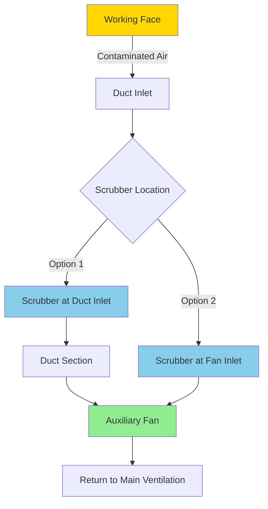

## Forcing vs Exhausting Auxiliary Ventilation

Auxiliary ventilation systems in underground mining operations employ two fundamental configurations: forcing and exhausting. The selection between these methods determines airflow patterns, contaminant control effectiveness, and operational constraints at the working face.

### Physical Principles of Operation

**Forcing systems** deliver fresh air through rigid or flexible ductwork from the last through connection to the working face. The fan creates positive pressure within the duct, establishing a jet of clean air that impinges on the face and entrains return air as it travels back through the heading.

**Exhausting systems** extract contaminated air from the working face through ductwork, creating negative pressure that draws fresh air from the last through connection along the heading floor and ribs.

The momentum exchange in forcing systems follows:

$$\dot{m}_{\text{jet}} v_{\text{jet}} = \dot{m}_{\text{entrained}} v_{\text{mixed}}$$

Where jet velocity decreases with distance from the duct outlet according to:

$$\frac{v(x)}{v_0} = 6.2\sqrt{\frac{D}{x}}$$

For exhausting systems, the capture velocity at distance $x$ from the duct inlet:

$$v_{\text{capture}}(x) = \frac{Q}{A_{\text{face}} + \pi x^2}$$

### System Comparison

| Parameter | Forcing | Exhausting |
|-----------|---------|------------|
| Face air quality | Moderate - dilution dependent | Superior - source capture |
| Duct-to-face distance | 10-50 ft typical | 5-15 ft typical |
| Methane layering control | Poor - buoyancy effects | Excellent - roof capture |
| Diesel particulate removal | Fair - dilution only | Excellent with scrubber |
| Recirculation risk | High if improperly positioned | Low - negative pressure |
| Duct damage susceptibility | Moderate | High - near blast/operations |
| Installation complexity | Low | Moderate |
| Regulatory considerations | MSHA 75.325 compliance | MSHA 75.325, 75.326 compliance |

### Forcing Ventilation Characteristics

**Advantages:**
- Duct remains distant from face operations, reducing damage
- Simpler installation and repositioning
- Lower capital cost for duct system
- Effective for hot, dry conditions requiring cooling

**Disadvantages:**
- Contaminants travel through occupied zone before dilution
- Increased duct-to-face distance reduces face air velocity
- Recirculation zones develop if jet impingement angle exceeds 15-20° from perpendicular
- Methane can accumulate at roof due to buoyancy ($\Delta\rho/\rho \approx 0.45$ for CH₄)

The effective ventilation distance for forcing systems:

$$L_{\text{max}} = 6.2D\sqrt{\frac{v_0}{v_{\text{min}}}}$$

Where $v_{\text{min}}$ is the minimum acceptable face velocity (typically 50-100 fpm per MSHA standards).

### Exhausting Ventilation Characteristics

**Advantages:**
- Contaminants captured at source before entering worker breathing zone
- Effective methane control through roof-level capture
- Compatible with dust scrubbers and filtration equipment
- Superior for hot, humid conditions (removes heat at source)

**Disadvantages:**
- Duct positioned near face requires frequent repositioning
- Higher damage and maintenance costs
- Flow short-circuiting if inlet too close to last through
- Negative pressure can draw strata gases from formation

The capture efficiency for roof-level methane:

$$\eta_{\text{capture}} = 1 - e^{-\frac{v_{\text{roof}}A_{\text{roof}}}{Q_{\text{CH_4}}}}$$

### Overlap Ventilation Systems

Overlap systems employ both forcing and exhausting simultaneously during the transition from one duct length to another, preventing ventilation interruption during duct extension.

**Overlap operational sequence:**

1. Primary system ventilates face (forcing or exhausting)
2. Secondary system installed and started before primary shutdown
3. Both systems operate during transition (5-15 minutes)
4. Primary system shut down and repositioned
5. Secondary becomes primary for next cycle

The pressure differential during overlap:

$$\Delta P_{\text{overlap}} = \Delta P_{\text{forcing}} + \Delta P_{\text{exhausting}} - \Delta P_{\text{interference}}$$

Interference effects reduce combined system efficiency by 15-30% due to competing pressure fields.

### Scrubber Integration with Exhausting Systems

Exhausting configurations enable integration of dust scrubbers (filter systems) at the duct inlet or fan inlet, removing diesel particulate matter (DPM) and respirable dust.

Scrubber pressure drop must be included in fan selection:

$$\Delta P_{\text{total}} = \Delta P_{\text{duct}} + \Delta P_{\text{scrubber}} + \Delta P_{\text{fittings}}$$

For HEPA-grade filtration: $\Delta P_{\text{scrubber}}$ = 4-8 in. w.g. clean, 10-15 in. w.g. loaded.

### Duct Placement Considerations

**Forcing System Placement:**
- Duct outlet 10-50 ft from face depending on fan capacity
- Centerline aim point 4-6 ft above floor at face center
- Avoid impingement angles > 20° to prevent recirculation
- Mount duct to rib or roof to prevent equipment damage

**Exhausting System Placement:**
- Duct inlet 5-15 ft from face (closer for methane control)
- Inlet positioned at roof level for stratified gas capture
- Minimum 30 ft from last through to prevent short-circuiting
- Bell-mouth inlet reduces entrance losses by 60-70%

The short-circuit airflow fraction:

$$f_{\text{short}} = \frac{1}{1 + (L_{\text{duct}}/D_{\text{duct}})^2(A_{\text{heading}}/A_{\text{duct}})}$$

### Recirculation Control

Recirculation occurs when return air re-enters the ventilation system intake, reducing fresh air delivery to the working face.

**Forcing system recirculation mechanisms:**
1. Jet impingement creates toroidal vortex at face
2. Inadequate duct-to-face distance allows jet diffusion
3. Obstructions deflect air jet toward duct outlet

**Control methods:**
- Maintain minimum duct-to-face distance per fan manufacturer specifications
- Position duct to direct air perpendicular to face
- Remove obstructions within jet expansion cone (approximately 15° half-angle)
- Smoke tube testing to identify recirculation zones

**Exhausting system recirculation:**
- Short-circuiting between last through and duct inlet
- Induced by excessive duct inlet proximity to fresh air source

**Control methods:**
- Maintain minimum 30 ft separation (or $L > 3D_{\text{heading}}$)
- Install flow straighteners at last through connection
- Barrier curtains to direct airflow along floor before reaching inlet

The recirculation fraction for forcing systems:

$$R = \frac{C_{\text{outlet}} - C_{\text{fresh}}}{C_{\text{face}} - C_{\text{fresh}}}$$

Where $C$ represents tracer gas concentration. MSHA requires $R < 0.25$ for compliance with 75.325.

### Regulatory Framework

MSHA regulations (30 CFR Part 75) govern auxiliary ventilation:

- **75.325**: Requires air reaching working face to contain at least 19.5% oxygen, not more than 0.5% CO₂, and maintain quality standards
- **75.326**: Air quantity requirements based on face advancement rate and methane liberation
- **75.330**: Face ventilation controls and air velocity requirements (minimum 60 fpm in intake)

System selection must consider the regulatory requirement for continuous ventilation during all face operations, influencing overlap system implementation and redundancy planning.

### Selection Methodology

**Choose forcing when:**
- Low methane liberation (< 0.5 cfm/ton production)
- High advancement rates requiring frequent duct repositioning
- Limited capital budget for duct systems
- Hot, dry conditions where air cooling beneficial

**Choose exhausting when:**
- Gassy conditions (> 1.0 cfm/ton methane)
- DPM levels approaching permissible exposure limit
- Regulatory emphasis on working face air quality
- Integration with scrubber systems required

**Choose overlap when:**
- Zero-downtime ventilation mandatory
- MSHA enforcement history indicates ventilation gaps
- Production rates justify system complexity costs

The decision matrix should incorporate site-specific factors including heading dimensions, production equipment, thermal conditions, and strata gas characteristics to optimize worker protection and operational efficiency.
