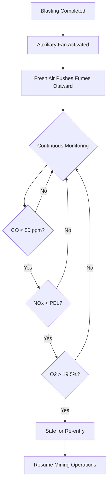
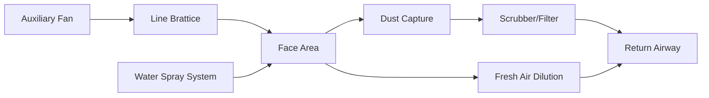

Local ventilation delivers fresh air directly to active working faces and dead-end entries where the primary ventilation system cannot reach. This targeted airflow removes contaminants at their source, clears blasting fumes, and maintains breathable atmospheres in advancing headings. The physics governing local ventilation involves momentum transfer from auxiliary fans through ducting systems, diffusion of contaminants within the working space, and the interplay between supplied airflow and leakage losses.

## Face Ventilation Requirements

The minimum airflow quantity at a working face depends on contaminant generation rates, allowable concentration limits, and the geometry of the dead-end entry. MSHA regulations (30 CFR 75.325) mandate minimum air velocities and quantities based on specific operations.

**Minimum airflow calculation:**

$$Q_{\text{face}} = \frac{G}{C_{\text{max}} - C_{\text{ambient}}}$$

Where:
- $Q_{\text{face}}$ = required airflow at face (cfm)
- $G$ = contaminant generation rate (mass/time)
- $C_{\text{max}}$ = maximum allowable concentration (ppm or mg/m³)
- $C_{\text{ambient}}$ = background concentration in supply air

For diesel equipment operations, the airflow requirement increases substantially:

$$Q_{\text{diesel}} = 100 \times \text{HP}_{\text{total}}$$

This empirical relationship (100 cfm per brake horsepower) accounts for diesel particulate matter, nitrogen oxides, and carbon monoxide production from combustion processes.

### Working Face Airflow Standards

| Operation Type | Minimum Airflow | Regulatory Basis |
|----------------|-----------------|------------------|
| Development heading (no equipment) | 3,000 cfm | 30 CFR 75.325(a) |
| Heading with diesel equipment | 100 cfm/HP | 30 CFR 75.325(e) |
| Blasting operations | Sufficient for fume clearance in 30 min | 30 CFR 75.323 |
| Mechanized mining unit | 9,000 cfm minimum | 30 CFR 75.325(a)(1) |

## Blasting Fume Clearance Time

After blasting, toxic gases including nitrogen oxides (NOₓ), carbon monoxide (CO), and carbon dioxide (CO₂) disperse throughout the dead-end entry. The clearance time depends on the ventilation effectiveness and mixing characteristics.

**Theoretical clearance time (well-mixed assumption):**

$$t_{\text{clear}} = -\frac{V}{Q} \ln\left(\frac{C_{\text{final}}}{C_{\text{initial}}}\right)$$

Where:
- $t_{\text{clear}}$ = time to reach safe concentration (minutes)
- $V$ = volume of dead-end entry (ft³)
- $Q$ = ventilation airflow rate (cfm)
- $C_{\text{final}}$ / $C_{\text{initial}}$ = concentration ratio

MSHA requires re-entry only after atmosphere testing confirms concentrations below permissible exposure limits. Conservative practice assumes 3-5 air changes for adequate clearance, yielding:

$$t_{\text{practical}} = \frac{3V}{Q} \text{ to } \frac{5V}{Q}$$

### Blasting Fume Clearance Process

## Line Brattice Systems

Line brattice (ventilation tubing or ductwork) conveys air from the auxiliary fan to the working face. The system operates in either forcing mode (positive pressure) or exhaust mode (negative pressure), each with distinct advantages.

**Forcing ventilation:**
- Delivers fresh air directly to face
- Maintains positive pressure at working area
- Dust and fumes migrate toward return airway
- Duct leakage results in air loss before reaching face

**Exhaust ventilation:**
- Captures contaminants at source
- Creates negative pressure at face
- Better fume control during blasting
- Duct leakage draws in potentially contaminated air

### Duct Leakage and Pressure Drop

Air leakage through duct seams and fabric reduces effective airflow:

$$Q_x = Q_0 e^{-kL}$$

Where:
- $Q_x$ = airflow at distance $L$ from fan (cfm)
- $Q_0$ = airflow at fan discharge (cfm)
- $k$ = leakage coefficient (per 100 ft)
- $L$ = duct length (100 ft units)

Typical leakage coefficients range from 0.015 to 0.05 per 100 ft for flexible duct in good condition.

Friction losses in ductwork follow the Darcy-Weisbach relationship:

$$\Delta P = \frac{f L \rho v^2}{2D}$$

Where:
- $\Delta P$ = pressure drop (Pa or in. w.g.)
- $f$ = friction factor (dimensionless)
- $L$ = duct length (ft)
- $\rho$ = air density (lb/ft³)
- $v$ = air velocity (ft/min)
- $D$ = duct diameter (ft)

## Dust Suppression Integration

Effective face ventilation integrates with water spray systems to suppress respirable dust. The ventilation airflow pattern must not disrupt spray curtains or carry dust past the working face into the general body.

**Capture velocity for dust control:**

$$v_{\text{capture}} = \frac{Q}{A_{\text{face}}}$$

Minimum capture velocities range from 50-100 fpm for coal dust, with higher values required for vigorous mechanical operations.

### Combined Ventilation and Dust Control Strategy

## Dead-End Entry Regulatory Requirements

MSHA regulations strictly control ventilation in dead-end entries to prevent accumulation of methane and other hazardous gases.

**30 CFR 75.325(a):** Line brattice, tubing, or other approved methods must direct air to within 10 feet of the working face in bituminous coal mines.

**30 CFR 57.8520 (metal/nonmetal):** Minimum 200 cfm must reach the face of dead-end workings where persons work or travel.

**Distance limitations:**
- Duct terminus to face: ≤10 ft (coal mines)
- Maximum dead-end length without ventilation: 20 ft

### Compliance Monitoring Requirements

| Parameter | Frequency | Regulatory Reference |
|-----------|-----------|---------------------|
| Airflow quantity at face | Each shift | 30 CFR 75.325(d) |
| Methane concentration | Continuous (in coal) | 30 CFR 75.323 |
| Oxygen percentage | Before each shift | 30 CFR 75.323 |
| Duct condition inspection | Weekly | 30 CFR 75.370 |

## System Design Considerations

Proper local ventilation system design accounts for:

1. **Fan selection:** Pressure capability must overcome duct friction losses and discharge velocity requirements
2. **Duct diameter:** Larger diameters reduce friction but increase cost and handling difficulty
3. **Duct material:** Flexible fabric for temporary applications, rigid steel for permanent installations
4. **Mounting location:** Fan positioned outside hazardous zone with intake drawing from fresh air course
5. **Overlap ventilation:** Establishing new duct system before removing old system during heading advance

The efficacy of local ventilation fundamentally depends on maintaining continuous airflow, minimizing leakage losses, and positioning duct discharge to maximize contaminant capture at the source. Regular inspection and maintenance of auxiliary fan systems constitute essential elements of mine safety management.
