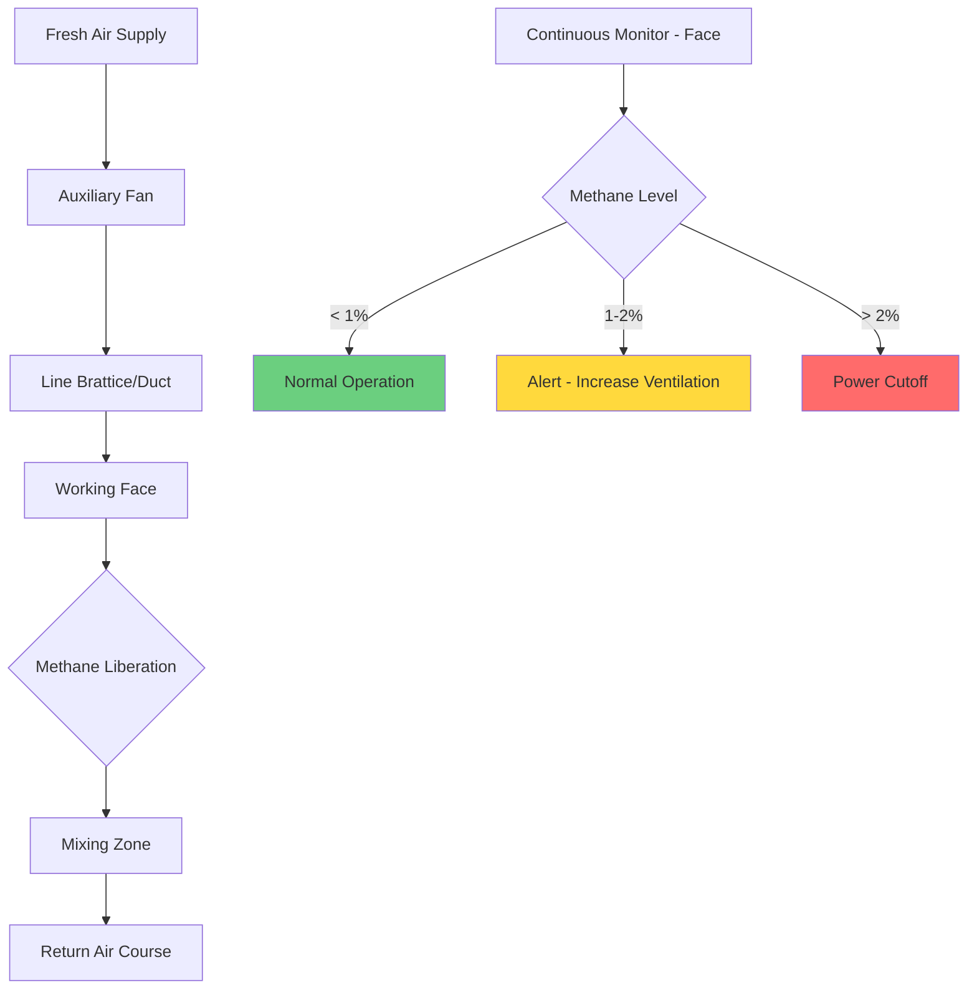
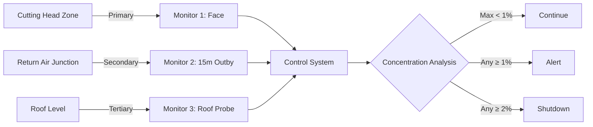

## Overview

Methane dilution ventilation represents the primary defense against explosive atmospheres in underground coal mining operations. This application differs fundamentally from comfort HVAC through its life-safety criticality: inadequate ventilation creates conditions where methane concentrations reach the lower explosive limit (LEL) of 5% by volume, with MSHA mandating intervention at 1% and automatic power cutoff at 2%.

The physics governing methane dilution involves continuous mixing of fresh air with methane-laden return air, maintaining concentrations below regulatory thresholds through sufficient volumetric flow. Unlike contaminant dilution in industrial ventilation, methane's density (0.554 kg/m³ at standard conditions versus 1.204 kg/m³ for air) creates buoyancy-driven stratification that complicates mixing analysis.

## Methane Liberation Rate Fundamentals

### Liberation Mechanisms

Methane releases from coal seams through three distinct physical processes:

1. **Desorption**: Methane molecules bound to coal micropores release as mining reduces overburden pressure. The Langmuir isotherm describes this equilibrium:

$$V = \frac{V_L P}{P_L + P}$$

where $V$ = gas content (m³/tonne), $V_L$ = Langmuir volume constant, $P$ = gas pressure (kPa), and $P_L$ = Langmuir pressure constant.

2. **Displacement**: Virgin coal fracture during cutting expels free gas from cleats and fractures at rates proportional to production tonnage.

3. **Diffusion**: Concentration gradients drive methane migration from intact coal to the working face, governed by Fick's law with diffusion coefficients typically 1×10⁻⁶ to 5×10⁻⁶ m²/s.

### Emission Rate Quantification

Total methane liberation rate combines these mechanisms:

$$Q_{CH_4} = q_p T + q_d T + q_f A$$

where:
- $Q_{CH_4}$ = total methane emission (m³/min)
- $q_p$ = production-related emission (m³/tonne)
- $q_d$ = desorption rate (m³/tonne)
- $T$ = production rate (tonnes/min)
- $q_f$ = face emission rate (m³/m²·min)
- $A$ = exposed face area (m²)

Typical ranges for bituminous coal operations:

| Parameter | Typical Range | High-Gas Mines |
|-----------|---------------|----------------|
| $q_p$ | 2-8 m³/tonne | 15-25 m³/tonne |
| $q_d$ | 0.5-2 m³/tonne | 3-8 m³/tonne |
| $q_f$ | 0.01-0.05 m³/m²·min | 0.08-0.15 m³/m²·min |

## Dilution Airflow Calculations

### Minimum Ventilation Rate

The required airflow to maintain methane concentration below the regulatory limit derives from mass balance:

$$Q_{air} = \frac{100 \cdot Q_{CH_4}}{C_{max}}$$

where:
- $Q_{air}$ = required air volume (m³/min)
- $Q_{CH_4}$ = methane liberation rate (m³/min)
- $C_{max}$ = maximum allowable concentration (%)

For MSHA's 1% action level:

$$Q_{air} = 100 \cdot Q_{CH_4}$$

### Safety Factor Application

Conservative design incorporates safety factors accounting for:
- Measurement uncertainty (±15% typical for handheld detectors)
- Ventilation short-circuiting and dead zones
- Production rate variability
- Liberation rate increases during roof falls

Standard practice applies a minimum 2.0 safety factor:

$$Q_{design} = 2.0 \cdot Q_{air} = 200 \cdot Q_{CH_4}$$

For a working section liberating 5 m³/min of methane:

$$Q_{design} = 200 \times 5 = 1000 \text{ m³/min}$$

### Face Ventilation for Gassy Seams

High-liberation faces require auxiliary fan systems delivering air directly to the cutting zone. The critical design parameter is face velocity, which must exceed minimum values to prevent methane accumulation:

$$v_{face} = \frac{Q_{aux}}{A_{face}}$$

Minimum face velocities:

| Methane Liberation | Minimum Face Velocity | Typical $Q_{aux}$ (5m×3m face) |
|-------------------|----------------------|-------------------------------|
| Low (<2 m³/min) | 0.3 m/s | 270 m³/min |
| Medium (2-5 m³/min) | 0.5 m/s | 450 m³/min |
| High (5-10 m³/min) | 0.8 m/s | 720 m³/min |
| Very High (>10 m³/min) | 1.2 m/s | 1080 m³/min |

## Layering Prevention Through Flow Dynamics

### Buoyancy-Driven Stratification

Methane's lower density creates upward buoyancy force:

$$F_b = (\rho_{air} - \rho_{CH_4}) g V = 0.65 \text{ N/m³}$$

In stagnant conditions, this force drives methane to roof accumulations. The Richardson number quantifies stratification tendency:

$$Ri = \frac{g \Delta\rho H}{\rho v^2}$$

where $H$ = entry height, $v$ = air velocity, $\Delta\rho$ = density difference. Turbulent mixing prevents stratification when $Ri < 0.1$, requiring:

$$v > \sqrt{\frac{10 g \Delta\rho H}{\rho}} = \sqrt{10 \times 9.81 \times 0.65 \times H}$$

For a 2.5m entry height:

$$v > \sqrt{10 \times 9.81 \times 0.65 \times 2.5} = 4.0 \text{ m/s}$$

### Ventilation Flow Regime

## MSHA Regulatory Framework

### Concentration Thresholds

MSHA Title 30 CFR establishes three critical thresholds:

| Concentration | Regulatory Action | Physical Basis |
|---------------|------------------|----------------|
| 1.0% | Examine ventilation, identify source | 20% of LEL, action level |
| 1.5% | Withdraw personnel until <1% | 30% of LEL, escalated risk |
| 2.0% | De-energize equipment, evacuate | 40% of LEL, automatic shutdown |

The 1% action level provides 5:1 safety margin below the 5% LEL, accounting for local concentration variability and measurement lag.

### Monitoring Requirements

Continuous monitoring systems must:
- Sample at ≤30-second intervals
- Provide alarming at 1%, 1.5%, and 2% setpoints
- Integrate with machine control systems for automatic de-energization
- Maintain calibration accuracy of ±0.1% absolute

## Continuous Monitoring Integration

### Sensor Placement Strategy

Optimal detector locations account for methane transport physics:

**Detector positioning principles:**

1. **Face monitor**: 3-5m from cutting head, breathing zone height (1.5m), maximum exposure point
2. **Return monitor**: 15-20m outby face, roof level, captures layered accumulations
3. **Roof probe**: At face, extended to within 0.3m of roof, detects early stratification

### Real-Time Ventilation Adjustment

Advanced systems modulate auxiliary fan speed based on measured methane:

$$\omega_{fan} = \omega_{nominal} \cdot \left(1 + K_p \cdot \frac{C_{measured} - C_{target}}{C_{target}}\right)$$

where $K_p$ = proportional gain (typically 2-5), enabling automatic ventilation optimization while maintaining regulatory compliance.

## Design Example: Continuous Miner Section

**Given parameters:**
- Production rate: 400 tonnes/shift (8 hours)
- Coal methane content: 12 m³/tonne
- Face dimensions: 5.5m wide × 3.2m high
- Entry length: 150m

**Methane liberation calculation:**

$$T = \frac{400 \text{ tonnes}}{8 \times 60 \text{ min}} = 0.833 \text{ tonnes/min}$$

$$Q_{CH_4} = 12 \text{ m³/tonne} \times 0.833 \text{ tonnes/min} = 10.0 \text{ m³/min}$$

**Required airflow (1% limit with 2.0 safety factor):**

$$Q_{design} = 200 \times 10.0 = 2000 \text{ m³/min}$$

**Face velocity verification:**

$$v_{face} = \frac{2000}{5.5 \times 3.2} = 114 \text{ m/min} = 1.9 \text{ m/s}$$

This exceeds the 1.2 m/s minimum for very high liberation rates, confirming adequate turbulent mixing to prevent stratification.

## Operational Considerations

### Variable Liberation Scenarios

Methane emission rates increase dramatically during:
- **Roof falls**: 5-10× normal rates as fractured strata releases trapped gas
- **Geological discontinuities**: Faults and joints provide migration pathways
- **Barometric pressure drops**: Reduced atmospheric pressure enhances desorption (0.1% concentration increase per 10 mbar drop)

Ventilation systems must accommodate these transients through:
- 50-100% fan speed modulation range
- Automatic response to monitor readings
- Manual override capability for emergency ventilation

### Seasonal and Diurnal Effects

Surface air temperature affects mine airflow through natural ventilation pressure:

$$\Delta P_{NV} = \rho g H \left(\frac{1}{T_{surface}} - \frac{1}{T_{mine}}\right)$$

Summer conditions reduce natural draft assistance to mechanical ventilation, requiring increased fan capacity to maintain design airflows.

## Conclusion

Methane dilution ventilation design fundamentally applies mass transfer principles to maintain explosive gas concentrations below regulatory limits. The 100:1 dilution ratio required for 1% compliance (200:1 with standard safety factors) demands substantial airflow quantities, distinguishing mine ventilation as one of the most demanding HVAC applications. Success requires integrating methane liberation rate prediction, turbulent mixing analysis to prevent stratification, and continuous monitoring with automatic control systems—all within MSHA's prescriptive regulatory framework that prioritizes miner safety through conservative design margins.