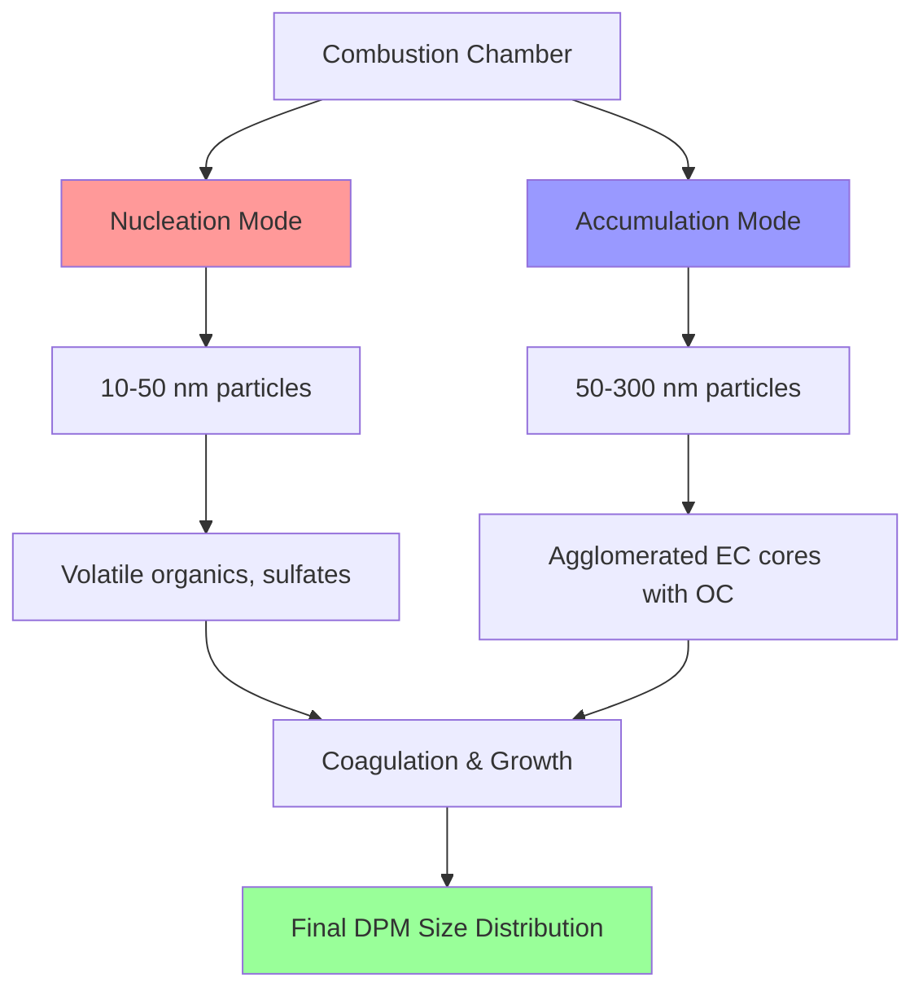
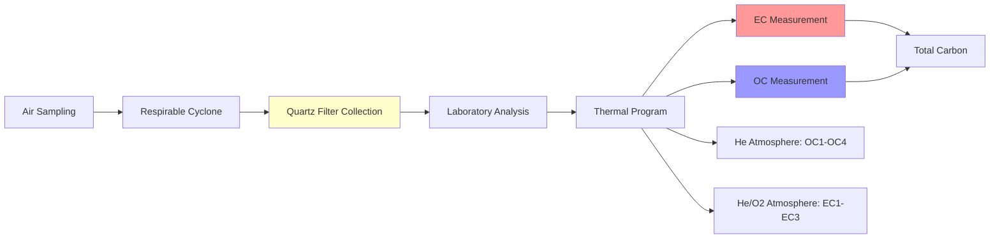

## Overview

Diesel particulate matter (DPM) represents the most significant air quality challenge in underground mining operations using diesel-powered equipment. DPM consists of complex carbonaceous particles with adsorbed hydrocarbons and sulfates, sized predominantly in the respirable range (<10 μm), making them capable of deep lung penetration. MSHA regulations (30 CFR 57.5060) establish strict exposure limits due to the carcinogenic nature of diesel exhaust, requiring continuous monitoring and control strategies.

## Compositional Analysis

### Primary Components

DPM exists as a three-phase aerosol system consisting of solid carbon cores with adsorbed volatile and semi-volatile compounds:

| Component | Mass Fraction | Characteristics |
|-----------|---------------|-----------------|
| Elemental Carbon (EC) | 30-60% | Graphitic structure, thermally stable, insoluble |
| Organic Carbon (OC) | 15-40% | Polyaromatic hydrocarbons (PAHs), aliphatic compounds |
| Sulfates | 5-20% | Sulfuric acid, ammonium sulfate, hygroscopic |
| Water | 5-15% | Condensed moisture, variable with humidity |
| Trace Metals | 1-5% | Iron, calcium, zinc from engine wear and fuel additives |

Elemental carbon forms through high-temperature pyrolysis and incomplete combustion in fuel-rich zones within the combustion chamber. The carbon nucleation process follows:

$$C_nH_m + \text{O}_2 \rightarrow \text{soot nuclei} + \text{CO} + \text{H}_2\text{O} + \text{heat}$$

Organic carbon originates from unburned fuel and lubricating oil that adsorbs onto the elemental carbon core during exhaust cooling. The organic fraction includes hundreds of compounds, with PAHs representing the primary carcinogenic constituents.

### Sulfate Formation Mechanism

Sulfur in diesel fuel oxidizes during combustion to form sulfur dioxide, which subsequently converts to sulfate particulates through catalytic oxidation:

$$\text{S (fuel)} + \text{O}_2 \rightarrow \text{SO}_2 \xrightarrow{\text{catalyst}} \text{SO}_3 + \text{H}_2\text{O} \rightarrow \text{H}_2\text{SO}_4 \text{ (aerosol)}$$

The sulfuric acid aerosol concentration directly correlates with fuel sulfur content, making ultra-low sulfur diesel (ULSD, <15 ppm S) mandatory in underground mining to minimize sulfate DPM.

## Particle Size Distribution

DPM exhibits a bimodal size distribution reflecting distinct formation mechanisms:

### Size Distribution Characteristics

The mass median aerodynamic diameter (MMAD) of DPM typically ranges from 0.1 to 0.3 μm, with number concentrations peaking in the nucleation mode (20-50 nm) and mass concentrations dominated by the accumulation mode (100-300 nm).

Respirable fraction analysis:

$$\text{RF} = \int_0^{10} \frac{dM}{d\log D_p} \cdot S(D_p) \, d\log D_p$$

Where:
- $\text{RF}$ = respirable fraction
- $D_p$ = particle aerodynamic diameter (μm)
- $S(D_p)$ = size-selective sampling efficiency
- $\frac{dM}{d\log D_p}$ = mass size distribution function

For DPM, approximately 90-98% of the mass falls within the respirable range, making it particularly hazardous for miners.

## Generation Sources and Emission Factors

Underground mining DPM originates exclusively from diesel-powered equipment operating in confined spaces with limited ventilation exchange.

### Equipment-Specific Emission Rates

| Equipment Type | Emission Factor (mg/hp-hr) | Primary Operating Mode |
|----------------|----------------------------|------------------------|
| Load-Haul-Dump (LHD) | 0.5-2.5 | Load/dump cycles, high transient loading |
| Haul Trucks | 0.3-1.5 | Steady-state transport, grade climbing |
| Bolters | 0.2-0.8 | Low load, extended idle periods |
| Jumbo Drills | 0.4-1.2 | Variable load, positioning movements |
| Personnel Carriers | 0.3-1.0 | Moderate steady-state operation |

Emission factors depend on engine load factor, maintenance condition, fuel quality, and altitude. The generation rate follows:

$$G_{\text{DPM}} = \sum_{i=1}^n (EF_i \cdot HP_i \cdot LF_i \cdot t_i)$$

Where:
- $G_{\text{DPM}}$ = total DPM generated (mg)
- $EF_i$ = emission factor for equipment $i$ (mg/hp-hr)
- $HP_i$ = rated horsepower
- $LF_i$ = load factor (dimensionless, 0-1)
- $t_i$ = operating time (hours)

## Measurement Methods: NIOSH 5040

The NIOSH Method 5040 thermal-optical analysis protocol serves as the definitive standard for DPM measurement in underground mines, providing separate quantification of elemental and organic carbon fractions.

### Thermal-Optical Analysis Protocol

The method employs stepwise temperature programming under controlled atmospheres:

**Phase 1 - Organic Carbon Evolution (Helium atmosphere):**
- OC1: 310°C
- OC2: 480°C
- OC3: 615°C
- OC4: 900°C

**Phase 2 - Elemental Carbon Evolution (2% O₂/98% He):**
- EC1: 600°C
- EC2: 675°C
- EC3: 750°C
- EC4: 850°C

Optical correction accounts for pyrolysis-induced charring of organic compounds during the helium phase. Transmittance monitoring through the filter allows differentiation between native elemental carbon and pyrolyzed organic carbon.

### Sampling Requirements

MSHA mandates personal sampling for DPM exposure assessment:

$$C_{\text{DPM}} = \frac{(EC + OC) \cdot 1000}{Q \cdot t}$$

Where:
- $C_{\text{DPM}}$ = DPM concentration (μg/m³)
- $EC$ = elemental carbon mass (mg)
- $OC$ = organic carbon mass (mg)
- $Q$ = sampling flow rate (L/min)
- $t$ = sampling duration (min)

Current MSHA permissible exposure limit: **160 μg/m³ total carbon (TC)** as an 8-hour time-weighted average.

## Exposure Monitoring Strategies

Effective DPM control requires integrated monitoring approaches combining personal sampling, area monitoring, and real-time surveillance.

### Multi-Point Monitoring Network Design

Strategic placement of monitoring stations captures DPM dispersion patterns:

1. **Source monitoring** - Near active diesel equipment
2. **Transport monitoring** - Primary ventilation airways
3. **Worker breathing zone** - Personal sampling pumps
4. **Fresh air base** - Reference background levels

The dilution ventilation requirement derives from the generation-removal balance:

$$Q_{\text{vent}} = \frac{G_{\text{DPM}}}{C_{\text{target}} - C_{\text{background}}} \cdot SF$$

Where:
- $Q_{\text{vent}}$ = required ventilation rate (m³/min)
- $G_{\text{DPM}}$ = total DPM generation rate (μg/min)
- $C_{\text{target}}$ = target concentration (μg/m³)
- $C_{\text{background}}$ = fresh air DPM level (μg/m³)
- $SF$ = safety factor (typically 1.5-2.0)

### Real-Time Monitoring Technologies

Continuous monitoring systems provide immediate feedback for ventilation system optimization:

| Technology | Measurement Principle | Response Time | Accuracy |
|------------|----------------------|---------------|----------|
| Photoacoustic | Light absorption by EC | 1-10 seconds | ±15% |
| Tapered Element Oscillating Microbalance (TEOM) | Mass loading detection | 1 minute | ±10% |
| Aethalometer | Optical absorption at 880 nm | 1 second | ±20% |
| Light Scattering | Particle concentration proxy | 1 second | ±30% |

Real-time instruments correlate with NIOSH 5040 results through calibration factors accounting for DPM composition variations between mines.

## Regulatory Compliance

MSHA regulations (30 CFR Part 57, Subpart D) mandate comprehensive DPM control programs including:

- Quarterly personal exposure sampling for affected workers
- Annual ventilation surveys with DPM mapping
- Diesel equipment approval and maintenance protocols
- Engineering controls (filtration systems, ventilation)
- Administrative controls (equipment rotation, work schedules)

Mines must demonstrate DPM concentrations remain below the 160 μg/m³ limit through documented sampling records and corrective action plans for exceedances.

---

*Related Topics: [Mine Ventilation Principles](../../), [Diesel Engine Filtration](../filtration/), [Air Quality Monitoring](../../../air-quality-monitoring/)*