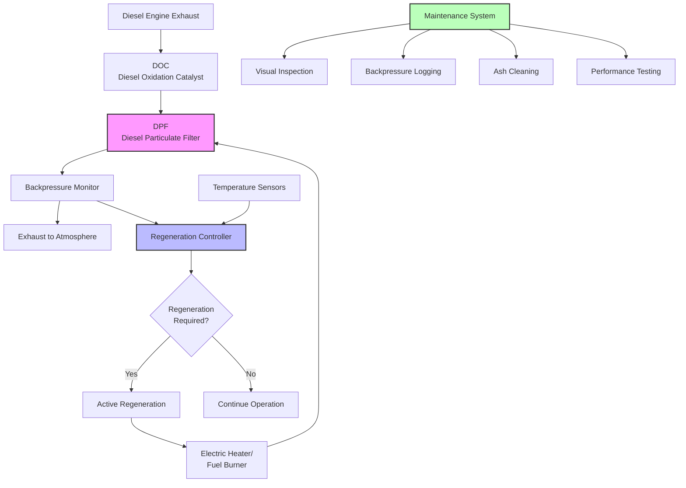

Diesel exhaust treatment systems represent critical technology for controlling diesel particulate matter (DPM) emissions in underground mines. These systems reduce harmful emissions at the source, complementing ventilation strategies to maintain air quality within MSHA permissible exposure limits.

## Diesel Particulate Filter Systems

Diesel particulate filters (DPFs) capture and remove particulate matter from exhaust streams through physical filtration. Wall-flow filters represent the most common configuration, forcing exhaust gas through porous ceramic walls that trap particles while allowing gas passage.

**Filter substrate materials:**

- Cordierite ceramic substrates
- Silicon carbide for higher temperature resistance
- Metal fiber filters for severe duty applications
- Sintered metal elements for specialized conditions

DPF efficiency depends on filter design, flow velocity, and particle size distribution. Collection efficiency follows:

$$\eta_{DPF} = 1 - \exp\left(-\frac{4\alpha h t}{\pi d_p D}\right)$$

where $\eta_{DPF}$ is collection efficiency, $\alpha$ is packing density, $h$ is filter thickness, $t$ is fiber diameter, $d_p$ is particle diameter, and $D$ is filter diameter.

Modern DPF systems achieve 85-95% reduction in particulate mass and 90-99% reduction in particle number for properly maintained units. However, DPFs create exhaust backpressure that increases with particulate loading, requiring periodic regeneration.

## Catalytic Converter Technology

Diesel oxidation catalysts (DOCs) reduce gaseous pollutants including carbon monoxide, hydrocarbons, and soluble organic fraction of DPM. Catalyst substrates contain precious metals (platinum, palladium) that promote oxidation reactions.

**Oxidation reactions:**

$$\text{CO} + \frac{1}{2}\text{O}_2 \xrightarrow{\text{catalyst}} \text{CO}_2$$

$$\text{HC} + \text{O}_2 \xrightarrow{\text{catalyst}} \text{CO}_2 + \text{H}_2\text{O}$$

DOCs operate effectively at exhaust temperatures above 200°C (392°F). In underground mining applications, catalyst formulations must withstand vibration, thermal cycling, and potential catalyst poisoning from fuel sulfur and lubricant additives.

Catalyzed DPF systems combine oxidation catalyst function with particulate filtration. The catalyst coating promotes continuous passive regeneration by oxidizing trapped particulate matter at lower temperatures than uncoated filters require.

## Exhaust After-Treatment Options

Selection of after-treatment technology depends on engine characteristics, duty cycle, and operational constraints:

| Technology | PM Reduction | CO/HC Reduction | Backpressure | Regeneration |
|------------|--------------|-----------------|--------------|--------------|
| Diesel Oxidation Catalyst | 20-50% | 70-90% | Low | None |
| Uncatalyzed DPF | 85-95% | Minimal | High | Active required |
| Catalyzed DPF | 85-95% | 60-80% | High | Passive/active |
| Catalyzed Wire Mesh | 60-80% | 50-70% | Medium | Passive |
| Disposable Filter | 70-85% | Minimal | Medium | Replace |

**System selection criteria:**

- Engine exhaust temperature profile
- Available space for installation
- Maintenance access and capability
- Duty cycle and operating hours
- Ventilation air availability for cooling

## Regeneration Requirements

DPF regeneration removes accumulated particulate matter to restore filtration efficiency and limit backpressure increase. Regeneration oxidizes trapped carbon particles to CO₂ gas.

**Passive regeneration** occurs continuously during operation when exhaust temperatures exceed 250-300°C (482-572°F). The reaction rate follows Arrhenius kinetics:

$$r = A \exp\left(-\frac{E_a}{RT}\right)$$

where $r$ is oxidation rate, $A$ is frequency factor, $E_a$ is activation energy (typically 140-180 kJ/mol for catalyzed soot oxidation), $R$ is gas constant, and $T$ is absolute temperature.

**Active regeneration** uses external heat input when passive regeneration proves insufficient. Methods include:

- Electric heating elements in filter housing
- Fuel burners upstream of DPF
- Exhaust throttling to increase temperature
- Stationary regeneration stations

Underground mining equipment typically requires active regeneration every 80-200 operating hours depending on engine load, fuel sulfur content, and filter design. Regeneration duration ranges from 20-60 minutes per cycle.

## Maintenance Schedules

Proper maintenance ensures continued emission control effectiveness and prevents equipment damage from excessive backpressure.

**Scheduled maintenance intervals:**

- Daily visual inspection for damage, leaks
- Weekly backpressure monitoring (warning at 20-25 kPa above baseline)
- Monthly catalyst inspection for physical damage
- Every 500 hours: ash cleaning, substrate inspection
- Every 1000 hours: comprehensive system testing
- Annual certification testing per MSHA requirements

Ash accumulation from lubricant-derived metallic compounds creates non-combustible residue requiring periodic removal. Ash cleaning intervals depend on lubricant consumption rate and formulation.

## MSHA Compliance Requirements

The Mine Safety and Health Administration (MSHA) regulates diesel emissions through approval and testing requirements in 30 CFR Part 7, Subpart E.

**MSHA approval process:**

- Manufacturer submits application with test data
- MSHA assigns approval number
- Periodic retesting required for continued approval
- Field modifications require re-approval

Equipment must maintain emission levels below:

$$\text{DPM} \leq 2.5 \text{ mg/m}^3 \text{ (8-hour TWA)}$$

MSHA-approved engines and after-treatment systems receive identification plates listing approval numbers, permissible operating conditions, and maintenance requirements. Operators must maintain systems according to manufacturer specifications to retain approval status.

**Documentation requirements:**

- Maintenance logs with dates, procedures
- Backpressure measurements before/after regeneration
- Fuel and lubricant specifications
- Annual emission testing results
- Operator training records

Non-compliant equipment must be removed from service until deficiencies are corrected and verified. Proper exhaust treatment system selection, operation, and maintenance directly impacts worker health protection and regulatory compliance in underground mining operations.
