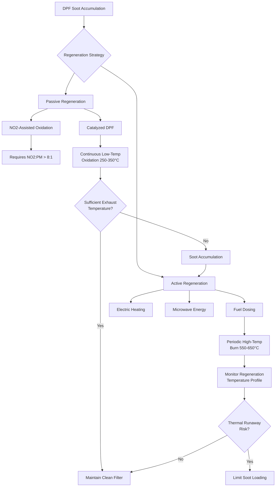

Diesel particulate matter filtration represents the most direct engineering control for reducing worker exposure to respirable combustion products in underground mining environments. Filtration systems employ two distinct strategies: source control through exhaust-mounted diesel particulate filters (DPF) on mobile equipment, and point-of-exposure control through environmental cabin filtration systems.

## Diesel Particulate Filter Technology

### Filter Construction and Capture Mechanisms

Diesel particulate filters utilize ceramic or silicon carbide substrates with parallel channel geometry. The wall-flow configuration forces exhaust gas through porous channel walls with typical mean pore diameters of 10-20 μm, creating a tortuous path that captures particulate matter through four simultaneous mechanisms:

- **Inertial impaction** - particles with sufficient momentum cannot follow gas streamlines around substrate fibers
- **Interception** - particles following streamlines contact fibers when particle radius exceeds distance to fiber surface
- **Diffusion** - Brownian motion causes sub-0.3 μm particles to deviate from streamlines and contact collection surfaces
- **Gravitational settling** - relevant only for particles exceeding 1 μm diameter in low-velocity regions

The single-fiber collection efficiency for diffusion-dominated capture follows:

$$\eta_D = 2.6 \left(\frac{\mu}{U_0 \rho_p d_p d_f}\right)^{1/3}$$

where $\mu$ is gas dynamic viscosity, $U_0$ is approach velocity, $\rho_p$ is particle density, $d_p$ is particle diameter, and $d_f$ is fiber diameter.

### Filtration Efficiency and Pressure Drop

Clean diesel particulate filters achieve 85-95% mass capture efficiency for particles above 0.1 μm, with efficiency approaching 99% as soot loading increases surface filtration contribution. The pressure drop across the filter substrate follows Darcy's law modified for compressible flow:

$$\Delta P = \frac{\mu L U_0}{k_0} + \frac{\mu L_c U_0}{k_c}$$

where $L$ is substrate wall thickness, $k_0$ is clean substrate permeability (typically $1-3 \times 10^{-13}$ m²), $L_c$ is soot cake thickness, and $k_c$ is cake layer permeability.

Acceptable pressure drop limits range from 25-40 kPa (3.6-5.8 psi) before regeneration becomes necessary to prevent excessive engine backpressure and power loss.

## Filter Regeneration Methods

### Passive Regeneration Thermodynamics

Passive regeneration relies on catalytic oxidation of captured carbon particles at exhaust gas temperatures typically present during normal equipment operation. The rate-limiting oxidation reaction:

$$\text{C} + \frac{1}{2}\text{O}_2 \rightarrow \text{CO}$$

proceeds at meaningful rates above 250°C when platinum-group metal catalysts reduce the activation energy from 180 kJ/mol to approximately 120 kJ/mol. The Arrhenius rate expression:

$$r = A e^{-E_a/RT} [\text{O}_2]^n$$

demonstrates the exponential temperature sensitivity. Each 50°C increase in exhaust temperature approximately doubles the oxidation rate.

Catalyzed systems incorporating cerium oxide or platinum enhance NO oxidation to NO2, which acts as a more reactive oxidizing agent:

$$\text{C} + 2\text{NO}_2 \rightarrow \text{CO}_2 + 2\text{NO}$$

This pathway proceeds at temperatures 200-250°C, extending passive regeneration viability to lower-duty-cycle mining equipment.

### Active Regeneration Systems

When exhaust temperatures remain insufficient for passive regeneration, active systems inject energy to elevate filter temperature above the 550°C threshold for rapid carbon oxidation. Common approaches include:

| Method | Temperature Rise | Energy Source | Cycle Duration | Mining Suitability |
|--------|------------------|---------------|----------------|-------------------|
| Post-injection fuel dosing | 300-400°C | Diesel fuel | 15-30 min | Limited - explosion risk |
| Electric heating elements | 200-350°C | Battery/alternator | 30-60 min | Moderate - power demand |
| Microwave RF heating | 400-500°C | Dedicated generator | 10-20 min | Poor - equipment complexity |
| Stationary regeneration station | 500-600°C | External burner | 60-120 min | Preferred for underground |

The heat release during regeneration follows:

$$Q = \Delta H_c \cdot m_{\text{soot}} \cdot X$$

where $\Delta H_c = 32.8$ MJ/kg is carbon heat of combustion, $m_{\text{soot}}$ is accumulated mass, and $X$ is burnoff fraction. Uncontrolled regeneration of filters with excessive soot loading (>10 g/L of substrate volume) creates thermal runaway risk when heat generation exceeds substrate thermal capacity and convective cooling.

## Operator Cabin Filtration Systems

### Environmental Cabin Design Requirements

MSHA 30 CFR 57.5066 mandates environmental cabs on diesel-powered equipment in underground metal/nonmetal mines to protect operators from DPM exposure. Effective cabin protection requires:

1. **Positive pressurization** - maintain 25-50 Pa (0.1-0.2 in. w.c.) above ambient mine air
2. **High-efficiency particulate filtration** - MERV 16 or better
3. **Activated carbon gas-phase filtration** - for volatile organic compounds
4. **Sealed cab construction** - minimize infiltration through door seals and cable penetrations

The protection factor achieved by a pressurized, filtered cabin follows:

$$PF = \frac{C_{\text{outside}}}{C_{\text{inside}}} = \frac{Q_{\text{supply}}}{Q_{\text{supply}} + Q_{\text{infiltration}}(1 - \eta)}$$

where $Q_{\text{supply}}$ is filtered supply airflow, $Q_{\text{infiltration}}$ is unfiltered leakage flow, and $\eta$ is filter collection efficiency.

### HEPA Filter Performance

High-efficiency particulate air (HEPA) filters specified for mining cabin applications must achieve minimum 99.97% efficiency for 0.3 μm particles - the most penetrating particle size where diffusion and interception mechanisms exhibit minimum combined efficiency. Filter media consists of submicron glass fibers with diameter distribution 0.5-5 μm arranged in random orientation to maximize particle capture probability.

The initial pressure drop across HEPA media correlates with face velocity:

$$\Delta P = \frac{4 \mu L U}{\pi d_f^2 \alpha} \cdot f(\alpha)$$

where $\alpha$ is media solidity (typically 0.05-0.15 for HEPA media), and $f(\alpha)$ is an empirical drag correction factor. Standard cabin systems operate at face velocities of 1.3-2.5 m/s, producing initial clean pressure drops of 150-250 Pa.

## Maintenance Requirements and Monitoring

### Filter Service Intervals

DPF maintenance intervals depend on equipment duty cycle, engine size, and fuel sulfur content:

- **Heavy-duty equipment** (>200 hp, continuous operation) - inspect every 500-1000 hours
- **Light-duty equipment** (<100 hp, intermittent use) - inspect every 1000-2000 hours
- **Catalyzed DPF systems** - replace catalyst every 5000-8000 hours due to thermal degradation

Cabin filtration systems require more frequent attention:

- **Pre-filters** (MERV 8-11) - replace every 1-3 months based on pressure drop
- **HEPA final filters** - replace when differential pressure exceeds 500 Pa or every 6-12 months
- **Activated carbon beds** - replace every 3-6 months or when breakthrough detected

### Performance Verification

MSHA requires periodic verification of cabin filtration effectiveness through:

1. **Smoke test** - visual confirmation of filtered air delivery and absence of infiltration
2. **Pressure differential measurement** - verify positive pressurization maintained
3. **Air quality testing** - elemental carbon concentration inside versus outside cab

The cabin protection factor must exceed 10:1 per MSHA guidelines, meaning operator exposure to DPM should not exceed 10% of ambient mine air concentration when cabin systems operate properly.

Diesel particulate filtration technology provides quantifiable exposure reduction when properly specified, maintained, and verified. The combination of source control through high-efficiency DPF systems and exposure control through pressurized, filtered operator cabins represents current best practice for DPM management in underground mining operations.
