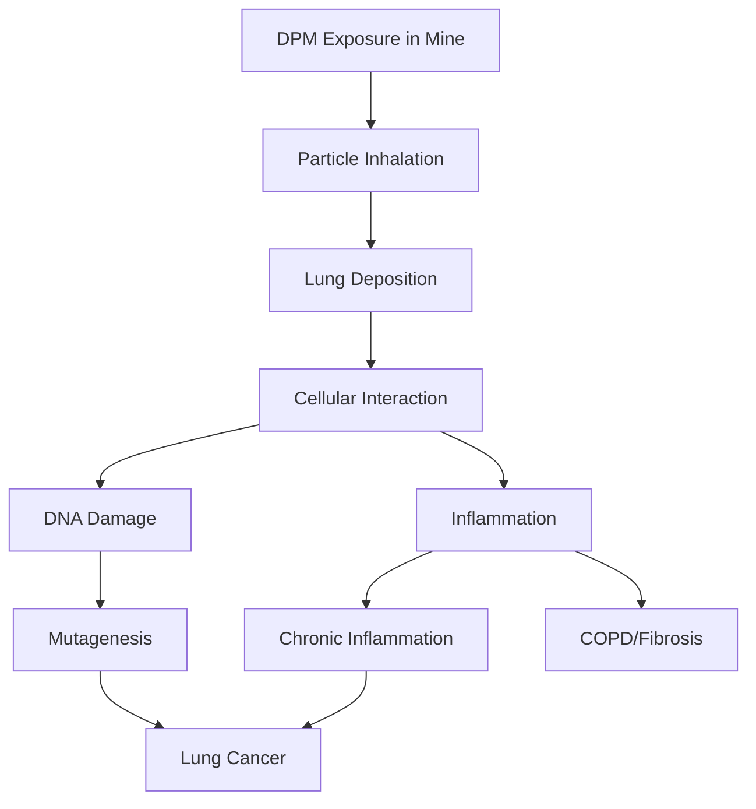
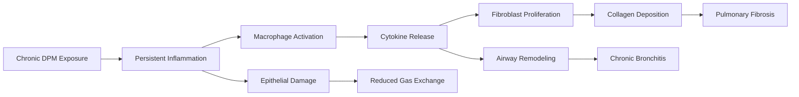

# Health Hazards of Diesel Particulate Matter in Underground Mines

Diesel particulate matter (DPM) represents one of the most significant occupational health hazards in underground mining operations. The confined environment and extensive use of diesel equipment create conditions where workers face chronic exposure to a complex aerosol containing known carcinogens and respiratory irritants. Understanding the physical mechanisms of particle interaction with human tissue is critical for implementing effective exposure controls.

## Carcinogenic Classification and Evidence

The International Agency for Research on Cancer (IARC) reclassified diesel engine exhaust from Group 2A (probably carcinogenic) to **Group 1 (carcinogenic to humans)** in 2012. This decision was based on sufficient epidemiological evidence linking diesel exhaust exposure to increased lung cancer risk, particularly in underground mining populations.

### Epidemiological Evidence

Large-scale cohort studies have established clear dose-response relationships between cumulative DPM exposure and lung cancer mortality:

- **Diesel Exhaust in Miners Study (DEMS)**: Demonstrated increased lung cancer risk with cumulative exposure measured in respirable elemental carbon (REC)
- **Exposure-response relationship**: Relative risk increases approximately 1.08 per 100 μg/m³-years of cumulative REC exposure
- **Latency period**: Cancer risk manifests after 15-30 years of exposure, complicating direct observation in individual workers

The carcinogenic mechanism involves multiple pathways. Polycyclic aromatic hydrocarbons (PAHs) adsorbed onto the carbon core undergo metabolic activation, forming DNA adducts. Simultaneously, the particle surface generates reactive oxygen species through Fenton-type reactions, creating oxidative stress in lung tissue.

## Particle Size and Lung Deposition Physics

DPM particle size distribution critically determines deposition location within the respiratory system. The physics of particle transport and deposition follows well-established aerosol mechanics principles.

### Deposition Mechanisms by Particle Size

| Particle Diameter | Primary Deposition Mechanism | Deposition Region | Deposition Efficiency |
|-------------------|------------------------------|-------------------|------------------------|
| > 10 μm | Inertial impaction | Nasopharyngeal | 90-95% |
| 2.5 - 10 μm | Sedimentation | Tracheobronchial | 50-70% |
| 0.1 - 2.5 μm | Diffusion + Sedimentation | Alveolar | 20-40% |
| < 0.1 μm | Brownian diffusion | Alveolar | 40-60% |

Diesel particulate matter primarily consists of **agglomerated particles in the 0.05-1.0 μm range**, with a mass median aerodynamic diameter (MMAD) typically between 0.15-0.30 μm. This size range ensures high alveolar penetration.

### Deposition Fraction Calculation

The alveolar deposition fraction for spherical particles can be approximated using:

$$
\eta_{alv} = 0.5 \left( 1 - \frac{1}{1 + 0.0155 \sqrt{d_p}} \right) \exp\left(-0.416\sqrt{d_p}\right) + 0.155\sqrt{d_p}
$$

where $d_p$ is the particle diameter in micrometers. For typical DPM particles at $d_p = 0.2$ μm:

$$
\eta_{alv} \approx 0.25
$$

This indicates approximately 25% of inhaled DPM mass deposits in the alveolar region, where particle clearance mechanisms are slowest and carcinogenic exposure is most critical.

## Respiratory Health Effects

Beyond cancer, DPM exposure causes acute and chronic non-malignant respiratory effects through multiple physiological mechanisms.

### Acute Effects

- **Airway irritation**: Gaseous components (NO₂, SO₂) and particle surface chemistry trigger immediate inflammatory responses
- **Bronchospasm**: Observed in sensitive individuals at concentrations above 200 μg/m³ total carbon
- **Mucociliary dysfunction**: Particle deposition impairs ciliary beat frequency, reducing clearance capacity by 30-50%

### Chronic Effects

Prolonged exposure leads to permanent structural changes in lung tissue:

The inflammatory cascade initiates when alveolar macrophages phagocytose DPM particles but cannot effectively digest the carbonaceous core. This frustrated phagocytosis triggers chronic release of inflammatory mediators (TNF-α, IL-1β, IL-6) and reactive oxygen species.

## Occupational Exposure Limits

MSHA established the first comprehensive DPM exposure limit for underground metal and non-metal mines in 2001, subsequently refined in 2006.

### MSHA Regulatory Framework

| Regulation | Effective Date | Exposure Limit | Measurement Method |
|------------|----------------|----------------|---------------------|
| 30 CFR 57.5060 | January 2006 | 160 μg/m³ TC | NIOSH 5040 |
| Final Rule Target | January 2008 | 160 μg/m³ TC | NIOSH 5040 |

**TC = Total Carbon** measured as the sum of elemental carbon (EC) and organic carbon (OC).

The exposure limit is based on an 8-hour time-weighted average (TWA):

$$
\text{TWA} = \frac{\sum_{i=1}^{n} C_i \cdot t_i}{8 \text{ hours}}
$$

where $C_i$ is the DPM concentration during period $i$ and $t_i$ is the duration in hours.

### Sampling and Analysis Protocol

MSHA requires sampling using:
- **Filter**: 37 mm, 0.8 μm pore quartz fiber filter
- **Flow rate**: 2.0 L/min for personal sampling
- **Analysis**: Thermal-optical analysis per NIOSH Method 5040, measuring elemental carbon as the primary marker

The relationship between total carbon and elemental carbon in mine environments typically follows:

$$
\text{EC} \approx 0.7 \to 0.9 \times \text{TC}
$$

This ratio varies with engine technology, fuel type, and maintenance practices.

## Dose-Response Relationships

Quantifying health risk requires understanding cumulative exposure over a working lifetime. The cumulative exposure metric integrates concentration and duration:

$$
\text{Cumulative Exposure} = \int_0^T C(t) \, dt \approx \sum_{i=1}^{N} C_i \cdot \Delta t_i
$$

expressed in units of μg/m³-years.

For practical risk assessment, the excess lifetime lung cancer risk can be estimated using:

$$
\text{Excess Risk} = \beta \times \text{Cumulative Exposure}
$$

where $\beta \approx 8 \times 10^{-5}$ per μg/m³-year based on DEMS data. A miner exposed to 160 μg/m³ for 40 years accumulates 6,400 μg/m³-years, corresponding to approximately 0.5% excess lifetime lung cancer risk.

## Prevention and Control Hierarchy

Protecting worker health requires integrated ventilation and administrative controls:

1. **Source control**: Diesel oxidation catalysts, diesel particulate filters reduce emissions by 85-95%
2. **Dilution ventilation**: Maintain minimum 30 cfm per brake horsepower to dilute DPM below exposure limits
3. **Personal protective equipment**: Respirators provide temporary protection but cannot replace engineering controls
4. **Exposure monitoring**: Continuous or periodic sampling to verify control effectiveness

The ventilation requirement to maintain concentration below the permissible exposure limit follows:

$$
Q = \frac{G}{C_{PEL} - C_{ambient}}
$$

where $Q$ is required airflow (m³/min), $G$ is DPM generation rate (μg/min), and $C_{PEL}$ is the permissible exposure limit.

## Components

- Carcinogenic Potential
- Respiratory Health Effects
- Exposure Limits Dpm
- Msha Regulations
