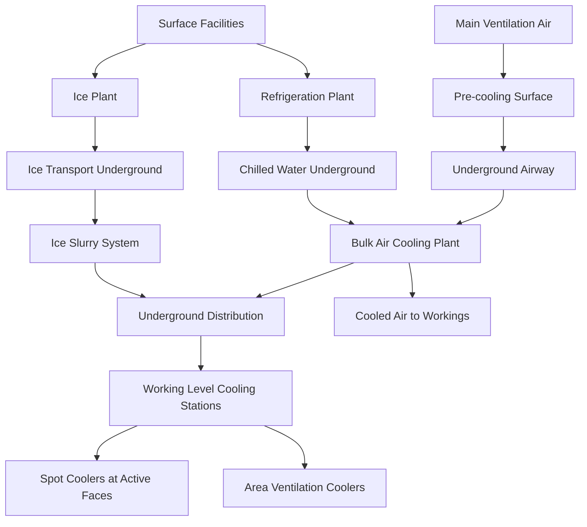
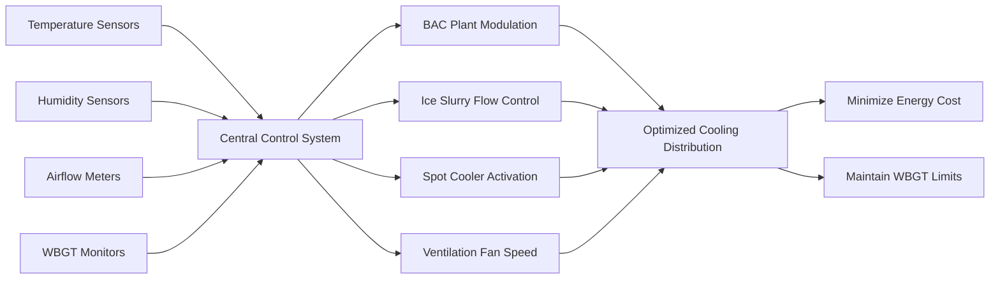

Underground mine cooling strategies address the severe thermal environments created by virgin rock temperature, auto-compression heating, equipment heat loads, and human metabolism. As mining operations extend beyond 1,500 meters depth, cooling becomes essential for worker safety and operational viability. Effective thermal management requires integrated approaches combining ventilation, refrigeration, and localized cooling to maintain wet-bulb globe temperature (WBGT) within physiological limits.

## Heat Stress Index Calculations

The thermal burden in mines is quantified using the wet-bulb globe temperature (WBGT), which integrates dry-bulb temperature, humidity, and radiant heat. WBGT is calculated differently for indoor and outdoor environments:

**Indoor WBGT (applicable to underground mines):**

$$\text{WBGT} = 0.7 \times T_{wb} + 0.3 \times T_{g}$$

Where:
- $T_{wb}$ = natural wet-bulb temperature (°C or °F)
- $T_{g}$ = globe temperature (°C or °F)

**Outdoor WBGT (surface facilities):**

$$\text{WBGT} = 0.7 \times T_{wb} + 0.2 \times T_{g} + 0.1 \times T_{db}$$

Where $T_{db}$ is dry-bulb temperature.

The NIOSH recommended exposure limits (REL) for heat stress vary by metabolic work rate and acclimatization status. For continuous work in mining environments:

| Work Rate | Metabolic Heat (W) | WBGT Limit (Acclimatized) | WBGT Limit (Unacclimatized) |
|-----------|-------------------|---------------------------|----------------------------|
| Light | 200 | 30.0°C (86.0°F) | 29.0°C (84.2°F) |
| Moderate | 300 | 28.0°C (82.4°F) | 26.5°C (79.7°F) |
| Heavy | 400 | 26.0°C (78.8°F) | 24.0°C (75.2°F) |
| Very Heavy | 500 | 25.0°C (77.0°F) | 22.0°C (71.6°F) |

MSHA requires work-rest regimens when WBGT exceeds these thresholds, directly impacting productivity. Cooling systems aim to maintain WBGT below limits for continuous operation.

## Total Mine Heat Load Calculation

Effective cooling system design requires accurate quantification of all heat sources. The total sensible heat load is:

$$Q_{total} = Q_{rock} + Q_{auto} + Q_{equipment} + Q_{human} + Q_{oxidation} + Q_{water}$$

**Virgin rock heat ($Q_{rock}$):**

Heat flux from rock surfaces depends on exposure time and temperature differential:

$$Q_{rock} = A \times h \times (T_{rock} - T_{air})$$

Where:
- $A$ = exposed rock surface area (m²)
- $h$ = convective heat transfer coefficient (5-15 W/m²·K)
- $T_{rock}$ = virgin rock temperature (°C)
- $T_{air}$ = ventilation air temperature (°C)

For newly blasted rock faces, initial heat flux can reach 40-50 W/m², decreasing exponentially as surface layers cool. Over time (weeks to months), equilibrium heat flux stabilizes at 10-20 W/m².

**Auto-compression heating ($Q_{auto}$):**

For intake air descending depth $H$:

$$Q_{auto} = \dot{m} \times c_p \times \frac{g \times H}{c_p} = \dot{m} \times g \times H$$

Simplifying:

$$\Delta T_{auto} = \frac{g \times H}{c_p} = \frac{9.81 \times H}{1005} \approx 0.00976 \times H \text{ (°C)}$$

For a 2,500-meter shaft, auto-compression adds approximately 24.4°C (44°F) to intake air temperature, representing an irreversible thermal load requiring removal through refrigeration.

**Equipment heat ($Q_{equipment}$):**

All mechanical and electrical energy ultimately converts to heat:

$$Q_{equipment} = \sum (P_{i} \times \eta_{i} \times DF_{i})$$

Where:
- $P_i$ = installed power of equipment $i$ (kW)
- $\eta_i$ = load factor (0.5-0.9 typical)
- $DF_i$ = diversity factor (0.6-0.85 for multiple units)

Diesel equipment converts fuel energy to heat with approximately 35% mechanical efficiency and 65% thermal rejection. A 300 hp diesel loader rejects approximately 150 kW of heat to the mine atmosphere.

## Cooling System Architecture

## Ice Plant Cooling Systems

Ice-based cooling exploits the high latent heat of fusion ($h_{fg} = 334$ kJ/kg) to transport thermal energy efficiently. Ice production occurs on surface using conventional refrigeration equipment, with ice transported underground for distribution.

**Ice production energy requirement:**

$$Q_{ice} = m_{ice} \times (h_{fg} + c_{p,ice} \times \Delta T)$$

For ice production from water at 10°C to ice at 0°C:

$$Q_{ice} = m_{ice} \times (334 + 4.18 \times 10) = m_{ice} \times 375.8 \text{ kJ/kg}$$

**System characteristics:**

| Parameter | Typical Range | Notes |
|-----------|--------------|-------|
| Production rate | 500-2,000 tonnes/day | Large deep mines |
| Storage capacity | 1,000-5,000 tonnes | 1-3 day reserve |
| Ice form | Flake, block, or slurry | Flake most common for handling |
| Transport method | Pneumatic, conveyor, or shaft | Pneumatic typical for vertical shafts |
| Distribution temp | 0-4°C | Ice-water mixture |

**Ice slurry distribution:**

Ice slurry systems circulate ice-water mixtures (typically 20-40% ice by weight) through insulated piping networks. The mixture remains at 0°C during melting, providing isothermal cooling with excellent heat transfer characteristics.

Slurry flow requires special consideration for pressure drop. The Darcy-Weisbach equation is modified for two-phase flow:

$$\Delta P = f \times \frac{L}{D} \times \frac{\rho \times v^2}{2} \times \Phi$$

Where $\Phi$ is the two-phase multiplier (1.2-1.8 for ice slurry).

**Advantages of ice systems:**

- High thermal capacity per unit volume (latent heat)
- Isothermal cooling performance at 0°C
- No refrigerant handling underground
- Simple distribution using existing infrastructure
- Thermal storage provides load buffering

**Disadvantages:**

- Ice production energy cost (COP typically 2.5-3.5)
- Handling and transport logistics
- Water management in underground workings
- Limited to 0°C supply temperature

## Bulk Air Cooling Plants

Bulk air cooling (BAC) plants install refrigeration equipment underground at strategic locations to cool main ventilation airstreams. These centralized systems provide baseline cooling across large mining districts.

**Refrigeration cycle analysis:**

Underground BAC plants typically employ ammonia (R-717) or modern HFC refrigerants in vapor-compression cycles. The coefficient of performance is:

$$\text{COP}_{cooling} = \frac{Q_{evap}}{W_{comp}} = \frac{h_1 - h_4}{h_2 - h_1}$$

Where enthalpy values correspond to evaporator inlet (4), evaporator outlet (1), and compressor discharge (2).

Typical COP for underground installations ranges from 2.5 to 4.0, influenced by:
- Evaporator temperature (5-10°C for air cooling)
- Condenser temperature (30-45°C depending on heat rejection method)
- Refrigerant properties and cycle efficiency

**Heat rejection strategies:**

Underground refrigeration plants must reject condenser heat. Three approaches are used:

1. **Return airway rejection:** Condenser heat rejected to return ventilation air, which carries heat to surface. Requires sufficient return air capacity to prevent excessive temperature rise.

$$\Delta T_{return} = \frac{Q_{condenser}}{\dot{m}_{air} \times c_{p,air}}$$

For 5 MW cooling with 4 MW compressor power (total 9 MW rejection) and 200 m³/s return air:

$$\Delta T_{return} = \frac{9,000,000}{200 \times 1.2 \times 1005} = 37.3 \text{°C rise}$$

This substantial temperature rise may approach auto-ignition temperatures for combustible materials, requiring careful design.

2. **Surface cooling towers:** Chilled water circulated between underground evaporators and surface heat rejection. Requires large-diameter insulated piping and pumping energy.

3. **Mine water cooling:** Natural cold groundwater used for condenser cooling where available. Effective in flooded workings with constant water supply.

**BAC plant specifications:**

| Component | Typical Sizing | Design Considerations |
|-----------|---------------|----------------------|
| Evaporator capacity | 2,000-10,000 kW | Airside approach 3-5°C |
| Compressor power | 800-3,500 kW | Screw or centrifugal |
| Air temperature drop | 8-15°C | Depends on entering conditions |
| Airflow rate | 100-400 m³/s | Main intake airways |
| Refrigerant charge | 1,000-5,000 kg | Leak detection critical |

BAC plants are typically located 500-1,000 meters shallower than active working levels to minimize auto-compression reheating of cooled air.

## Spot Cooler Systems

Spot coolers provide localized cooling to individual work areas, targeting the worker breathing zone with conditioned air. These units range from portable 10 kW units to semi-permanent 100 kW installations.

**Spot cooler types comparison:**

| Technology | Capacity Range | Cooling Method | Application | Efficiency |
|-----------|---------------|----------------|-------------|------------|
| Direct expansion | 10-50 kW | Refrigerant evaporation | Active headings | COP 2.5-3.5 |
| Chilled water coil | 20-100 kW | Ice slurry/chilled water | Fixed locations | COP 3.0-4.0 |
| Vortex tube | 1-5 kW | Compressed air expansion | Confined spaces | COP 0.2-0.3 |
| Evaporative | 5-30 kW | Water evaporation | Low humidity only | COP 10-20 |

**Direct expansion spot coolers:**

Self-contained refrigeration units with integral compressor, evaporator, and condenser. Condenser heat typically rejected to return ventilation air through ducting.

Cooling delivered directly to worker vicinity:

$$Q_{delivered} = \dot{m}_{air} \times c_{p,air} \times (T_{in} - T_{out})$$

For 1,000 cfm (0.472 m³/s) cooler with 15°C temperature drop:

$$Q = 0.472 \times 1.2 \times 1005 \times 15 = 8,510 \text{ W} \approx 8.5 \text{ kW cooling}$$

**Chilled water spot coolers:**

Fan coil units connected to ice slurry or chilled water networks. Simpler maintenance (no compressors) and higher efficiency but require distribution infrastructure.

**Vortex tube coolers:**

Ranque-Hilsch vortex tubes separate compressed air into hot and cold streams through tangential injection and thermal separation. Limited efficiency but useful for confined spaces requiring flameless cooling:

$$T_{cold} = T_{inlet} - \frac{\Delta P}{\rho \times c_p} \times \eta_{vortex}$$

Typical temperature drops of 20-30°C achievable with 100 psi compressed air, but compressed air energy cost limits application to spot cooling for 1-2 workers.

## Ventilation Air Conditioning

Pre-cooling intake ventilation air on surface before descent reduces the thermal burden underground. Surface air conditioning exploits ambient air temperature and cooling tower heat rejection efficiency.

**Surface cooling plant thermodynamics:**

For intake air at 30°C cooled to 15°C at flow rate 200 m³/s:

$$Q_{cooling} = \dot{m} \times c_p \times \Delta T = (200 \times 1.2) \times 1.005 \times 15 = 3,618 \text{ kW}$$

This cooling load requires substantial refrigeration capacity, but surface installation permits use of efficient equipment with favorable condenser temperatures.

**Auto-compression interaction:**

Cooled surface air experiences auto-compression heating during descent. For 2,000 m shaft:

$$\Delta T_{auto} = 0.00976 \times 2000 = 19.5 \text{°C}$$

Air cooled from 30°C to 15°C on surface arrives at depth at approximately 34.5°C, still cooler than unconditioned air at 49.5°C. The 15°C surface cooling translates to 15°C reduction at depth despite auto-compression.

**Cooling tower performance:**

Surface installations use evaporative cooling towers for heat rejection:

$$Q_{tower} = \dot{m}_{water} \times c_{p,water} \times (T_{in} - T_{out})$$

Approach temperature to wet-bulb (typically 3-5°C) determines tower effectiveness. Cooling tower COP (heat rejected per fan/pump power) typically exceeds 20, making surface heat rejection much more efficient than underground rejection to return air.

## System Integration and Control

Integrated mine cooling systems use distributed control networks to optimize energy consumption while maintaining thermal safety:

1. **Continuous monitoring:** WBGT sensors at all active work areas with data logging per MSHA requirements
2. **Predictive control:** Cooling capacity adjusted based on production schedule and equipment loading
3. **Demand-based distribution:** Ice slurry and chilled water directed to areas with highest thermal load
4. **Energy optimization:** Surface refrigeration preferentially utilized over underground plants when thermodynamically favorable

**Energy cost analysis:**

Total cooling cost includes:

$$C_{total} = C_{refrigeration} + C_{pumping} + C_{ice\\_handling} + C_{ventilation}$$

Typical energy costs for deep, hot mines reach $15-30 per tonne of ore mined, representing 10-20% of total operating costs. System optimization can reduce cooling costs by 20-40% through:

- Load shifting to off-peak electrical rates
- Thermal storage using ice inventory
- Heat recovery from compressed air systems
- Ventilation-on-demand integration

## MSHA and NIOSH Regulatory Compliance

MSHA regulations require thermal environmental monitoring but do not prescribe specific WBGT limits. Instead, MSHA relies on NIOSH recommendations and ACGIH threshold limit values (TLVs).

**Key regulatory requirements:**

- **30 CFR 57.5060:** Atmospheric monitoring programs must include heat stress evaluation
- **NIOSH Publication 2016-106:** Criteria for a Recommended Standard for occupational heat exposure
- **ACGIH TLVs:** Work-rest regimens based on WBGT and metabolic rate

Compliance programs must include:

1. Heat stress surveys documenting WBGT at representative work locations
2. Medical surveillance for workers in hot environments
3. Acclimatization protocols for new workers (7-14 day gradual exposure)
4. Hydration and rest facilities at cooling stations
5. Emergency response procedures for heat illness

**Work-rest regimens per ACGIH:**

For heavy work (400 W metabolic rate) when WBGT exceeds 26°C:

| WBGT Range | Work-Rest Regimen | Productivity Impact |
|------------|------------------|-------------------|
| 26-28°C | 75% work, 25% rest | 15% reduction |
| 28-30°C | 50% work, 50% rest | 40% reduction |
| 30-32°C | 25% work, 75% rest | 70% reduction |
| >32°C | Work prohibited | 100% stoppage |

These productivity losses underscore the economic imperative for effective cooling in deep, hot mines.

## Design Methodology

Comprehensive mine cooling design follows systematic analysis:

1. **Heat load quantification:** Calculate all heat sources including virgin rock, auto-compression, equipment, and human metabolism
2. **Target WBGT determination:** Establish maximum acceptable WBGT based on work intensity and acclimatization
3. **Cooling capacity allocation:** Distribute cooling between surface pre-conditioning, BAC plants, and spot coolers
4. **Distribution system design:** Size piping, ductwork, and airways for thermal and hydraulic performance
5. **Energy optimization:** Minimize total energy cost considering refrigeration COP, transport losses, and electrical rates
6. **Control strategy:** Implement demand-based modulation with safety overrides

Effective thermal management in underground mines demands integrated engineering combining thermodynamics, fluid mechanics, and physiological heat stress principles. Well-designed cooling systems maintain safe working conditions while controlling energy costs in one of industry's most thermally demanding environments.
