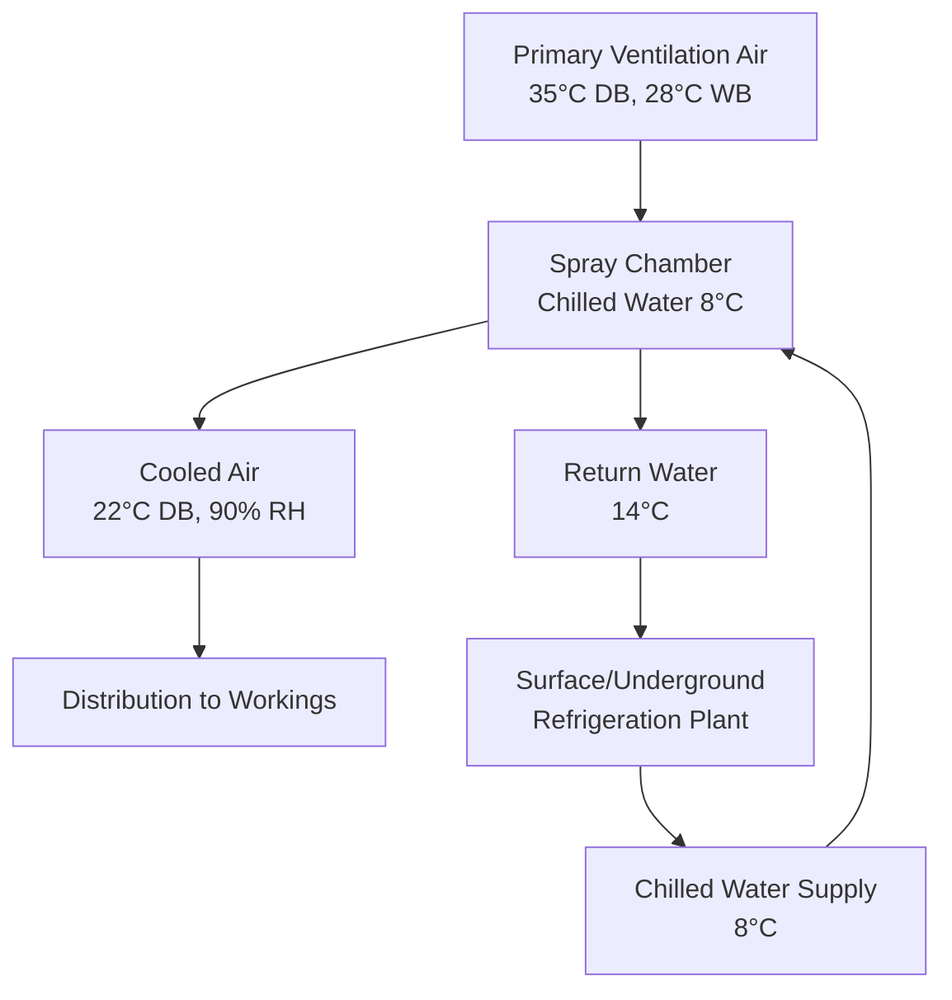
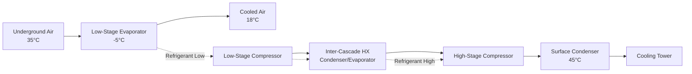

## Overview

Mine cooling systems remove heat from underground workings where virgin rock temperatures, auto-compression, machinery, and human metabolism create intolerable thermal conditions. The fundamental challenge is heat rejection: removing thermal energy from depths exceeding 3000 meters where rock wall temperatures reach 60°C requires refrigeration capacity measured in tens of megawatts.

The physics governing mine cooling differs from surface HVAC. Heat flow from rock walls follows Fourier's Law: $q = -k \nabla T$, creating a continuous thermal load that increases with excavation surface area and temperature differential. Auto-compression adds sensible heat at approximately 1°C per 100 m depth via the relationship $\Delta T = \frac{g \cdot h}{c_p}$, where $g$ is gravitational acceleration (9.81 m/s²), $h$ is depth, and $c_p$ is air specific heat (1005 J/kg·K).

## Surface vs Underground Refrigeration Plants

The strategic placement of refrigeration machinery determines system efficiency, capital cost, and operational complexity. Surface plants avoid the hostile underground environment but face thermodynamic penalties from transporting chilled media to depth.

### Surface Refrigeration Plants

Surface installations centralize refrigeration equipment in accessible buildings with unlimited heat rejection capacity. Chilled water production occurs at surface conditions, then distributes through insulated pipelines to underground heat exchangers.

**Thermodynamic penalty:** Pumping chilled water from surface to depth requires overcoming static head pressure and friction losses. Pump work converts to heat at the rate $\dot{Q}_p = \dot{m} \cdot g \cdot h$, reheating the chilled water. For a 2000 m deep mine circulating 100 kg/s of water, gravitational heating adds approximately 2 MW of thermal load.

**Advantages:**
- Unlimited cooling tower capacity at surface
- Accessible maintenance environment
- Lower underground fire risk
- Simplified underground infrastructure

**Disadvantages:**
- Pump work heat addition (0.98 kW per 100 m per kg/s)
- Pipeline heat gain through rock mass
- High initial piping capital cost
- Water temperature rise reduces cooling effectiveness at depth

### Underground Refrigeration Plants

Installing refrigeration machinery underground eliminates pipeline parasitic losses but introduces operational challenges in the hostile environment.

**Thermodynamic advantage:** Refrigeration occurs at the point of use, eliminating pump work reheating. Chilled water circulates locally, minimizing distribution losses.

**Heat rejection challenge:** Condenser heat must return to surface via warm water loops or air streams. The coefficient of performance (COP) relationship shows that underground condensing temperatures directly impact power consumption: $COP = \frac{Q_c}{W} = \frac{T_c}{T_h - T_c}$ for ideal cycles.

| Parameter | Surface Plant | Underground Plant |
|-----------|---------------|-------------------|
| Refrigeration accessibility | Excellent | Limited |
| Heat rejection capacity | Unlimited | Constrained by return circuit |
| Parasitic losses | High (pump work + pipe heat gain) | Low (local distribution only) |
| Fire risk | Low | Elevated (refrigerant + electrical) |
| Capital cost | Very high (piping) | High (equipment + infrastructure) |
| Efficiency at depth | Decreases with depth | Maintains design COP |

## Bulk Air Cooling Systems

Bulk air coolers (BACs) are large heat exchangers that process the primary ventilation airstream, reducing dry-bulb temperature before air enters working areas.

### Operating Principles

Water sprays or finned coil heat exchangers contact the air stream, transferring sensible and latent heat to chilled water. The cooling capacity follows:

$$Q_{total} = \dot{m}_{air} \cdot (h_1 - h_2)$$

where $h_1$ and $h_2$ are inlet and outlet air enthalpies (kJ/kg). For sensible-only cooling over coils:

$$Q_s = \dot{m}_{air} \cdot c_p \cdot (T_1 - T_2)$$

### Spray Chamber Performance

Spray chambers atomize chilled water into the air stream, achieving near-adiabatic saturation conditions. Effectiveness depends on contact time and spray droplet surface area. The psychrometric process moves air toward the saturation curve along a constant wet-bulb temperature line when spray water temperature equals wet-bulb temperature.

For spray water colder than air wet-bulb temperature, the process combines sensible cooling (reducing dry-bulb) and dehumidification (reducing humidity ratio), following:

$$\dot{m}_{water} \cdot c_{p,w} \cdot \Delta T_w = \dot{m}_{air} \cdot \Delta h$$

## Spot Cooling Systems

Spot coolers deliver localized cooling to specific work faces where bulk air cooling cannot reach or where supplemental cooling is required. These portable or semi-permanent units typically range from 10 to 100 kW refrigeration capacity.

### Direct Expansion (DX) Spot Coolers

Self-contained DX units refrigerate air directly, rejecting heat to a separate air or water stream. The refrigeration cycle operates at the point of use:

**Evaporator:** Cools work face air at temperature $T_c$
**Condenser:** Rejects heat to return ventilation air at elevated temperature $T_h$
**COP:** Typically 2.5-3.5 for underground conditions

**Heat balance:** Total heat rejected to return air equals cooling capacity plus compressor work: $Q_h = Q_c + W$

### Chilled Water Spot Coolers

Fan coil units supplied from central chilled water loops offer simpler local equipment without refrigerant handling. Cooling capacity follows:

$$Q = U \cdot A \cdot \Delta T_{lm}$$

where $U$ is overall heat transfer coefficient (W/m²·K), $A$ is coil surface area (m²), and $\Delta T_{lm}$ is log-mean temperature difference between air and water streams.

## Cooling Towers and Heat Rejection

Every underground refrigeration system requires ultimate heat rejection to the environment. Cooling towers at surface facilities provide this function through evaporative cooling of condenser water.

### Evaporative Cooling Physics

Water evaporation consumes latent heat at 2442 kJ/kg (at 25°C), providing exceptional cooling efficiency. Cooling tower performance depends on ambient wet-bulb temperature, not dry-bulb temperature.

The approach temperature (difference between cold water temperature and ambient wet-bulb) indicates tower effectiveness:

$$\text{Approach} = T_{water,out} - T_{wb,ambient}$$

Typical designs achieve 3-5°C approach. The range (temperature drop across the tower) equals:

$$\text{Range} = T_{water,in} - T_{water,out} = \frac{Q}{\dot{m}_{water} \cdot c_{p,w}}$$

### Water Consumption

Evaporation rate approximates 1% of circulation rate per 5.5°C range, plus blowdown to control mineral concentration. For a 10 MW heat rejection system with 15°C range:

$$\dot{m}_{evap} \approx 0.027 \cdot \dot{m}_{circ} = 0.027 \times \frac{10,000}{4.18 \times 15} = 4.3 \text{ kg/s} = 372 \text{ m}^3/\text{day}$$

## Chilled Water Distribution

Large mine cooling systems distribute chilled water through extensive pipeline networks from central plants to distributed coolers. Hydraulic design balances flow velocity (affecting friction losses) against pipe diameter (capital cost).

### Pipeline Sizing

Friction pressure drop follows the Darcy-Weisbach equation:

$$\Delta P = f \cdot \frac{L}{D} \cdot \frac{\rho v^2}{2}$$

where $f$ is friction factor (function of Reynolds number and roughness), $L$ is pipe length, $D$ is diameter, $\rho$ is density, and $v$ is velocity.

Typical design velocities range from 1.5-3.0 m/s, balancing energy cost against pipe cost. The economic pipe diameter minimizes total lifecycle cost:

$$D_{opt} \propto Q^{0.45}$$

for constant velocity design.

### Insulation Requirements

Chilled water pipes traversing hot rock experience continuous heat gain. Required insulation thickness balances heat gain against capital cost:

$$q = \frac{2 \pi L (T_{rock} - T_{water})}{\frac{1}{h_i r_i} + \frac{\ln(r_2/r_1)}{k_{pipe}} + \frac{\ln(r_3/r_2)}{k_{ins}} + \frac{1}{h_o r_3}}$$

where subscripts $i$ denote inner surface, $o$ outer surface, 1 is pipe inner radius, 2 is pipe outer radius, and 3 is insulation outer radius.

## Cascade Refrigeration for Deep Mines

Ultra-deep mines (>3000 m) encounter conditions where single-stage vapor compression refrigeration becomes impractical. Cascade systems employ multiple refrigeration stages with different refrigerants optimized for their operating temperature ranges.

### Thermodynamic Rationale

Single-stage compression ratio limits practical application. For a refrigerant with saturation temperatures of -5°C (evaporator) and 45°C (condenser), the pressure ratio might exceed 6:1. Cascade systems split this into two or three stages:

**Low-stage:** Evaporates at -5°C, condenses at 15°C (ratio ≈ 3:1)
**High-stage:** Evaporates at 10°C, condenses at 45°C (ratio ≈ 3:1)

Total COP improves because each stage operates near optimal compression ratio:

$$COP_{cascade} > COP_{single-stage}$$

### Refrigerant Selection

Low-stage circuits use refrigerants with low normal boiling points (R-508B, R-23) for efficient low-temperature operation. High-stage circuits use conventional refrigerants (R-134a, R-513A) suited to moderate temperature lifts.

## System Selection Criteria

| Depth Range | Recommended Primary System | Secondary/Supplemental |
|-------------|----------------------------|------------------------|
| < 1000 m | Surface bulk air cooling | DX spot coolers |
| 1000-2000 m | Surface refrigeration + underground BACs | Chilled water spot coolers |
| 2000-3000 m | Underground refrigeration plants | Distributed BACs + spot coolers |
| > 3000 m | Cascade underground refrigeration | Multi-stage chilled water distribution |

The fundamental constraint is thermodynamic efficiency versus capital cost. Surface systems minimize underground complexity at the expense of parasitic losses. Underground systems maximize efficiency but require substantial infrastructure investment and operational expertise in hazardous environments. Deep mines inevitably require sophisticated cascade or multi-stage approaches to maintain acceptable refrigeration efficiency against extreme temperature differentials.
