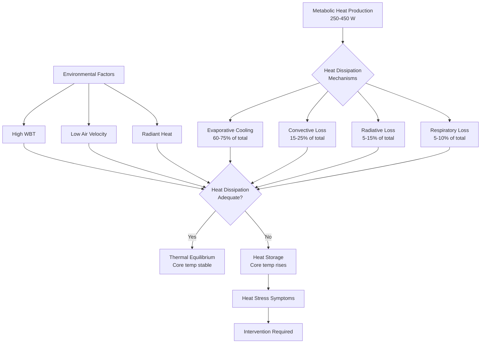
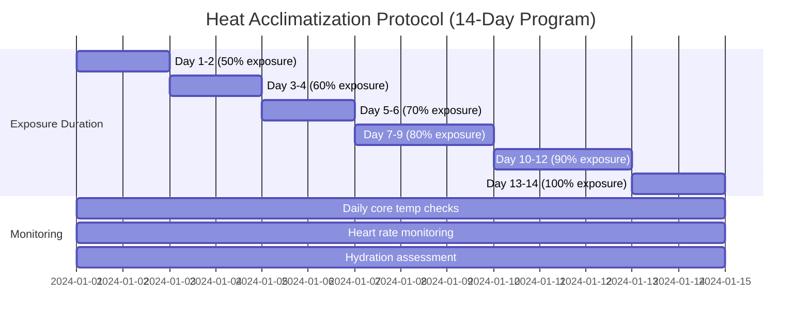

## Physical Basis of Deep Mine Heat Stress

Heat stress in deep mines represents one of the most severe occupational thermal environments. As mining operations extend beyond 3000m depth, the combination of geothermal heating, metabolic heat production, and limited heat dissipation creates potentially lethal conditions requiring sophisticated engineering controls.

### Geothermal Heat Sources

The primary heat source in deep mines is geothermal energy from Earth's interior. The virgin rock temperature increases with depth according to the geothermal gradient:

$$T_{\text{rock}} = T_{\text{surface}} + G \cdot z$$

where:
- $T_{\text{rock}}$ = virgin rock temperature (°C)
- $T_{\text{surface}}$ = surface temperature (°C)
- $G$ = geothermal gradient (typically 0.025-0.030°C/m)
- $z$ = depth below surface (m)

At 3000m depth with a typical gradient of 0.027°C/m and surface temperature of 15°C, virgin rock temperatures reach approximately 96°C. In South African gold mines exceeding 3900m depth, rock temperatures approach 120°C.

### Heat Transfer Mechanisms

Heat flows from hot rock into mine airways through three mechanisms:

**Conduction through rock walls:**

$$q_{\text{cond}} = k \cdot A \cdot \frac{(T_{\text{rock}} - T_{\text{air}})}{L}$$

where $k$ is thermal conductivity (typically 2.5-3.5 W/m·K for hard rock), $A$ is exposed surface area, and $L$ is the thermal penetration depth.

**Convection to ventilation air:**

$$q_{\text{conv}} = h \cdot A \cdot (T_{\text{surface}} - T_{\text{air}})$$

The convective heat transfer coefficient $h$ ranges from 5-25 W/m²·K depending on airflow velocity.

**Radiation from equipment and rock surfaces:**

$$q_{\text{rad}} = \epsilon \cdot \sigma \cdot A \cdot (T_{\text{hot}}^4 - T_{\text{cold}}^4)$$

where $\epsilon$ is emissivity (0.8-0.95 for rock) and $\sigma$ is the Stefan-Boltzmann constant (5.67×10⁻⁸ W/m²·K⁴).

## Wet-Bulb Temperature Limits and WBGT

### Critical Temperature Thresholds

The wet-bulb temperature (WBT) determines the maximum cooling potential through evaporation. When WBT approaches skin temperature (approximately 35°C), evaporative cooling becomes ineffective and physiological heat stress becomes acute.

MSHA and international standards establish action levels based on wet-bulb globe temperature (WBGT):

| WBGT Range (°C) | Work Classification | Required Actions |
|-----------------|---------------------|------------------|
| < 25.0 | Normal operations | Standard monitoring |
| 25.0 - 27.5 | Moderate heat stress | Enhanced monitoring, hydration |
| 27.5 - 30.0 | High heat stress | Work-rest cycles, acclimatization required |
| 30.0 - 32.5 | Severe heat stress | Restricted work duration, cooling systems mandatory |
| > 32.5 | Extreme heat stress | Operations curtailed, emergency cooling only |

### WBGT Calculation

The wet-bulb globe temperature integrates multiple thermal parameters:

**Outdoor (with solar load):**
$$\text{WBGT} = 0.7 \cdot T_{\text{wb}} + 0.2 \cdot T_{\text{g}} + 0.1 \cdot T_{\text{db}}$$

**Indoor/underground (no solar load):**
$$\text{WBGT} = 0.7 \cdot T_{\text{wb}} + 0.3 \cdot T_{\text{g}}$$

where:
- $T_{\text{wb}}$ = natural wet-bulb temperature (°C)
- $T_{\text{g}}$ = black globe temperature (°C)
- $T_{\text{db}}$ = dry-bulb temperature (°C)

The natural wet-bulb temperature represents the theoretical minimum temperature achievable through evaporation at 100% efficiency:

$$T_{\text{wb}} = T_{\text{db}} \cdot \arctan[0.151977(RH\% + 8.313659)^{0.5}] + \arctan(T_{\text{db}} + RH\%) - \arctan(RH\% - 1.676331) + 0.00391838(RH\%)^{1.5} \arctan(0.023101 \cdot RH\%) - 4.686035$$

For practical field use, psychrometric charts or portable instruments provide WBT directly.

## Heat Balance and Metabolic Load

Worker heat stress results from the thermal balance equation:

$$M - W = E_{\text{resp}} + C_{\text{resp}} + E_{\text{skin}} + C_{\text{conv}} + R + S$$

where:
- $M$ = metabolic heat production (W)
- $W$ = external work performed (W)
- $E_{\text{resp}}$ = evaporative heat loss through respiration (W)
- $C_{\text{resp}}$ = convective heat loss through respiration (W)
- $E_{\text{skin}}$ = evaporative heat loss from skin (W)
- $C_{\text{conv}}$ = convective heat exchange with environment (W)
- $R$ = radiative heat exchange (W)
- $S$ = heat storage in body (W)

When $S$ becomes positive and sustained, core body temperature rises, leading to heat stress. Heavy mining work generates 250-450 W of metabolic heat, requiring efficient dissipation mechanisms.

## Work-Rest Cycles and Physiological Limits

### Time-Weighted Exposure Limits

The permissible exposure time decreases exponentially as WBGT increases. MSHA standards require work-rest cycles based on metabolic rate and WBGT:

| Metabolic Rate | WBGT 25-27°C | WBGT 27-30°C | WBGT 30-32°C |
|----------------|--------------|--------------|--------------|
| Light (< 200 W) | 75% work | 50% work | 25% work |
| Moderate (200-350 W) | 50% work | 25% work | Work prohibited |
| Heavy (> 350 W) | 25% work | Work prohibited | Work prohibited |

Work percentage represents the fraction of each hour spent in the heat exposure zone, with remainder as rest in cooled areas.

### Acclimatization Protocols

Heat acclimatization improves physiological heat tolerance through:

- Increased plasma volume (12-20% expansion)
- Earlier onset of sweating (lower threshold temperature)
- Increased sweat rate (1.5-2.0 L/hr vs 1.0 L/hr unacclimatized)
- Reduced cardiovascular strain (lower heart rate at given work rate)
- Improved sodium conservation (reduced salt loss in sweat)

Standard acclimatization protocol for deep mine workers:

Full acclimatization develops over 10-14 days with progressive exposure. Deacclimatization begins after 3-4 days without exposure, with significant loss after 2-3 weeks.

## Personal Cooling Equipment

### Cooling Vest Technology

Personal cooling equipment provides localized heat removal when environmental cooling proves insufficient. Three primary technologies exist:

**Phase change material (PCM) vests:**
- Utilize materials with melting points of 15-20°C
- Provide 100-150 W cooling capacity for 2-3 hours
- Cooling power: $q = m_{\text{PCM}} \cdot h_{\text{fusion}} / t_{\text{melt}}$
- Require replacement/recharging after phase transition complete

**Liquid cooling garments:**
- Circulate chilled water (10-15°C) through tubing network
- Provide 150-300 W continuous cooling
- Heat removal: $q = \dot{m} \cdot c_p \cdot (T_{\text{return}} - T_{\text{supply}})$
- Require umbilical connection to chiller or ice reservoir

**Evaporative cooling vests:**
- Use water evaporation from fabric
- Provide 100-200 W cooling in low humidity
- Effectiveness limited by ambient wet-bulb temperature
- Inoperative when WBT exceeds 30°C

| Technology | Cooling Power (W) | Duration | Mobility | Cost |
|------------|-------------------|----------|----------|------|
| PCM Vest | 100-150 | 2-3 hours | Excellent | Moderate |
| Liquid Cooling | 150-300 | Continuous | Limited (tethered) | High |
| Evaporative | 100-200 | 4-6 hours | Excellent | Low |

### Application Strategy

Personal cooling equipment extends safe working time but cannot substitute for adequate ventilation and cooling infrastructure. The additional safe working time can be estimated:

$$t_{\text{additional}} = \frac{q_{\text{cooling}} \cdot t_{\text{work}}}{M - q_{\text{env}} - q_{\text{cooling}}}$$

where $q_{\text{env}}$ represents environmental heat dissipation without personal cooling and $q_{\text{cooling}}$ is the personal cooling system capacity.

## Engineering Controls and Monitoring

Effective heat stress management in ultra-deep mines requires integrated engineering controls:

- Spot cooling at work locations (air-conditioned refuge chambers)
- Ice slurry distribution systems for drinking water (0-4°C)
- Refrigerated air delivery to working faces (12-18°C supply)
- Heat-resistant mining methods minimizing rock exposure
- Real-time physiological monitoring (core temperature, heart rate)
- Automated work restriction enforcement systems

International standards (ISO 7243, ISO 7933) and MSHA regulations mandate continuous WBGT monitoring in areas where dry-bulb temperature exceeds 30°C or when heat illness incidents occur. Core body temperature monitoring using ingestible sensors provides direct physiological assessment when WBGT exceeds 30°C.

The transition to deeper mining operations demands increasingly sophisticated thermal management. At depths beyond 4000m, even with maximum engineering controls, heat stress may ultimately impose absolute limits on human occupancy, potentially requiring autonomous mining systems or radical cooling infrastructure investments approaching costs of the mining operation itself.
