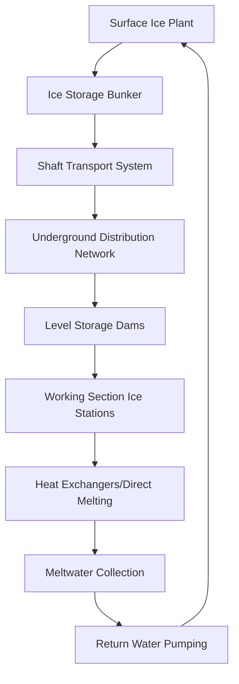

Ice-based cooling systems exploit the latent heat of fusion to provide efficient thermal energy storage and distribution for deep underground mining operations. These systems deliver cooling capacity by transporting ice or ice slurry to working areas where the phase change from solid to liquid absorbs heat at constant temperature, providing superior heat removal compared to sensible cooling alone.

## Physical Principles of Ice Cooling

The fundamental advantage of ice-based cooling derives from water's latent heat of fusion. When ice melts at 0°C, it absorbs energy without temperature change according to:

$$Q_{latent} = m \cdot h_{fg}$$

where $Q_{latent}$ is the cooling energy (kJ), $m$ is the ice mass (kg), and $h_{fg}$ is the latent heat of fusion (334 kJ/kg for water).

This latent heat capacity represents a volumetric energy density of approximately 93 kWh/m³, significantly higher than sensible cooling from chilled water alone. For comparison, cooling water from 10°C to 0°C provides only:

$$Q_{sensible} = m \cdot c_p \cdot \Delta T = m \cdot 4.18 \cdot 10 = 41.8 \text{ kJ/kg}$$

The total cooling capacity combining both sensible and latent effects becomes:

$$Q_{total} = m \cdot [c_{p,ice} \cdot \Delta T_{ice} + h_{fg} + c_{p,water} \cdot \Delta T_{water}]$$

For ice delivered at -5°C and melting to water at 5°C, this yields approximately 376 kJ/kg of total cooling capacity.

## Ice Production Systems

### Surface Ice Plants

Central ice production facilities at the surface generate ice through conventional refrigeration cycles operating at evaporator temperatures between -10°C and -15°C. Two primary production methods exist:

**Direct Expansion Systems**: Refrigerant evaporators submerged in agitated water tanks freeze ice layers on tube surfaces. Harvest cycles periodically warm tubes to release ice pieces for storage.

**Ice Builders**: Chilled glycol or brine circulates through heat exchangers submerged in water tanks. Ice accumulates on exchanger surfaces until harvest.

| System Type | Production Rate | Energy Efficiency | Capital Cost |
|-------------|-----------------|-------------------|--------------|
| Direct Expansion | 50-200 tons/day | COP 2.5-3.0 | Medium |
| Ice Builder | 100-500 tons/day | COP 2.2-2.8 | High |
| Flake Ice | 20-100 tons/day | COP 2.0-2.5 | Low |

### Underground Ice Production

Some operations install ice-making equipment underground to eliminate transport losses. This requires substantial electrical power infrastructure and creates additional heat rejection challenges, as the refrigeration system's condenser heat must be removed through ventilation or cooling water circuits.

## Ice Distribution Systems

### Block Ice Transport

Traditional systems produce ice in blocks (typically 25-50 kg each) transported underground via skip or cage. Block ice is stored in insulated bunkers at underground levels and distributed to working areas using rail cars or conveyor systems.

Transport efficiency becomes critical as heat gain during distribution reduces delivered cooling capacity:

$$\eta_{transport} = \frac{Q_{delivered}}{Q_{produced}} = 1 - \frac{q_{gain} \cdot t_{transport}}{m \cdot h_{fg}}$$

where $q_{gain}$ is the heat gain rate (kW) and $t_{transport}$ is transport time (hours).

### Ice Slurry Systems

Modern installations increasingly employ ice slurry—a pumpable mixture of fine ice crystals suspended in water or brine. Typical slurry contains 20-40% ice by mass, allowing pipeline distribution similar to chilled water while maintaining latent heat advantages.

The ice packing fraction $\phi$ determines the cooling capacity per unit volume:

$$q_{volume} = \phi \cdot \rho_{ice} \cdot h_{fg} + (1-\phi) \cdot \rho_{water} \cdot c_{p,water} \cdot \Delta T$$

For a 30% ice slurry ($\phi = 0.30$), this yields approximately 110 kWh/m³ of cooling capacity—three times that of conventional chilled water systems.

## Melting Rate Calculations

The ice melting rate in underground heat exchangers depends on the heat transfer effectiveness and temperature difference between the hot mine air and the ice/water mixture. For forced convection over ice surfaces:

$$\dot{m}_{melt} = \frac{h \cdot A \cdot (T_{air} - T_{ice})}{h_{fg}}$$

where $h$ is the convective heat transfer coefficient (W/m²·K), $A$ is the contact area (m²), and $T_{air}$ is the entering air temperature (°C).

For direct air-to-ice heat exchangers with air velocities of 2-4 m/s, typical heat transfer coefficients range from 25-50 W/m²·K. This yields specific melting rates of 3-6 kg of ice per m² of contact surface per hour for 32°C intake air.

## Ice vs. Conventional Refrigeration

The economic and technical comparison between ice-based cooling and direct mechanical refrigeration depends on several factors:

| Parameter | Ice Systems | Direct Refrigeration |
|-----------|-------------|---------------------|
| Energy Storage | Excellent (shift to off-peak) | None (continuous operation) |
| Distribution Complexity | High (physical handling) | Medium (piping only) |
| Underground Equipment | Minimal | Substantial |
| Heat Rejection Underground | None | Significant (1.3-1.4 × cooling) |
| Maintenance Intensity | Low | High (moving equipment) |
| Response to Demand Peaks | Excellent (stored capacity) | Limited (installed capacity) |
| Capital Cost per kW | Medium | High (underground installation) |

The thermal advantage of ice systems becomes apparent when examining the full thermodynamic cycle. Direct underground refrigeration must reject all absorbed heat plus compressor work heat underground, requiring:

$$Q_{reject} = Q_{cooling} \cdot \left(\frac{1}{COP} + 1\right)$$

For a COP of 3.0, this creates 1.33 kW of heat rejection for every 1 kW of cooling—partially offsetting the benefit. Ice systems reject this heat at the surface where ambient temperatures are lower and heat rejection capacity is greater.

## South African Deep Mine Applications

South African gold and platinum mines pioneered ice cooling for operations extending beyond 3,000 meters depth where virgin rock temperatures exceed 50°C. These extreme conditions make ice cooling particularly advantageous.

### Typical Installation Parameters

- Production capacity: 200-600 tons ice per day
- Delivery depth: 2,000-3,500 meters
- Working section temperatures: 28-35°C wet bulb before cooling
- Target cooling: 8-12°C reduction in working areas
- Ice to cooling load ratio: 0.6-0.8 kg ice per kWh of cooling delivered

### Operational Experience

Major installations at mines including TauTona, Mponeng, and Beatrix demonstrated sustained ice delivery rates exceeding 400 tons/day to depths of 3,500+ meters. The systems achieved working section cooling effectiveness of 65-80%, with losses attributed to:

- Transport heat gain: 8-12%
- Storage and handling: 5-8%
- Distribution inefficiencies: 10-15%

Energy costs for ice production typically range from 0.08-0.12 kWh per kg of ice, making load shifting to off-peak electricity periods economically significant. Many operations produce ice exclusively during low-tariff periods (typically 22:00-06:00), storing sufficient capacity for 24-hour cooling demands.

## Design Considerations

Effective ice cooling system design requires careful analysis of:

1. **Production-to-demand matching**: Size ice plants for peak daily demand plus 15-20% contingency
2. **Storage capacity**: Provide minimum 8-12 hours of cooling capacity at peak demand
3. **Transport logistics**: Minimize handling stages and transport time to reduce thermal losses
4. **Distribution design**: Optimize pipe sizing for slurry systems to balance pumping energy against transport time
5. **Integration with ventilation**: Coordinate ice cooling with airflow patterns to maximize effectiveness

The specific cooling delivery per unit mass of ice varies with implementation method but typically ranges from 250-320 kJ/kg in practice—representing 75-95% utilization of theoretical latent heat capacity when accounting for all system losses.

## Conclusion

Ice-based cooling systems provide technically and economically viable solutions for deep mine heat stress control, particularly where extreme depths create virgin rock temperatures exceeding 45°C. The latent heat advantage, ability to shift electrical loads, and minimal underground mechanical equipment make these systems competitive with conventional refrigeration despite handling complexities. Continued development of ice slurry technologies and improved distribution methods enhance system effectiveness and reduce operational costs.
