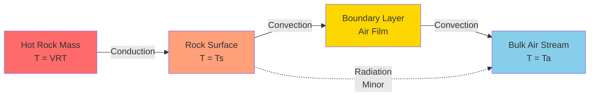
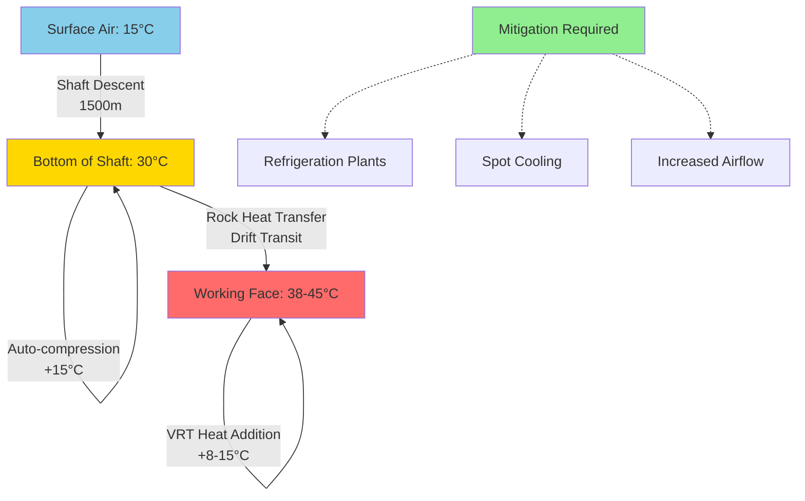

## Virgin Rock Temperature Fundamentals

Virgin rock temperature (VRT) represents the undisturbed temperature of rock strata at depth, controlled by the Earth's geothermal gradient. This parameter becomes the dominant heat source in deep mining operations, often exceeding all other thermal loads including metabolic heat, machinery, and oxidation processes.

The geothermal gradient describes the rate of temperature increase with depth below the Earth's surface. In most mining regions, this gradient ranges from **1°C per 30-40 m of vertical depth** (approximately 0.025-0.033°C/m or 1.4-1.8°F per 100 ft). Surface temperature plus geothermal contribution determines the VRT at any given depth:

$$T_{VRT} = T_{surface} + \frac{z}{30 \text{ to } 40}$$

where $T_{VRT}$ is virgin rock temperature (°C), $T_{surface}$ is mean annual surface temperature (°C), and $z$ is depth below surface (m).

At 1,500 m depth with a surface temperature of 15°C and a gradient of 1°C per 35 m, the VRT reaches approximately 58°C (136°F), creating severe challenges for maintaining acceptable working conditions per MSHA regulations under 30 CFR 57.5060.

## Geothermal Heat Transfer Mechanisms

Heat flows from the hot rock mass to cooler mine air through three distinct mechanisms, with conduction dominating the initial transfer:

The steady-state heat flux from rock to air follows Fourier's law combined with Newton's law of cooling:

$$q'' = \frac{T_{VRT} - T_a}{\frac{L}{k} + \frac{1}{h}}$$

where $q''$ is heat flux (W/m²), $L$ is depth of thermal penetration into rock (m), $k$ is rock thermal conductivity (typically 2.5-3.5 W/m·K), $h$ is convective heat transfer coefficient at rock-air interface (5-25 W/m²·K), and $T_a$ is bulk air temperature (°C).

The thermal penetration depth depends on ventilation duration. Newly excavated drifts exhibit maximum heat transfer rates (100-150 W/m²) that decay exponentially as the rock surface cools. After several months of continuous ventilation, heat flux stabilizes to 20-40 W/m² depending on air velocity and VRT differential.

## VRT Measurement Methods

Accurate VRT determination requires measurement techniques that eliminate transient thermal effects from ventilation and excavation activities:

| Method | Depth Required | Accuracy | Time to Equilibrium | Application |
|--------|----------------|----------|---------------------|-------------|
| **Borehole thermometry** | 10-15 m into solid rock | ±0.5°C | 48-72 hours | Gold standard for VRT |
| **Production hole measurement** | 3-5 m minimum | ±1-2°C | 24-48 hours | Practical field method |
| **Extrapolation from multiple shallow holes** | 2-3 m each | ±1-3°C | 12-24 hours per hole | Quick assessment |
| **Thermal conductivity back-calculation** | Surface only | ±3-5°C | Immediate | Preliminary estimates |

The borehole method involves drilling horizontally into the rib or roof, inserting calibrated resistance temperature detectors (RTDs) at multiple depths, sealing the hole with insulation, and monitoring until readings stabilize. The deepest sensor provides the most reliable VRT reading, as measurements closer to the opening show cooling effects from ventilation.

## Auto-Compression Heating

Air descending down shafts or declines undergoes adiabatic compression, increasing in temperature even before contacting hot rock. This auto-compression effect follows the dry adiabatic lapse rate:

$$\frac{dT}{dz} = -\frac{g}{c_p} = -0.00976 \text{ K/m} \approx -1°C/100\text{ m}$$

where $g$ is gravitational acceleration (9.81 m/s²) and $c_p$ is specific heat of air at constant pressure (1005 J/kg·K).

For a vertical descent of 1,500 m, auto-compression heating alone adds approximately **15°C** to the intake air temperature before any rock heat transfer occurs. Combined with VRT effects, this creates intake air temperatures routinely exceeding 40°C (104°F) in deep operations.

The auto-compression temperature rise is independent of airflow rate and occurs in all downcast airways. Upcast airways experience the reverse effect (auto-expansion cooling), but this benefit is typically negated by accumulated heat from machinery, blasting, and rock surface heat transfer throughout the mine.

## Impact on Ventilation System Design

Virgin rock temperature fundamentally constrains deep mine ventilation design. MSHA requires wet-bulb temperatures not to exceed 30.6°C (87°F) in working areas under 30 CFR 57.5060, but dry-bulb temperatures approaching 50°C are common in ultra-deep operations (>2,500 m).

### Heat Load Calculation

The total sensible heat addition from VRT sources includes both auto-compression and rock surface heat transfer:

$$Q_{total} = Q_{auto} + Q_{rock} = \dot{m} c_p \Delta T_{auto} + q'' A_{surface}$$

where $\dot{m}$ is air mass flow rate (kg/s), $\Delta T_{auto}$ is auto-compression temperature rise (K), and $A_{surface}$ is exposed rock surface area (m²).

For a typical development heading (5 m × 5 m cross-section, 1,000 m length, 50 m³/s airflow, 1,500 m depth):

- Auto-compression heat: $\dot{Q}_{auto} = 60 \times 1005 \times 15 = 905$ kW
- Rock surface heat (40 W/m², 20,000 m² surface): $\dot{Q}_{rock} = 40 \times 20,000 = 800$ kW
- **Total VRT heat load: 1,705 kW**

This thermal burden requires either massive refrigeration capacity (often 5-15 MW for entire mine) or extremely high ventilation rates (>400 m³/s for large operations), both representing major capital and operating costs.

### Design Strategies

| Strategy | Effectiveness | Capital Cost | Operating Cost | Limitations |
|----------|---------------|--------------|----------------|-------------|
| **Increased airflow** | Moderate (dilution only) | Low-Medium | High (fan power) | Diminishing returns, noise |
| **Refrigeration plants** | High (active cooling) | Very High | Very High (energy) | Complex maintenance, space |
| **Ice/phase change materials** | High (spot cooling) | Medium | Medium | Logistics, recharging |
| **Insulation of hot rock** | Low-Moderate | Low | Minimal | Delays heat, doesn't eliminate |
| **Water sprays** | Moderate (evaporative) | Low | Low-Medium | Humidity increase |

Modern deep mines typically employ combinations of these strategies, with surface or underground refrigeration plants providing chilled water distributed to heat exchangers throughout the mine, supplemented by spot cooling at high-intensity work areas.

---

**Regulatory Note:** MSHA enforcement under 30 CFR 57.5060 and 30 CFR 57.5061 requires environmental monitoring and corrective action when wet-bulb temperatures exceed limits. Accurate VRT characterization during mine planning stages is essential for designing compliant ventilation systems before production begins.