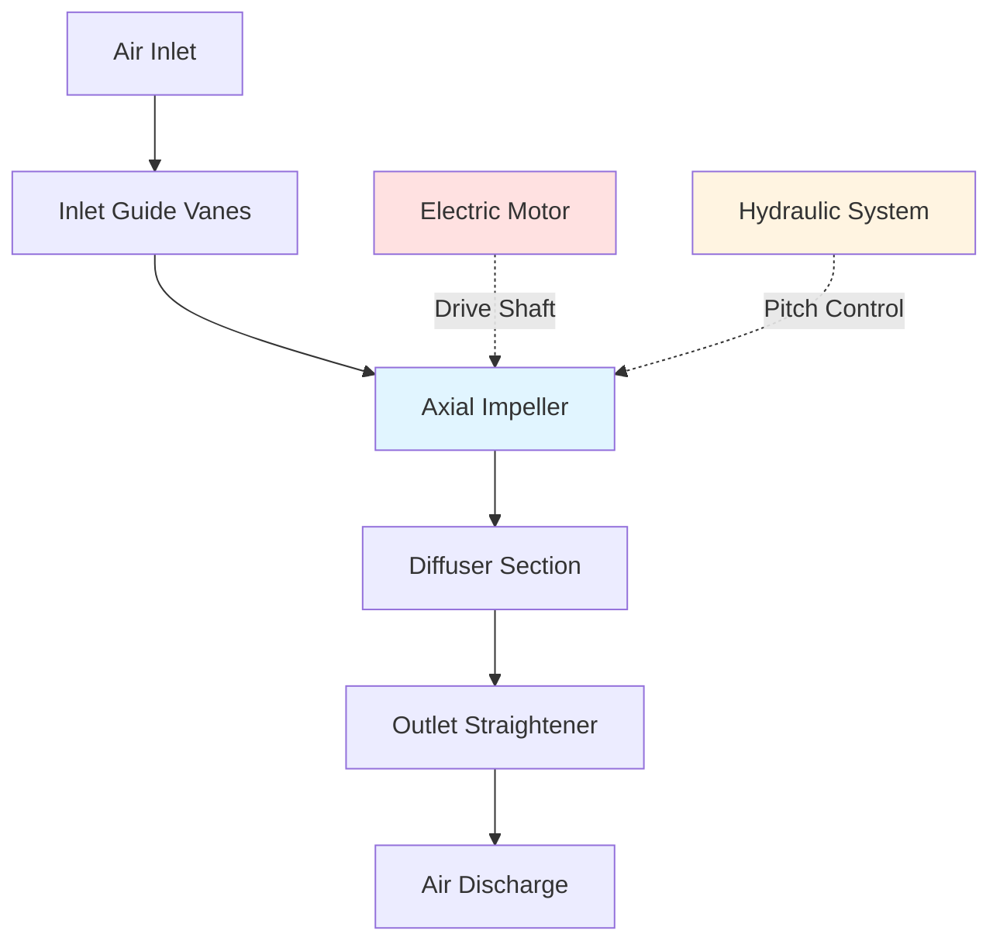

Axial main fans represent the predominant fan type for mine ventilation applications, delivering high volumetric airflow rates with superior efficiency compared to centrifugal designs. These fans move air parallel to the shaft axis using aerodynamic impeller blades, making them ideal for the large-volume, moderate-pressure requirements typical of underground mining operations.

## Axial Fan Design for Mining Applications

Mining axial fans feature robust construction to withstand continuous operation in harsh environments. The impeller consists of airfoil-shaped blades mounted on a central hub, enclosed within a cylindrical casing. Blade profiles follow NACA or custom airfoil sections optimized for mining duty, typically ranging from 4 to 16 blades depending on fan diameter and performance requirements.

Fan diameters for main mine ventilation typically range from 1.5 to 7 meters (5 to 23 feet), with larger installations moving over 1,000 m³/s (2,000,000 cfm). The impeller rotates at speeds between 300 and 1,200 rpm, selected to balance efficiency, noise, and structural considerations.

## Adjustable Pitch Blade Systems

Modern mine fans incorporate adjustable pitch blade mechanisms allowing blade angle modification during operation or shutdown. This capability provides critical operational flexibility:

**During Operation (On-the-Fly Adjustment):**
- Hydraulic or electric actuators adjust blade pitch while running
- Response to changing mine resistance conditions
- Optimization for seasonal temperature variations
- Adjustment range typically ±15° from design position

**Shutdown Adjustment:**
- Manual or motorized pitch changes when fan is stopped
- Greater adjustment range (often ±30°)
- Permanent mine configuration changes
- Retrofit capability for performance optimization

The blade angle directly affects fan performance according to:

$$Q = \frac{\pi D^2}{4} \times C_x \times U$$

where $Q$ is volumetric flow rate, $D$ is fan diameter, $C_x$ is axial flow coefficient (function of blade angle), and $U$ is blade tip velocity.

## Performance Characteristics and Curves

Axial fan performance is characterized by pressure-volume relationships across the operating range. The total pressure developed follows:

$$P_t = \rho \times U^2 \times \psi$$

where $\rho$ is air density, $U$ is tip speed, and $\psi$ is the pressure coefficient determined by blade geometry and angle.

Performance curves exhibit characteristic shapes:
- **Steep region:** Low flow, high pressure (operation avoided due to instability)
- **Design point:** Maximum efficiency, stable operation
- **Flat region:** Higher flow, reduced pressure (typical operating range)

## Axial Fan Characteristics

| Parameter | Typical Range | Mining Application |
|-----------|--------------|-------------------|
| **Fan Diameter** | 1.5 - 7.0 m | Main ventilation: 3-6 m |
| **Volume Flow** | 50 - 1,200 m³/s | Average mine: 200-600 m³/s |
| **Total Pressure** | 1,000 - 6,000 Pa | Typical: 2,500-4,000 Pa |
| **Tip Speed** | 50 - 120 m/s | Optimum: 70-90 m/s |
| **Efficiency (Peak)** | 82% - 91% | Modern designs: 86-89% |
| **Power Range** | 100 - 5,000 kW | Large mines: 1,000-3,000 kW |
| **Blade Angle Range** | -15° to +45° | Operating: 15-35° |

## Pressure and Volume Capabilities

Axial fans excel in high-volume, moderate-pressure applications. The fan laws govern performance at varying speeds:

$$\frac{Q_2}{Q_1} = \frac{N_2}{N_1}$$

$$\frac{P_2}{P_1} = \left(\frac{N_2}{N_1}\right)^2$$

$$\frac{W_2}{W_1} = \left(\frac{N_2}{N_1}\right)^3$$

where $Q$ is flow rate, $P$ is pressure, $W$ is power, and $N$ is rotational speed.

Single-stage axial fans typically develop 2,000-4,500 Pa total pressure. For deeper mines requiring higher pressures, counter-rotating dual-stage designs can achieve 6,000-8,000 Pa while maintaining axial flow advantages.

## Efficiency Considerations

Total fan efficiency combines aerodynamic, mechanical, and motor efficiency:

$$\eta_{total} = \eta_{aero} \times \eta_{mech} \times \eta_{motor}$$

Peak aerodynamic efficiency occurs at the design point where blade angle, flow rate, and pressure match optimal conditions. Operating away from design reduces efficiency according to:

$$\eta = \eta_{max} - k_1(Q - Q_{design})^2 - k_2(P - P_{design})^2$$

Factors affecting efficiency:
- **Blade profile quality:** Manufacturing precision impacts boundary layer control
- **Tip clearance:** Maintain <0.5% of diameter to minimize leakage losses
- **Reynolds number:** Scale effects in large fans improve efficiency
- **Surface roughness:** Blade coating and cleaning protocols
- **Inlet conditions:** Uniform flow distribution critical

## Installation Configurations

**Forcing Configuration:**
- Fan pushes fresh air into mine
- Pressurizes underground workings
- Advantages: Clean air through fan, easier access for maintenance
- Challenges: Leakage from pressurized system, distribution complexity

**Exhausting Configuration:**
- Fan pulls contaminated air from mine
- Depressurizes underground workings
- Advantages: Natural air distribution, captures all contaminants
- Disadvantages: Corrosive air through fan, moisture handling

The installation pressure efficiency is:

$$\eta_{installation} = \frac{P_{static-delivered}}{P_{fan-total}}$$

Proper diffuser design (7-12° divergence angle) and evasé installations recover velocity pressure, achieving installation efficiencies of 0.85-0.95 for exhausting fans and 0.75-0.85 for forcing configurations.

Axial fan selection requires matching system resistance curves with fan characteristic curves at the specified operating density, typically considering mine air at 20-30°C with elevated humidity levels affecting density by 2-5%.
