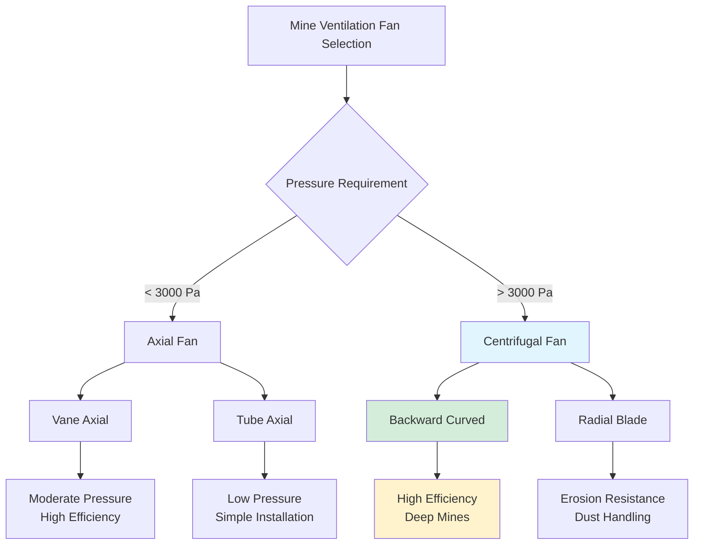

## Centrifugal Fan Fundamentals

Centrifugal fans dominate deep mine ventilation applications where high static pressures exceed the capabilities of axial designs. These fans impart energy to air through centrifugal force generated by rotating impellers, converting velocity pressure to static pressure within the fan housing. The fundamental relationship governing centrifugal fan performance:

$$P_s = \rho \cdot \psi \cdot u_2^2$$

where $P_s$ is static pressure developed (Pa), $\rho$ is air density (kg/m³), $\psi$ is the pressure coefficient (dimensionless), and $u_2$ is the impeller tip speed (m/s).

## Centrifugal Fan Types

### Backward Curved Blade Fans

Backward curved (BC) fans feature blades inclined away from the direction of rotation, typically at 15-35° from radial. These designs offer the highest efficiency (75-85%) and self-limiting power characteristics. The velocity triangle at the impeller exit:

$$u_2 = \frac{\pi D_2 N}{60}$$

where $D_2$ is impeller diameter (m) and $N$ is rotational speed (rpm).

BC fans exhibit non-overloading power curves—motor power peaks at approximately 60-70% of maximum flow and decreases at higher flows. This characteristic protects motors during system changes or door failures.

### Radial Blade Fans

Radial blade fans have straight blades extending from hub to rim. While less efficient (65-75%) than BC designs, radial fans handle dust-laden air and resist erosion in abrasive environments. They develop higher pressures at lower flows, making them suitable for systems with high resistance.

### Forward Curved Blade Fans

Forward curved fans are rarely used in mine ventilation due to overloading characteristics and lower efficiency. The sharply rising power curve can overload motors during high-flow conditions.

## High-Pressure Capabilities

Centrifugal fans routinely develop static pressures of 5,000-15,000 Pa in deep mine applications, with specialized designs reaching 25,000 Pa. Pressure capability scales with tip speed squared:

$$\frac{P_2}{P_1} = \left(\frac{N_2}{N_1}\right)^2$$

Multi-stage centrifugal fans achieve extreme pressures by arranging two or more impellers in series. Each stage adds pressure incrementally, with interstage diffusers converting velocity to static pressure between stages.

## Applications in Deep Mines

Mines exceeding 1,500 m depth require centrifugal fans to overcome shaft friction losses and elevation head. The total pressure requirement:

$$P_{total} = P_{friction} + P_{shock} + \rho g h$$

where $h$ is vertical depth (m) and $g$ is gravitational acceleration (9.81 m/s²).

Centrifugal fans excel in:

- **Shaft ventilation**: Downcast and upcast shaft resistance
- **Booster fans**: Underground stations requiring pressure boost
- **Auxiliary systems**: High-resistance ducted ventilation
- **Variable density applications**: Deep shafts with temperature stratification

## Surge and Stall Characteristics

Surge occurs when flow reduces below the fan's stable operating range, causing flow reversal and pressure oscillations. The surge line represents the left boundary of stable operation on the fan curve. Critical surge margin:

$$SM = \frac{P_{surge} - P_{op}}{P_{op}} \times 100\%$$

Minimum recommended surge margin is 15-20% for mine fans. Stall results from boundary layer separation on blade surfaces, reducing pressure development and efficiency. Unlike axial fans with abrupt stall, centrifugal fans exhibit gradual stall progression.

**Surge Prevention Methods:**
- Operating point selection 20% right of surge line
- Anti-surge control systems with flow measurement
- Variable inlet guide vanes for flow modulation
- Blow-off valves for rapid pressure relief

## Fan Housings and Drift Connections

Centrifugal fan housings convert impeller discharge velocity to static pressure through gradual expansion. The scroll (volute) housing follows logarithmic spiral geometry:

$$r = r_2 \cdot e^{\theta \tan\alpha}$$

where $r_2$ is impeller radius, $\theta$ is angular position, and $\alpha$ is spiral angle (typically 60-75°).

**Housing Design Considerations:**

- **Material**: Reinforced concrete or steel plate (6-12 mm thick)
- **Cutoff clearance**: 5-8% of impeller diameter
- **Discharge diffuser**: 10-15° included angle expansion
- **Access doors**: Personnel entry and maintenance openings

Drift connections integrate the fan discharge with mine airways. Proper transition design minimizes shock losses:

$$\Delta P_{shock} = K \cdot \frac{\rho V^2}{2}$$

where $K$ is the loss coefficient (0.1-0.3 for well-designed transitions).

## Comparison with Axial Fans

| **Parameter** | **Centrifugal (BC)** | **Centrifugal (Radial)** | **Vane Axial** |
|---------------|---------------------|-------------------------|----------------|
| **Pressure range (Pa)** | 3,000-15,000 | 4,000-20,000 | 1,000-4,000 |
| **Peak efficiency (%)** | 75-85 | 65-75 | 80-88 |
| **Footprint** | Large | Large | Compact |
| **Installation complexity** | High | High | Moderate |
| **Dust tolerance** | Good | Excellent | Poor |
| **Surge margin** | 15-20% | 20-25% | 10-15% |
| **Power characteristic** | Non-overloading | Overloading | Overloading |
| **Vibration sensitivity** | Moderate | Low | High |
| **Typical mine depth** | > 1,500 m | > 2,000 m | < 1,000 m |

## Fan Selection Criteria

The fan affinity laws govern performance scaling:

$$\frac{Q_2}{Q_1} = \frac{N_2}{N_1}, \quad \frac{P_2}{P_1} = \left(\frac{N_2}{N_1}\right)^2, \quad \frac{W_2}{W_1} = \left(\frac{N_2}{N_1}\right)^3$$

Select centrifugal fans when:

1. System resistance exceeds 3,000 Pa
2. Mine depth requires high static pressure development
3. Non-overloading power characteristics protect infrastructure
4. Space permits larger housing installation
5. Dust or moisture requires robust impeller design

Backward curved designs optimize efficiency for clean air applications, while radial blades suit erosive or particulate-laden environments. Proper surge margin ensures stable operation across load variations encountered in mine ventilation networks.

## Performance Monitoring

Critical monitoring parameters include:

- **Pressure rise**: Inlet to outlet static pressure differential
- **Flow rate**: Pitot traverse or anemometer measurement
- **Vibration**: Displacement and acceleration at bearing housings
- **Temperature**: Bearing and motor winding temperatures
- **Power consumption**: Motor electrical input

Deviations from baseline performance indicate blade erosion, buildup accumulation, or mechanical degradation requiring maintenance intervention.
