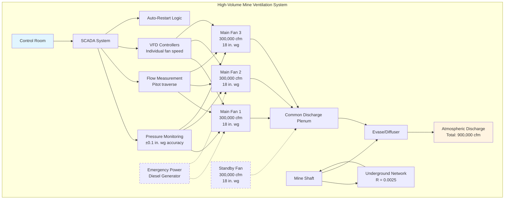

## Large Mine Fan Requirements

High-volume mine ventilation fans serving deep or extensive underground mining operations require careful engineering to deliver airflow rates exceeding 100,000 cfm while overcoming substantial system resistance. These main fans represent the primary life safety system for underground workers and must operate continuously with exceptional reliability.

**Critical Design Parameters:**

- **Flow capacity:** 100,000 to 1,000,000+ cfm for large mining complexes
- **Static pressure development:** 8 to 30 inches water gauge depending on mine depth and resistance
- **Motor power:** 200 to 2,000+ horsepower per fan
- **Duty cycle:** Continuous operation (24/7/365)
- **Redundancy requirements:** N+1 or 2N capacity for emergency backup
- **Efficiency targets:** 75-85% total fan efficiency at design point

The fan selection must account for mine expansion plans, seasonal temperature variations affecting air density, and deterioration of airways over time that increases resistance.

## Flow Rate Calculation Methods

Mine airflow requirements derive from multiple factors including personnel count, diesel equipment operation, heat loads, and explosive gas dilution requirements.

**Personnel Ventilation:**

$$Q_{\text{personnel}} = N_{\text{workers}} \times q_{\text{person}}$$

where $N_{\text{workers}}$ is the maximum number of workers underground simultaneously and $q_{\text{person}}$ is typically 100-200 cfm per person depending on jurisdiction.

**Diesel Equipment Ventilation:**

$$Q_{\text{diesel}} = \sum (P_{\text{brake}} \times K_{\text{diesel}})$$

where $P_{\text{brake}}$ is the brake horsepower of each diesel unit and $K_{\text{diesel}}$ ranges from 100-150 cfm per brake horsepower.

**Heat Load Removal:**

$$Q_{\text{heat}} = \frac{q_{\text{total}}}{c_p \times \rho \times \Delta T_{\text{allowable}}}$$

where $q_{\text{total}}$ is the total heat load (Btu/hr), $c_p$ is specific heat of air (0.24 Btu/lb·°F), $\rho$ is air density (lb/ft³), and $\Delta T_{\text{allowable}}$ is the permitted temperature rise.

**Total System Requirement:**

$$Q_{\text{total}} = \max(Q_{\text{personnel}}, Q_{\text{diesel}}, Q_{\text{heat}}) \times SF$$

where $SF$ is a safety factor typically ranging from 1.15 to 1.25.

## Mine Resistance and Fan Matching

The mine ventilation network exhibits resistance to airflow that increases approximately with the square of velocity. Accurate resistance calculation is essential for proper fan selection.

**Atkinson's Equation for Mine Resistance:**

$$H = RQ^2$$

where $H$ is pressure loss (inches water gauge), $R$ is mine resistance (in. wg·s²/ft⁶ × 10⁻¹⁰), and $Q$ is airflow rate (cfm).

**System Resistance Determination:**

Mine resistance calculation requires detailed airway surveys including:

- Airway dimensions (cross-sectional area, perimeter, length)
- Surface roughness (friction factor: 0.00015-0.015 ft depending on wall condition)
- Shock losses at junctions, bends, and obstructions (K-factors: 0.1-2.0)
- Airlock and door resistances

The total system resistance curve must intersect with the fan characteristic curve at the desired operating point. For optimal efficiency, this intersection should occur within 85-115% of the fan's best efficiency point (BEP).

**Fan Laws for Operating Point Adjustment:**

$$\frac{Q_2}{Q_1} = \frac{N_2}{N_1}, \quad \frac{H_2}{H_1} = \left(\frac{N_2}{N_1}\right)^2, \quad \frac{P_2}{P_1} = \left(\frac{N_2}{N_1}\right)^3$$

where $N$ is fan speed (rpm), $Q$ is flow, $H$ is pressure, and $P$ is power.

## Multiple Fan Installations

Large mining operations frequently employ multiple fans in parallel or series configurations to achieve required flow and pressure characteristics.

**Parallel Operation:**

Fans in parallel increase total flow capacity while maintaining similar pressure development:

$$Q_{\text{total}} = Q_1 + Q_2 + ... + Q_n \text{ (at constant pressure)}$$

Parallel fans must have closely matched characteristics to prevent flow imbalance. Each fan should have individual dampers and instrumentation.

**Series Operation:**

Fans in series increase total pressure while maintaining similar flow:

$$H_{\text{total}} = H_1 + H_2 + ... + H_n \text{ (at constant flow)}$$

Series configurations are less common in mine ventilation but may be used for exceptionally deep or high-resistance mines.

**Fan Arrays:**

Modern large mines often utilize 2-6 fans in parallel configurations with:
- Individual VFD control for load matching
- Automatic staging based on mine demand
- Redundancy for maintenance and emergency backup
- Load sharing algorithms to optimize combined efficiency

## Control and Monitoring Systems

High-volume mine fans require sophisticated control and monitoring systems to ensure safe, efficient operation.

**Essential Monitoring Parameters:**

- Real-time airflow measurement (pitot arrays or anemometer stations)
- Static pressure at fan inlet and discharge (±0.1 in. wg accuracy)
- Fan speed, motor current, power consumption
- Bearing temperatures and vibration levels
- Mine shaft pressure and underground monitoring stations
- Methane, CO, and O₂ concentrations at strategic locations

**Control Strategies:**

Variable frequency drives enable several control modes:

1. **Constant pressure control:** Maintains fixed static pressure regardless of mine resistance changes
2. **Constant flow control:** Maintains target airflow using feedback from flow measurement
3. **Demand-based control:** Adjusts total flow based on underground activity and gas concentrations
4. **Optimization control:** Balances multiple fans for minimum total energy consumption

**Automatic Safety Functions:**

- Auto-restart after power interruption (critical for life safety)
- Emergency ramp to full speed on gas detection
- Automatic switchover to standby fan on primary failure
- Minimum flow interlocks to prevent fan surge or stall

## Energy Consumption Considerations

Large mine fans represent significant electrical loads, with annual energy costs often exceeding $500,000 for major installations.

**Power Consumption Calculation:**

$$P = \frac{Q \times H}{6356 \times \eta_{\text{fan}} \times \eta_{\text{motor}} \times \eta_{\text{drive}}}$$

where $P$ is power (hp), $Q$ is flow (cfm), $H$ is static pressure (in. wg), and efficiencies are expressed as decimals.

For a 500,000 cfm system at 15 in. wg with 80% fan efficiency, 96% motor efficiency, and 97% VFD efficiency:

$$P = \frac{500,000 \times 15}{6356 \times 0.80 \times 0.96 \times 0.97} = 1,596 \text{ hp} \approx 1,190 \text{ kW}$$

Annual energy consumption at $0.08/kWh: 1,190 kW × 8,760 hr × $0.08 = $834,000.

**Energy Optimization Strategies:**

| Strategy | Potential Savings | Implementation Considerations |
|----------|------------------|-------------------------------|
| VFD installation on constant-speed fans | 20-40% | Requires control system integration |
| Fan efficiency upgrades | 5-12% | May require fan replacement |
| Airway improvements (reduced R) | 10-30% | Capital intensive but permanent benefit |
| Demand-based control | 15-25% | Requires comprehensive monitoring |
| Multiple smaller fans vs. single large | 8-15% | Better part-load efficiency |
| High-efficiency motors (IE3/IE4) | 2-5% | Specify for new installations |

## Large Mine Fan Specifications

| Parameter | Small Installation | Medium Installation | Large Installation | Notes |
|-----------|-------------------|---------------------|-------------------|-------|
| **Flow Rate** | 100,000-250,000 cfm | 250,000-600,000 cfm | 600,000-1,200,000 cfm | Total system capacity |
| **Static Pressure** | 8-12 in. wg | 12-20 in. wg | 18-30 in. wg | Function of mine depth |
| **Fan Type** | Axial or centrifugal | Axial (single stage) | Axial (multi-stage) | Axial preferred for high flow |
| **Motor Power** | 200-500 hp | 500-1,500 hp | 1,500-3,000+ hp | Per fan unit |
| **Fan Diameter** | 72-96 inches | 96-144 inches | 144-240 inches | Axial fan impeller |
| **Speed Range** | 300-600 rpm | 250-450 rpm | 200-350 rpm | VFD controlled |
| **Efficiency (Total)** | 75-80% | 78-83% | 80-85% | At design point |
| **Sound Level** | 95-105 dB(A) | 100-110 dB(A) | 105-115 dB(A) | At 3 ft from housing |
| **Redundancy** | N+1 (2 fans) | N+1 (3-4 fans) | N+1 or 2N (5-8 fans) | Reliability requirement |
| **Capital Cost** | $500K-$1.5M | $1.5M-$4M | $4M-$12M | Complete installation |

**Common Manufacturers:** Howden, TLT-Babcock, Robinson, Joy, ABB, Siemens (high-efficiency motors).

The selection and operation of high-volume mine ventilation fans requires multidisciplinary expertise spanning aerodynamics, electrical engineering, mine planning, and safety regulations. Proper system design with adequate capacity, efficiency, and redundancy is essential for protecting worker health and enabling productive mining operations.
