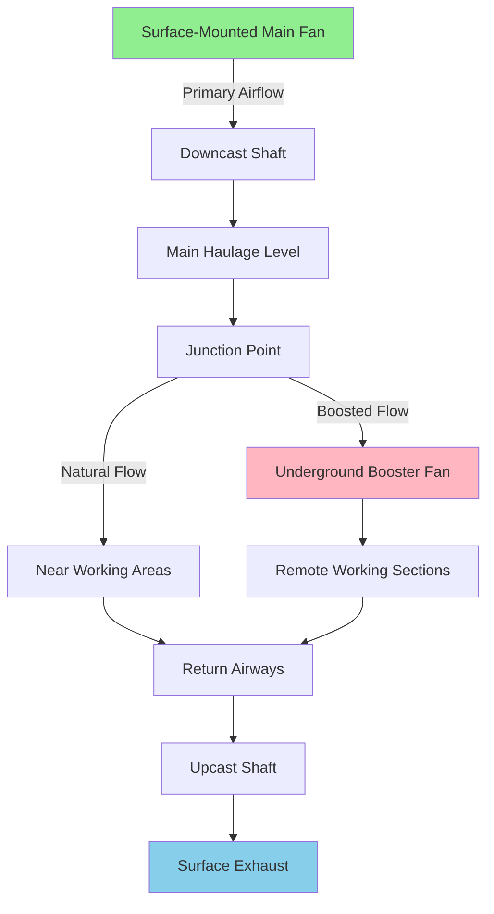

## Surface-Mounted Fan Configurations

Surface-mounted main fans represent the primary ventilation approach for most mining operations. These installations position large centrifugal or axial fans at shaft collars or portal entries, creating the driving force for mine-wide airflow systems.

**Exhaust Fan Placement**

The most common configuration places fans on the exhaust (upcast) shaft, pulling contaminated air from underground workings. This arrangement maintains negative pressure throughout the mine, preventing uncontrolled air leakage to surface and ensuring that any leakage flows into rather than out of the mine. The exhaust velocity at the fan outlet typically ranges from 2,000 to 4,000 fpm (10 to 20 m/s).

**Supply Fan Placement**

Supply (downcast) fans force fresh air into the mine through intake shafts. While less common for main ventilation due to pressurization concerns, this configuration offers advantages in specific applications where heating or cooling of intake air is required before entry.

**Series and Parallel Arrangements**

Large operations frequently employ multiple surface fans in series or parallel configurations. Series installations increase total pressure development: $\Delta P_{total} = \Delta P_1 + \Delta P_2$. Parallel arrangements increase volumetric capacity: $Q_{total} = Q_1 + Q_2$. Redundancy requirements typically mandate N+1 configuration, ensuring continued operation during maintenance or failure events.

## Underground Booster Fan Applications

Underground booster fans supplement main surface ventilation systems by increasing airflow to remote working sections or overcoming localized resistance.

**Strategic Placement**

Booster fans install at junction points, drift entries, or ventilation raise locations to direct air to specific working areas. Typical installations occur 1,000 to 5,000 feet from active faces, where natural ventilation pressure from surface fans diminishes below effective levels.

**Staging Calculations**

Booster fan pressure must overcome downstream resistance while accounting for upstream available pressure. The staging equation: $\Delta P_{booster} = R_{downstream} \times Q^2 - P_{available}$, where $R_{downstream}$ represents resistance coefficient in inches of water per million cubic feet squared (in H₂O/MMcfpm²).

**Coordination with Main Ventilation**

Booster fans must coordinate with main ventilation system operating curves to prevent flow reversal or stagnation. The combined system characteristic follows: $\Delta P_{system} = \Delta P_{main} + \Delta P_{booster} = (R_{main} + R_{branch})Q^2$.

## Comparative Analysis

| Criterion | Surface Mounting | Underground Mounting |
|-----------|------------------|----------------------|
| **Capacity Range** | 100,000-2,000,000 cfm | 10,000-200,000 cfm |
| **Pressure Development** | 10-40 in H₂O | 2-15 in H₂O |
| **Installation Cost** | $500,000-$5,000,000 | $50,000-$500,000 |
| **Maintenance Access** | Unrestricted surface access | Limited by shaft/drift access |
| **Power Supply** | Direct grid connection | Underground distribution required |
| **Environmental Protection** | Weather enclosures needed | Stable temperature environment |
| **Emergency Response** | External access maintained | May be inaccessible during events |
| **Operating Environment** | -40°F to 120°F ambient | 50°F to 90°F typical |

## Access for Maintenance

**Surface Fan Accessibility**

Surface installations provide unrestricted access for preventive maintenance, inspections, and emergency repairs. Crane access facilitates impeller removal, bearing replacement, and motor changeouts without mine production interruptions. Typical maintenance windows occur during shift changes or scheduled downtimes, with complete overhauls achievable in 24-72 hour periods.

**Underground Constraints**

Underground booster fan maintenance requires coordination with mine operations, shaft scheduling, and ventilation management. Access limitations restrict equipment size and require specialized rigging for component replacement. Fan removal often necessitates temporary ventilation adjustments affecting production schedules. Emergency repairs may require ventilation circuit modifications to maintain airflow during equipment downtime.

## Weather Protection for Surface Fans

Surface-mounted installations require comprehensive environmental protection systems addressing temperature extremes, precipitation, wind loads, and atmospheric contaminants.

**Enclosure Design**

Fan houses employ insulated metal panels or concrete construction providing thermal stability and acoustic attenuation. Heating systems maintain minimum operating temperatures of 40°F to prevent bearing lubricant congealing and structural icing. Ventilation openings incorporate louvers preventing rain and snow infiltration while allowing heat dissipation during operation.

**Cold Weather Operation**

Arctic and subarctic installations require heated enclosures maintaining 50-70°F internal temperatures. Heat recovery from motor inefficiency ($Q_{heat} = 2545 \times HP \times (1-\eta)$ BTU/hr) supplements building heating loads. Inlet air heating prevents ice formation on guide vanes and diffusers.

## Emergency Considerations

**Surface Fan Advantages**

External positioning ensures accessibility during underground emergencies. Reversible fans enable smoke ejection from escape routes during fire events. Multiple units provide redundancy maintaining minimum ventilation during single-unit failures. Emergency power connections facilitate diesel generator hookup during electrical outages.

**Underground Fan Vulnerabilities**

Fire, explosion, or ground instability may render underground boosters inoperable or inaccessible. Bypass airways around booster locations permit emergency ventilation routing if fans fail or require isolation. Explosion-proof construction (Class II, Division 1 or 2) prevents ignition of combustible dust atmospheres. Remote monitoring systems detect failures and enable immediate ventilation circuit adjustments.

**Backup Provisions**

Critical ventilation sections served by underground boosters require standby units or designed natural ventilation pathways maintaining minimum 30-50 fpm face velocities during fan outages. Emergency procedures define isolation protocols, alternative routing, and evacuation thresholds when booster failures compromise working section ventilation below regulatory minimums.

Surface-mounted main fans provide reliable, accessible, high-capacity ventilation for overall mine systems, while underground boosters extend effective ventilation to remote areas where surface fan pressure dissipates. Optimal mine ventilation design strategically combines both approaches, leveraging surface installations for primary airflow and underground units for targeted supplementation
