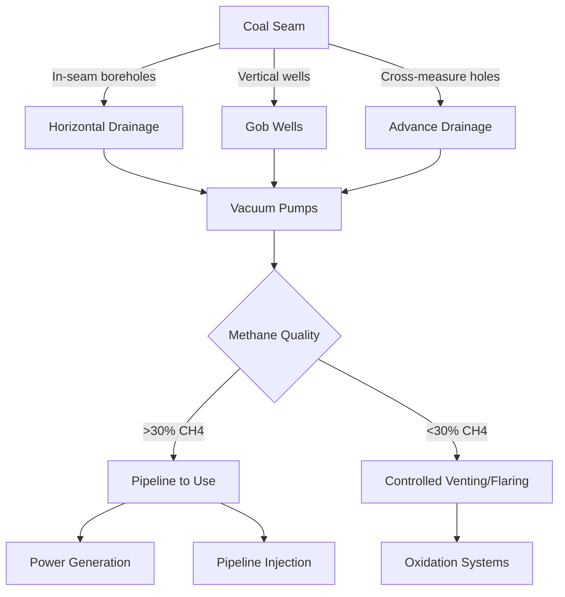

Methane (CH₄) control represents the most critical safety challenge in underground coal mine ventilation. Methane, a colorless, odorless gas liberated from coal seams during mining, forms explosive mixtures with air at concentrations between 5-15%. Ventilation systems must continuously dilute methane to safe levels below explosive limits while monitoring systems detect accumulations and trigger automatic protective actions.

## Methane Formation and Liberation

Coal beds contain methane formed during coalification, the geological process converting plant material to coal. Methane content increases with coal rank, from 1-2 m³/ton in sub-bituminous coals to 15-25 m³/ton in anthracite seams.

**Methane Release Mechanisms**

Mining activities liberate methane through three physical processes:

- **Desorption**: Pressure reduction from coal extraction allows adsorbed methane to desorb from internal coal surfaces following Langmuir isotherm behavior
- **Diffusion**: Concentration gradients drive methane migration from coal matrix through cleats and fractures
- **Displacement**: Groundwater or air displaces free gas in coal voids and surrounding strata

Liberation rates depend on coal permeability (typically 0.1-10 millidarcies), mining advance rate, and extent of strata disturbance. A typical longwall face may emit 10-30 cfm methane during production, with additional emissions from previously mined areas.

## Explosive Characteristics

Methane combustion follows the reaction:

$$\text{CH}_4 + 2\text{O}_2 \rightarrow \text{CO}_2 + 2\text{H}_2\text{O} + 891 \text{ kJ/mol}$$

The lower explosive limit (LEL) of 5.0% CH₄ represents the minimum concentration supporting flame propagation at standard conditions. Below LEL, insufficient fuel exists for sustained combustion. The upper explosive limit (UEL) of 15.0% CH₄ marks the oxygen-deficient boundary where combustion cannot proceed.

**Factors Affecting Explosibility**

| Parameter | Effect on LEL | Effect on UEL |
|-----------|---------------|---------------|
| Temperature increase (+100°C) | Decreases 0.3-0.5% | Increases 1-2% |
| Pressure increase (2 atm) | Decreases 0.2-0.4% | Increases 2-3% |
| Coal dust presence | Decreases significantly | Decreases moderately |
| Inert gas (N₂, CO₂) | Increases (safer) | Decreases (narrower range) |

Coal dust suspended in methane-air mixtures dramatically increases explosion violence and propagation velocity. Dust concentrations as low as 50-100 g/m³ can sustain flame propagation even outside normal methane explosive range, creating hybrid explosions requiring combined methane and dust control strategies.

## Dilution Ventilation Fundamentals

Dilution ventilation maintains methane concentrations below regulatory limits through adequate airflow. The fundamental dilution equation derives from mass balance:

$$Q_{\text{req}} = \frac{q_{\text{CH}_4}}{C_{\text{max}} - C_{\text{intake}}} \times SF$$

Where:
- $Q_{\text{req}}$ = Required airflow (cfm)
- $q_{\text{CH}_4}$ = Methane emission rate (cfm)
- $C_{\text{max}}$ = Maximum allowable concentration (decimal fraction)
- $C_{\text{intake}}$ = Intake air methane concentration (typically 0)
- $SF$ = Safety factor (1.25-1.5)

**Example Calculation**: A continuous miner section emits 8.5 cfm methane. Calculate required airflow to maintain 1.0% maximum concentration with 1.3 safety factor:

$$Q_{\text{req}} = \frac{8.5}{0.010 - 0} \times 1.3 = 1,105 \text{ cfm}$$

This represents minimum face ventilation; actual quantities must account for additional workers, equipment heat, and airway losses.

## MSHA Regulatory Requirements

The Mine Safety and Health Administration (MSHA) establishes methane concentration limits under 30 CFR Part 75 for underground coal mines:

**Concentration Limits**

| Location | Maximum CH₄ | Action Required |
|----------|-------------|-----------------|
| Working face return | 1.0% | Normal operations |
| Last open crosscut | 1.0% | Normal operations |
| At face sensors | 1.0% | Continue mining |
| Any location | 1.5% | Deenergize equipment, withdraw personnel |
| Any location | 2.0% | Evacuate affected area, restore ventilation |
| Bleeder system | 2.0% | Normal for sealed areas |
| Pillar recovery | 2.0% | Maximum during retreat mining |

When methane reaches 1.5%, MSHA 30 CFR 75.323 mandates immediate deenergization of all electric equipment (except approved intrinsically safe devices) and personnel withdrawal until concentrations return below 1.0%.

**Minimum Airflow Standards**

- Working sections: 9,000 cfm minimum per MSHA 30 CFR 75.325(a)
- Each mechanized mining unit: 3,000 cfm minimum
- Last open crosscut: Minimum air velocity 60 fpm
- Belt entries: Minimum 10,000 cfm or sufficient for belt horsepower

## Methane Drainage Systems

High-emission mines employ methane drainage (degasification) to capture methane before entering ventilation air. Drainage reduces ventilation requirements and captures methane for commercial use or controlled venting.

**Drainage Methods**

1. **Gob Wells (Vertical)**: Drilled from surface into caved zones behind longwall faces
   - Typical depths: 500-2,000 ft
   - Spacing: 500-1,000 ft along panel
   - Capture efficiency: 30-60% of gob emissions
   - Methane concentration: 25-60%

2. **Horizontal In-seam Boreholes**: Drilled ahead of mining from underground
   - Length: 500-1,500 ft ahead of face
   - Diameter: 2-4 inches
   - Drainage time: 3-12 months pre-mining
   - Capture efficiency: 20-40% of seam content

3. **Cross-measure Boreholes**: Drilled into overlying/underlying strata
   - Target zones: 50-300 ft above/below seam
   - Capture emissions from fractured strata
   - Effective during and post-mining

Applied vacuum ranges from 5-20 in. Hg depending on coal permeability and drainage system configuration. Total drainage system capacity may reach 1,000-5,000 cfm in highly gassy mines.

## Methane Monitoring Systems

Continuous atmospheric monitoring systems (CAMS) detect dangerous methane accumulations before reaching explosive concentrations.

**Sensor Technologies**

| Type | Principle | Range | Response Time | Advantages |
|------|-----------|-------|---------------|------------|
| Catalytic bead | Oxidation heat | 0-5% CH₄ | 10-30 sec | Accurate, widely used |
| Infrared absorption | IR spectroscopy | 0-100% CH₄ | 1-5 sec | No oxygen required, stable |
| Thermal conductivity | Heat transfer | 0-100% CH₄ | 5-15 sec | Wide range |
| Laser methane | Tunable diode laser | 0-100% CH₄ | <1 sec | Remote detection possible |

**Sensor Placement Requirements (30 CFR 75.342)**

- Working face: Within 12 inches of roof, 60 ft from face
- Continuous miner operator: On miner body or operator helmet
- Return air: Last open crosscut
- Belt entries: At transfer points and tailpiece
- Sealed areas: Monitoring for leak detection

CAMS interfaces with mine-wide control systems to:
- Trigger visual/audible alarms at 1.0% CH₄
- Automatically deenergize equipment at 1.5% CH₄
- Record concentration data for regulatory compliance
- Transmit real-time data to surface monitoring stations

## Ventilation Control Devices

Methane control requires directing adequate airflow through working sections while preventing contamination of intake air.

**Line Curtains**: Heavy-duty vinyl or brattice cloth extending from roof to within 6-12 inches of floor, creating auxiliary ventilation split in entries. Typical curtain weights: 14-20 oz/yd² for durability in active mining areas.

**Overcasts/Undercasts**: Permanent concrete or steel structures allowing one airway to cross another without mixing. Pressure differential across cast should remain <0.2 in. w.g. to prevent leakage.

**Regulators**: Adjustable doors or louvers creating controlled resistance to balance airflow distribution. Regulator pressure drops calculated using:

$$\Delta P = R \times Q^2$$

Where $R$ is regulator resistance (in. w.g./1000 cfm²) and $Q$ is airflow (1000 cfm). Regulators require periodic adjustment as mine ventilation network evolves.

**Check Curtains**: One-way flow barriers preventing backflow in parallel airways. Critical for maintaining proper flow direction during ventilation disturbances.

## Bleeder Ventilation Systems

Sealed abandoned areas (gobs) behind longwall faces continue emitting methane requiring controlled ventilation. Bleeder systems route controlled airflow across gob perimeter, sweeping methane to return.

**Design Criteria**

- Minimum airflow: Sufficient to maintain <2.0% CH₄ in bleeder entries
- Air velocity: 20-60 fpm through bleeder entries (avoid excessive turbulence)
- Monitoring: Continuous sensors at bleeder fan and evaluation points
- Evaluation: Weekly measurements per MSHA 30 CFR 75.334

Bleeder fans typically operate at 5,000-50,000 cfm depending on panel dimensions and gob emission rates. Multiple bleeders may require coordination to prevent short-circuiting between panels.

## Emergency Response Protocols

Despite preventive measures, methane accumulations may occur requiring immediate action:

**Response Hierarchy**

1. **1.0-1.5% CH₄**: Increase ventilation, investigate source, continue monitoring
2. **1.5-2.0% CH₄**: Deenergize equipment per 30 CFR 75.323, withdraw personnel, restore ventilation
3. **>2.0% CH₄**: Evacuate district, prohibit entry until <1.0%, investigate thoroughly
4. **Ignition event**: Activate emergency response plan, account for personnel, control ventilation

Main fan reversal capability, required per MSHA 30 CFR 75.311, provides emergency smoke evacuation during underground fires. However, reversal must be carefully evaluated as it may spread methane from sealed areas into active workings.

Modern mines maintain intrinsically safe communication systems, self-contained self-rescuers (SCSRs) for personnel, and strategically located refuge chambers providing temporary safe haven during evacuation delays.

## Integration with Mine Planning

Effective methane control requires coordination with mine design and operational planning:

- Pre-mining exploration drilling to characterize methane content and distribution
- Panel sequencing to minimize gob interactions and cumulative emissions
- Mining rates matched to ventilation capacity and drainage effectiveness
- Contingency planning for unexpected high-emission zones
- Ventilation system capacity reserved for future expansion

Mines in highly gassy seams may implement specialized extraction methods (shortwall mining, phased extraction) to manage methane within ventilation system capabilities, accepting reduced production rates to maintain safety margins.

Methane control remains the fundamental life safety requirement in underground coal mining, demanding continuous vigilance, properly designed ventilation systems, effective monitoring, and strict adherence to regulatory requirements to prevent explosive atmospheres and protect miners.
