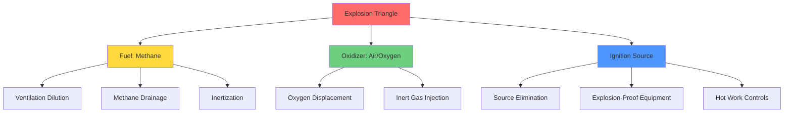
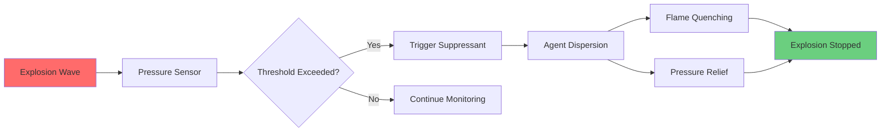

## Overview

Preventing methane explosions in underground coal mines requires a multi-layered defense strategy that addresses both fuel concentration and ignition sources. The explosion hazard exists when methane concentration reaches the lower explosive limit (LEL) of 5% by volume in air while an ignition source providing sufficient energy (typically 0.28 mJ for methane) is present.

## Explosion Triangle and Prevention Strategy

Methane combustion requires three elements simultaneously: fuel (CH₄), oxidizer (O₂), and ignition energy. Eliminate any one element and combustion cannot occur.

## Ventilation-Based LEL Control

### Dilution Ventilation Principles

The fundamental approach to explosion prevention is maintaining methane concentration below 1% (20% of LEL) per MSHA 30 CFR 75.323. The required ventilation rate follows the mass balance equation:

$$Q_{req} = \frac{q_{CH_4}}{C_{max} - C_{amb}}$$

Where:
- $Q_{req}$ = required airflow rate (cfm)
- $q_{CH_4}$ = methane emission rate (cfm)
- $C_{max}$ = maximum allowable concentration (0.01 for 1%)
- $C_{amb}$ = ambient methane concentration (typically 0)

### Safety Factor Application

Regulations mandate maintaining concentrations well below LEL to account for:

1. **Ventilation variability** - airflow fluctuations from stoppings, door operation
2. **Emission surges** - sudden methane releases from roof falls or pressure changes
3. **Mixing inefficiency** - incomplete dilution in dead-end entries
4. **Monitoring lag** - time delay between concentration rise and detection

The effective safety factor is:

$$SF = \frac{LEL}{C_{operating}} = \frac{5\%}{1\%} = 5$$

## Ignition Source Elimination

### Energy Threshold and Ignition Mechanisms

Methane requires minimum ignition energy (MIE) of 0.28 mJ at stoichiometric concentration (9.5% CH₄). Common ignition sources in mines:

| Ignition Source | Typical Energy | MSHA Control Measure |
|----------------|----------------|----------------------|
| Electrical arc | 1-1000 mJ | Explosion-proof enclosures (75.500) |
| Frictional spark | 10-100 mJ | Rock dusting, water sprays |
| Hot surface | >650°C sustained | Temperature monitoring |
| Open flame | >1000 mJ | Prohibited in gassy areas |
| Static discharge | 1-10 mJ | Bonding/grounding systems |
| Blasting | >>1000 mJ | Permissible explosives only |

### Explosion-Proof Equipment Design

Electrical equipment in underground coal mines must meet intrinsically safe or explosion-proof standards per 30 CFR 75.500-75.507. Two primary design philosophies:

**Intrinsically Safe Design**: Limits available energy below MIE under all fault conditions.

$$E_{available} = \frac{1}{2}LI^2 + \frac{1}{2}CV^2 < 0.28 \text{ mJ}$$

Where $L$ is circuit inductance, $I$ is current, $C$ is capacitance, and $V$ is voltage.

**Explosion-Proof Enclosures**: Contain internal explosions and prevent external ignition through:
- Flame path quenching (gap <0.020 inches for methane)
- Heat dissipation through metal walls
- Pressure relief without flame emission

## Methane Drainage (Degasification)

### Drainage System Design

Pre-drainage reduces methane emission into working sections by extracting gas directly from coal seams before mining. The pressure-driven flow follows Darcy's law modified for gas compressibility:

$$q = \frac{\pi k h (P_s^2 - P_w^2)}{1.422 \times 10^6 \mu \ln(r_e/r_w)}$$

Where:
- $q$ = gas flow rate (scfd)
- $k$ = permeability (md)
- $h$ = seam thickness (ft)
- $P_s$ = reservoir pressure (psia)
- $P_w$ = wellbore pressure (psia)
- $\mu$ = gas viscosity (cp)
- $r_e/r_w$ = drainage radius ratio

### Drainage Methods Comparison

| Method | Application | Efficiency | Implementation Complexity |
|--------|-------------|------------|---------------------------|
| Vertical wells | Pre-mining, deep seams | 40-70% reduction | High (surface drilling) |
| Horizontal boreholes | Active mining areas | 30-50% reduction | Medium (underground drilling) |
| Gob wells | Post-mining capture | 50-80% of gob gas | High (surface/underground) |
| Cross-measure holes | Multiple seam drainage | 20-40% reduction | Low (simple drilling) |

## Inertization Strategies

### Nitrogen Injection Systems

Inertization displaces oxygen below the minimum concentration required for combustion (12% O₂ for methane). The stoichiometric combustion equation:

$$CH_4 + 2O_2 \rightarrow CO_2 + 2H_2O$$

reveals that methane requires 2 moles O₂ per mole CH₄. At 12% O₂, the maximum flame temperature drops below the thermal runaway threshold.

Inert gas injection rate for sealed areas:

$$Q_{N_2} = V_{sealed} \times \left(\frac{C_{O_2,initial} - C_{O_2,target}}{C_{O_2,target}}\right) \times \frac{1}{t_{inert}}$$

Where $V_{sealed}$ is sealed volume, oxygen concentrations are in decimal form, and $t_{inert}$ is target inertization time.

### Application Scenarios

- **Sealed abandonment areas** - long-term inertization prevents spontaneous combustion
- **Emergency response** - rapid inertization stops ongoing explosions
- **Advance inertization** - pre-treatment of high-risk zones before entry

## Explosion Barriers and Suppression

### Passive Barrier Systems

Stone dust barriers (30 CFR 75.335) operate on momentum transfer and flame quenching principles. When explosion pressure waves arrive:

$$\Delta P_{trigger} \geq 0.5 \text{ psi} \rightarrow \text{barrier activation}$$

The dispersed stone dust (typically 200-400 lb per barrier) absorbs thermal energy:

$$Q_{absorbed} = m_{dust} \times c_p \times \Delta T$$

This endothermic cooling drops flame temperature below the autoignition point (650°C), terminating the deflagration.

### Active Suppression Systems

Modern suppression uses pressure-triggered water or chemical agent injection:

Response time requirements:
- Detection: <10 ms
- Valve opening: <50 ms
- Full dispersion: <200 ms

Total system response must occur before flame front travels beyond barrier location.

## Integrated Prevention System

Effective explosion prevention combines multiple layers:

1. **Primary control**: Ventilation maintains <1% CH₄
2. **Secondary control**: Methane drainage reduces emission load
3. **Tertiary control**: Ignition source elimination
4. **Emergency mitigation**: Barriers limit explosion propagation

This defense-in-depth approach ensures that single-point failures do not result in catastrophic outcomes.

## Monitoring and Compliance

MSHA regulations require:
- Continuous methane monitoring in return airways (75.323)
- Handheld detector examinations at active faces
- Automatic shutdown systems at 2% CH₄ (75.323-4)
- Quarterly inspection of explosion barriers (75.335)

The probability of explosion decreases exponentially with each independent control layer, following the fault tree analysis principle:

$$P_{explosion} = P_{LEL} \times P_{ignition} \times (1 - P_{barrier})$$

Maintaining $P_{explosion} < 10^{-6}$ per working hour is the industry target.
