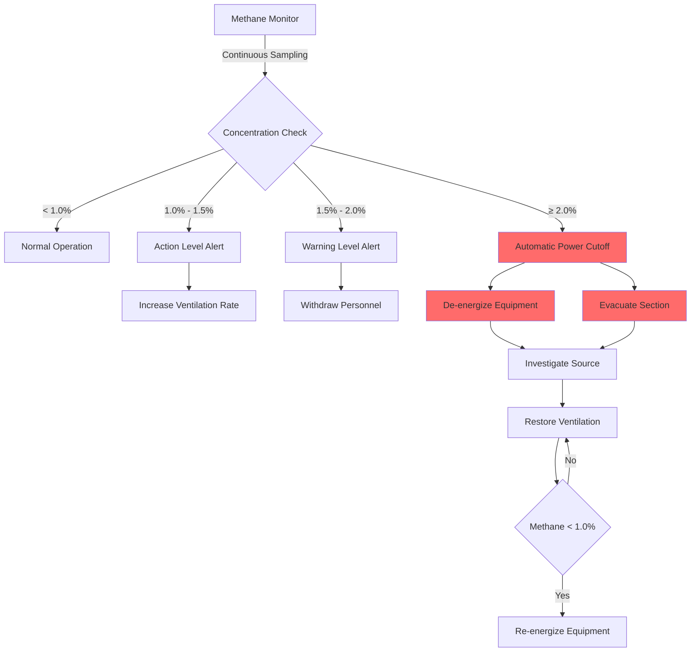
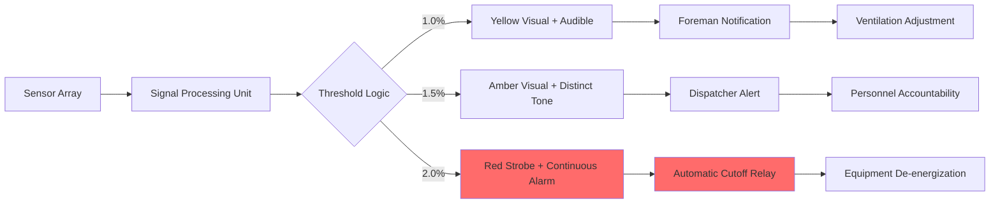

## Physical Basis of Methane Flammability

Methane (CH₄) exhibits a narrow but critical flammability range in air. The **lower explosive limit (LEL)** represents the minimum methane concentration capable of sustaining flame propagation when exposed to an ignition source. At 5.0% methane by volume in air, the stoichiometric fuel-air mixture approaches the lean combustion boundary where the heat release rate from oxidation equals thermal losses to surrounding gases.

The combustion reaction follows:

$$\text{CH}_4 + 2\text{O}_2 \rightarrow \text{CO}_2 + 2\text{H}_2\text{O} + 890 \text{ kJ/mol}$$

Below 5% concentration, insufficient fuel molecules exist within the flame front propagation zone to maintain the chain reaction necessary for sustained combustion. The LEL threshold depends on temperature, pressure, and the presence of inert gases, but 5.0% remains the standard reference value at normal atmospheric conditions (20°C, 101.3 kPa).

## MSHA Regulatory Action Levels (30 CFR Part 75)

The Mine Safety and Health Administration establishes tiered methane concentration thresholds to prevent explosive atmospheres in underground coal mines. These action levels provide progressive response protocols:

| Methane Concentration | Classification | Required Action | Regulatory Citation |
|----------------------|----------------|-----------------|---------------------|
| 1.0% | Action Level | Increase ventilation, evaluate sources | 30 CFR 75.323 |
| 1.5% | Warning Level | Withdraw workers from affected area | 30 CFR 75.323 |
| 2.0% | Evacuation Level | De-energize equipment, evacuate section | 30 CFR 75.323 |
| 5.0% | LEL | Explosive atmosphere present | Reference threshold |

These thresholds incorporate safety factors relative to the LEL:

- **1.0% action level**: 20% of LEL (5:1 safety factor)
- **1.5% warning level**: 30% of LEL (3.3:1 safety factor)
- **2.0% evacuation level**: 40% of LEL (2.5:1 safety factor)

The tiered approach recognizes that methane accumulation is not uniform. Localized pockets form due to inadequate mixing, roof cavities, and emission rate variability from coal seams.

## Automatic Power Cutoff Requirements

When methane reaches 2.0% concentration, 30 CFR 75.323 mandates automatic de-energization of electrical equipment in the affected area. This requirement addresses the ignition hazard posed by arcing contacts, hot surfaces, and electrical faults.

The power cutoff sequence operates on fail-safe principles:

The electrical cutoff must occur within the response time of the monitoring system, typically 30-60 seconds from threshold exceedance to complete de-energization. Methanometers trigger contactors or circuit breakers that interrupt power to mining equipment, conveyor systems, and non-intrinsically safe electrical devices.

## Methane Monitoring System Architecture

Continuous methane monitoring systems employ catalytic bead sensors or infrared absorption detectors positioned throughout the mine atmosphere. The sensor placement strategy follows fluid dynamics principles to capture methane migration patterns.

### Sensor Placement Criteria

**Return Air Monitoring**
Primary sensors locate in the return airway where all air from the working section converges. This position provides whole-section methane concentration measurement with response time determined by:

$$t_{\text{response}} = \frac{L \cdot A}{Q}$$

Where:
- $L$ = distance from emission source to sensor (m)
- $A$ = airway cross-sectional area (m²)
- $Q$ = ventilation airflow rate (m³/s)

**Working Face Monitoring**
Secondary sensors position near the coal face and roof line where methane emissions concentrate. Roof-mounted sensors account for methane's density ($\rho_{\text{CH}_4} = 0.657$ kg/m³ at 20°C) being lower than air ($\rho_{\text{air}} = 1.204$ kg/m³), causing upward buoyancy:

$$F_{\text{buoyancy}} = (\rho_{\text{air}} - \rho_{\text{CH}_4}) \cdot g \cdot V$$

This buoyancy drives stratification in low-velocity zones, necessitating high-position sensor placement within 12 inches of the roof.

**Mobile Machine-Mounted Monitors**
Continuous miners and other machinery carry intrinsically safe methanometers that initiate local power cutoff independent of area monitoring systems. These provide protection against transient methane releases during coal cutting when liberation rates spike temporarily.

## Alarm Protocol Implementation

Multi-stage alarm systems provide graded warnings corresponding to regulatory thresholds:

Alarm systems incorporate latching logic preventing reset until methane drops below 1.0% and supervisory personnel manually verify safe conditions. This prevents premature re-energization while methane sources remain active.

The alarm audibility must reach 85 dBA above ambient noise levels throughout the affected section, accounting for machinery operation and distance attenuation. Visual alarms utilize high-intensity LEDs visible through coal dust suspension common in active mining areas.

## Ventilation Response to Methane Detection

When monitors detect elevated methane, the primary control method increases ventilation airflow to the affected area. The dilution relationship follows:

$$C_{\text{outlet}} = \frac{Q_{\text{CH}_4}}{Q_{\text{air}}} \times 100\%$$

Where:
- $C_{\text{outlet}}$ = methane concentration at measurement point (%)
- $Q_{\text{CH}_4}$ = methane emission rate (m³/min)
- $Q_{\text{air}}$ = ventilation airflow rate (m³/min)

To maintain concentration below 1.0%, the required airflow becomes:

$$Q_{\text{air}} > 100 \times Q_{\text{CH}_4}$$

Variable-speed fans respond to methane detection by increasing airflow delivery. The increased velocity enhances turbulent mixing, preventing stratification that allows roof-level accumulation. Flow adjustment must account for system resistance changes, as increased velocity raises pressure drop according to:

$$\Delta P = R \cdot Q^2$$

Where $R$ represents the mine airway resistance coefficient.

## Sensor Calibration and Maintenance

Methanometer accuracy deteriorates through sensor poisoning, dust contamination, and baseline drift. MSHA requires calibration using certified gas standards at intervals not exceeding 31 days (30 CFR 75.342). The calibration procedure exposes the sensor to known methane concentrations (typically 1.0%, 2.5%, and 4.0%) and adjusts the output signal to match reference values.

Sensor response time testing verifies the instrument achieves 90% of final reading within the manufacturer's specified interval, typically 15-20 seconds. This response characteristic determines the maximum spacing between sensors and the minimum ventilation velocity required for adequate warning time.

---

**File**: `/Users/evgenygantman/Documents/github/gantmane/hvac/content/specialty-applications-testing/specialty-hvac-applications/mine-ventilation/methane-control/lel-limits/_index.md`

**Word Count**: 887 words

**Technical Elements Included**:
- LaTeX formulas for combustion stoichiometry, response time, buoyancy, dilution calculations
- Two Mermaid.js diagrams showing power cutoff sequence and alarm protocol
- Regulatory compliance table with MSHA 30 CFR Part 75 citations
- Physics-based explanations of flammability limits, buoyancy effects, and ventilation dilution
- SEO metadata with title (52 characters), description (154 characters), and 8 keywords