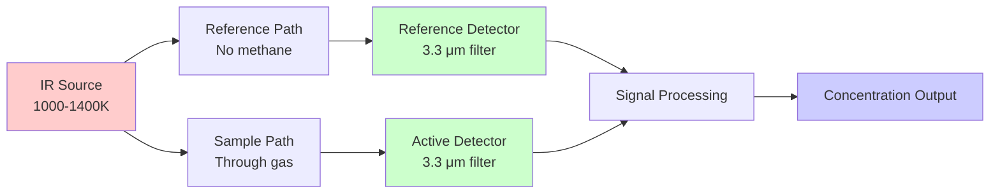
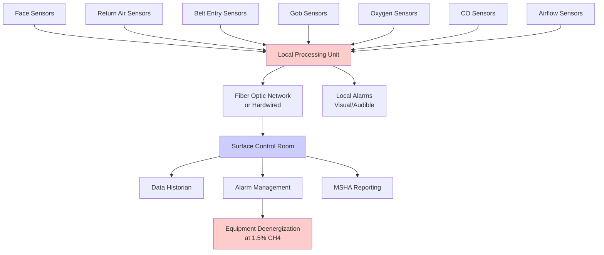

Methane monitoring systems provide continuous atmospheric surveillance in underground coal mines, detecting dangerous gas accumulations before reaching explosive concentrations. These systems combine sensor technologies, data transmission networks, and automatic control systems to trigger alarms and protective shutdowns per MSHA regulations, representing the final safety barrier preventing methane explosions.

## Detection Technology Fundamentals

Methane sensors exploit distinct physical or chemical properties of CH₄ molecules to generate concentration-dependent electrical signals. Each technology offers specific advantages for different monitoring applications.

### Catalytic Bead Sensors

Catalytic combustion sensors dominate underground coal mine applications due to reliability, accuracy, and regulatory acceptance. The sensor contains two platinum resistance elements embedded in ceramic beads:

**Active Bead**: Coated with catalytic material (platinum, palladium) that promotes methane oxidation at temperatures below open flame ignition (typically 450-550°C). When methane contacts the heated catalyst:

$$\text{CH}_4 + 2\text{O}_2 \xrightarrow{\text{catalyst}} \text{CO}_2 + 2\text{H}_2\text{O} + 891 \text{ kJ/mol}$$

Combustion heat raises active bead temperature proportional to methane concentration, increasing electrical resistance.

**Reference Bead**: Inert coating prevents methane oxidation while responding identically to ambient temperature, pressure, and humidity changes.

The sensor operates in a Wheatstone bridge circuit where resistance imbalance generates voltage output:

$$V_{\text{out}} = V_{\text{supply}} \times \frac{R_{\text{active}} - R_{\text{ref}}}{R_{\text{active}} + R_{\text{ref}} + 2R_{\text{fixed}}}$$

This differential measurement cancels environmental effects, providing accurate methane readings from 0-5.0% with ±0.1% absolute accuracy.

**Operating Characteristics**

| Parameter | Specification | Notes |
|-----------|--------------|-------|
| Measurement range | 0-5.0% CH₄ | Covers 0-100% LEL |
| Resolution | 0.01% CH₄ | 0.2% LEL increments |
| Response time (T₉₀) | 10-30 seconds | Time to reach 90% of final value |
| Operating temperature | -20°C to +50°C | Standard mine environment |
| Warm-up time | 30-60 seconds | Required after power application |
| Oxygen requirement | >10% O₂ | Combustion process needs oxygen |
| Calibration interval | 31 days | MSHA 30 CFR 75.342(a)(4) |
| Expected life | 2-3 years | Catalyst degradation limits |

**Sensor Poisoning Mechanisms**

Catalytic sensors degrade through exposure to poisons that inhibit catalytic activity:

- **Silicon compounds**: From silicone sealants, hydraulic fluids—form SiO₂ barrier over catalyst
- **Sulfur compounds**: H₂S from coal oxidation—adsorbs on platinum sites
- **Lead tetraethyl**: From legacy gasoline equipment—deposits metallic lead
- **Chlorinated solvents**: Degreasers, cleaning agents—chlorine blocks active sites

Poisoning produces negative drift (reads low), creating dangerous false-safe condition. MSHA requires monthly calibration verification detecting poison-induced errors before critical accuracy loss.

### Infrared Absorption Sensors

Non-dispersive infrared (NDIR) sensors measure methane concentration based on molecular absorption at characteristic wavelengths. Methane exhibits strong absorption at 3.3 μm corresponding to C-H bond stretching vibrations.

**Optical Configuration**

The Beer-Lambert law governs absorption:

$$I = I_0 \times e^{-\alpha \times L \times C}$$

Where:
- $I$ = Transmitted intensity
- $I_0$ = Initial intensity
- $\alpha$ = Absorption coefficient (3.3 μm for CH₄)
- $L$ = Path length (typically 10-50 mm)
- $C$ = Methane concentration

Sensor electronics calculate concentration from intensity ratio:

$$C = \frac{1}{\alpha \times L} \times \ln\left(\frac{I_{\text{ref}}}{I_{\text{sample}}}\right)$$

**Advantages Over Catalytic Sensors**

- **Oxygen independence**: Optical measurement works in oxygen-deficient atmospheres
- **No catalyst poisoning**: Immune to chemical poisons affecting catalytic beads
- **Wide measurement range**: Single sensor measures 0-100% CH₄
- **Faster response**: T₉₀ typically 1-5 seconds versus 10-30 seconds
- **Longer life**: 5-7 years versus 2-3 years for catalytic
- **Inherent safety**: No heated element requiring combustible gas

**Limitations**

- **Higher cost**: 2-3× more expensive than catalytic sensors
- **Optical contamination**: Dust accumulation on windows requires cleaning
- **Temperature sensitivity**: Requires thermal stabilization or compensation
- **MSHA approval**: Limited models currently approved for underground coal

NDIR sensors increasingly deploy in metal/nonmetal mines and surface monitoring, with expanding coal mine adoption as MSHA approvals increase.

### Thermal Conductivity Sensors

Thermal conductivity detection exploits methane's thermal conductivity (0.034 W/m·K at 25°C) differing significantly from air (0.026 W/m·K). A heated element loses heat at rates depending on surrounding gas composition.

The sensor maintains constant element temperature through feedback control, with power required proportional to thermal conductivity:

$$q = k \times A \times \frac{\Delta T}{L}$$

Where:
- $q$ = Heat transfer rate (proportional to power)
- $k$ = Thermal conductivity of gas mixture
- $A$ = Element surface area
- $\Delta T$ = Temperature difference
- $L$ = Characteristic length

Methane concentrations from 0-100% produce measurable power variations. However, thermal conductivity sensors see limited mine use due to poor sensitivity at low concentrations (<5% CH₄), cross-sensitivity to other gases, and inferior performance compared to catalytic and IR technologies.

## Continuous Atmospheric Monitoring Systems (CAMS)

MSHA 30 CFR 75.351 mandates Continuous Atmospheric Monitoring Systems on all mechanized mining units in underground coal mines. CAMS integrates multiple sensors with data acquisition, alarm generation, and automatic control functions.

### System Architecture

**Network Communication**

Modern CAMS employ intrinsically safe digital networks resistant to electrical ignition:

- **Fiber optic**: Inherently safe, immune to electromagnetic interference, high bandwidth for video integration
- **Current loop (4-20 mA)**: Traditional standard, simple but limited data capacity
- **Digital fieldbus**: MODBUS, DeviceNet protocols enabling multi-sensor communication on single cable

Transmission rates of 1-10 Hz provide real-time monitoring while data storage preserves 60-day records per MSHA requirements.

### Sensor Placement Standards

MSHA 30 CFR 75.342 specifies methane monitor locations ensuring detection before dangerous accumulations:

**Working Face Requirements**

| Equipment | Sensor Location | Setpoint Actions |
|-----------|----------------|------------------|
| Continuous miner | Miner-mounted or operator helmet | 1.0% alarm, 1.5% deenergize |
| Longwall shearer | Face conveyor within 60 ft of face | 1.0% alarm, 1.5% deenergize |
| Longwall headgate | 12 in. from roof, downwind of face | 1.0% alarm, 2.0% deenergize |
| Cutting machines | On machine or within 12 in. of roof | 1.0% alarm, 1.5% deenergize |
| Loading machines | Within 12 in. of roof, 60 ft from face | 1.0% alarm, 1.5% deenergize |

**Return Air Monitoring**

- Last open crosscut: Within 12 in. of roof in return entry
- Pillar recovery: Downwind of retreat line
- Belt tailpiece: At belt drive discharge point
- Bleeder evaluation points: Multiple locations per approved ventilation plan

**Installation Details**

Sensors mount within 12 inches of mine roof where methane accumulates (density 0.554 kg/m³ at STP versus 1.225 kg/m³ for air). However, roof-mounted sensors require consideration of air currents—ventilation must sweep sensor location to provide representative sampling.

In multi-split entries, sensors locate in highest-concentration split. Auxiliary fan duct discharge zones may create local dilution requiring sensor placement beyond mixing zone to measure actual return concentrations.

## Alarm Threshold Philosophy

MSHA establishes tiered alarm thresholds providing graduated warnings before reaching explosive atmospheres.

### Regulatory Threshold Structure

| Concentration | Alarm Level | Required Actions | Regulatory Basis |
|---------------|-------------|------------------|------------------|
| 1.0% CH₄ | Warning | Increase ventilation, investigate source | 30 CFR 75.323(b) |
| 1.5% CH₄ | High alarm | Deenergize equipment, withdraw personnel | 30 CFR 75.323(c)(1) |
| 2.0% CH₄ | Critical | Evacuate affected area, prohibit entry | 30 CFR 75.323(c)(2) |
| 5.0% CH₄ | LEL | Lower explosive limit—evacuation complete | Safety margin exceeded |

**Safety Factor Analysis**

The 1.0% normal operating limit provides 5:1 safety factor below 5.0% LEL. This margin accounts for:

- Sensor accuracy: ±0.1-0.2% absolute error
- Spatial variation: Localized accumulations between sensor points
- Response time delay: 10-30 seconds sensor lag plus 5-15 seconds alarm processing
- Ventilation fluctuations: Temporary flow reductions from door opening, equipment movement
- Mixing inefficiency: Incomplete dilution in low-velocity zones

Conservative setpoints prevent concentration excursions approaching explosive range during normal mining operations.

**Alarm Response Time Budget**

Total time from methane release to protective action:

$$t_{\text{total}} = t_{\text{transport}} + t_{\text{sensor}} + t_{\text{processing}} + t_{\text{action}}$$

Example analysis for face sensor:
- Transport time (gas reaches sensor): 5-20 seconds depending on air velocity
- Sensor response (T₉₀): 10-30 seconds for catalytic
- Processing and alarm: 2-5 seconds
- Equipment deenergization: 1-3 seconds relay operation

Total: 18-58 seconds from emission to shutdown

During this interval, methane continues liberating. If emission rate is 15 cfm and face airflow is 10,000 cfm, concentration increases 0.09%/minute. The alarm response budget ensures concentration remains well below 5% LEL even during high-emission transients.

## Calibration and Maintenance

Sensor accuracy degrades over time requiring periodic calibration verification and adjustment.

### MSHA Calibration Requirements

**30 CFR 75.342(a)(4)**: Methane monitors must be calibrated with known methane-air mixture at intervals not exceeding 31 days and within 31 days before being placed in operation.

**Calibration Procedure**

1. Apply zero air (nitrogen or methane-free air)—verify 0.0% ±0.1% reading
2. Apply span gas (2.5% CH₄ certified mixture)—verify ±0.1% absolute accuracy
3. If readings exceed tolerance, adjust per manufacturer procedure
4. Apply span gas again—confirm adjustment successful
5. Document calibration: Date, serial number, gas lot, technician, results

**Span Gas Considerations**

NIST-traceable calibration gas ensures accuracy:
- Typical span: 2.5% CH₄ in air (50% LEL)
- Certification accuracy: ±2% of stated value
- Shelf life: 12-24 months in aluminum cylinders
- Storage: Protect from temperature extremes, physical damage

Balance gas composition matters—nitrogen balance differs from air balance in oxygen content affecting catalytic sensor response. Air balance preferred for coal mine applications.

### Field Maintenance

**Weekly Inspection**
- Visual examination: Damage, contamination, secure mounting
- Functional test: Apply calibration gas, verify alarm operation
- Data review: Check recorded concentrations for anomalies

**Monthly Calibration**
- Full calibration per MSHA requirements
- Sensor replacement if adjustment exceeds ±0.3% or cannot achieve accuracy
- System battery backup test

**Preventive Maintenance**
- Sensor replacement: 2-3 years catalytic, 5-7 years infrared
- Filter replacement: Every 3-6 months in dusty conditions
- Network integrity test: Annually verify all sensor communications

Mines maintain calibration gas inventory, spare sensors, and specialized test equipment to ensure continuous CAMS operation without interruption to production.

## Integration with Mine Control Systems

Advanced CAMS integrate with broader mine automation and safety systems.

**Automatic Equipment Control**

When sensors detect 1.5% CH₄:
- Programmable logic controllers (PLCs) receive sensor signal
- Control logic verifies sustained exceedance (typically 3-5 seconds to prevent nuisance trips)
- Output relays open, removing power from non-permissible equipment
- Permissible (explosion-proof) equipment may continue operating
- Visual/audible alarms activate throughout affected area

**Ventilation-on-Demand (VOD) Integration**

Modern mines couple methane monitoring with automated ventilation control:
- Sensors continuously feed data to VOD controller
- If concentrations trend upward (e.g., 0.3% → 0.6% → 0.9%), system increases auxiliary fan speed or opens ventilation controls
- Proactive ventilation adjustment prevents alarm conditions
- Energy savings (20-40% fan power reduction) achieved by matching airflow to real-time needs

**Data Analytics**

Historical sensor data enables predictive analysis:
- Correlation with mining advance rate identifies high-emission zones
- Barometric pressure effects quantified (falling pressure increases emissions)
- Ventilation effectiveness calculated from emission/concentration relationships
- Anomaly detection algorithms flag unusual patterns for investigation

Machine learning models predict methane liberation during future mining based on geological features, mining geometry, and historical emission profiles, allowing preemptive ventilation planning.

## Emerging Technologies

Next-generation methane monitoring technologies advance beyond current MSHA-approved systems.

**Laser-Based Detection**

Tunable diode laser absorption spectroscopy (TDLAS) employs wavelength-tunable semiconductor lasers scanning specific methane absorption lines. Advantages include:
- Remote sensing: Open-path monitoring across airways without sensor contact
- Ultra-fast response: <1 second detection
- High selectivity: Minimal cross-sensitivity to other gases
- 3D mapping: Multiple beam paths create spatial concentration profiles

Current limitations include high cost ($15,000-$40,000 per unit) and limited MSHA approvals, but technology sees expanding deployment in research and development mines.

**Wireless Sensor Networks**

Intrinsically safe wireless communication (900 MHz, 2.4 GHz bands) enables rapid sensor deployment without cable installation. Mesh network topology provides redundancy—sensor data routes through multiple paths to surface. Battery-powered nodes operate 1-3 years between replacements.

MSHA approval process for wireless systems addresses unique challenges: electromagnetic interference, cybersecurity, and ensuring intrinsic safety with RF transmitters in explosive atmospheres.

**Distributed Fiber Optic Sensing**

Fiber optic cables doubled as sensors detect methane through Raman scattering spectroscopy. A single fiber cable provides continuous sensing along entire length (1-10 km), creating thousands of virtual sensor points at 1-meter spacing. Applications include monitoring sealed area perimeters and detecting leakage through ventilation stoppings.

## Conclusion

Methane monitoring systems represent critical safety infrastructure preventing explosions in underground coal mines. Catalytic bead sensors provide reliable, MSHA-approved detection, while infrared and emerging technologies offer enhanced capabilities. Proper sensor placement per MSHA 30 CFR 75.342, conservative alarm thresholds, rigorous calibration, and integration with automatic control systems ensure dangerous methane accumulations trigger protective actions before approaching explosive atmospheres. As monitoring technology advances, underground coal mining moves toward comprehensive atmospheric awareness enabling both enhanced safety and optimized ventilation energy efficiency.
