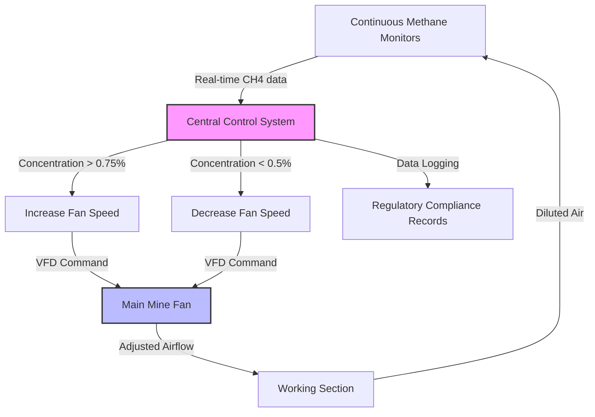

## Fundamental Dilution Physics

Methane control through ventilation relies on the mass balance principle where fresh air continuously dilutes liberated methane below explosive concentrations (5-15% by volume). The dilution effectiveness depends on airflow rate, methane liberation rate, and mixing efficiency within the working section.

The basic dilution equation establishes the relationship between methane concentration and ventilation:

$$C_{CH_4} = \frac{Q_{CH_4}}{Q_{air} + Q_{CH_4}} \times 100\%$$

Where:
- $C_{CH_4}$ = methane concentration (%)
- $Q_{CH_4}$ = methane liberation rate (cfm)
- $Q_{air}$ = ventilation air quantity (cfm)

For practical applications where $Q_{CH_4} \ll Q_{air}$, this simplifies to:

$$Q_{air} = \frac{Q_{CH_4}}{C_{CH_4}} \times 100$$

MSHA regulations under 30 CFR 75.325 mandate methane concentrations remain below 1.0% in working sections and below 2.0% in return airways, establishing design targets with significant safety margins below the lower explosive limit.

## Regulatory Minimum Air Quantities

30 CFR Part 75 establishes prescriptive minimum ventilation rates independent of calculated dilution requirements:

| Location | Minimum Air Quantity | Regulatory Citation |
|----------|---------------------|---------------------|
| Working face (mechanized) | 9,000 cfm | 30 CFR 75.325(a)(1) |
| Working face (non-mechanized) | 3,000 cfm | 30 CFR 75.325(a)(2) |
| Belt entries with combustible belting | 50 fpm velocity | 30 CFR 75.350(b) |
| Pillar recovery areas | 9,000 cfm minimum | 30 CFR 75.325(a)(1) |

These minimums represent baseline requirements; actual ventilation must accommodate the higher value between regulatory minimums and dilution-calculated requirements based on methane liberation.

## Methane Liberation Prediction

Accurate prediction of methane liberation rates drives ventilation system design. The liberation rate combines contributions from multiple sources:

$$Q_{CH_4,total} = Q_{face} + Q_{floor} + Q_{roof} + Q_{gob}$$

### Coal Face Liberation

Direct liberation during cutting follows an empirical relationship:

$$Q_{face} = k \times P \times \rho_{coal} \times m$$

Where:
- $k$ = methane content coefficient (cf/ton)
- $P$ = production rate (tons/hour)
- $\rho_{coal}$ = coal density (typically 1.3-1.4 g/cm³)
- $m$ = mining height (ft)

### Time-Dependent Desorption

Exposed surfaces exhibit declining liberation following first-order kinetics:

$$Q(t) = Q_0 \times e^{-\lambda t}$$

Where $\lambda$ represents the desorption rate constant (typically 0.1-0.5 hr⁻¹) dependent on coal rank, gas content, and cleat permeability.

## Variable Air Volume Systems

Modern gassy mine operations implement variable air volume (VAV) control to match ventilation supply with dynamic methane liberation patterns:

VAV systems provide several operational advantages:

- **Energy efficiency**: Fan power consumption scales with cube of airflow ($P \propto Q^3$)
- **Extended equipment life**: Reduced operating hours at maximum capacity
- **Improved face conditions**: Minimizes excessive ventilation during low production periods
- **Dynamic response**: Automatic adjustment to sudden methane liberation events

## Bleeder System Design

Bleeder systems ventilate abandoned areas (gob) where continued methane emission occurs from fractured overburden. The bleeder airflow must maintain methane concentration below 2.0% per 30 CFR 75.334:

$$Q_{bleeder} = \frac{Q_{gob,emission}}{0.02} \times 1.2$$

The 1.2 safety factor accounts for non-uniform mixing and measurement uncertainty. Gob emission rates typically decline exponentially with time but can persist for years:

$$Q_{gob}(t) = Q_{initial} \times e^{-t/\tau}$$

Where $\tau$ represents the characteristic decay time (typically 6-24 months depending on overburden permeability and barometric pressure fluctuations).

### Bleeder Configuration Types

| Configuration | Application | Advantages | Limitations |
|--------------|-------------|------------|-------------|
| Direct bleeder | Single-entry panels | Simple layout | Limited air distribution |
| Cross-panel bleeder | Multiple adjacent panels | Shared bleeder entries | Complex air balancing |
| Pressure bleeder | Deep cover, high gas | Positive gob pressure control | Higher energy consumption |

## Gob Ventilation Mechanics

Air movement through gob material follows non-Darcy flow due to high permeability:

$$\Delta P = \alpha Q + \beta Q^2$$

Where $\alpha$ represents viscous resistance and $\beta$ represents inertial resistance. The quadratic term dominates at typical ventilation velocities through fractured rock.

Effective gob permeability ranges from 10-100 darcies, orders of magnitude higher than intact coal seams, but flow paths remain highly tortuous and subject to progressive compaction as overburden settles.

### Barometric Breathing Effects

Atmospheric pressure changes induce transient gob outgassing independent of ventilation:

$$\frac{dQ_{CH_4}}{dt} = -V_{gob} \times \frac{C_{CH_4}}{P_{atm}} \times \frac{dP_{atm}}{dt}$$

Falling barometric pressure (typically 0.5-1.5 inches Hg over 12-24 hours) can temporarily increase methane emissions by 20-40%, requiring ventilation system capacity margins to accommodate these events.

## Air Quantity Calculation Example

For a longwall face producing 800 tons/hour with measured methane content of 250 cf/ton:

**Methane liberation rate:**
$$Q_{CH_4} = 800 \text{ tons/hr} \times 250 \text{ cf/ton} = 200,000 \text{ cfh} = 3,333 \text{ cfm}$$

**Required ventilation (1.0% target):**
$$Q_{air} = \frac{3,333}{0.01} = 333,300 \text{ cfm}$$

**With 25% safety margin:**
$$Q_{design} = 333,300 \times 1.25 = 416,625 \text{ cfm}$$

This substantially exceeds the 9,000 cfm regulatory minimum, demonstrating that methane liberation governs design in gassy operations.

## Components

- [Methane Dilution Ventilation](methane-dilution-ventilation/)
- [Minimum Air Quantity Calculation](minimum-air-quantity-calculation/)
- [Cfm Per Ton Of Coal](cfm-per-ton-of-coal/)
- [Regulatory Requirements Ventilation](regulatory-requirements-ventilation/)
